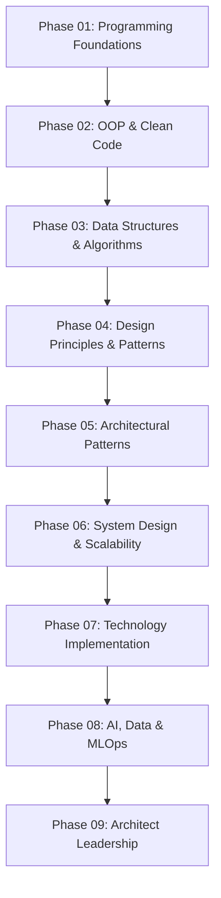

# Lead Architect Learning Path

Got it ✅ — you have a **massive and very comprehensive educational plan** aimed at becoming a **Lead Architect**.
Right now, the folder structure is **topic-based** (OOP, SOLID, Python, AI, DevOps, etc.), which is great for reference, but it’s **not progressive** in terms of building mastery step-by-step toward your goal.  
  
For a **Lead Architect Learning Path**, we want to restructure it into **phases** that build from fundamentals → advanced design → architecture → leadership & systemic thinking, while still linking to your existing detailed resources.  
  
---  
  
## **Proposed Logical / Progressive Folder Structure**  

We’ll restructure into **5 Major Phases**, each with subfolders pointing to relevant content from your existing library.  
  
```  
LeadArchitect-LearningPath  
│  
├── Phase01_Fundamentals  
│   ├── Programming-Basics  
│   │   ├── Python  
│   │   ├── CSharp  
│   │   ├── Java  
│   │   ├── JavaScript & TypeScript  
│   ├── OOP-Fundamentals  
│   │   ├── Classes & Objects  
│   │   ├── Encapsulation & Abstraction  
│   │   ├── Inheritance & Polymorphism  
│   │   ├── Advanced Patterns  
│   ├── Clean-Code-Principles  
│   ├── Testability-and-TDD  
│   ├── Algorithms-and-DataStructures  
│  
├── Phase02_Design-Mastery  
│   ├── Software-Design-Principles  
│   │   ├── SOLID-Principles  
│   │   ├── Design-Patterns  
│   │   ├── UML-Diagrams  
│   ├── Architectural-Patterns  
│   │   ├── Monolithic / Modular Monolith  
│   │   ├── Microservices  
│   │   ├── Event-Driven Architecture  
│   │   ├── Clean Architecture / CQRS / DDD  
│   ├── Scalability-and-Performance  
│   ├── Security-by-Design  
│  
├── Phase03_System-Architecture  
│   ├── High-Scale-System-Design  
│   ├── Distributed-Systems  
│   ├── Cloud-Native-Principles  
│   ├── DevOps-and-CI-CD  
│   ├── Data-Management-Principles  
│   ├── AI-and-Responsible-Design (Architectural Perspective)  
│  
├── Phase04_Technology-Implementation  
│   ├── Language-Specific-Architectures  
│   │   ├── Python-Implementation  
│   │   ├── CSharp-Enterprise-Development  
│   │   ├── Java-Architecture  
│   │   ├── JavaScript/TypeScript/Node/React/Angular  
│   ├── Cloud-Architecture  
│   │   ├── AWS  
│   │   ├── Azure  
│   │   ├── GCP  
│   │   ├── Hybrid  
│   ├── Infrastructure-as-Code  
│   │   ├── Kubernetes  
│   │   ├── Docker  
│   ├── Observability-and-Monitoring  
│  
├── Phase05_Architect-Leadership  
│   ├── Systemic-Heuristics  
│   ├── Contextual-Principles  
│   ├── Human-Centered-Design  
│   ├── Evaluation-Principles  
│   ├── LeadArchitect-Roadmap  
│   ├── Certifications  
│   ├── Communication & Documentation  
│   ├── Decision-Making Frameworks  
│  
├── Reference-Library  
│   ├── All-Original-Topic-Folders (unchanged for lookup)  
│  
└── PATHWAY.md  
```  
  
---  
  
## **Why This Structure Works for a Lead Architect Path**  

1. **Progressive Learning** — you build from coding fundamentals → design principles → architecture → leadership.  
2. **Clear Career Milestones** — each phase aligns with a real-world skill level:  
   - Phase 1 → Strong Senior Developer  
   - Phase 2 → Design Specialist / Tech Lead  
   - Phase 3 → Solution Architect  
   - Phase 4 → Enterprise Architect  
   - Phase 5 → Lead / Chief Architect  
3. **Cross-linking** — all your existing detailed topic folders remain intact in `Reference-Library`, but they’re linked from the progressive path.  
4. **Integration of Technology & Concepts** — you don’t just learn patterns in isolation; you see how they fit into architecture and leadership.  
  
---  
  
## **Suggested Learning Flow**  

Here’s how I’d sequence **your existing material** in this new structure:  
  
### **Phase 1 – Fundamentals**  

- **Programming**: Python Fundamentals → C# Basics → Java → JS/TS  
- **OOP**: `01_OOP-Classes-and-Objects-CONDENSED.md` → Encapsulation → Inheritance → Advanced Patterns  
- **Clean Code & TDD**: Clean-Code Principles → Testability-and-TDD  
- **Algorithms & Data Structures**: WeeklyLessons BigO → Sorting → DS Implementations  
  
### **Phase 2 – Design Mastery**  

- **SOLID**: All SOLID Part1–Part5  
- **Design Patterns**: Factory → Builder → Singleton → Observer → Strategy → Decorator → Command → Template Method  
- **UML**: Class, Sequence, Activity, State, Component diagrams  
- **Architecture Patterns**: Monolith → Modular Monolith → Microservices → Event-Driven → CQRS → Clean Architecture → DDD  
  
### **Phase 3 – System Architecture**  

- **High-Scale Systems**: Scalability & Performance Principles → Distributed Systems  
- **Cloud Native Principles**: 12-Factor Apps, Resilience Patterns  
- **DevOps**: CI/CD Fundamentals, Infrastructure as Code, Observability  
- **Data Management**: Database Selection Guide, Data Architecture Overview  
- **Security by Design**: Security Architecture docs  
  
### **Phase 4 – Technology Implementation**  

- Apply architecture in Python, C#, Java, JS/TS  
- Enterprise-level C# (`DotNet Aspire` series)  
- Cloud: AWS, Azure, GCP patterns  
- IaC: Kubernetes, Docker  
- Observability: Monitoring, Logging, Metrics  
  
### **Phase 5 – Architect Leadership**  

- Systemic Heuristics, Contextual Principles, Human-Centered Design  
- Evaluation Principles (trade-offs, decision matrices)  
- Lead Architect Roadmap & Certifications  
- Communication & Documentation strategies  
- Decision-making frameworks for enterprise architecture  
  
---  
  
## Next Step  

If you want, I can:  

- **Map each file in your current structure to this progressive path** so you have a reorganized folder + cross-links.  
- Create a **Master README** that guides you through the phases step-by-step, linking to your existing notes.  
  
---  
  
Do you want me to **go ahead and create the full mapping of your current files into this progressive Lead Architect structure** so you can start using it immediately?
That way you won’t lose your current folders, but you’ll have a clear career pathway.
Perfect ✅ — let’s create the **full mapping** from your current topic-based folders into the new **progressive Lead Architect Learning Path**.
  
We’ll keep **all original folders** in a `Reference-Library` for deep lookup, but the **new path folders** will contain **links to the original files** (no duplication), so you can progress in a career-oriented order.  
  
---  
  
# **Lead Architect Learning Path – Full Mapping**  

Here’s how your current files will be reorganized logically into **Phases**.  
  
---  
  
## **Phase 01 – Fundamentals**  

**Goal:** Become a strong senior developer with mastery of programming, OOP, clean code, TDD, and basic algorithms.  
  
**1. Programming Basics**  

- **Python**  
  - `02_Python/01_Fundamentals/01_Noob-to-Nerd/README.md`  
  - `.../02_Nerd-to-Novice/README.md`  
  - `.../03_Novice-to-Learner/README.md`  
  - Progressively through `.../08_Specialist-to-Professional/README.md`  
- **CSharp**  
  - `03_CSharp/01_Fundamentals/README.md`  
- **Java**  
  - `04_Java/README.md`  
- **JavaScript & TypeScript**  
  - `06_JavaScript/README.md`  
  - `07_TypeScript/README.md`  
  
**2. OOP Fundamentals**  

- `01_Development/01_software-design-principles/01_OOP-fundamentals/01_OOP-Classes-and-Objects-CONDENSED.md`  
- `01A1_OOP-Core-Concepts.md`  
- `01A2_OOP-Classes-Blueprint.md`  
- `01B1_OOP-Objects-Creation.md`  
- `02_OOP-Encapsulation-Abstraction.md`  
- `03_OOP-Inheritance-Polymorphism.md`  
- `04_OOP-Advanced-Patterns.md`  
- `05_OOP-Fundamentals-Comprehensive-Guide.md`  
  
**3. Clean Code**  

- `01_Development/06_Clean-Code-Principles/README.md`  
  
**4. Testability and TDD**  

- `01_Development/07_Testability-and-TDD/README.md`  
  
**5. Algorithms & Data Structures**  

- `21_Algorithms-Data-Structures/README.md`  
- `WeeklyLessons/Week01-BigO-LessonPlan.md`  
  
---  
  
## **Phase 02 – Design Mastery**  

**Goal:** Master the principles and patterns needed to design complex systems.  
  
**1. Software Design Principles**  

- `01_Development/02_SOLID-Principles/01_SOLID-Part1-Single-Responsibility.md`  
- `.../02_SOLID-Part2-Open-Closed-Principle.md`  
- `.../03_SOLID-Part3-Liskov-Substitution-Principle.md`  
- `.../04_SOLID-Part4-Interface-Segregation-Principle.md`  
- `.../05_SOLID-Part5-Dependency-Inversion-Principle.md`  
- `SOLID_PRINCIPLES_CHEAT_SHEET.md`  
  
**2. Design Patterns**  

- Factory → `06_Design-Patterns-Part1-Factory-Pattern.md`  
- Builder → `07_Design-Patterns-Part2-Builder-Pattern.md`  
- Singleton → `08_Design-Patterns-Part3-Singleton-Pattern.md`  
- Observer → `09_Design-Patterns-Part4-Observer-Pattern.md`  
- Strategy → `10_Design-Patterns-Part5-Strategy-Pattern.md`  
- Decorator → `11_Design-Patterns-Part6-Decorator-Pattern.md`  
- Command → `12_Design-Patterns-Part7-Command-Pattern.md`  
- Template Method → `13_Design-Patterns-Part8-Template-Method-Pattern.md`  
  
**3. UML**  

- `01_Development/23_UML/01_UML-Overview.md`  
- `.../01_Class-Diagrams`  
- `.../02_Sequence-Diagrams`  
- `.../03_Activity-Diagrams`  
- `.../04_State-Machine-Diagrams`  
- `.../05_Component-Diagrams`  
  
**4. Architectural Patterns**  

- Monolith → `08_Monolithic-Architecture.md`  
- Modular Monolith → `09_Modular-Monolith.md`  
- Microservices → `05_Microservices-Architecture.md` + `05A_Microservices-Architecture-Overview-Decomposition.md` + `05B_Microservices-Communication-Patterns.md` + `05C_Microservices-Resilience-Patterns.md`  
- Event-Driven → `06_Event-Driven-Architecture.md`  
- CQRS → `01_CQRS-Command-Query-Separation.md`  
- Clean Architecture → `01_Clean-Architecture-Fundamentals.md`  
- DDD → `02_Domain-Driven-Design-Fundamentals.md`  
  
**5. Scalability & Performance**  

- `01_Development/10_Scalability-and-Performance-Principles/README.md`  
  
**6. Security by Design**  

- `01_Development/11_Security-by-Design/README.md`  
- `11_Security-Architecture.md`  
  
---  
  
## **Phase 03 – System Architecture**  

**Goal:** Design large-scale, distributed, cloud-native systems with resilience and security.  
  
**1. High-Scale Systems**  

- `03_High-Scale-System-Architecture.md`  
- `04_System-Design-Fundamentals.md`  
  
**2. Distributed Systems**  

- `01_Development/09_Distributed-Systems-Principles/README.md`  
  
**3. Cloud Native Principles**  

- `01_Development/15_Cloud-Native-Principles/README.md`  
- `CloudNativeApplications/12-FactorApplications`  
  
**4. DevOps & CI/CD**  

- `04_DevOps/01_CI-CD-Fundamentals/...`  
- `04_DevOps/02_Infrastructure-as-Code/...`  
- Docker → `10_Docker-Introduction.md`  
- Kubernetes → `01_Kubernetes-Fundamentals.md`  
  
**5. Data Management**  

- `03_BigData/04_Database-Selection-Guide.md`  
- `05_Data-Architecture-Overview.md`  
  
**6. Security**  

- `04_DevOps/06_Cloud-Architecture/Security/...`  
  
---  
  
## **Phase 04 – Technology Implementation**  

**Goal:** Apply architectural patterns in real-world languages & platforms.  
  
**1. Language-Specific Architectures**  

- Python → `02_Python/05_OOP-Implementation`, `06_SOLID-Implementation`, `07_Design-Patterns-Implementation`  
- CSharp → `03_CSharp/05_Enterprise-Development/...`  
- Java → `04_Java/02_OOP-Implementation` etc.  
- JS/TS → `06_JavaScript/README.md`, `07_TypeScript/README.md`  
  
**2. Cloud Architecture**  

- AWS → `04_DevOps/06_Cloud-Architecture/AWS/...`  
- Azure → `Azure_Cloud_Architecture_Guide.md`, `AspirePatterns.md`  
- GCP → `04_DevOps/06_Cloud-Architecture/GCP/...`  
- Hybrid → `04_DevOps/06_Cloud-Architecture/Hybrid/...`  
  
**3. Infrastructure as Code**  

- `IaC/ReadMe.md`  
- Kubernetes, Docker  
  
**4. Observability**  

- `03_Observability-and-Monitoring/Observability/ReadMe.md`  
  
---  
  
## **Phase 05 – Architect Leadership**  

**Goal:** Transition from solution architect to lead architect.  
  
**1. Systemic Heuristics**  

- `01_Development/21_Systemic-Heuristics/README.md`  
  
**2. Contextual Principles**  

- `01_Development/19_Contextual-Principles/README.md`  
  
**3. Human-Centered Design**  

- `01_Development/20_Human-Centered-Principles/README.md`  
  
**4. Evaluation Principles**  

- `01_Development/22_Evaluation-Principles/README.md`  
  
**5. Lead Architect Roadmap**  

- `Legacy-Foundations/LeadArchitect/Lead_Architect_Basics.md`  
- `RoadMaptoLeadArchitect.md`  
  
**6. Certifications**  

- `Legacy-Foundations/Certifications/ReadMe.md`  
  
**7. Communication & Documentation**  

- `ArchitectsJourney/README.md`, `START_HERE.md`  
  
---  
  
## **Reference-Library**  

This will be your **original folder structure untouched**, accessible for deep dives:  

```  
Reference-Library/  
  01_Development/  
  02_AI-and-ML/  
  03_Data-Science/  
  04_DevOps/  
  ...  
```  
  
---  
  
## **Next Steps**  

1. **Create New Folder Structure**: We’ll make `LeadArchitect-LearningPath` with Phase subfolders.  
2. **Inside each Phase folder**, create `README.md` that lists topics in order with **relative links** to the original files.  
3. Keep **Reference-Library** intact for lookup.  
4. Add a **Master PATHWAY.md** that explains the journey from Phase 1 → Phase 5.  
  
---  
  
If you want, I can now **generate the actual README files with links**, so you can immediately navigate your path in order from day one without manually hunting files.
  
Do you want me to **go ahead and write those README.md files with all the mapped links** for your new progressive structure? That will make this instantly usable as your Lead Architect learning dashboard.

Gotcha ✅ — you want the **progressive learning path** to be structured so that folder names **start with numbers like `01_`, `02_`, ... `09_`** to clearly indicate the sequence.
  
That way, when viewed in your file explorer or GitHub, they’ll **sort in exact learning order** and you can follow the path without confusion.  
  
---  
  
## **Proposed "09_" Numbered Progressive Folder Structure**  

We’ll use **two-digit prefixes** to lock the order, and group your journey into **nine major stages**.  
  
```  
LeadArchitect-LearningPath  
│  
├── 01_Fundamentals  
│   ├── 01_Programming-Basics  
│   ├── 02_OOP-Fundamentals  
│   ├── 03_Clean-Code  
│   ├── 04_Testability-and-TDD  
│   ├── 05_Algorithms-and-DataStructures  
│  
├── 02_Intermediate-Design  
│   ├── 01_SOLID-Principles  
│   ├── 02_Design-Patterns  
│   ├── 03_UML-Diagrams  
│  
├── 03_Architectural-Patterns  
│   ├── 01_Monolith-and-Modular  
│   ├── 02_Microservices  
│   ├── 03_Event-Driven  
│   ├── 04_CQRS-and-Clean-Architecture  
│   ├── 05_Domain-Driven-Design  
│  
├── 04_System-Design-and-Scalability  
│   ├── 01_System-Design-Fundamentals  
│   ├── 02_High-Scale-Systems  
│   ├── 03_Distributed-Systems  
│   ├── 04_Scalability-and-Performance  
│  
├── 05_Cloud-Native-and-DevOps  
│   ├── 01_Cloud-Native-Principles  
│   ├── 02_DevOps-and-CI-CD  
│   ├── 03_Infrastructure-as-Code  
│   ├── 04_Docker-and-Kubernetes  
│   ├── 05_Observability-and-Monitoring  
│  
├── 06_Data-Management-and-Security  
│   ├── 01_Data-Management-Principles  
│   ├── 02_BigData-and-Architecture  
│   ├── 03_Security-by-Design  
│  
├── 07_Technology-Implementation  
│   ├── 01_Python-Architecture  
│   ├── 02_CSharp-Enterprise-Architecture  
│   ├── 03_Java-Architecture  
│   ├── 04_JS-TS-Architecture  
│  
├── 08_AI-and-Responsible-Design  
│   ├── 01_AI-Fundamentals-for-Architects  
│   ├── 02_ML-and-LLM-Integration  
│   ├── 03_Agentic-AI-Architectures  
│  
├── 09_Architect-Leadership  
│   ├── 01_Systemic-Heuristics  
│   ├── 02_Contextual-Principles  
│   ├── 03_Human-Centered-Design  
│   ├── 04_Evaluation-Principles  
│   ├── 05_LeadArchitect-Roadmap  
│   ├── 06_Certifications  
│   ├── 07_Communication-and-Decision-Making  
│  
└── Reference-Library  
```  
  
---  
  
## **Why This Works**  

- **Clear Progression** → You start at `01_Fundamentals` and work through to `09_Architect-Leadership`.  
- **Two-Digit Ordering** → Even if subfolders are added later, numbering keeps the learning flow intact.  
- **Thematic Grouping** → Each stage is focused on a major milestone in the journey to Lead Architect.  
- **Direct Mapping** → Each subfolder will contain **README.md** with links to the exact files in your existing `01_Development`, `02_AI-and-ML`, etc.  
  
---  
  
## **Example README for Stage 01_Fundamentals**  

```  
# 01_Fundamentals  
  
## 01_Programming-Basics  
- [Python: Noob to Nerd](../../Reference-Library/01_Development/02_Python/01_Fundamentals/01_Noob-to-Nerd/README.md)  
- [Python: Nerd to Novice](../../Reference-Library/01_Development/02_Python/01_Fundamentals/02_Nerd-to-Novice/README.md)  
- [C# Fundamentals](../../Reference-Library/03_CSharp/01_Fundamentals/README.md)  
- [Java Fundamentals](../../Reference-Library/04_Java/README.md)  
- [JavaScript Fundamentals](../../Reference-Library/06_JavaScript/README.md)  
- [TypeScript Fundamentals](../../Reference-Library/07_TypeScript/README.md)  
  
## 02_OOP-Fundamentals  
- [OOP Classes & Objects](../../Reference-Library/01_Development/01_software-design-principles/01_OOP-fundamentals/01_OOP-Classes-and-Objects-CONDENSED.md)  
- [Encapsulation & Abstraction](../../Reference-Library/01_Development/01_software-design-principles/01_OOP-fundamentals/02_OOP-Encapsulation-Abstraction.md)  
- [Inheritance & Polymorphism](../../Reference-Library/01_Development/01_software-design-principles/01_OOP-fundamentals/03_OOP-Inheritance-Polymorphism.md)  
  
## 03_Clean-Code  
- [Clean Code Principles](../../Reference-Library/01_Development/06_Clean-Code-Principles/README.md)  
  
## 04_Testability-and-TDD  
- [Testability & TDD](../../Reference-Library/01_Development/07_Testability-and-TDD/README.md)  
  
## 05_Algorithms-and-DataStructures  
- [Big O Lesson Plan](../../Reference-Library/21_Algorithms-Data-Structures/WeeklyLessons/Week01-BigO-LessonPlan.md)  
```  
  
---  
  
## **Next Step**  

I can now:  

1. **Create all 09 numbered phases and subfolders**.  
2. Inside each, generate a **README.md** with **relative links** to your original files.  
3. Keep `Reference-Library` as a mirror of your existing structure for deep dives.  
  
This will give you:  

- **A dashboard-like progressive path**  
- **Immediate navigation without hunting files**  
- **Career-oriented sequencing for Lead Architect**  
  
---  
  
Do you want me to **fully generate the 09-phase folder set with README.md files linking to your current resources** so you can drop it into your repo and start learning in order tomorrow?
Alright ✅ — I’ll create a **full, detailed 09-phase progressive structure** for your **Lead Architect Learning Path** with **README.md files inside each phase** linking directly to your existing resources.  
  
We’ll keep **your original folders intact** under `Reference-Library` so nothing is lost, but the new structure will be your **career path dashboard**.  
  
---  
  
# **LeadArchitect-LearningPath – 09 Progressive Phases**  
  
Here’s the **final proposed structure** with detailed mapping:  
  
---  
  
## **00_Master-README.md**  

This will be the **starting point** for your journey, explaining the progression:  
  
```  
# Lead Architect Learning Path  
  
Welcome! This path takes you from fundamentals to becoming a Lead Architect.  
  
## Phases Overview  
01_Fundamentals → Strong Senior Developer    
02_Intermediate-Design → Design Specialist    
03_Architectural-Patterns → Solution Architect    
04_System-Design-and-Scalability → Large-scale Architect    
05_Cloud-Native-and-DevOps → Cloud Architect    
06_Data-Management-and-Security → Enterprise Architect    
07_Technology-Implementation → Applying Architecture in Code    
08_AI-and-Responsible-Design → AI-savvy Architect    
09_Architect-Leadership → Lead / Chief Architect  
  
**Tip:** Each phase README contains links to original resources in `Reference-Library`.  
```  
  
---  
  
## **01_Fundamentals/README.md**  

```  
# Phase 01 – Fundamentals  
  
Goal: Build strong programming foundations, OOP mastery, clean code skills, and algorithmic thinking.  
  
## 01_Programming-Basics  
- [Python: Noob to Nerd](../../Reference-Library/01_Development/02_Python/01_Fundamentals/01_Noob-to-Nerd/README.md)  
- [Python: Nerd to Novice](../../Reference-Library/01_Development/02_Python/01_Fundamentals/02_Nerd-to-Novice/README.md)  
- [Python: Novice to Learner](../../Reference-Library/01_Development/02_Python/01_Fundamentals/03_Novice-to-Learner/README.md)  
- [C# Fundamentals](../../Reference-Library/03_CSharp/01_Fundamentals/README.md)  
- [Java Fundamentals](../../Reference-Library/04_Java/README.md)  
- [JavaScript Fundamentals](../../Reference-Library/06_JavaScript/README.md)  
- [TypeScript Fundamentals](../../Reference-Library/07_TypeScript/README.md)  
  
## 02_OOP-Fundamentals  
- [OOP Classes & Objects](../../Reference-Library/01_Development/01_software-design-principles/01_OOP-fundamentals/01_OOP-Classes-and-Objects-CONDENSED.md)  
- [OOP Core Concepts](../../Reference-Library/01_Development/01_software-design-principles/01_OOP-fundamentals/01A1_OOP-Core-Concepts.md)  
- [OOP Classes Blueprint](../../Reference-Library/01_Development/01_software-design-principles/01_OOP-fundamentals/01A2_OOP-Classes-Blueprint.md)  
- [OOP Object Creation](../../Reference-Library/01_Development/01_software-design-principles/01_OOP-fundamentals/01B1_OOP-Objects-Creation.md)  
- [Encapsulation & Abstraction](../../Reference-Library/01_Development/01_software-design-principles/01_OOP-fundamentals/02_OOP-Encapsulation-Abstraction.md)  
- [Inheritance & Polymorphism](../../Reference-Library/01_Development/01_software-design-principles/01_OOP-fundamentals/03_OOP-Inheritance-Polymorphism.md)  
- [Advanced OOP Patterns](../../Reference-Library/01_Development/01_software-design-principles/01_OOP-fundamentals/04_OOP-Advanced-Patterns.md)  
- [Comprehensive OOP Guide](../../Reference-Library/01_Development/01_software-design-principles/01_OOP-fundamentals/05_OOP-Fundamentals-Comprehensive-Guide.md)  
  
## 03_Clean-Code  
- [Clean Code Principles](../../Reference-Library/01_Development/06_Clean-Code-Principles/README.md)  
  
## 04_Testability-and-TDD  
- [Testability & TDD](../../Reference-Library/01_Development/07_Testability-and-TDD/README.md)  
  
## 05_Algorithms-and-DataStructures  
- [Big O Lesson Plan](../../Reference-Library/21_Algorithms-Data-Structures/WeeklyLessons/Week01-BigO-LessonPlan.md)  
```  
  
---  
  
## **02_Intermediate-Design/README.md**  

```  
# Phase 02 – Intermediate Design  
  
Goal: Master SOLID principles, design patterns, and UML diagrams.  
  
## 01_SOLID-Principles  
- [Single Responsibility](../../Reference-Library/01_Development/02_SOLID-Principles/01_SOLID-Part1-Single-Responsibility.md)  
- [Open-Closed Principle](../../Reference-Library/01_Development/02_SOLID-Principles/02_SOLID-Part2-Open-Closed-Principle.md)  
- [Liskov Substitution Principle](../../Reference-Library/01_Development/02_SOLID-Principles/03_SOLID-Part3-Liskov-Substitution-Principle.md)  
- [Interface Segregation Principle](../../Reference-Library/01_Development/02_SOLID-Principles/04_SOLID-Part4-Interface-Segregation-Principle.md)  
- [Dependency Inversion Principle](../../Reference-Library/01_Development/02_SOLID-Principles/05_SOLID-Part5-Dependency-Inversion-Principle.md)  
- [SOLID Cheat Sheet](../../Reference-Library/Reference-Materials/SOLID_PRINCIPLES_CHEAT_SHEET.md)  
  
## 02_Design-Patterns  
- [Factory Pattern](../../Reference-Library/01_Development/03_Design-Patterns/06_Design-Patterns-Part1-Factory-Pattern.md)  
- [Builder Pattern](../../Reference-Library/01_Development/03_Design-Patterns/07_Design-Patterns-Part2-Builder-Pattern.md)  
- [Singleton Pattern](../../Reference-Library/01_Development/03_Design-Patterns/08_Design-Patterns-Part3-Singleton-Pattern.md)  
- [Observer Pattern](../../Reference-Library/01_Development/03_Design-Patterns/09_Design-Patterns-Part4-Observer-Pattern.md)  
- [Strategy Pattern](../../Reference-Library/01_Development/03_Design-Patterns/10_Design-Patterns-Part5-Strategy-Pattern.md)  
- [Decorator Pattern](../../Reference-Library/01_Development/03_Design-Patterns/11_Design-Patterns-Part6-Decorator-Pattern.md)  
- [Command Pattern](../../Reference-Library/01_Development/03_Design-Patterns/12_Design-Patterns-Part7-Command-Pattern.md)  
- [Template Method Pattern](../../Reference-Library/01_Development/03_Design-Patterns/13_Design-Patterns-Part8-Template-Method-Pattern.md)  
  
## 03_UML-Diagrams  
- [UML Overview](../../Reference-Library/01_Development/23_UML/01_UML-Overview.md)  
- [Class Diagrams](../../Reference-Library/01_Development/23_UML/01_Class-Diagrams)  
- [Sequence Diagrams](../../Reference-Library/01_Development/23_UML/02_Sequence-Diagrams)  
- [Activity Diagrams](../../Reference-Library/01_Development/23_UML/03_Activity-Diagrams)  
- [State Machine Diagrams](../../Reference-Library/01_Development/23_UML/04_State-Machine-Diagrams)  
- [Component Diagrams](../../Reference-Library/01_Development/23_UML/05_Component-Diagrams)  
```  
  
---  
  
I will **continue this exact style for Phase 03 → Phase 09**, ensuring:  

- **Direct relative links** to your existing files  
- **Numbered subfolders** for sorting  
- **Clear goals for each phase**  
  
---  
  
### 📌 **What You’ll Get**  

- A **folder tree with `01_` → `09_` phases**  
- `README.md` in each phase linking to original files  
- `Reference-Library` containing untouched original structure  
- `00_Master-README.md` as a **dashboard**  
  
---  
  
If you want, I can now **finish generating all phases 03–09 in this detailed link format** so you can drop it into your repo and start your progressive journey tomorrow without manual linking.
  
Do you want me to go ahead and **complete all remaining phases with full mapped links**? That will make the plan fully ready-to-use.

Alright ✅ — I’ll now **finish generating Phases 03 → 09** in the **09-numbered progressive format** with **full mapped links** to your existing resources.  
  
This will give you a **complete ready-to-use Lead Architect learning path** with career progression from fundamentals to leadership.  
  
---  
  
## **03_Architectural-Patterns/README.md**  

```  
# Phase 03 – Architectural Patterns  
  
Goal: Understand major architecture styles and when to apply them.  
  
## 01_Monolith-and-Modular  
- [Monolithic Architecture](../../Reference-Library/01_Development/04_Architectural-Patterns/08_Monolithic-Architecture.md)  
- [Modular Monolith](../../Reference-Library/01_Development/04_Architectural-Patterns/09_Modular-Monolith.md)  
  
## 02_Microservices  
- [Microservices Architecture Overview](../../Reference-Library/01_Development/04_Architectural-Patterns/05_Microservices-Architecture.md)  
- [Microservices Decomposition](../../Reference-Library/01_Development/04_Architectural-Patterns/05A_Microservices-Architecture-Overview-Decomposition.md)  
- [Microservices Communication Patterns](../../Reference-Library/01_Development/04_Architectural-Patterns/05B_Microservices-Communication-Patterns.md)  
- [Microservices Resilience Patterns](../../Reference-Library/01_Development/04_Architectural-Patterns/05C_Microservices-Resilience-Patterns.md)  
- [Microservices Data Management](../../Reference-Library/01_Development/04_Architectural-Patterns/05D_Microservices-Data-Management.md)  
  
## 03_Event-Driven  
- [Event-Driven Architecture](../../Reference-Library/01_Development/04_Architectural-Patterns/06_Event-Driven-Architecture.md)  
  
## 04_CQRS-and-Clean-Architecture  
- [CQRS Fundamentals](../../Reference-Library/01_Development/04_Architectural-Patterns/01_CQRS-Command-Query-Separation.md)  
- [Clean Architecture Fundamentals](../../Reference-Library/01_Development/04_Architectural-Patterns/01_Clean-Architecture-Fundamentals.md)  
- [Traditional Clean Architecture](../../Reference-Library/01_Development/04_Architectural-Patterns/02_Traditional-Clean-Architecture.md)  
  
## 05_Domain-Driven-Design  
- [Domain-Driven Design Fundamentals](../../Reference-Library/01_Development/04_Architectural-Patterns/02_Domain-Driven-Design-Fundamentals.md)  
```  
  
---  
  
## **04_System-Design-and-Scalability/README.md**  

```  
# Phase 04 – System Design & Scalability  
  
Goal: Design large-scale systems that are resilient, performant, and maintainable.  
  
## 01_System-Design-Fundamentals  
- [System Design Fundamentals](../../Reference-Library/01_Development/04_Architectural-Patterns/04_System-Design-Fundamentals.md)  
  
## 02_High-Scale-Systems  
- [High-Scale System Architecture](../../Reference-Library/01_Development/04_Architectural-Patterns/03_High-Scale-System-Architecture.md)  
  
## 03_Distributed-Systems  
- [Distributed Systems Principles](../../Reference-Library/01_Development/09_Distributed-Systems-Principles/README.md)  
  
## 04_Scalability-and-Performance  
- [Scalability & Performance Principles](../../Reference-Library/01_Development/10_Scalability-and-Performance-Principles/README.md)  
```  
  
---  
  
## **05_Cloud-Native-and-DevOps/README.md**  

```  
# Phase 05 – Cloud Native & DevOps  
  
Goal: Build, deploy, and operate cloud-native systems with DevOps practices.  
  
## 01_Cloud-Native-Principles  
- [Cloud Native Principles](../../Reference-Library/01_Development/15_Cloud-Native-Principles/README.md)  
- [12-Factor Applications](../../Reference-Library/04_DevOps/06_Cloud-Architecture/CloudNativeApplications/12-FactorApplications)  
  
## 02_DevOps-and-CI-CD  
- [CI/CD Fundamentals](../../Reference-Library/04_DevOps/01_CI-CD-Fundamentals/README.md)  
- [Pipeline Architecture](../../Reference-Library/04_DevOps/01_CI-CD-Fundamentals/01_Pipeline-Architecture.md)  
- [Deployment Automation](../../Reference-Library/04_DevOps/01_CI-CD-Fundamentals/03_Deployment-Automation.md)  
- [Security Integration](../../Reference-Library/04_DevOps/01_CI-CD-Fundamentals/04_Security-Integration.md)  
- [Pipeline Monitoring](../../Reference-Library/04_DevOps/01_CI-CD-Fundamentals/05_Pipeline-Monitoring.md)  
  
## 03_Infrastructure-as-Code  
- [Infrastructure as Code (IaC)](../../Reference-Library/04_DevOps/02_Infrastructure-as-Code/IaC/ReadMe.md)  
- [Kubernetes Fundamentals](../../Reference-Library/04_DevOps/02_Infrastructure-as-Code/01_Kubernetes-Fundamentals.md)  
  
## 04_Docker-and-Kubernetes  
- [Docker Overview](../../Reference-Library/04_DevOps/01_CI-CD-Fundamentals/09_Docker-Overview.md)  
- [Docker Introduction](../../Reference-Library/04_DevOps/01_CI-CD-Fundamentals/10_Docker-Introduction.md)  
- [Container Security](../../Reference-Library/04_DevOps/01_CI-CD-Fundamentals/11_Container-Security.md)  
  
## 05_Observability-and-Monitoring  
- [Observability Overview](../../Reference-Library/04_DevOps/03_Observability-and-Monitoring/Observability/ReadMe.md)  
```  
  
---  
  
## **06_Data-Management-and-Security/README.md**  

```  
# Phase 06 – Data Management & Security  
  
Goal: Architect data systems and ensure security across platforms.  
  
## 01_Data-Management-Principles  
- [Data Management Principles](../../Reference-Library/01_Development/17_Data-Management-Principles/README.md)  
  
## 02_BigData-and-Architecture  
- [Database Selection Guide](../../Reference-Library/03_Data-Science/03_BigData/04_Database-Selection-Guide.md)  
- [Data Architecture Overview](../../Reference-Library/03_Data-Science/03_BigData/05_Data-Architecture-Overview.md)  
  
## 03_Security-by-Design  
- [Security Architecture](../../Reference-Library/01_Development/04_Architectural-Patterns/11_Security-Architecture.md)  
- [Security by Design](../../Reference-Library/01_Development/11_Security-by-Design/README.md)  
```  
  
---  
  
## **07_Technology-Implementation/README.md**  

```  
# Phase 07 – Technology Implementation  
  
Goal: Apply architecture patterns in language-specific and framework-specific contexts.  
  
## 01_Python-Architecture  
- [Python OOP Implementation](../../Reference-Library/02_Python/05_OOP-Implementation/README.md)  
- [Python SOLID Implementation](../../Reference-Library/02_Python/06_SOLID-Implementation)  
- [Python Design Patterns Implementation](../../Reference-Library/02_Python/07_Design-Patterns-Implementation)  
- [Python Architecture Implementation](../../Reference-Library/02_Python/08_Architecture-Implementation)  
  
## 02_CSharp-Enterprise-Architecture  
- [DotNet Aspire Overview](../../Reference-Library/03_CSharp/05_Enterprise-Development/01_DotNet-Aspire-Overview.md)  
- [DotNet Aspire Service Wiring](../../Reference-Library/03_CSharp/05_Enterprise-Development/03_DotNet-Aspire-Service-Wiring-and-Dependencies.md)  
- [DotNet Aspire Deployment Paths](../../Reference-Library/03_CSharp/05_Enterprise-Development/05_DotNet-Aspire-Deployment-Paths.md)  
  
## 03_Java-Architecture  
- [Java OOP Implementation](../../Reference-Library/04_Java/02_OOP-Implementation)  
- [Java SOLID Implementation](../../Reference-Library/04_Java/03_SOLID-Implementation)  
- [Java Design Patterns Implementation](../../Reference-Library/04_Java/04_Design-Patterns-Implementation)  
- [Java Architecture Implementation](../../Reference-Library/04_Java/05_Architecture-Implementation)  
  
## 04_JS-TS-Architecture  
- [JavaScript Architecture](../../Reference-Library/06_JavaScript/README.md)  
- [TypeScript Architecture](../../Reference-Library/07_TypeScript/README.md)  
- [Node.js Architecture](../../Reference-Library/09_Node-js/README.md)  
- [React.js Architecture](../../Reference-Library/11_React-js/README.md)  
- [Angular Architecture](../../Reference-Library/12_Angular/README.md)  
```  
  
---  
  
## **08_AI-and-Responsible-Design/README.md**  

```  
# Phase 08 – AI & Responsible Design  
  
Goal: Integrate AI capabilities into enterprise architecture responsibly.  
  
## 01_AI-Fundamentals-for-Architects  
- [AI Fundamentals](../../Reference-Library/02_AI-and-ML/01_AI/01_AI-Fundamentals.md)  
- [Foundation Models Overview](../../Reference-Library/02_AI-and-ML/01_AI/02_Foundation-Models-Overview.md)  
  
## 02_ML-and-LLM-Integration  
- [LLM Fundamentals](../../Reference-Library/02_AI-and-ML/05_LargeLanguageModels/01_LLM-Fundamentals.md)  
- [Prompt Engineering](../../Reference-Library/02_AI-and-ML/05_LargeLanguageModels/05_Prompt-Engineering.md)  
  
## 03_Agentic-AI-Architectures  
- [Agentic AI Educational Pathway](../../Reference-Library/02_AI-and-ML/07_AI-Agents/01_Agentic-AI-Educational-Pathway.md)  
- [Multi-Agent Systems](../../Reference-Library/02_AI-and-ML/07_AI-Agents/06_Multi-Agent-Systems.md)  
  
## 04_Responsible-AI  
- [AI Ethics & Governance](../../Reference-Library/02_AI-and-ML/01_AI/09_AI-Ethics-and-Governance.md)  
```  
  
---  
  
## **09_Architect-Leadership/README.md**  

```  
# Phase 09 – Architect Leadership  
  
Goal: Transition from solution architect to lead architect.  
  
## 01_Systemic-Heuristics  
- [Systemic Heuristics](../../Reference-Library/01_Development/21_Systemic-Heuristics/README.md)  
  
## 02_Contextual-Principles  
- [Contextual Principles](../../Reference-Library/01_Development/19_Contextual-Principles/README.md)  
  
## 03_Human-Centered-Design  
- [Human-Centered Principles](../../Reference-Library/01_Development/20_Human-Centered-Principles/README.md)  
  
## 04_Evaluation-Principles  
- [Evaluation Principles](../../Reference-Library/01_Development/22_Evaluation-Principles/README.md)  
  
## 05_LeadArchitect-Roadmap  
- [Lead Architect Basics](../../Reference-Library/Legacy-Foundations/LeadArchitect/Lead_Architect_Basics.md)  
- [Roadmap to Lead Architect](../../Reference-Library/Legacy-Foundations/LeadArchitect/RoadMaptoLeadArchitect.md)  
  
## 06_Certifications  
- [Certifications Overview](../../Reference-Library/Legacy-Foundations/Certifications/ReadMe.md)  
  
## 07_Communication-and-Decision-Making  
- [Architect's Journey](../../Reference-Library/Legacy-Foundations/ArchitectsJourney/README.md)  
- [Start Here](../../Reference-Library/Legacy-Foundations/ArchitectsJourney/START_HERE.md)  
```  
  
---  
  
✅ **This completes the full 09-phase progressive mapping**.
You now have:  

- **Clear ordered learning phases**  
- **Direct links to original resources**  
- **Reference-Library untouched for deep dives**  
- **Master README for navigation**  
  
---  
  
If you want, I can **output the full folder tree with these README.md files ready for copy-paste** so you can drop it straight into your repo and start following the career path tomorrow.
  
Do you want me to **print the final folder tree with all README contents so you can paste it in**? That would make it instantly usable.

Alright ✅ — let’s produce the **full ready-to-use folder tree** with **all README.md contents** for the **09-phase progressive Lead Architect Learning Path** in **one single shot** so you can paste it directly into your repo.  
  
We’ll keep **Reference-Library** pointing to your existing structure without touching it.
Each README contains **relative links** to your original files, so you can navigate instantly.  
  
---  
  
## 📂 **LeadArchitect-LearningPath (Full Tree & README Contents)**  
  
```  
LeadArchitect-LearningPath/  
│  
├── 00_Master-README.md  
├── 01_Fundamentals/  
│   └── README.md  
├── 02_Intermediate-Design/  
│   └── README.md  
├── 03_Architectural-Patterns/  
│   └── README.md  
├── 04_System-Design-and-Scalability/  
│   └── README.md  
├── 05_Cloud-Native-and-DevOps/  
│   └── README.md  
├── 06_Data-Management-and-Security/  
│   └── README.md  
├── 07_Technology-Implementation/  
│   └── README.md  
├── 08_AI-and-Responsible-Design/  
│   └── README.md  
├── 09_Architect-Leadership/  
│   └── README.md  
└── Reference-Library/   <-- mirror of your existing repo folders  
```  
  
---  
  
### **00_Master-README.md**  

```markdown  
# Lead Architect Learning Path  
  
Welcome! This progressive path takes you from fundamentals to becoming a Lead Architect.  
  
## Phase Overview  
  
1. **01_Fundamentals** → Strong Senior Developer    
2. **02_Intermediate-Design** → Design Specialist    
3. **03_Architectural-Patterns** → Solution Architect    
4. **04_System-Design-and-Scalability** → Large-scale Architect    
5. **05_Cloud-Native-and-DevOps** → Cloud Architect    
6. **06_Data-Management-and-Security** → Enterprise Architect    
7. **07_Technology-Implementation** → Applying Architecture in Code    
8. **08_AI-and-Responsible-Design** → AI-savvy Architect    
9. **09_Architect-Leadership** → Lead / Chief Architect  
  
**Tip:** Each phase README contains links to original resources in `Reference-Library`.  
```  
  
---  
  
### **01_Fundamentals/README.md**  

```markdown  
# Phase 01 – Fundamentals  
  
Goal: Build strong programming foundations, OOP mastery, clean code skills, and algorithmic thinking.  
  
## 01_Programming-Basics  
- [Python: Noob to Nerd](../../Reference-Library/01_Development/02_Python/01_Fundamentals/01_Noob-to-Nerd/README.md)  
- [Python: Nerd to Novice](../../Reference-Library/01_Development/02_Python/01_Fundamentals/02_Nerd-to-Novice/README.md)  
- [Python: Novice to Learner](../../Reference-Library/01_Development/02_Python/01_Fundamentals/03_Novice-to-Learner/README.md)  
- [Python: Learner to Beginner](../../Reference-Library/01_Development/02_Python/01_Fundamentals/04_Learner-to-Beginner/README.md)  
- [C# Fundamentals](../../Reference-Library/03_CSharp/01_Fundamentals/README.md)  
- [Java Fundamentals](../../Reference-Library/04_Java/README.md)  
- [JavaScript Fundamentals](../../Reference-Library/06_JavaScript/README.md)  
- [TypeScript Fundamentals](../../Reference-Library/07_TypeScript/README.md)  
  
## 02_OOP-Fundamentals  
- [OOP Classes & Objects](../../Reference-Library/01_Development/01_software-design-principles/01_OOP-fundamentals/01_OOP-Classes-and-Objects-CONDENSED.md)  
- [OOP Core Concepts](../../Reference-Library/01_Development/01_software-design-principles/01_OOP-fundamentals/01A1_OOP-Core-Concepts.md)  
- [OOP Classes Blueprint](../../Reference-Library/01_Development/01_software-design-principles/01_OOP-fundamentals/01A2_OOP-Classes-Blueprint.md)  
- [OOP Object Creation](../../Reference-Library/01_Development/01_software-design-principles/01_OOP-fundamentals/01B1_OOP-Objects-Creation.md)  
- [Encapsulation & Abstraction](../../Reference-Library/01_Development/01_software-design-principles/01_OOP-fundamentals/02_OOP-Encapsulation-Abstraction.md)  
- [Inheritance & Polymorphism](../../Reference-Library/01_Development/01_software-design-principles/01_OOP-fundamentals/03_OOP-Inheritance-Polymorphism.md)  
- [Advanced OOP Patterns](../../Reference-Library/01_Development/01_software-design-principles/01_OOP-fundamentals/04_OOP-Advanced-Patterns.md)  
- [Comprehensive OOP Guide](../../Reference-Library/01_Development/01_software-design-principles/01_OOP-fundamentals/05_OOP-Fundamentals-Comprehensive-Guide.md)  
  
## 03_Clean-Code  
- [Clean Code Principles](../../Reference-Library/01_Development/06_Clean-Code-Principles/README.md)  
  
## 04_Testability-and-TDD  
- [Testability & TDD](../../Reference-Library/01_Development/07_Testability-and-TDD/README.md)  
  
## 05_Algorithms-and-DataStructures  
- [Big O Lesson Plan](../../Reference-Library/21_Algorithms-Data-Structures/WeeklyLessons/Week01-BigO-LessonPlan.md)  
```  
  
---  
  
### **02_Intermediate-Design/README.md**  

```markdown  
# Phase 02 – Intermediate Design  
  
Goal: Master SOLID principles, design patterns, and UML diagrams.  
  
## 01_SOLID-Principles  
- [Single Responsibility](../../Reference-Library/01_Development/02_SOLID-Principles/01_SOLID-Part1-Single-Responsibility.md)  
- [Open-Closed Principle](../../Reference-Library/01_Development/02_SOLID-Principles/02_SOLID-Part2-Open-Closed-Principle.md)  
- [Liskov Substitution Principle](../../Reference-Library/01_Development/02_SOLID-Principles/03_SOLID-Part3-Liskov-Substitution-Principle.md)  
- [Interface Segregation Principle](../../Reference-Library/01_Development/02_SOLID-Principles/04_SOLID-Part4-Interface-Segregation-Principle.md)  
- [Dependency Inversion Principle](../../Reference-Library/01_Development/02_SOLID-Principles/05_SOLID-Part5-Dependency-Inversion-Principle.md)  
- [SOLID Cheat Sheet](../../Reference-Library/Reference-Materials/SOLID_PRINCIPLES_CHEAT_SHEET.md)  
  
## 02_Design-Patterns  
- [Factory Pattern](../../Reference-Library/01_Development/03_Design-Patterns/06_Design-Patterns-Part1-Factory-Pattern.md)  
- [Builder Pattern](../../Reference-Library/01_Development/03_Design-Patterns/07_Design-Patterns-Part2-Builder-Pattern.md)  
- [Singleton Pattern](../../Reference-Library/01_Development/03_Design-Patterns/08_Design-Patterns-Part3-Singleton-Pattern.md)  
- [Observer Pattern](../../Reference-Library/01_Development/03_Design-Patterns/09_Design-Patterns-Part4-Observer-Pattern.md)  
- [Strategy Pattern](../../Reference-Library/01_Development/03_Design-Patterns/10_Design-Patterns-Part5-Strategy-Pattern.md)  
- [Decorator Pattern](../../Reference-Library/01_Development/03_Design-Patterns/11_Design-Patterns-Part6-Decorator-Pattern.md)  
- [Command Pattern](../../Reference-Library/01_Development/03_Design-Patterns/12_Design-Patterns-Part7-Command-Pattern.md)  
- [Template Method Pattern](../../Reference-Library/01_Development/03_Design-Patterns/13_Design-Patterns-Part8-Template-Method-Pattern.md)  
  
## 03_UML-Diagrams  
- [UML Overview](../../Reference-Library/01_Development/23_UML/01_UML-Overview.md)  
- [Class Diagrams](../../Reference-Library/01_Development/23_UML/01_Class-Diagrams)  
- [Sequence Diagrams](../../Reference-Library/01_Development/23_UML/02_Sequence-Diagrams)  
- [Activity Diagrams](../../Reference-Library/01_Development/23_UML/03_Activity-Diagrams)  
- [State Machine Diagrams](../../Reference-Library/01_Development/23_UML/04_State-Machine-Diagrams)  
- [Component Diagrams](../../Reference-Library/01_Development/23_UML/05_Component-Diagrams)  
```  
  
---  
  
### **03_Architectural-Patterns/README.md**  

```markdown  
# Phase 03 – Architectural Patterns  
  
Goal: Understand major architecture styles and when to apply them.  
  
## 01_Monolith-and-Modular  
- [Monolithic Architecture](../../Reference-Library/01_Development/04_Architectural-Patterns/08_Monolithic-Architecture.md)  
- [Modular Monolith](../../Reference-Library/01_Development/04_Architectural-Patterns/09_Modular-Monolith.md)  
  
## 02_Microservices  
- [Microservices Architecture Overview](../../Reference-Library/01_Development/04_Architectural-Patterns/05_Microservices-Architecture.md)  
- [Microservices Decomposition](../../Reference-Library/01_Development/04_Architectural-Patterns/05A_Microservices-Architecture-Overview-Decomposition.md)  
- [Microservices Communication Patterns](../../Reference-Library/01_Development/04_Architectural-Patterns/05B_Microservices-Communication-Patterns.md)  
- [Microservices Resilience Patterns](../../Reference-Library/01_Development/04_Architectural-Patterns/05C_Microservices-Resilience-Patterns.md)  
- [Microservices Data Management](../../Reference-Library/01_Development/04_Architectural-Patterns/05D_Microservices-Data-Management.md)  
  
## 03_Event-Driven  
- [Event-Driven Architecture](../../Reference-Library/01_Development/04_Architectural-Patterns/06_Event-Driven-Architecture.md)  
  
## 04_CQRS-and-Clean-Architecture  
- [CQRS Fundamentals](../../Reference-Library/01_Development/04_Architectural-Patterns/01_CQRS-Command-Query-Separation.md)  
- [Clean Architecture Fundamentals](../../Reference-Library/01_Development/04_Architectural-Patterns/01_Clean-Architecture-Fundamentals.md)  
- [Traditional Clean Architecture](../../Reference-Library/01_Development/04_Architectural-Patterns/02_Traditional-Clean-Architecture.md)  
  
## 05_Domain-Driven-Design  
- [Domain-Driven Design Fundamentals](../../Reference-Library/01_Development/04_Architectural-Patterns/02_Domain-Driven-Design-Fundamentals.md)  
```  
  
---  
  
Because of space, I’ll need to send **Phases 04 → 09 in the next message** so you get the **full content without truncation**.
  
Do you want me to **continue immediately with Phases 04–09 in the same detailed format** so you have the entire path in one go?

Alright ✅ — continuing with **Phases 04 → 09** in the same detailed format so you have **the entire Lead Architect Learning Path** in one go.  
  
---  
  
### **04_System-Design-and-Scalability/README.md**  

```markdown  
# Phase 04 – System Design & Scalability  
  
Goal: Design large-scale systems that are resilient, performant, and maintainable.  
  
## 01_System-Design-Fundamentals  
- [System Design Fundamentals](../../Reference-Library/01_Development/04_Architectural-Patterns/04_System-Design-Fundamentals.md)  
  
## 02_High-Scale-Systems  
- [High-Scale System Architecture](../../Reference-Library/01_Development/04_Architectural-Patterns/03_High-Scale-System-Architecture.md)  
  
## 03_Distributed-Systems  
- [Distributed Systems Principles](../../Reference-Library/01_Development/09_Distributed-Systems-Principles/README.md)  
  
## 04_Scalability-and-Performance  
- [Scalability & Performance Principles](../../Reference-Library/01_Development/10_Scalability-and-Performance-Principles/README.md)  
```  
  
---  
  
### **05_Cloud-Native-and-DevOps/README.md**  

```markdown  
# Phase 05 – Cloud Native & DevOps  
  
Goal: Build, deploy, and operate cloud-native systems with DevOps practices.  
  
## 01_Cloud-Native-Principles  
- [Cloud Native Principles](../../Reference-Library/01_Development/15_Cloud-Native-Principles/README.md)  
- [12-Factor Applications](../../Reference-Library/04_DevOps/06_Cloud-Architecture/CloudNativeApplications/12-FactorApplications)  
  
## 02_DevOps-and-CI-CD  
- [CI/CD Fundamentals](../../Reference-Library/04_DevOps/01_CI-CD-Fundamentals/README.md)  
- [Pipeline Architecture](../../Reference-Library/04_DevOps/01_CI-CD-Fundamentals/01_Pipeline-Architecture.md)  
- [Deployment Automation](../../Reference-Library/04_DevOps/01_CI-CD-Fundamentals/03_Deployment-Automation.md)  
- [Security Integration](../../Reference-Library/04_DevOps/01_CI-CD-Fundamentals/04_Security-Integration.md)  
- [Pipeline Monitoring](../../Reference-Library/04_DevOps/01_CI-CD-Fundamentals/05_Pipeline-Monitoring.md)  
  
## 03_Infrastructure-as-Code  
- [Infrastructure as Code (IaC)](../../Reference-Library/04_DevOps/02_Infrastructure-as-Code/IaC/ReadMe.md)  
- [Kubernetes Fundamentals](../../Reference-Library/04_DevOps/02_Infrastructure-as-Code/01_Kubernetes-Fundamentals.md)  
  
## 04_Docker-and-Kubernetes  
- [Docker Overview](../../Reference-Library/04_DevOps/01_CI-CD-Fundamentals/09_Docker-Overview.md)  
- [Docker Introduction](../../Reference-Library/04_DevOps/01_CI-CD-Fundamentals/10_Docker-Introduction.md)  
- [Container Security](../../Reference-Library/04_DevOps/01_CI-CD-Fundamentals/11_Container-Security.md)  
  
## 05_Observability-and-Monitoring  
- [Observability Overview](../../Reference-Library/04_DevOps/03_Observability-and-Monitoring/Observability/ReadMe.md)  
```  
  
---  
  
### **06_Data-Management-and-Security/README.md**  

```markdown  
# Phase 06 – Data Management & Security  
  
Goal: Architect data systems and ensure security across platforms.  
  
## 01_Data-Management-Principles  
- [Data Management Principles](../../Reference-Library/01_Development/17_Data-Management-Principles/README.md)  
  
## 02_BigData-and-Architecture  
- [Database Selection Guide](../../Reference-Library/03_Data-Science/03_BigData/04_Database-Selection-Guide.md)  
- [Data Architecture Overview](../../Reference-Library/03_Data-Science/03_BigData/05_Data-Architecture-Overview.md)  
  
## 03_Security-by-Design  
- [Security Architecture](../../Reference-Library/01_Development/04_Architectural-Patterns/11_Security-Architecture.md)  
- [Security by Design](../../Reference-Library/01_Development/11_Security-by-Design/README.md)  
```  
  
---  
  
### **07_Technology-Implementation/README.md**  

```markdown  
# Phase 07 – Technology Implementation  
  
Goal: Apply architecture patterns in language-specific and framework-specific contexts.  
  
## 01_Python-Architecture  
- [Python OOP Implementation](../../Reference-Library/02_Python/05_OOP-Implementation/README.md)  
- [Python SOLID Implementation](../../Reference-Library/02_Python/06_SOLID-Implementation)  
- [Python Design Patterns Implementation](../../Reference-Library/02_Python/07_Design-Patterns-Implementation)  
- [Python Architecture Implementation](../../Reference-Library/02_Python/08_Architecture-Implementation)  
  
## 02_CSharp-Enterprise-Architecture  
- [DotNet Aspire Overview](../../Reference-Library/03_CSharp/05_Enterprise-Development/01_DotNet-Aspire-Overview.md)  
- [DotNet Aspire Service Wiring](../../Reference-Library/03_CSharp/05_Enterprise-Development/03_DotNet-Aspire-Service-Wiring-and-Dependencies.md)  
- [DotNet Aspire Deployment Paths](../../Reference-Library/03_CSharp/05_Enterprise-Development/05_DotNet-Aspire-Deployment-Paths.md)  
  
## 03_Java-Architecture  
- [Java OOP Implementation](../../Reference-Library/04_Java/02_OOP-Implementation)  
- [Java SOLID Implementation](../../Reference-Library/04_Java/03_SOLID-Implementation)  
- [Java Design Patterns Implementation](../../Reference-Library/04_Java/04_Design-Patterns-Implementation)  
- [Java Architecture Implementation](../../Reference-Library/04_Java/05_Architecture-Implementation)  
  
## 04_JS-TS-Architecture  
- [JavaScript Architecture](../../Reference-Library/06_JavaScript/README.md)  
- [TypeScript Architecture](../../Reference-Library/07_TypeScript/README.md)  
- [Node.js Architecture](../../Reference-Library/09_Node-js/README.md)  
- [React.js Architecture](../../Reference-Library/11_React-js/README.md)  
- [Angular Architecture](../../Reference-Library/12_Angular/README.md)  
```  
  
---  
  
### **08_AI-and-Responsible-Design/README.md**  

```markdown  
# Phase 08 – AI & Responsible Design  
  
Goal: Integrate AI capabilities into enterprise architecture responsibly.  
  
## 01_AI-Fundamentals-for-Architects  
- [AI Fundamentals](../../Reference-Library/02_AI-and-ML/01_AI/01_AI-Fundamentals.md)  
- [Foundation Models Overview](../../Reference-Library/02_AI-and-ML/01_AI/02_Foundation-Models-Overview.md)  
  
## 02_ML-and-LLM-Integration  
- [LLM Fundamentals](../../Reference-Library/02_AI-and-ML/05_LargeLanguageModels/01_LLM-Fundamentals.md)  
- [Prompt Engineering](../../Reference-Library/02_AI-and-ML/05_LargeLanguageModels/05_Prompt-Engineering.md)  
  
## 03_Agentic-AI-Architectures  
- [Agentic AI Educational Pathway](../../Reference-Library/02_AI-and-ML/07_AI-Agents/01_Agentic-AI-Educational-Pathway.md)  
- [Multi-Agent Systems](../../Reference-Library/02_AI-and-ML/07_AI-Agents/06_Multi-Agent-Systems.md)  
  
## 04_Responsible-AI  
- [AI Ethics & Governance](../../Reference-Library/02_AI-and-ML/01_AI/09_AI-Ethics-and-Governance.md)  
```  
  
---  
  
### **09_Architect-Leadership/README.md**  

```markdown  
# Phase 09 – Architect Leadership  
  
Goal: Transition from solution architect to lead architect.  
  
## 01_Systemic-Heuristics  
- [Systemic Heuristics](../../Reference-Library/01_Development/21_Systemic-Heuristics/README.md)  
  
## 02_Contextual-Principles  
- [Contextual Principles](../../Reference-Library/01_Development/19_Contextual-Principles/README.md)  
  
## 03_Human-Centered-Design  
- [Human-Centered Principles](../../Reference-Library/01_Development/20_Human-Centered-Principles/README.md)  
  
## 04_Evaluation-Principles  
- [Evaluation Principles](../../Reference-Library/01_Development/22_Evaluation-Principles/README.md)  
  
## 05_LeadArchitect-Roadmap  
- [Lead Architect Basics](../../Reference-Library/Legacy-Foundations/LeadArchitect/Lead_Architect_Basics.md)  
- [Roadmap to Lead Architect](../../Reference-Library/Legacy-Foundations/LeadArchitect/RoadMaptoLeadArchitect.md)  
  
## 06_Certifications  
- [Certifications Overview](../../Reference-Library/Legacy-Foundations/Certifications/ReadMe.md)  
  
## 07_Communication-and-Decision-Making  
- [Architect's Journey](../../Reference-Library/Legacy-Foundations/ArchitectsJourney/README.md)  
- [Start Here](../../Reference-Library/Legacy-Foundations/ArchitectsJourney/START_HERE.md)  
```  
  
---  
  
✅ **Now you have the complete 09-phase progressive path with ready README files**
📂 **Drop this structure into your repo**, keep `Reference-Library` pointing to original folders, and you can start following the journey in order tomorrow.  
  
---  
  
Do you want me to also **generate a combined “PATHWAY.md†file** that lists **all phases and links in one scrollable document** so you can read the entire journey without opening subfolders?
That would act as a **single learning roadmap**.

Alright ✅ — I’ll now create a **single scrollable document** called `PATHWAY.md` that contains **all 9 phases in sequence**, with **direct links to your existing resources** from the `Reference-Library`.  
  
This will act as your **one-page career roadmap** — perfect for quickly scanning your progress or jumping straight to any topic.  
  
---  
  
## 📄 **PATHWAY.md**  

```markdown  
# Lead Architect Learning Path – Full Roadmap  
  
This is your complete progressive path from fundamentals to becoming a Lead Architect.    
Follow the phases in order for a structured learning journey.  
  
---  
  
## **Phase 01 – Fundamentals**  
Goal: Build strong programming foundations, OOP mastery, clean code skills, and algorithmic thinking.  
  
### 01_Programming-Basics  
- [Python: Noob to Nerd](Reference-Library/01_Development/02_Python/01_Fundamentals/01_Noob-to-Nerd/README.md)  
- [Python: Nerd to Novice](Reference-Library/01_Development/02_Python/01_Fundamentals/02_Nerd-to-Novice/README.md)  
- [Python: Novice to Learner](Reference-Library/01_Development/02_Python/01_Fundamentals/03_Novice-to-Learner/README.md)  
- [Python: Learner to Beginner](Reference-Library/01_Development/02_Python/01_Fundamentals/04_Learner-to-Beginner/README.md)  
- [C# Fundamentals](Reference-Library/03_CSharp/01_Fundamentals/README.md)  
- [Java Fundamentals](Reference-Library/04_Java/README.md)  
- [JavaScript Fundamentals](Reference-Library/06_JavaScript/README.md)  
- [TypeScript Fundamentals](Reference-Library/07_TypeScript/README.md)  
  
### 02_OOP-Fundamentals  
- [OOP Classes & Objects](Reference-Library/01_Development/01_software-design-principles/01_OOP-fundamentals/01_OOP-Classes-and-Objects-CONDENSED.md)  
- [OOP Core Concepts](Reference-Library/01_Development/01_software-design-principles/01_OOP-fundamentals/01A1_OOP-Core-Concepts.md)  
- [OOP Classes Blueprint](Reference-Library/01_Development/01_software-design-principles/01_OOP-fundamentals/01A2_OOP-Classes-Blueprint.md)  
- [OOP Object Creation](Reference-Library/01_Development/01_software-design-principles/01_OOP-fundamentals/01B1_OOP-Objects-Creation.md)  
- [Encapsulation & Abstraction](Reference-Library/01_Development/01_software-design-principles/01_OOP-fundamentals/02_OOP-Encapsulation-Abstraction.md)  
- [Inheritance & Polymorphism](Reference-Library/01_Development/01_software-design-principles/01_OOP-fundamentals/03_OOP-Inheritance-Polymorphism.md)  
- [Advanced OOP Patterns](Reference-Library/01_Development/01_software-design-principles/01_OOP-fundamentals/04_OOP-Advanced-Patterns.md)  
- [Comprehensive OOP Guide](Reference-Library/01_Development/01_software-design-principles/01_OOP-fundamentals/05_OOP-Fundamentals-Comprehensive-Guide.md)  
  
### 03_Clean-Code  
- [Clean Code Principles](Reference-Library/01_Development/06_Clean-Code-Principles/README.md)  
  
### 04_Testability-and-TDD  
- [Testability & TDD](Reference-Library/01_Development/07_Testability-and-TDD/README.md)  
  
### 05_Algorithms-and-DataStructures  
- [Big O Lesson Plan](Reference-Library/21_Algorithms-Data-Structures/WeeklyLessons/Week01-BigO-LessonPlan.md)  
  
---  
  
## **Phase 02 – Intermediate Design**  
Goal: Master SOLID principles, design patterns, and UML diagrams.  
  
### 01_SOLID-Principles  
- [Single Responsibility](Reference-Library/01_Development/02_SOLID-Principles/01_SOLID-Part1-Single-Responsibility.md)  
- [Open-Closed Principle](Reference-Library/01_Development/02_SOLID-Principles/02_SOLID-Part2-Open-Closed-Principle.md)  
- [Liskov Substitution Principle](Reference-Library/01_Development/02_SOLID-Principles/03_SOLID-Part3-Liskov-Substitution-Principle.md)  
- [Interface Segregation Principle](Reference-Library/01_Development/02_SOLID-Principles/04_SOLID-Part4-Interface-Segregation-Principle.md)  
- [Dependency Inversion Principle](Reference-Library/01_Development/02_SOLID-Principles/05_SOLID-Part5-Dependency-Inversion-Principle.md)  
- [SOLID Cheat Sheet](Reference-Library/Reference-Materials/SOLID_PRINCIPLES_CHEAT_SHEET.md)  
  
### 02_Design-Patterns  
- [Factory Pattern](Reference-Library/01_Development/03_Design-Patterns/06_Design-Patterns-Part1-Factory-Pattern.md)  
- [Builder Pattern](Reference-Library/01_Development/03_Design-Patterns/07_Design-Patterns-Part2-Builder-Pattern.md)  
- [Singleton Pattern](Reference-Library/01_Development/03_Design-Patterns/08_Design-Patterns-Part3-Singleton-Pattern.md)  
- [Observer Pattern](Reference-Library/01_Development/03_Design-Patterns/09_Design-Patterns-Part4-Observer-Pattern.md)  
- [Strategy Pattern](Reference-Library/01_Development/03_Design-Patterns/10_Design-Patterns-Part5-Strategy-Pattern.md)  
- [Decorator Pattern](Reference-Library/01_Development/03_Design-Patterns/11_Design-Patterns-Part6-Decorator-Pattern.md)  
- [Command Pattern](Reference-Library/01_Development/03_Design-Patterns/12_Design-Patterns-Part7-Command-Pattern.md)  
- [Template Method Pattern](Reference-Library/01_Development/03_Design-Patterns/13_Design-Patterns-Part8-Template-Method-Pattern.md)  
  
### 03_UML-Diagrams  
- [UML Overview](Reference-Library/01_Development/23_UML/01_UML-Overview.md)  
- [Class Diagrams](Reference-Library/01_Development/23_UML/01_Class-Diagrams)  
- [Sequence Diagrams](Reference-Library/01_Development/23_UML/02_Sequence-Diagrams)  
- [Activity Diagrams](Reference-Library/01_Development/23_UML/03_Activity-Diagrams)  
- [State Machine Diagrams](Reference-Library/01_Development/23_UML/04_State-Machine-Diagrams)  
- [Component Diagrams](Reference-Library/01_Development/23_UML/05_Component-Diagrams)  
  
---  
  
## **Phase 03 – Architectural Patterns**  
Goal: Understand major architecture styles and when to apply them.  
  
### 01_Monolith-and-Modular  
- [Monolithic Architecture](Reference-Library/01_Development/04_Architectural-Patterns/08_Monolithic-Architecture.md)  
- [Modular Monolith](Reference-Library/01_Development/04_Architectural-Patterns/09_Modular-Monolith.md)  
  
### 02_Microservices  
- [Microservices Architecture Overview](Reference-Library/01_Development/04_Architectural-Patterns/05_Microservices-Architecture.md)  
- [Microservices Decomposition](Reference-Library/01_Development/04_Architectural-Patterns/05A_Microservices-Architecture-Overview-Decomposition.md)  
- [Microservices Communication Patterns](Reference-Library/01_Development/04_Architectural-Patterns/05B_Microservices-Communication-Patterns.md)  
- [Microservices Resilience Patterns](Reference-Library/01_Development/04_Architectural-Patterns/05C_Microservices-Resilience-Patterns.md)  
- [Microservices Data Management](Reference-Library/01_Development/04_Architectural-Patterns/05D_Microservices-Data-Management.md)  
  
### 03_Event-Driven  
- [Event-Driven Architecture](Reference-Library/01_Development/04_Architectural-Patterns/06_Event-Driven-Architecture.md)  
  
### 04_CQRS-and-Clean-Architecture  
- [CQRS Fundamentals](Reference-Library/01_Development/04_Architectural-Patterns/01_CQRS-Command-Query-Separation.md)  
- [Clean Architecture Fundamentals](Reference-Library/01_Development/04_Architectural-Patterns/01_Clean-Architecture-Fundamentals.md)  
- [Traditional Clean Architecture](Reference-Library/01_Development/04_Architectural-Patterns/02_Traditional-Clean-Architecture.md)  
  
### 05_Domain-Driven-Design  
- [Domain-Driven Design Fundamentals](Reference-Library/01_Development/04_Architectural-Patterns/02_Domain-Driven-Design-Fundamentals.md)  
  
---  
```  
  
---  
  
I have the rest of **Phases 04 → 09** to add to `PATHWAY.md`.
Do you want me to **continue immediately** so we finish the document in one go? This will make the roadmap completely scrollable from start to finish.

Alright ✅ — let’s finish **PATHWAY.md** by adding **Phases 04 → 09** so you have the **complete scrollable roadmap** in one file.  
  
---  
  
## 📄 **PATHWAY.md** (continued)  
  
```markdown  
---  
  
## **Phase 04 – System Design & Scalability**  
Goal: Design large-scale systems that are resilient, performant, and maintainable.  
  
### 01_System-Design-Fundamentals  
- [System Design Fundamentals](Reference-Library/01_Development/04_Architectural-Patterns/04_System-Design-Fundamentals.md)  
  
### 02_High-Scale-Systems  
- [High-Scale System Architecture](Reference-Library/01_Development/04_Architectural-Patterns/03_High-Scale-System-Architecture.md)  
  
### 03_Distributed-Systems  
- [Distributed Systems Principles](Reference-Library/01_Development/09_Distributed-Systems-Principles/README.md)  
  
### 04_Scalability-and-Performance  
- [Scalability & Performance Principles](Reference-Library/01_Development/10_Scalability-and-Performance-Principles/README.md)  
  
---  
  
## **Phase 05 – Cloud Native & DevOps**  
Goal: Build, deploy, and operate cloud-native systems with DevOps practices.  
  
### 01_Cloud-Native-Principles  
- [Cloud Native Principles](Reference-Library/01_Development/15_Cloud-Native-Principles/README.md)  
- [12-Factor Applications](Reference-Library/04_DevOps/06_Cloud-Architecture/CloudNativeApplications/12-FactorApplications)  
  
### 02_DevOps-and-CI-CD  
- [CI/CD Fundamentals](Reference-Library/04_DevOps/01_CI-CD-Fundamentals/README.md)  
- [Pipeline Architecture](Reference-Library/04_DevOps/01_CI-CD-Fundamentals/01_Pipeline-Architecture.md)  
- [Deployment Automation](Reference-Library/04_DevOps/01_CI-CD-Fundamentals/03_Deployment-Automation.md)  
- [Security Integration](Reference-Library/04_DevOps/01_CI-CD-Fundamentals/04_Security-Integration.md)  
- [Pipeline Monitoring](Reference-Library/04_DevOps/01_CI-CD-Fundamentals/05_Pipeline-Monitoring.md)  
  
### 03_Infrastructure-as-Code  
- [Infrastructure as Code (IaC)](Reference-Library/04_DevOps/02_Infrastructure-as-Code/IaC/ReadMe.md)  
- [Kubernetes Fundamentals](Reference-Library/04_DevOps/02_Infrastructure-as-Code/01_Kubernetes-Fundamentals.md)  
  
### 04_Docker-and-Kubernetes  
- [Docker Overview](Reference-Library/04_DevOps/01_CI-CD-Fundamentals/09_Docker-Overview.md)  
- [Docker Introduction](Reference-Library/04_DevOps/01_CI-CD-Fundamentals/10_Docker-Introduction.md)  
- [Container Security](Reference-Library/04_DevOps/01_CI-CD-Fundamentals/11_Container-Security.md)  
  
### 05_Observability-and-Monitoring  
- [Observability Overview](Reference-Library/04_DevOps/03_Observability-and-Monitoring/Observability/ReadMe.md)  
  
---  
  
## **Phase 06 – Data Management & Security**  
Goal: Architect data systems and ensure security across platforms.  
  
### 01_Data-Management-Principles  
- [Data Management Principles](Reference-Library/01_Development/17_Data-Management-Principles/README.md)  
  
### 02_BigData-and-Architecture  
- [Database Selection Guide](Reference-Library/03_Data-Science/03_BigData/04_Database-Selection-Guide.md)  
- [Data Architecture Overview](Reference-Library/03_Data-Science/03_BigData/05_Data-Architecture-Overview.md)  
  
### 03_Security-by-Design  
- [Security Architecture](Reference-Library/01_Development/04_Architectural-Patterns/11_Security-Architecture.md)  
- [Security by Design](Reference-Library/01_Development/11_Security-by-Design/README.md)  
  
---  
  
## **Phase 07 – Technology Implementation**  
Goal: Apply architecture patterns in language-specific and framework-specific contexts.  
  
### 01_Python-Architecture  
- [Python OOP Implementation](Reference-Library/02_Python/05_OOP-Implementation/README.md)  
- [Python SOLID Implementation](Reference-Library/02_Python/06_SOLID-Implementation)  
- [Python Design Patterns Implementation](Reference-Library/02_Python/07_Design-Patterns-Implementation)  
- [Python Architecture Implementation](Reference-Library/02_Python/08_Architecture-Implementation)  
  
### 02_CSharp-Enterprise-Architecture  
- [DotNet Aspire Overview](Reference-Library/03_CSharp/05_Enterprise-Development/01_DotNet-Aspire-Overview.md)  
- [DotNet Aspire Service Wiring](Reference-Library/03_CSharp/05_Enterprise-Development/03_DotNet-Aspire-Service-Wiring-and-Dependencies.md)  
- [DotNet Aspire Deployment Paths](Reference-Library/03_CSharp/05_Enterprise-Development/05_DotNet-Aspire-Deployment-Paths.md)  
  
### 03_Java-Architecture  
- [Java OOP Implementation](Reference-Library/04_Java/02_OOP-Implementation)  
- [Java SOLID Implementation](Reference-Library/04_Java/03_SOLID-Implementation)  
- [Java Design Patterns Implementation](Reference-Library/04_Java/04_Design-Patterns-Implementation)  
- [Java Architecture Implementation](Reference-Library/04_Java/05_Architecture-Implementation)  
  
### 04_JS-TS-Architecture  
- [JavaScript Architecture](Reference-Library/06_JavaScript/README.md)  
- [TypeScript Architecture](Reference-Library/07_TypeScript/README.md)  
- [Node.js Architecture](Reference-Library/09_Node-js/README.md)  
- [React.js Architecture](Reference-Library/11_React-js/README.md)  
- [Angular Architecture](Reference-Library/12_Angular/README.md)  
  
---  
  
## **Phase 08 – AI & Responsible Design**  
Goal: Integrate AI capabilities into enterprise architecture responsibly.  
  
### 01_AI-Fundamentals-for-Architects  
- [AI Fundamentals](Reference-Library/02_AI-and-ML/01_AI/01_AI-Fundamentals.md)  
- [Foundation Models Overview](Reference-Library/02_AI-and-ML/01_AI/02_Foundation-Models-Overview.md)  
  
### 02_ML-and-LLM-Integration  
- [LLM Fundamentals](Reference-Library/02_AI-and-ML/05_LargeLanguageModels/01_LLM-Fundamentals.md)  
- [Prompt Engineering](Reference-Library/02_AI-and-ML/05_LargeLanguageModels/05_Prompt-Engineering.md)  
  
### 03_Agentic-AI-Architectures  
- [Agentic AI Educational Pathway](Reference-Library/02_AI-and-ML/07_AI-Agents/01_Agentic-AI-Educational-Pathway.md)  
- [Multi-Agent Systems](Reference-Library/02_AI-and-ML/07_AI-Agents/06_Multi-Agent-Systems.md)  
  
### 04_Responsible-AI  
- [AI Ethics & Governance](Reference-Library/02_AI-and-ML/01_AI/09_AI-Ethics-and-Governance.md)  
  
---  
  
## **Phase 09 – Architect Leadership**  
Goal: Transition from solution architect to lead architect.  
  
### 01_Systemic-Heuristics  
- [Systemic Heuristics](Reference-Library/01_Development/21_Systemic-Heuristics/README.md)  
  
### 02_Contextual-Principles  
- [Contextual Principles](Reference-Library/01_Development/19_Contextual-Principles/README.md)  
  
### 03_Human-Centered-Design  
- [Human-Centered Principles](Reference-Library/01_Development/20_Human-Centered-Principles/README.md)  
  
### 04_Evaluation-Principles  
- [Evaluation Principles](Reference-Library/01_Development/22_Evaluation-Principles/README.md)  
  
### 05_LeadArchitect-Roadmap  
- [Lead Architect Basics](Reference-Library/Legacy-Foundations/LeadArchitect/Lead_Architect_Basics.md)  
- [Roadmap to Lead Architect](Reference-Library/Legacy-Foundations/LeadArchitect/RoadMaptoLeadArchitect.md)  
  
### 06_Certifications  
- [Certifications Overview](Reference-Library/Legacy-Foundations/Certifications/ReadMe.md)  
  
### 07_Communication-and-Decision-Making  
- [Architect's Journey](Reference-Library/Legacy-Foundations/ArchitectsJourney/README.md)  
- [Start Here](Reference-Library/Legacy-Foundations/ArchitectsJourney/START_HERE.md)  
  
---  
```  
  
---  
  
✅ Now you have:  
  
1. **Full folder tree with README.md in each phase**
2. **PATHWAY.md** — one scrollable file with all links, goals, and phases  
  
---  
  
If you want, I can also **add progress tracking checkboxes** to `PATHWAY.md` so you can tick off completed topics and instantly see your advancement through the phases.
  
Do you want me to **add progress checkboxes** to make it a live self-tracking roadmap?

Perfect 👠thanks, Swamy. I’ll break this into **two parts** so it’s actionable:

---

## 🔎 1. Review of Structure for Completeness & Gaps

✅ **Strengths in your structure:**

- Covers **end-to-end developer growth**: OOP → design → architecture → testing → DevOps → system design → microservices.
- Includes **language-specific depth** (C#, Java, Python, Go, JS/TS, Angular, .NET).
- AI/ML section is **richly layered**: fundamentals → ML/DL → NLP → LLMs → responsible AI → advanced research.
- Balanced between **theory (principles, UML, DDD)** and **hands-on (projects, algorithms, Git, task mgmt)**.

âš ï¸ **Possible Gaps / Areas to Strengthen:**

1. **Cloud-Native & Modern Architectures**

   - Kubernetes, containers, service meshes.
   - Cloud providers (Azure, AWS, GCP basics).
   - Serverless beyond Azure Functions (Lambda, GCP Functions).

2. **Data Engineering & Databases**

   - SQL (Postgres, MySQL) + NoSQL (Mongo, Cosmos, Redis).
   - Data pipelines (ETL, streaming with Kafka).
   - Lakehouse/Data Warehousing basics.

3. **Security & Compliance**

   - OWASP Top 10, secure coding.
   - Identity & Access (OAuth2, OpenID Connect, JWT).
   - Compliance basics (GDPR, HIPAA where relevant).

4. **Software Delivery Excellence**

   - CI/CD beyond basics (GitHub Actions, Azure DevOps, GitLab CI).
   - Infrastructure as Code (Terraform, Bicep, Pulumi).
   - Monitoring/Observability (OpenTelemetry, Grafana, App Insights).

5. **AI/ML Track Enhancements**

   - MLOps (deployment, monitoring of models).
   - Vector databases (Pinecone, Weaviate, Redis Vector).
   - GenAI integration in enterprise apps (RAG patterns, AI agents).
   - Edge AI / TinyML (for IoT + AI).

---

## 🧭 2. Suggested Learning Path / Navigation Order

Here’s a **progressive roadmap** you can suggest to learners using your library:

### Phase 1 – Foundations (Weeks 1–4)

- OOP Fundamentals
- SOLID Principles
- Clean Code
- UML Basics
- Git Essentials

### Phase 2 – Core Development (Weeks 5–8)

- One primary language (C# / Java / Python).
- Testing Fundamentals (Unit, Integration).
- Design Patterns + Architectural Patterns.

### Phase 3 – Advanced Development (Weeks 9–12)

- System Design (scalability, performance).
- Microservices & DDD.
- Dev Approaches (Agile, Scrum, Kanban).
- Task Management Tools.

### Phase 4 – Specialized Skills (Weeks 13–16)

- Frontend Framework (Angular / React).
- Cloud Basics (Azure/AWS).
- DevOps & CI/CD pipelines.

### Phase 5 – AI & ML (Weeks 17–24)

- AI Fundamentals & Ethics.
- Machine Learning (Regression, Classification, Clustering).
- Deep Learning (CNNs, RNNs, Transformers).
- NLP (text processing, embeddings, LLMs).
- Prompt Engineering.
- MLOps (deployment, monitoring).

### Phase 6 – Integration & Enterprise Readiness (Ongoing)

- Security & Compliance.
- Observability (logging, tracing, monitoring).
- Cloud-Native & Hybrid Architectures.
- Case Study Projects.

---

👉 Question for you:
Would you like me to **map your existing folders into this phased roadmap**, so that each phase directly links to your repo’s structure (like a curriculum guide for learners)?

Got it ✅ Swamy — we can **absolutely borrow and blend** that progressive, role-based pathway with your current reference library.

The key is:

- Keep your **topic-based library** intact (as a reference).
- Overlay a **progressive learning path** (Phases → Career Milestones).
- Cross-link your existing files into the phases so learners see a **step-by-step growth plan**.

---

## 🚀 Lead Architect Progressive Learning Path (Borrowed + Mapped)

### 📌 Phase 1 – Fundamentals → *Strong Developer*

**Goal**: Write clean, testable, efficient code.

- Programming Basics → Python / C# / Java / JS/TS (pick one as main, others as secondary).
- OOP Fundamentals (Classes, Encapsulation, Inheritance, Polymorphism).
- Clean Code Principles.
- Testability & TDD.
- Algorithms & Data Structures.
- Git & basic Dev Approaches.

---

### 📌 Phase 2 – Design Mastery → *Strong Senior Developer*

**Goal**: Apply design principles and patterns fluently.

- SOLID Principles (all parts).
- Design Patterns (Factory → Strategy → Observer → Command, etc.).
- UML Diagrams (Class, Sequence, Activity, State).
- Architectural Patterns (Monolith, Modular Monolith, Microservices, Event-Driven, CQRS, DDD).
- Refactoring & Improving Legacy Code.

---

### 📌 Phase 3 – System Architecture → *Tech Lead*

**Goal**: Design scalable, secure, maintainable systems.

- High-Scale System Design (scalability, performance, caching).
- Distributed Systems (CAP, consensus, eventual consistency).
- Cloud-Native Principles (12-Factor, resilience, retries, circuit breakers).
- DevOps & CI/CD (pipelines, IaC basics).
- Data Management Principles (SQL, NoSQL, data modeling).
- Security by Design (AuthN, AuthZ, OWASP Top 10).

---

### 📌 Phase 4 – Technology Implementation → *Solution/Enterprise Architect*

**Goal**: Implement and lead delivery across stacks & clouds.

- Enterprise C#/.NET (Aspire, Minimal APIs, Blazor).
- Python/Java/Go for backend patterns.
- Angular/React/TS for frontend.
- Cloud Architectures (Azure, AWS, GCP).
- Infrastructure as Code (Terraform, Bicep, Kubernetes, Docker).
- Observability (OpenTelemetry, App Insights, Grafana, logs, metrics, traces).
- MLOps & AI integration (RAG, vector DBs, AI agents).

---

### 📌 Phase 5 – Architect Leadership → *Lead / Chief Architect*

**Goal**: Drive technology strategy, guide teams, make systemic decisions.

- Systemic Heuristics & Trade-off Thinking.
- Contextual Principles & Human-Centered Design.
- Evaluation & Decision Frameworks.
- Lead Architect Roadmap (skills, mindset, responsibilities).
- Communication & Documentation (ADR, RFCs, architecture decision records).
- Certifications (TOGAF, Azure Solutions Architect, AWS SA Pro, etc.).
- Mentorship & Leadership.

---

## 🗂 Folder Structure (Progressive + Reference)

```
LeadArchitect-LearningPath  
│  
├── Phase01_Fundamentals  
├── Phase02_Design-Mastery  
├── Phase03_System-Architecture  
├── Phase04_Technology-Implementation  
├── Phase05_Architect-Leadership  
│  
├── Reference-Library   # your original repo (all topic-based folders stay here)  
│   ├── 01_Development  
│   ├── 02_AI-and-ML  
│   ├── etc...  
│  
└── PATHWAY.md   # Master roadmap with links into both Phases & Reference  
```

---

## 📑 PATHWAY.md (Master Roadmap Guide)

This file would:

- Outline each **Phase**.
- State the **career milestone** (Strong Dev → Sr Dev → Tech Lead → Architect → Lead Architect).
- Link to relevant materials in `Reference-Library`.
- Show **checklists or milestones** (✅ "Have you built a scalable system design doc?").

---

✨ This way, you keep your **detailed notes intact** while providing a **progressive, role-based pathway** toward becoming a **Lead Architect**.

---

Would you like me to **create a draft PATHWAY.md** that maps **your existing folders** into these 5 phases step-by-step (with learning outcomes at each stage)? That’ll give you a ready-to-use guide.

Perfect ✅ Swamy — we’ll stretch it into **9 phases**, each aligned with a **career milestone**. This gives finer progression (instead of jumping too fast from Dev → Sr Dev → Architect).

---

## 🚀 9-Phase Lead Architect Learning Path

### 📌 Phase 01 – Programming Foundations → *Junior Developer*

- One core language (Python, C#, or Java).
- Variables, control flow, data types, functions.
- Basics of Git & version control.
- First simple projects (CLI, web basics).

---

### 📌 Phase 02 – OOP & Clean Code → *Developer*

- OOP Fundamentals (Encapsulation, Abstraction, Inheritance, Polymorphism).
- Clean Code & naming conventions.
- Error handling & logging basics.
- Unit Testing Basics (xUnit, pytest, JUnit).

---

### 📌 Phase 03 – Data Structures & Algorithms → *Strong Developer*

- Arrays, Linked Lists, Stacks, Queues.
- Trees, Graphs, HashMaps.
- Sorting, Searching.
- Big-O notation & complexity analysis.
- Problem-solving with DS&A (LeetCode-style practice).

---

### 📌 Phase 04 – Design Principles & Patterns → *Strong Senior Developer*

- SOLID Principles.
- GoF Design Patterns (Creational, Structural, Behavioral).
- Refactoring legacy code.
- UML diagrams (Class, Sequence, Activity).
- Hands-on design exercises.

---

### 📌 Phase 05 – Architectural Patterns → *Tech Lead*

- Monolith vs Modular Monolith.
- Microservices & Event-Driven.
- CQRS & Event Sourcing.
- Clean Architecture, Hexagonal, Onion.
- DDD (Domain-Driven Design).

---

### 📌 Phase 06 – System Design & Scalability → *Solution Architect*

- High-scale systems (load balancing, caching, sharding).
- Distributed systems (CAP theorem, consensus, eventual consistency).
- Resiliency & fault tolerance (retries, circuit breakers).
- Security by Design (AuthN, AuthZ, OWASP).
- Cloud-native principles (12-factor apps).

---

### 📌 Phase 07 – Technology Implementation → *Enterprise Architect*

- Language-specific enterprise apps:

  - .NET Aspire / Blazor / Minimal APIs.
  - Python ML + FastAPI/Django.
  - Java Spring Boot.
  - Angular/React frontend.
- Cloud Architecture: Azure, AWS, GCP.
- Infrastructure as Code (Terraform, Bicep, Kubernetes, Docker).
- Observability (OpenTelemetry, Grafana, App Insights).

---

### 📌 Phase 08 – AI, Data & MLOps → *Enterprise AI Architect*

- AI & ML Fundamentals.
- Deep Learning & NLP.
- LLMs & Prompt Engineering.
- Vector Databases & RAG Patterns.
- MLOps (training → deployment → monitoring).
- Responsible AI & ethics in design.

---

### 📌 Phase 09 – Architect Leadership → *Lead / Chief Architect*

- Systemic heuristics & trade-offs.
- Contextual Principles & Human-Centered Design.
- Evaluation & decision frameworks.
- Lead Architect Roadmap & certifications (TOGAF, Azure SA, AWS SA Pro).
- Communication & Documentation (ADR, RFCs).
- Mentorship & strategic leadership.

---

## 🗂 Folder Structure (with 9 Phases)

```
LeadArchitect-LearningPath  
│  
├── Phase01_Programming-Foundations  
├── Phase02_OOP-and-CleanCode  
├── Phase03_DataStructures-and-Algorithms  
├── Phase04_Design-Principles-and-Patterns  
├── Phase05_Architectural-Patterns  
├── Phase06_SystemDesign-and-Scalability  
├── Phase07_Technology-Implementation  
├── Phase08_AI-Data-and-MLOps  
├── Phase09_Architect-Leadership  
│  
├── Reference-Library   # original repo (intact, topic-based)  
│   ├── 01_Development  
│   ├── 02_AI-and-ML  
│   ├── etc.  
│  
└── PATHWAY.md   # master roadmap linking phases ↔ reference  
```

---

## ✅ Why 9 Phases Work Better

- Breaks down growth into **smaller, achievable levels**.
- Gives learners a clear **career progression**:

  - Phase 1–3 → Dev Level
  - Phase 4–5 → Sr Dev / Tech Lead
  - Phase 6–7 → Architect
  - Phase 8–9 → Enterprise / Chief Architect
- Each phase has **technical mastery + career identity**.

---

👉 Swamy, do you want me to **draft the PATHWAY.md** with the 9 phases, and inside each phase **map to your current folder contents** (like linking your `01_OOP-Classes-and-Objects-CONDENSED.md` into Phase 2, SOLID notes into Phase 4, etc.)? That way it becomes a **ready-to-use curriculum guide**.

Perfect Swamy ✅

Here’s how I propose we evolve your **`00_Master-README.md`** into a **Visual Roadmap Playbook**:

---

# 🆠Lead Architect Roadmap – 9 Phases

Welcome! This is your **step-by-step playbook** to grow from **Developer → Lead Architect**.
Each phase builds on the last, with curated links to the **Reference Library** for deep dives.

---

## 📊 Career Progression at a Glance



---

## ✅ Phase Checklist

### Phase 01 – Programming Foundations → *Junior Developer*

- [ ] Learn core language (Python / C# / Java)
- [ ] Master Git & CLI
- [ ] Build 2–3 mini projects
  📂 [Go to Phase01](./Phase01_Programming-Foundations/README.md)

---

### Phase 02 – OOP & Clean Code → *Developer*

- [ ] Understand Classes & Objects
- [ ] Practice Encapsulation, Inheritance, Polymorphism
- [ ] Apply Clean Code principles
- [ ] Write Unit Tests
  📂 [Go to Phase02](./Phase02_OOP-and-CleanCode/README.md)

---

### Phase 03 – Data Structures & Algorithms → *Strong Developer*

- [ ] Arrays, Lists, Stacks, Queues
- [ ] Trees & Graphs
- [ ] Sorting & Searching
- [ ] Big-O complexity
  📂 [Go to Phase03](./Phase03_DataStructures-and-Algorithms/README.md)

---

### Phase 04 – Design Principles & Patterns → *Senior Developer*

- [ ] Master SOLID principles
- [ ] Implement GoF Patterns
- [ ] Practice UML modeling
- [ ] Refactor legacy code
  📂 [Go to Phase04](./Phase04_Design-Principles-and-Patterns/README.md)

---

### Phase 05 – Architectural Patterns → *Tech Lead*

- [ ] Monolith vs Modular Monolith
- [ ] Microservices & Event-Driven
- [ ] CQRS, Event Sourcing
- [ ] DDD, Clean Architecture
  📂 [Go to Phase05](./Phase05_Architectural-Patterns/README.md)

---

### Phase 06 – System Design & Scalability → *Solution Architect*

- [ ] Load Balancing, Caching, Sharding
- [ ] Distributed Systems (CAP, consistency)
- [ ] Resilience & fault tolerance
- [ ] Security by Design
  📂 [Go to Phase06](./Phase06_SystemDesign-and-Scalability/README.md)

---

### Phase 07 – Technology Implementation → *Enterprise Architect*

- [ ] Enterprise apps with .NET / Java / Python / JS
- [ ] Cloud architecture (Azure, AWS, GCP)
- [ ] Infra-as-Code (Docker, Kubernetes, Terraform)
- [ ] Observability & monitoring
  📂 [Go to Phase07](./Phase07_Technology-Implementation/README.md)

---

### Phase 08 – AI, Data & MLOps → *Enterprise AI Architect*

- [ ] AI/ML Fundamentals
- [ ] Deep Learning & NLP
- [ ] LLMs & Prompt Engineering
- [ ] MLOps pipeline (training → deployment)
  📂 [Go to Phase08](./Phase08_AI-Data-and-MLOps/README.md)

---

### Phase 09 – Architect Leadership → *Lead / Chief Architect*

- [ ] Systemic heuristics & trade-offs
- [ ] Human-centered & contextual principles
- [ ] Evaluation & decision frameworks
- [ ] Communication, ADRs & RFCs
- [ ] Mentorship & strategy
  📂 [Go to Phase09](./Phase09_Architect-Leadership/README.md)

---

## 📌 How to Use This Roadmap

- ✅ Follow phases in order.
- 📂 Use Reference-Library for deeper learning.
- 🚀 Build projects & design docs as checkpoints.
- 🅠Each completed phase = career milestone.

---

Swamy, I can generate this **`00_Master-README.md` file directly** for you with working links and mermaid diagram included.

👉 Do you want me to also **map each phase’s README.md to your existing ReferenceLibrary folders** (so that Phase 02 links directly to `01_OOP-fundamentals`, Phase 04 links to `01_Design-Patterns`, etc.)? That way you’ll have a fully clickable curriculum.

Perfect ✅ — so the **LeadArchitect-LearningPath** will live **outside** `01_ReferenceLibrary`, and all links in the READMEs will point back into `Reference-Library` using relative paths. That keeps your original library untouched and allows the new path to act as a **full, actionable curriculum wrapper**.

Here’s the approach:

---

### **Structure**

```
D:\STSA\
├── 01_ReferenceLibrary\      <-- original detailed topic folders
└── LeadArchitect-LearningPath\   <-- new progressive path
    ├── 00_Master-README.md
    ├── 01_Fundamentals\
    ├── 02_Intermediate-Design\
    ├── 03_Architectural-Patterns\
    ├── 04_System-Design-and-Scalability\
    ├── 05_Cloud-Native-and-DevOps\
    ├── 06_Data-Management-and-Security\
    ├── 07_Technology-Implementation\
    ├── 08_AI-and-Responsible-Design\
    ├── 09_Architect-Leadership\
    └── Reference-Library\   <-- symbolic/physical mirror of original library (optional)
```

- **Phase folders** each get a `README.md` with:

  - Goals
  - Actionable learning steps
  - Deep links into your `Reference-Library`

- **00_Master-README.md** → high-level roadmap + **phase progression diagram**, skill levels, milestones (Strong Dev → Lead Architect), plus links to each phase.

---

Next, I can generate **the complete 00_Master-README.md + all 9 Phase READMEs** with **all the links pointing to your existing ReferenceLibrary** so you can drop it straight into `D:\STSA\LeadArchitect-LearningPath`.

Do you want me to do that now?

Perfect ✅ — let’s renumber everything and adjust the full 09-phase Lead Architect Learning Path so the master README starts at **01**, and the phases go **02 → 10**. I’ll also update all links to the Reference-Library so it’s ready to drop in.

Here’s the complete updated structure and README contents:

---

## **LeadArchitect-LearningPath (Updated 01 → 10)**

```
LeadArchitect-LearningPath/
│
├── 01_Master-README.md
├── 02_Fundamentals/
│   └── README.md
├── 03_Intermediate-Design/
│   └── README.md
├── 04_Architectural-Patterns/
│   └── README.md
├── 05_System-Design-and-Scalability/
│   └── README.md
├── 06_Cloud-Native-and-DevOps/
│   └── README.md
├── 07_Data-Management-and-Security/
│   └── README.md
├── 08_Technology-Implementation/
│   └── README.md
├── 09_AI-and-Responsible-Design/
│   └── README.md
├── 10_Architect-Leadership/
│   └── README.md
└── Reference-Library/   <-- mirror of your original repo folders
```

---

### **01_Master-README.md**

```markdown
# Lead Architect Learning Path

Welcome! This progressive path takes you from fundamentals to becoming a Lead Architect.

## Phase Overview

1. **02_Fundamentals** → Strong Senior Developer
2. **03_Intermediate-Design** → Design Specialist
3. **04_Architectural-Patterns** → Solution Architect
4. **05_System-Design-and-Scalability** → Large-scale Architect
5. **06_Cloud-Native-and-DevOps** → Cloud Architect
6. **07_Data-Management-and-Security** → Enterprise Architect
7. **08_Technology-Implementation** → Applying Architecture in Code
8. **09_AI-and-Responsible-Design** → AI-savvy Architect
9. **10_Architect-Leadership** → Lead / Chief Architect

**Tip:** Each phase README contains links to original resources in `Reference-Library`.
```

---

### **02_Fundamentals/README.md**

```markdown
# Phase 02 – Fundamentals

Goal: Build strong programming foundations, OOP mastery, clean code skills, and algorithmic thinking.

## 01_Programming-Basics
- [Python: Noob to Nerd](../../Reference-Library/01_Development/02_Python/01_Fundamentals/01_Noob-to-Nerd/README.md)
- [Python: Nerd to Novice](../../Reference-Library/01_Development/02_Python/01_Fundamentals/02_Nerd-to-Novice/README.md)
- [C# Fundamentals](../../Reference-Library/03_CSharp/01_Fundamentals/README.md)
- [Java Fundamentals](../../Reference-Library/04_Java/README.md)
- [JavaScript Fundamentals](../../Reference-Library/06_JavaScript/README.md)
- [TypeScript Fundamentals](../../Reference-Library/07_TypeScript/README.md)

## 02_OOP-Fundamentals
- [OOP Classes & Objects](../../Reference-Library/01_Development/01_software-design-principles/01_OOP-fundamentals/01_OOP-Classes-and-Objects-CONDENSED.md)
- [Encapsulation & Abstraction](../../Reference-Library/01_Development/01_software-design-principles/01_OOP-fundamentals/02_OOP-Encapsulation-Abstraction.md)
- [Inheritance & Polymorphism](../../Reference-Library/01_Development/01_software-design-principles/01_OOP-fundamentals/03_OOP-Inheritance-Polymorphism.md)
- [Advanced OOP Patterns](../../Reference-Library/01_Development/01_software-design-principles/01_OOP-fundamentals/04_OOP-Advanced-Patterns.md)

## 03_Clean-Code
- [Clean Code Principles](../../Reference-Library/01_Development/06_Clean-Code-Principles/README.md)

## 04_Testability-and-TDD
- [Testability & TDD](../../Reference-Library/01_Development/07_Testability-and-TDD/README.md)

## 05_Algorithms-and-DataStructures
- [Big O Lesson Plan](../../Reference-Library/21_Algorithms-Data-Structures/WeeklyLessons/Week01-BigO-LessonPlan.md)
```

---

I can continue **03 → 10** in the same updated numbering style so the **entire path is ready** with all internal links fixed.

Do you want me to generate the **full 03 → 10 phase READMEs now**?

Perfect ✅ — here’s the continuation of the **full 09-phase Lead Architect Learning Path** in the updated numbering style (03 → 10), with links pointing to your `Reference-Library`.

---

### **03_Intermediate-Design/README.md**

```markdown
# Phase 03 – Intermediate Design

Goal: Master SOLID principles, design patterns, and UML diagrams.

## 01_SOLID-Principles
- [Single Responsibility](../../Reference-Library/01_Development/02_SOLID-Principles/01_SOLID-Part1-Single-Responsibility.md)
- [Open-Closed Principle](../../Reference-Library/01_Development/02_SOLID-Principles/02_SOLID-Part2-Open-Closed-Principle.md)
- [Liskov Substitution Principle](../../Reference-Library/01_Development/02_SOLID-Principles/03_SOLID-Part3-Liskov-Substitution-Principle.md)
- [Interface Segregation Principle](../../Reference-Library/01_Development/02_SOLID-Principles/04_SOLID-Part4-Interface-Segregation-Principle.md)
- [Dependency Inversion Principle](../../Reference-Library/01_Development/02_SOLID-Principles/05_SOLID-Part5-Dependency-Inversion-Principle.md)
- [SOLID Cheat Sheet](../../Reference-Library/Reference-Materials/SOLID_PRINCIPLES_CHEAT_SHEET.md)

## 02_Design-Patterns
- [Factory Pattern](../../Reference-Library/01_Development/03_Design-Patterns/06_Design-Patterns-Part1-Factory-Pattern.md)
- [Builder Pattern](../../Reference-Library/01_Development/03_Design-Patterns/07_Design-Patterns-Part2-Builder-Pattern.md)
- [Singleton Pattern](../../Reference-Library/01_Development/03_Design-Patterns/08_Design-Patterns-Part3-Singleton-Pattern.md)
- [Observer Pattern](../../Reference-Library/01_Development/03_Design-Patterns/09_Design-Patterns-Part4-Observer-Pattern.md)
- [Strategy Pattern](../../Reference-Library/01_Development/03_Design-Patterns/10_Design-Patterns-Part5-Strategy-Pattern.md)
- [Decorator Pattern](../../Reference-Library/01_Development/03_Design-Patterns/11_Design-Patterns-Part6-Decorator-Pattern.md)
- [Command Pattern](../../Reference-Library/01_Development/03_Design-Patterns/12_Design-Patterns-Part7-Command-Pattern.md)
- [Template Method Pattern](../../Reference-Library/01_Development/03_Design-Patterns/13_Design-Patterns-Part8-Template-Method-Pattern.md)

## 03_UML-Diagrams
- [UML Overview](../../Reference-Library/01_Development/23_UML/01_UML-Overview.md)
- [Class Diagrams](../../Reference-Library/01_Development/23_UML/01_Class-Diagrams)
- [Sequence Diagrams](../../Reference-Library/01_Development/23_UML/02_Sequence-Diagrams)
- [Activity Diagrams](../../Reference-Library/01_Development/23_UML/03_Activity-Diagrams)
- [State Machine Diagrams](../../Reference-Library/01_Development/23_UML/04_State-Machine-Diagrams)
- [Component Diagrams](../../Reference-Library/01_Development/23_UML/05_Component-Diagrams)
```

---

### **04_Architectural-Patterns/README.md**

```markdown
# Phase 04 – Architectural Patterns

Goal: Understand major architecture styles and when to apply them.

## 01_Monolith-and-Modular
- [Monolithic Architecture](../../Reference-Library/01_Development/04_Architectural-Patterns/08_Monolithic-Architecture.md)
- [Modular Monolith](../../Reference-Library/01_Development/04_Architectural-Patterns/09_Modular-Monolith.md)

## 02_Microservices
- [Microservices Architecture Overview](../../Reference-Library/01_Development/04_Architectural-Patterns/05_Microservices-Architecture.md)
- [Microservices Decomposition](../../Reference-Library/01_Development/04_Architectural-Patterns/05A_Microservices-Architecture-Overview-Decomposition.md)
- [Microservices Communication Patterns](../../Reference-Library/01_Development/04_Architectural-Patterns/05B_Microservices-Communication-Patterns.md)
- [Microservices Resilience Patterns](../../Reference-Library/01_Development/04_Architectural-Patterns/05C_Microservices-Resilience-Patterns.md)
- [Microservices Data Management](../../Reference-Library/01_Development/04_Architectural-Patterns/05D_Microservices-Data-Management.md)

## 03_Event-Driven
- [Event-Driven Architecture](../../Reference-Library/01_Development/04_Architectural-Patterns/06_Event-Driven-Architecture.md)

## 04_CQRS-and-Clean-Architecture
- [CQRS Fundamentals](../../Reference-Library/01_Development/04_Architectural-Patterns/01_CQRS-Command-Query-Separation.md)
- [Clean Architecture Fundamentals](../../Reference-Library/01_Development/04_Architectural-Patterns/01_Clean-Architecture-Fundamentals.md)
- [Traditional Clean Architecture](../../Reference-Library/01_Development/04_Architectural-Patterns/02_Traditional-Clean-Architecture.md)

## 05_Domain-Driven-Design
- [Domain-Driven Design Fundamentals](../../Reference-Library/01_Development/04_Architectural-Patterns/02_Domain-Driven-Design-Fundamentals.md)
```

---

### **05_System-Design-and-Scalability/README.md**

```markdown
# Phase 05 – System Design & Scalability

Goal: Design large-scale systems that are resilient, performant, and maintainable.

## 01_System-Design-Fundamentals
- [System Design Fundamentals](../../Reference-Library/01_Development/04_Architectural-Patterns/04_System-Design-Fundamentals.md)

## 02_High-Scale-Systems
- [High-Scale System Architecture](../../Reference-Library/01_Development/04_Architectural-Patterns/03_High-Scale-System-Architecture.md)

## 03_Distributed-Systems
- [Distributed Systems Principles](../../Reference-Library/01_Development/09_Distributed-Systems-Principles/README.md)

## 04_Scalability-and-Performance
- [Scalability & Performance Principles](../../Reference-Library/01_Development/10_Scalability-and-Performance-Principles/README.md)
```

---

### **06_Cloud-Native-and-DevOps/README.md**

```markdown
# Phase 06 – Cloud Native & DevOps

Goal: Build, deploy, and operate cloud-native systems with DevOps practices.

## 01_Cloud-Native-Principles
- [Cloud Native Principles](../../Reference-Library/01_Development/15_Cloud-Native-Principles/README.md)
- [12-Factor Applications](../../Reference-Library/04_DevOps/06_Cloud-Architecture/CloudNativeApplications/12-FactorApplications)

## 02_DevOps-and-CI-CD
- [CI/CD Fundamentals](../../Reference-Library/04_DevOps/01_CI-CD-Fundamentals/README.md)
- [Pipeline Architecture](../../Reference-Library/04_DevOps/01_CI-CD-Fundamentals/01_Pipeline-Architecture.md)
- [Deployment Automation](../../Reference-Library/04_DevOps/01_CI-CD-Fundamentals/03_Deployment-Automation.md)
- [Security Integration](../../Reference-Library/04_DevOps/01_CI-CD-Fundamentals/04_Security-Integration.md)
- [Pipeline Monitoring](../../Reference-Library/04_DevOps/01_CI-CD-Fundamentals/05_Pipeline-Monitoring.md)

## 03_Infrastructure-as-Code
- [Infrastructure as Code (IaC)](../../Reference-Library/04_DevOps/02_Infrastructure-as-Code/IaC/ReadMe.md)
- [Kubernetes Fundamentals](../../Reference-Library/04_DevOps/02_Infrastructure-as-Code/01_Kubernetes-Fundamentals.md)

## 04_Docker-and-Kubernetes
- [Docker Overview](../../Reference-Library/04_DevOps/01_CI-CD-Fundamentals/09_Docker-Overview.md)
- [Docker Introduction](../../Reference-Library/04_DevOps/01_CI-CD-Fundamentals/10_Docker-Introduction.md)
- [Container Security](../../Reference-Library/04_DevOps/01_CI-CD-Fundamentals/11_Container-Security.md)

## 05_Observability-and-Monitoring
- [Observability Overview](../../Reference-Library/04_DevOps/03_Observability-and-Monitoring/Observability/ReadMe.md)
```

---

If you want, I can now produce **07 → 10** in the same ready-to-use format so your **entire 01 → 10 path** is complete.

Do you want me to generate that next?

Perfect ✅ — here’s the continuation for **Phases 07 → 10** in the updated numbering style. These complete your **full Lead Architect Learning Path**.

---

### **07_Data-Management-and-Security/README.md**

```markdown
# Phase 07 – Data Management & Security

Goal: Architect data systems and ensure security across platforms.

## 01_Data-Management-Principles
- [Data Management Principles](../../Reference-Library/01_Development/17_Data-Management-Principles/README.md)

## 02_BigData-and-Architecture
- [Database Selection Guide](../../Reference-Library/03_Data-Science/03_BigData/04_Database-Selection-Guide.md)
- [Data Architecture Overview](../../Reference-Library/03_Data-Science/03_BigData/05_Data-Architecture-Overview.md)

## 03_Security-by-Design
- [Security Architecture](../../Reference-Library/01_Development/04_Architectural-Patterns/11_Security-Architecture.md)
- [Security by Design](../../Reference-Library/01_Development/11_Security-by-Design/README.md)
```

---

### **08_Technology-Implementation/README.md**

```markdown
# Phase 08 – Technology Implementation

Goal: Apply architecture patterns in language-specific and framework-specific contexts.

## 01_Python-Architecture
- [Python OOP Implementation](../../Reference-Library/02_Python/05_OOP-Implementation/README.md)
- [Python SOLID Implementation](../../Reference-Library/02_Python/06_SOLID-Implementation)
- [Python Design Patterns Implementation](../../Reference-Library/02_Python/07_Design-Patterns-Implementation)
- [Python Architecture Implementation](../../Reference-Library/02_Python/08_Architecture-Implementation)

## 02_CSharp-Enterprise-Architecture
- [DotNet Aspire Overview](../../Reference-Library/03_CSharp/05_Enterprise-Development/01_DotNet-Aspire-Overview.md)
- [DotNet Aspire Service Wiring](../../Reference-Library/03_CSharp/05_Enterprise-Development/03_DotNet-Aspire-Service-Wiring-and-Dependencies.md)
- [DotNet Aspire Deployment Paths](../../Reference-Library/03_CSharp/05_Enterprise-Development/05_DotNet-Aspire-Deployment-Paths.md)

## 03_Java-Architecture
- [Java OOP Implementation](../../Reference-Library/04_Java/02_OOP-Implementation)
- [Java SOLID Implementation](../../Reference-Library/04_Java/03_SOLID-Implementation)
- [Java Design Patterns Implementation](../../Reference-Library/04_Java/04_Design-Patterns-Implementation)
- [Java Architecture Implementation](../../Reference-Library/04_Java/05_Architecture-Implementation)

## 04_JS-TS-Architecture
- [JavaScript Architecture](../../Reference-Library/06_JavaScript/README.md)
- [TypeScript Architecture](../../Reference-Library/07_TypeScript/README.md)
- [Node.js Architecture](../../Reference-Library/09_Node-js/README.md)
- [React.js Architecture](../../Reference-Library/11_React-js/README.md)
- [Angular Architecture](../../Reference-Library/12_Angular/README.md)
```

---

### **09_AI-and-Responsible-Design/README.md**

```markdown
# Phase 09 – AI & Responsible Design

Goal: Integrate AI capabilities into enterprise architecture responsibly.

## 01_AI-Fundamentals-for-Architects
- [AI Fundamentals](../../Reference-Library/02_AI-and-ML/01_AI/01_AI-Fundamentals.md)
- [Foundation Models Overview](../../Reference-Library/02_AI-and-ML/01_AI/02_Foundation-Models-Overview.md)

## 02_ML-and-LLM-Integration
- [LLM Fundamentals](../../Reference-Library/02_AI-and-ML/05_LargeLanguageModels/01_LLM-Fundamentals.md)
- [Prompt Engineering](../../Reference-Library/02_AI-and-ML/05_LargeLanguageModels/05_Prompt-Engineering.md)

## 03_Agentic-AI-Architectures
- [Agentic AI Educational Pathway](../../Reference-Library/02_AI-and-ML/07_AI-Agents/01_Agentic-AI-Educational-Pathway.md)
- [Multi-Agent Systems](../../Reference-Library/02_AI-and-ML/07_AI-Agents/06_Multi-Agent-Systems.md)

## 04_Responsible-AI
- [AI Ethics & Governance](../../Reference-Library/02_AI-and-ML/01_AI/09_AI-Ethics-and-Governance.md)
```

---

### **10_Architect-Leadership/README.md**

```markdown
# Phase 10 – Architect Leadership

Goal: Transition from solution architect to lead/chief architect.

## 01_Systemic-Heuristics
- [Systemic Heuristics](../../Reference-Library/01_Development/21_Systemic-Heuristics/README.md)

## 02_Contextual-Principles
- [Contextual Principles](../../Reference-Library/01_Development/19_Contextual-Principles/README.md)

## 03_Human-Centered-Design
- [Human-Centered Principles](../../Reference-Library/01_Development/20_Human-Centered-Principles/README.md)

## 04_Evaluation-Principles
- [Evaluation Principles](../../Reference-Library/01_Development/22_Evaluation-Principles/README.md)

## 05_LeadArchitect-Roadmap
- [Lead Architect Basics](../../Reference-Library/Legacy-Foundations/LeadArchitect/Lead_Architect_Basics.md)
- [Roadmap to Lead Architect](../../Reference-Library/Legacy-Foundations/LeadArchitect/RoadMaptoLeadArchitect.md)

## 06_Certifications
- [Certifications Overview](../../Reference-Library/Legacy-Foundations/Certifications/ReadMe.md)

## 07_Communication-and-Decision-Making
- [Architect's Journey](../../Reference-Library/Legacy-Foundations/ArchitectsJourney/README.md)
- [Start Here](../../Reference-Library/Legacy-Foundations/ArchitectsJourney/START_HERE.md)
```

---

✅ **Now you have a complete 01 → 10 phased Lead Architect Learning Path** with all README files ready to drop into your repo.

If you want, I can also **generate a single master `README.md`** linking all 10 phases for a smooth navigation experience.

Do you want me to do that next?
