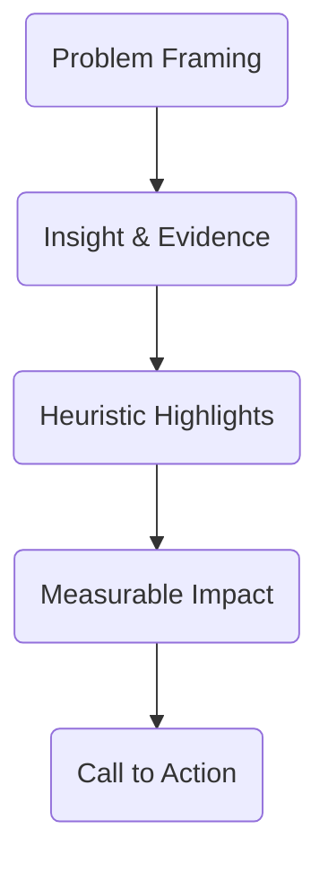

# 04E_Day04_Validation_Story

**Learning Level**: Advanced  
**Prerequisites**: Scenario playbook, bias checklist, stakeholder list  
**Estimated Time**: 2 × 27-minute loops

## 🎯 Objectives for Today

- Validate heuristics with peers and executives to ensure they resonate and align with strategy.
- Craft a narrative storyboard that communicates the value of the Systems Heuristics Atlas.

## ⏱️ Loop Map

| Loop | Focus | Output |
| --- | --- | --- |
| 07 | Peer validation | Heuristic peer review notes |
| 08 | Storytelling | Storyboard wireframe |

## 🤝 Loop 07 – Peer Validation

**Target Output**: Heuristic peer review notes summarizing feedback, concerns, and endorsements.

### Step-by-step (Loop 07)

1. Convene reviewers from architecture, product, engineering, and operations (minimum four perspectives).
2. Walk through top heuristics, scenario outcomes, and bias mitigations.
3. Capture feedback on clarity, feasibility, and missing edge cases.
4. Document commitments for pilot usage or follow-up validation sessions.

### Review Notes Template

| Heuristic | Reviewer | Feedback | Decision | Follow-up |
| --- | --- | --- | --- | --- |

### ASCII Capture

```text
[Heuristic] -> [Reviewer Reaction]
                    |-> Clarify wording
                    |-> Add data signal
                    |-> Accept as-is
```

## 🎙️ Loop 08 – Storytelling

**Target Output**: Storyboard wireframe for communicating the atlas to executives and teams.

### Step-by-step (Loop 08)

1. Outline the narrative arc: **Problem**, **Insight**, **Heuristics**, **Impact**, **Call to Action**.
2. Map each beat to visuals: diagrams, anecdotes, data points.
3. Identify spokespersons and supporting materials (slides, one-pagers, live demo).
4. Ensure the story ties back to Week 02 discipline principles and Week 03 toolchain enablement.

### Storyboard Wireframe

| Slide/Scene | Purpose | Key Message | Visual Support | Owner |
| --- | --- | --- | --- | --- |

### Mermaid Narrative Flow



## ✅ Exit Criteria for Day 4

- Peer review notes collected with clear actions and endorsements.
- Storyboard wireframe ready for final Atlas assembly.
- Agreed-upon spokespersons and follow-up sessions scheduled.

## 🛠️ Tools & Resources

- Collaboration spaces (Miro, FigJam, PowerPoint) for storyboard creation.
- Meeting facilitation templates for capturing review feedback.
- Executive communication guidelines.

## 🔄 Handoff to Day 5

- Integrate peer feedback into heuristics before final Atlas assembly.
- Finalize storyboard visuals and assign production tasks.
- Prepare enablement plan draft for Loop 10.
