# Phase 01 – Reboot (Mindset Architect)

**Learning Level**: Advanced (Lead Architect Track)  
**Prerequisites**: Executive summary of the Lead Architect journey, baseline system design fluency, willingness to unlearn outdated heuristics  
**Estimated Time**: 9 weeks × 5 focused days × 27-minute loops (≈ 20 hours per week)  
**Primary Outputs**: Nine capstone artifacts that codify your rebooted architectural operating system

Reboot is the “mindset architect” phase of the Lead Architect journey. Here you will dismantle stale beliefs, rebuild decision muscle with modern evidence, and erect a repeatable cadence that keeps you future-ready. Every cluster drives a purposeful artifact so you exit with tangible proof of your upgraded thinking.

## 🌟 What you will master

- Reframe leadership beliefs using narrative, data, and stakeholder commitments.
- Translate refreshed principles into daily rituals, review cadences, and personal guardrails.
- Curate an intentional toolchain that fuses AI assistants, automation, and observability from day one.
- Reconstruct systems thinking models from first principles so complex programs stay navigable.
- Drill baseline engineering craft through micro-labs and retrospective-driven feedback.
- Develop a signal library of modern exemplar systems to inspire decisive architectural patterns.
- Install non-negotiable quality, security, and governance baselines across teams.
- Explore emerging methods with structured experiments to keep your strategy adaptive.
- Synthesize the above into a reboot doctrine that communicates the “new you” to executives and teams.

## 🧭 Phase structure at a glance

| Part | Focus | Clusters | Weekly Theme | Signature Artefact |
| --- | --- | --- | --- | --- |
| Part A – Reset Identity | Let go of legacy assumptions and re-anchor purpose | 01–03 | Reorient & Ritualize | Perspective Reset Letter, Discipline Canvas, Toolchain Manifesto |
| Part B – Rewire Practice | Rebuild how you learn, decide, and evaluate | 04–06 | Systems & Signals | Systems Heuristics Atlas, Foundations Lab Journal, Signal Synthesis Brief |
| Part C – Reinforce Standards | Lock in excellence and communicate the reboot | 07–09 | Baselines & Doctrine | Baseline Guardrail Charter, Exploration Storyboard, Reboot Doctrine |

Each cluster unfolds over one focused week broken into ten 27-minute loops (see the operating rhythm below). Loops blend research, reflection, decision logging, and artifact drafting so momentum never stalls.

## 📅 Operating rhythm (per cluster)

| Loop | Focus (27 minutes) | Output Cue |
| --- | --- | --- |
| 01 | Frame the challenge and redefine the success question | Updated hypothesis log |
| 02 | Curate signals (benchmarks, case studies, metrics) | Annotated evidence board |
| 03 | Extract decision principles or heuristics | Draft principle stack |
| 04 | Apply principles to a current workstream or case | Scenario playbook entry |
| 05 | Reflect on resistance, biases, and stakeholder impacts | Friction journal |
| 06 | Translate insights into a tangible artifact section | Artifact section draft |
| 07 | Stress-test with peers, AI copilots, or mentors | Feedback deltas |
| 08 | Integrate refinements and finalize artifact | Artifact v1.0 |
| 09 | Define adoption rituals or guardrails | Implementation checklist |
| 10 | Capture lessons learned and plan the next cluster handoff | Retrospective and forward brief |

## 🗂️ Cluster deliverables matrix

| Cluster | Emphasis | Core Questions | Signature Artifact |
| --- | --- | --- | --- |
| 01 – Reorient Mindset | Identify outdated beliefs, align with current mission | What beliefs no longer serve the strategy? What commitments are required from stakeholders? | Perspective Reset Letter |
| 02 – Discipline Architecture | Draft new craftsmanship principles and rituals | How will I embody elite craftsmanship daily? | Daily Discipline Canvas |
| 03 – Toolchain Intentionality | Curate modern tooling stack, automation hooks | Which digital leverage points create time and visibility? | Toolchain Manifesto |
| 04 – Systems Heuristics | Map core systems thinking models from first principles | How do I simplify complexity for teams and execs? | Systems Heuristics Atlas |
| 05 – Craft Recovery | Build micro-labs to rehearse fundamentals | Where are the weakest craft muscles and how do we rebuild them? | Foundations Lab Journal |
| 06 – Signal Intelligence | Study modern exemplar systems, note insights | What patterns from elite teams should we adapt? | Signal Synthesis Brief |
| 07 – Guardrail Charter | Define minimum quality, security, and review guardrails | What becomes non-negotiable for reviews, releases, and audits? | Baseline Guardrail Charter |
| 08 – Exploration Engine | Explore emerging methods to challenge existing approaches | How do we safely experiment with frontier tech? | Exploration Storyboard |
| 09 – Reboot Declaration | Publish a reboot handbook summarizing decisions | How do we communicate the upgraded operating system? | Reboot Doctrine |

## 🔄 ASCII blueprint

```text
┌──────────────┬───────────────────────────────┬───────────────────────────────┐
│ Part         │ Weekly Pulse                  │ Momentum Anchor                │
├──────────────┼───────────────────────────────┼───────────────────────────────┤
│ Reset        │ Clusters 01-03 (Weeks 1-3)    │ Personal narrative & rituals   │
│ Rewire       │ Clusters 04-06 (Weeks 4-6)    │ Systems heuristics & labs      │
│ Reinforce    │ Clusters 07-09 (Weeks 7-9)    │ Guardrails & reboot doctrine   │
└──────────────┴───────────────────────────────┴───────────────────────────────┘
```

## 🧩 Mermaid view

```mermaid
gantt
    title Phase 01 – Reboot (9 Weeks)
    dateFormat  YYYY-MM-DD
    section Part A – Reset Identity
    Cluster_01 :a1, 2025-09-29, 7d
    Cluster_02 :a2, after a1, 7d
    Cluster_03 :a3, after a2, 7d
    section Part B – Rewire Practice
    Cluster_04 :b1, after a3, 7d
    Cluster_05 :b2, after b1, 7d
    Cluster_06 :b3, after b2, 7d
    section Part C – Reinforce Standards
    Cluster_07 :c1, after b3, 7d
    Cluster_08 :c2, after c1, 7d
    Cluster_09 :c3, after c2, 7d
    section Integration
    Reboot_Doctrine_Publication :milestone, after c3, 2d
```



## ✅ Quality gates

- Maintain a living “belief ledger” that captures before/after mindsets for every cluster.
- Produce version-controlled artifacts (Markdown + supporting canvases) and review them with at least one trusted partner.
- Run a weekly retrospective using the loop 10 template to reinforce lessons and adjust next cluster scope.
- Track adoption metrics (participation, turnaround time, defect leakage, stakeholder sentiment) to validate the reboot’s impact.

## 🧵 Cross-links and next steps

- Review the [Phase 01 Templates Toolkit](./01_Templates/README.md) before starting each cluster so you can instantiate the matching artifact scaffolds during the 10-loop cadence.
- Start with the detailed `[Week 1 – Mindset Reorientation](./Cluster01_Reorient_Mindset/00_Week01_Mindset_Reorientation.md)` plan and execute Loop 01 today.
- Use `[Day 1 – Perspective Reset](./Cluster01_Reorient_Mindset/01_Day01_Perspective_Reset.md)` as your template for daily execution.
- Review the enterprise-wide `[Lead Architect Learning Path](../README.md)` for progression context and downstream prerequisites.
- When you enter Part C, progress through `[Week 7 – Guardrail Charter](./Cluster07_Guardrail_Charter/00_Week07_Guardrail_Charter.md)`, `[Week 8 – Exploration Engine](./Cluster08_Exploration_Engine/00_Week08_Exploration_Engine.md)`, and `[Week 9 – Reboot Declaration](./Cluster09_Reboot_Declaration/00_Week09_Reboot_Declaration.md)` to lock in standards and publish the doctrine.
- Prepare a parking lot for insights that naturally feed Phase 02 (Execution Architect) so the baton pass stays clean.

## 🔗 Related topics

- `01_ReferenceLibrary/01_Development/Development-Track-Restructuring-Summary.md`
- `01_ReferenceLibrary/02_AI-and-ML/PATHWAY.md`
- `01_ReferenceLibrary/04_DevOps/01_CI-CD-Fundamentals/README.md`
- `01_ReferenceLibrary/03_Data-Science/PATHWAY.md`
