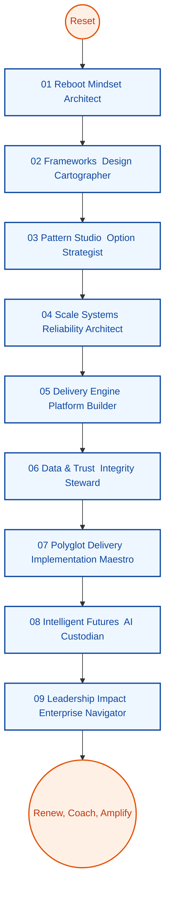

# Lead Architect Reimagination Pathway (V2 Clean Slate)

**Learning Level**: Senior Engineer preparing for enterprise-wide architecture ownership  
**Starting Point**: Willingness to reconstruct personal playbooks without relying on prior documentation  
**Estimated Time Commitment**: 9 phases × 36 hours ≈ 324 hours  
**Cadence**: Each phase contains 9 clusters (~4.5 hours each) to fit within focused 36-hour design sprints  
**North Star**: Create a self-authored body of knowledge, assets, and decision frameworks from scratch

## Using This Blueprint

1. Begin every phase by defining the questions you need answered; collect only primary sources you evaluate yourself.  
2. Convert each cluster into a research → experiment → artifact loop so that new material is produced at the end of every 4.5-hour block.  
3. Revisit completed clusters monthly, refine outcomes, and archive superseded artifacts to demonstrate evolution.  
4. Keep this document as the single index; expand with personal notes, diagrams, and repositories created during the journey.

```text
[Phase01_Reboot]
    ├─ Cluster01 Reorient Mindset
    ├─ Cluster02 Craft Fresh Practices
    ├─ ...
    └─ Cluster09 Publish Personal Doctrine
        ↓
[Phase02_Frameworks] → … → [Phase09_Leadership Impact]
        ↓
Repeat cycles with new evidence, updated heuristics, and refreshed assets
```



## Cluster Lattice

| Cluster | Intent | Focus Questions | Evidence to Produce |
| --- | --- | --- | --- |
| 01 | Reset & Mindset | What assumptions should be retired or reframed? | Reflection brief, belief inventory |
| 02 | Practice Crafting | Which new disciplines must be prototyped immediately? | Practice experiments plan |
| 03 | Tooling Forge | Which tools enable leverage for the next horizon? | Tool selection dossier |
| 04 | System Lens | Which systemic effects must be understood end to end? | System sketchbook |
| 05 | Lab Build | How will new approaches be proven rapidly? | Sandbox implementation notes |
| 06 | Evidence Review | What real-world signals validate or invalidate choices? | Insight digest |
| 07 | Guardrails | What protects quality, security, and observability by default? | Guardrail matrix |
| 08 | Frontier Scan | Which frontiers should I test for future-ready capabilities? | Frontier experiment log |
| 09 | Doctrine & Assets | How will I socialize and reuse what I have learned? | Playbook bundle |

---

### Phase Shortcuts

- [Phase 01 – Reboot](./Phase01_Reboot/README.md)
- [Phase 02 – Frameworks](./Phase02_Frameworks/README.md)
- [Phase 03 – Pattern Studio](./Phase03_Pattern_Studio/README.md)
- [Phase 04 – Scale Systems](./Phase04_Scale_Systems/README.md)
- [Phase 05 – Delivery Engine](./Phase05_Delivery_Engine/README.md)
- [Phase 06 – Data & Trust](./Phase06_Data_Trust/README.md)
- [Phase 07 – Polyglot Delivery](./Phase07_Polyglot_Delivery/README.md)
- [Phase 08 – Intelligent Futures](./Phase08_Intelligent_Futures/README.md)
- [Phase 09 – Leadership Impact](./Phase09_Leadership_Impact/README.md)

## Progress Tracker

- [ ] Phase 01 – Reboot
- [ ] Phase 02 – Frameworks
- [ ] Phase 03 – Pattern Studio
- [ ] Phase 04 – Scale Systems
- [ ] Phase 05 – Delivery Engine
- [ ] Phase 06 – Data & Trust
- [ ] Phase 07 – Polyglot Delivery
- [ ] Phase 08 – Intelligent Futures
- [ ] Phase 09 – Leadership Impact
