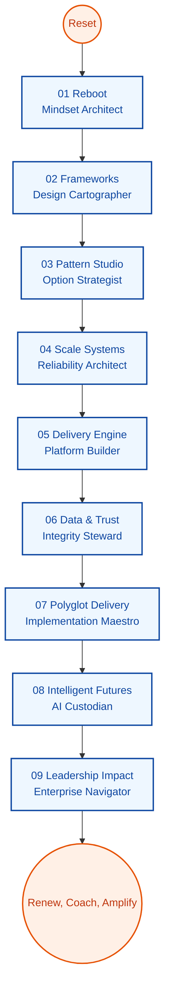

# Lead Architect Reimagination Pathway (V2 Clean Slate)

| Field | Details |
| --- | --- |
| **Learning Level** | Senior engineer or staff-level architect-in-training |
| **Prerequisites** | Ability to guide cross-functional delivery teams and appetite for first-principles research |
| **Estimated Time** | 9 phases × 36 hours ≈ 324 hours (each cluster ≈ 4.5 hours) |
| **Cadence** | Weekly 36-hour design sprint dedicated to one phase (nine clusters × 4.5 hours); revisit artifacts monthly |
| **North Star** | Build a self-authored operating system for architecture leadership |

The pathway replaces legacy playbooks with intentionally original research, experiments, and assets. Every cluster ends with something you can show a stakeholder, teach a team, or use to steer an initiative.

## Using This Blueprint

1. Frame each phase with three governing questions: intent, critical constraints, and success signals.  
2. Run every cluster as a research → experiment → artifact loop; conclude with a tangible deliverable rather than notes.  
3. Conduct a 30-minute after-action once all nine clusters finish; archive superseded assets and log what evolves.  
4. Keep this document as the single index, then branch into personal notebooks, diagrams, or code repos as evidence grows.

```text
[Phase01_Reboot]
    ├─ Cluster01 Reorient Mindset
    ├─ Cluster02 Craft Fresh Practices
    ├─ ...
    └─ Cluster09 Publish Personal Doctrine
        ↓
[Phase02_Frameworks] → … → [Phase09_Leadership Impact]
        ↓
Repeat cycles with new evidence, updated heuristics, and refreshed assets
```



## Cluster Lattice

| Cluster | Intent | Focus Questions | Evidence to Produce |
| --- | --- | --- | --- |
| 01 | Reset & Mindset | What assumptions should be retired or reframed? | Reflection brief, belief inventory |
| 02 | Practice Crafting | Which new disciplines must be prototyped immediately? | Practice experiments plan |
| 03 | Tooling Forge | Which tools enable leverage for the next horizon? | Tool selection dossier |
| 04 | System Lens | Which systemic effects must be understood end to end? | System sketchbook |
| 05 | Lab Build | How will new approaches be proven rapidly? | Sandbox implementation notes |
| 06 | Evidence Review | What signals validate or invalidate choices? | Insight digest |
| 07 | Guardrails | What protects quality, security, and observability by default? | Guardrail matrix |
| 08 | Frontier Scan | Which frontiers should I test for future-ready capabilities? | Frontier experiment log |
| 09 | Doctrine & Assets | How will I socialize and reuse what I have learned? | Playbook bundle |

---

### Phase Shortcuts

| Phase | Identity Shift | Signature Artifact | Jump In |
| --- | --- | --- | --- |
| 01 | Mindset Architect | Reboot doctrine | [Phase01_Reboot](./Phase01_Reboot/README.md) |
| 02 | Design Cartographer | Framework field guide | [Phase02_Frameworks](./Phase02_Frameworks/README.md) |
| 03 | Option Strategist | Pattern decision codex | [Phase03_Pattern_Studio](./Phase03_Pattern_Studio/README.md) |
| 04 | Reliability Architect | Resilience choreography | [Phase04_Scale_Systems](./Phase04_Scale_Systems/README.md) |
| 05 | Platform Builder | Delivery engine manual | [Phase05_Delivery_Engine](./Phase05_Delivery_Engine/README.md) |
| 06 | Integrity Steward | Data trust compendium | [Phase06_Data_Trust](./Phase06_Data_Trust/README.md) |
| 07 | Implementation Maestro | Polyglot starter suite | [Phase07_Polyglot_Delivery](./Phase07_Polyglot_Delivery/README.md) |
| 08 | AI Custodian | Intelligent futures charter | [Phase08_Intelligent_Futures](./Phase08_Intelligent_Futures/README.md) |
| 09 | Enterprise Navigator | Leadership impact portfolio | [Phase09_Leadership_Impact](./Phase09_Leadership_Impact/README.md) |

### Operating Rhythm at a Glance

1. **Prime** – Reserve a 36-hour sprint, define three guiding questions, and set success metrics for the phase.  
2. **Cycle** – Execute nine cluster loops. Each loop contains four 27-minute micro-sessions (≈4.5 hours per cluster): framing, experimentation, synthesis, packaging.  
3. **Review** – Close with a phase retrospective, refresh the progress tracker, and queue cross-team coaching sessions using the new artifacts.  
4. **Renew** – After a month, revisit the phase, score artifacts against outcomes, and either archive or iterate. Document the change log.

## Progress Tracker

- [ ] Phase 01 – Reboot
- [ ] Phase 02 – Frameworks
- [ ] Phase 03 – Pattern Studio
- [ ] Phase 04 – Scale Systems
- [ ] Phase 05 – Delivery Engine
- [ ] Phase 06 – Data & Trust
- [ ] Phase 07 – Polyglot Delivery
- [ ] Phase 08 – Intelligent Futures
- [ ] Phase 09 – Leadership Impact

## Quality Gates and Evidence Vault

- **Every cluster ships**: Publish the artifact in a shared repository, attach a one-page summary, and log source references.  
- **Decision traceability**: Capture assumptions, data points, and rationale in a lightweight ADR (Architecture Decision Record) per cluster.  
- **Review cadence**: Pair with a peer architect every second phase to critique artifacts and stress-test heuristics.  
- **Integration checks**: Map newly created assets to the Development, Data, AI/ML, and DevOps tracks to ensure reuse.

## Tooling & Templates

- [Evidence Journal Template](../01_ReferenceLibrary/03_Data-Science/01_DataScience/README.md) – adapt for capturing signal synthesis.  
- [ADR Quickstart](../01_ReferenceLibrary/01_Development/17_Git-Version-Control/README.md) – leverage version control workflows for decision tracking.  
- [DevOps Quality Gates](../01_ReferenceLibrary/04_DevOps/01_CI-CD-Fundamentals/README.md) – borrow automated checks for cluster guardrails.  
- [AI Custodian Guardrails](../01_ReferenceLibrary/02_AI-and-ML/07_AI-Agents/README.md) – integrate responsible AI practices before Phase 08.

## Next Moves

1. Pick the phase that matches your present strategic gap and schedule a dedicated sprint.  
2. Duplicate the cluster lattice into your workspace, pre-fill deliverable placeholders, and align stakeholders on outputs.  
3. Establish a monthly “architecture guild” review to socialize artifacts, gather feedback, and plan the next evolution.
