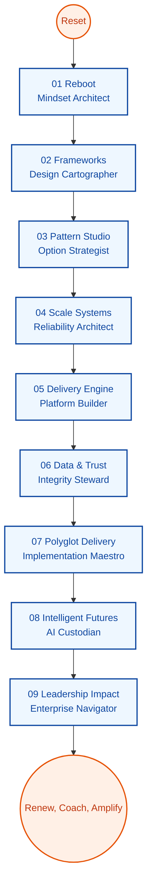

# Lead Architect Reimagination Pathway (V2 Clean Slate)

**Learning Level**: Senior Engineer preparing for enterprise-wide architecture ownership  
**Starting Point**: Willingness to reconstruct personal playbooks without relying on prior documentation  
**Estimated Time Commitment**: 9 phases × 36 hours ≈ 324 hours  
**Cadence**: Each phase contains 9 clusters (~4.5 hours each) to fit within focused 36-hour design sprints  
**North Star**: Create a self-authored body of knowledge, assets, and decision frameworks from scratch

## Using This Blueprint

1. Begin every phase by defining the questions you need answered; collect only primary sources you evaluate yourself.  
2. Convert each cluster into a research → experiment → artifact loop so that new material is produced at the end of every 4.5-hour block.  
3. Revisit completed clusters monthly, refine outcomes, and archive superseded artifacts to demonstrate evolution.  
4. Keep this document as the single index; expand with personal notes, diagrams, and repositories created during the journey.

```text
[Phase01_Reboot]
    ├─ Cluster01 Reorient Mindset
    ├─ Cluster02 Craft Fresh Practices
    ├─ ...
    └─ Cluster09 Publish Personal Doctrine
        ↓
[Phase02_Frameworks] → … → [Phase09_Leadership Impact]
        ↓
Repeat cycles with new evidence, updated heuristics, and refreshed assets
```



## Cluster Lattice

| Cluster | Intent | Focus Questions | Evidence to Produce |
| --- | --- | --- | --- |
| 01 | Reset & Mindset | What assumptions should be retired or reframed? | Reflection brief, belief inventory |
| 02 | Practice Crafting | Which new disciplines must be prototyped immediately? | Practice experiments plan |
| 03 | Tooling Forge | Which tools enable leverage for the next horizon? | Tool selection dossier |
| 04 | System Lens | Which systemic effects must be understood end to end? | System sketchbook |
| 05 | Lab Build | How will new approaches be proven rapidly? | Sandbox implementation notes |
| 06 | Evidence Review | What real-world signals validate or invalidate choices? | Insight digest |
| 07 | Guardrails | What protects quality, security, and observability by default? | Guardrail matrix |
| 08 | Frontier Scan | Which frontiers should I test for future-ready capabilities? | Frontier experiment log |
| 09 | Doctrine & Assets | How will I socialize and reuse what I have learned? | Playbook bundle |

---

## Phase Playbooks

### Phase 01 – Reboot (Mindset Architect)

Reconstruct foundational thinking and habits with fresh research and deliberate practice.

| Cluster | Emphasis | Create |
| --- | --- | --- |
| 01 | Identify outdated beliefs, align with current mission | Perspective reset letter |
| 02 | Draft new craftsmanship principles and rituals | Daily discipline canvas |
| 03 | Curate modern tooling stack, automation hooks | Toolchain manifesto |
| 04 | Map core system thinking models from first principles | Systems heuristics atlas |
| 05 | Build micro-labs to rehearse fundamentals | Foundations lab journal |
| 06 | Study modern exemplar systems, note insights | Signal synthesis brief |
| 07 | Define minimum quality, security, and review guardrails | Baseline guardrail charter |
| 08 | Explore emerging methods to challenge existing approaches | Exploration storyboard |
| 09 | Publish a reboot handbook summarizing decisions | Reboot doctrine |

### Phase 02 – Frameworks (Design Cartographer)

Invent architecture framing devices tailored to current challenges.

| Cluster | Emphasis | Create |
| --- | --- | --- |
| 01 | Distill core design values and evaluation heuristics | Design charter |
| 02 | Construct original pattern taxonomy for recurring scenarios | bespoke pattern map |
| 03 | Establish tool-agnostic workflow templates | Neutral workflow schematics |
| 04 | Compose storytelling visuals for stakeholder dialogue | Architecture narrative kit |
| 05 | Implement prototype modules illustrating each framework | Framework lab archive |
| 06 | Critique legacy decisions and extract lessons | Retrospective insight ledger |
| 07 | Define acceptance bars, review scorecards, and traceability | Quality oversight matrix |
| 08 | Run experiments comparing alternative frameworks | Comparative experiment notes |
| 09 | Capture decision playbook and communication collateral | Framework field guide |

### Phase 03 – Pattern Studio (Option Strategist)

Design a portfolio of architectural options tuned to present and near-future demands.

| Cluster | Emphasis | Create |
| --- | --- | --- |
| 01 | Outline solution archetypes for different scaling trajectories | Archetype dossier |
| 02 | Engineer bespoke combinations of patterns to address trade-offs | Option synthesis board |
| 03 | Develop tooling integration standards for pattern execution | Integration standards deck |
| 04 | Model service interactions, failure modes, and resilience stories | Interaction atlas |
| 05 | Build proof-of-concept services that exercise chosen patterns | Pattern lab repository |
| 06 | Analyze success and failure stories from personal network | Cross-industry case scrapbook |
| 07 | Define operational excellence measures tied to patterns | Pattern assurance checklist |
| 08 | Trial frontier approaches (serverless, edge, event mesh, etc.) | Frontier trial log |
| 09 | Document trade-offs and pattern selection framework | Pattern decision codex |

### Phase 04 – Scale Systems (Reliability Architect)

Engineer systems that remain dependable under uncertainty and load.

| Cluster | Emphasis | Create |
| --- | --- | --- |
| 01 | Translate scaling principles into usable heuristics | Scaling heuristics field notes |
| 02 | Craft caching, data distribution, and queuing playbooks | Scalable data playbook |
| 03 | Design observability-first development routines | Observability workbook |
| 04 | Draft end-to-end flow narratives capturing latency and coupling | Flow choreography map |
| 05 | Build scenario simulators that stress critical paths | Resilience simulation lab |
| 06 | Review high-scale stories, extract actionable lessons | Reliability insight digest |
| 07 | Define crisis response and recovery rituals | Resilience governance guide |
| 08 | Evaluate new infrastructure primitives | Infrastructure scouting log |
| 09 | Consolidate scale doctrine and response manual | Scale readiness charter |

### Phase 05 – Delivery Engine (Platform Builder)

Create an adaptive, automation-rich delivery system from first principles.

| Cluster | Emphasis | Create |
| --- | --- | --- |
| 01 | Formulate platform principles that prioritize flow and safety | Platform manifesto |
| 02 | Invent deployment playstyles (progressive delivery, experimentation) | Delivery tactics compendium |
| 03 | Define containerization, orchestration, and infrastructure automation standards | Automation blueprint |
| 04 | Embed telemetry, alerts, and review cadence into the pipeline | Operations sign-off kit |
| 05 | Build a greenfield pipeline to exercise new standards | Pipeline lab repo |
| 06 | Conduct migration dry-runs and document scripts | Migration rehearsal journal |
| 07 | Develop default security and compliance controls | Protection controls matrix |
| 08 | Explore platform accelerators (platform engineering, internal dev portals) | Accelerator exploration log |
| 09 | Publish the delivery engine handbook | Platform operating manual |

### Phase 06 – Data & Trust (Integrity Steward)

Own the data lifecycle and trust posture without leaning on legacy guidance.

| Cluster | Emphasis | Create |
| --- | --- | --- |
| 01 | Define universal data language, glossaries, and domain boundaries | Data lexicon |
| 02 | Architect ingestion, processing, and consumption patterns | Data architecture canvas |
| 03 | Build catalog of analytical and operational tooling decisions | Tool & service register |
| 04 | Map lineage, retention, and sovereignty requirements | Trust topology |
| 05 | Stand up secure, auditable pipelines for fresh scenarios | Trust lab journal |
| 06 | Evaluate cross-industry data incidents for lessons | Incident insight log |
| 07 | Codify risk, privacy, and compliance policies | Trust guardrail charter |
| 08 | Experiment with AI-ready data strategies | Intelligent data play log |
| 09 | Publish end-to-end data stewardship guide | Data trust compendium |

### Phase 07 – Polyglot Delivery (Implementation Maestro)

Translate architecture intent into code and operational patterns across stacks.

| Cluster | Emphasis | Create |
| --- | --- | --- |
| 01 | Align architecture decisions with language-specific execution models | Translation blueprint |
| 02 | Build reusable service skeletons in multiple ecosystems | Polyglot starter kit |
| 03 | Define automated build and verification choreography | Build choreography handbook |
| 04 | Map integration flows, APIs, and contract evolution | Integration blueprint |
| 05 | Produce end-to-end reference implementations | Implementation showcase |
| 06 | Review cross-stack solution outcomes | Cross-stack insight digest |
| 07 | Engineer quality gates spanning unit to chaos tests | Quality assurance codex |
| 08 | Trial AI-assisted engineering practices | Augmented engineering log |
| 09 | Curate implementation heuristics for future teams | Implementation field guide |

### Phase 08 – Intelligent Futures (AI Custodian)

Integrate intelligence responsibly while inventing new governing models.

| Cluster | Emphasis | Create |
| --- | --- | --- |
| 01 | Frame AI opportunities and constraints relevant to the portfolio | Opportunity charter |
| 02 | Compose original prompt, workflow, and agent design patterns | Intelligent pattern atlas |
| 03 | Evaluate tooling ecosystems, SDKs, and platforms | AI tooling ledger |
| 04 | Design guardrails for latency, privacy, and reliability | Responsible integration blueprint |
| 05 | Build AI-infused modules to validate assumptions | Intelligent module lab |
| 06 | Capture lessons from real-world AI deployments | AI learning digest |
| 07 | Establish ethics, bias, and compliance accountability loops | Responsible AI covenant |
| 08 | Experiment with multi-agent and reinforcement paradigms | Advanced exploration journal |
| 09 | Publish AI operating model and governance dashboard | Intelligent futures playbook |

### Phase 09 – Leadership Impact (Enterprise Navigator)

Shape organizational direction, influence investment, and cultivate future architects.

| Cluster | Emphasis | Create |
| --- | --- | --- |
| 01 | Articulate leadership heuristics and context maps | Leadership operating system |
| 02 | Design governance rhythms, councils, and decision forums | Governance cadence planner |
| 03 | Build situational awareness dashboards and signal libraries | Insight command center |
| 04 | Map multi-team collaboration patterns and strategy alignment | Portfolio orchestration kit |
| 05 | Construct facilitation assets for workshops and reviews | Influence toolkit |
| 06 | Chronicle transformation case stories and outcomes | Impact narrative anthology |
| 07 | Define policy evolution and feedback loops | Policy refinement charter |
| 08 | Chart strategic experiments and innovation pipelines | Strategic experiment ledger |
| 09 | Produce a 90-day leadership impact plan and mentor framework | Leadership impact portfolio |

---

## Progress Tracker

- [ ] Phase 01 – Reboot
- [ ] Phase 02 – Frameworks
- [ ] Phase 03 – Pattern Studio
- [ ] Phase 04 – Scale Systems
- [ ] Phase 05 – Delivery Engine
- [ ] Phase 06 – Data & Trust
- [ ] Phase 07 – Polyglot Delivery
- [ ] Phase 08 – Intelligent Futures
- [ ] Phase 09 – Leadership Impact
