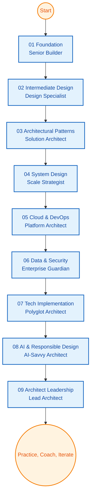

# Lead Architect Progressive Pathway (Clean Slate, V2)

**Learning Level**: Senior Engineer → Lead / Chief Architect  
**Prerequisites**: Multi-language development fluency, baseline DevOps and system design literacy  
**Estimated Time**: 9 phases × 36 hours ≈ 324 hours  
**Structure**: Each phase contains 9 thematic clusters (~4.5 hours per cluster)  
**Builds Upon**: STSA Development track, DevOps pathway, AI/ML foundations  
**Enables**: Enterprise-scale solution design, platform governance, strategic technology leadership

## How to Navigate This Playbook

1. Treat each cluster as a focused 4.5-hour arc: study → practice → artifact.  
2. Use the outputs column to capture tangible evidence (notes, diagrams, repos, decks).  
3. Rotate phases based on business demand; return quarterly to log deltas and reprioritize.  
4. Pair with [`ReadMeV1.md`](./ReadMeV1.md) for 27-minute sprints when you need rapid refreshers.

```text
[Phase01_Foundations]
    ├─ Cluster01 Concept Foundations
    ├─ Cluster02 Practical Patterns
    ├─ ...
    └─ Cluster09 Reflection & Artifacts
        ↓
[Phase02_Intermediate-Design] → … → [Phase09_Architect-Leadership]
        ↓
Continuous Improvement Loop (refresh artifacts, recalibrate priorities, mentor others)
```



## Cluster Taxonomy (applies to every phase)

| Cluster | Theme | Primary Focus | Typical Outputs |
| --- | --- | --- | --- |
| 01 | Concept Foundations | Core principles, mental models, heuristics | Concept map, glossary, comparison sheet |
| 02 | Practical Patterns | Design/architecture patterns in context | Pattern decision guide |
| 03 | Tooling & Language Mastery | IDEs, frameworks, automation, idioms | Tooling playbook, environment template |
| 04 | System Thinking | Scale, latency, failure trade-offs | System diagrams, risk heatmap |
| 05 | Hands-on Labs | Prototypes, code exercises, proof points | Repo snippet, executable demo |
| 06 | Case Studies & Reviews | Architecture tear-downs, postmortems | Lessons learned brief |
| 07 | Quality & Governance | Testing, security, compliance, observability | Quality checklist, guardrail matrix |
| 08 | Innovation & Experimentation | Emerging tech, pilots, spikes | Experiment log, hypothesis results |
| 09 | Reflection & Artifacts | Summaries, templates, playbooks | Phase artifact bundle |

---

## Phase Playbooks

### Phase 01 – Foundations (Senior Builder)

Focus on craftsman discipline across core languages and fundamentals.

| Cluster | Emphasis | Output |
| --- | --- | --- |
| 01 | Syntax refresh across Python, C#, Java, JS/TS | Multi-language fluency matrix |
| 02 | OOP and functional baselines | Pattern mapping cheatsheet |
| 03 | Toolchain setup, debugging, Git rigor | Personal tooling playbook |
| 04 | Algorithms, data structures, small-scale design | Mental model diagrams |
| 05 | Language-specific mini projects | Reference snippet repository |
| 06 | Review compact systems for strengths/gaps | Comparison notes |
| 07 | Clean code, TDD, code review etiquette | Quality checklist |
| 08 | Sample emerging frameworks, introductory AI | Tech scouting log |
| 09 | Consolidate learning narratives | Foundations playbook |

### Phase 02 – Intermediate Design (Design Specialist)

Move from intuitive design to principled architectural reasoning.

| Cluster | Emphasis | Output |
| --- | --- | --- |
| 01 | SOLID, modularity, encapsulation heuristics | Concept checklist |
| 02 | Classic design patterns with trade-offs | Pattern selection matrix |
| 03 | Advanced debugging, profiling, lint automation | Language-specific best practices |
| 04 | UML, C4, storytelling visuals | Component storyboard |
| 05 | Implement pattern-led modules | Reusable module mini-repo |
| 06 | Audit medium-sized systems | Architecture review dossier |
| 07 | Refactoring frameworks, definition of done | Refactoring checklist |
| 08 | Prototype alternate architectural variants | Experimental notes |
| 09 | Document decision rationale | Pattern & architecture notebook |

### Phase 03 – Architectural Patterns (Solution Architect)

Translate business constraints into fit-for-purpose architecture choices.

| Cluster | Emphasis | Output |
| --- | --- | --- |
| 01 | Monolith vs modular vs microservice positioning | Architecture comparison sheet |
| 02 | CQRS, DDD, event sourcing applicability | Pattern application map |
| 03 | Orchestration, messaging, workflow engines | Tooling cheat sheet |
| 04 | Inter-service communication, resilience | Communication blueprint |
| 05 | Microservice and event-driven prototypes | Service lab repo |
| 06 | Case studies of distributed deployments | Lessons learned brief |
| 07 | SLOs, SLI design, reliability practices | SLA & monitoring plan |
| 08 | Serverless, edge, hybrid explorations | Prototype log |
| 09 | Record trade-off decisions | Architecture decision register |

### Phase 04 – System Design & Scalability (Scale Strategist)

Engineer for resilience, performance, and graceful degradation.

| Cluster | Emphasis | Output |
| --- | --- | --- |
| 01 | Distributed fundamentals, CAP, consistency | Concept diagrams |
| 02 | Caching, sharding, queueing strategies | Pattern guide |
| 03 | Profiling, benchmarking, tracing suites | Tool reference sheet |
| 04 | End-to-end workflow modeling | System workflow map |
| 05 | Scalable prototype build | Prototype repo |
| 06 | High-scale case investigations | System review notes |
| 07 | Chaos engineering, disaster recovery | Resilience test checklist |
| 08 | Evaluate new data infra/brokers | Experimentation notes |
| 09 | Codify scale blueprint | Scalable system dossier |

### Phase 05 – Cloud-Native & DevOps (Platform Architect)

Industrialize delivery from commit to customer with cloud-first mindsets.

| Cluster | Emphasis | Output |
| --- | --- | --- |
| 01 | 12-factor discipline, cloud patterns | Concept summary |
| 02 | CI/CD, blue/green, canary frameworks | Deployment pattern guide |
| 03 | Docker, Kubernetes, IaC pipelines | Platform playbook |
| 04 | Observability, SRE rituals | Observability dashboard plan |
| 05 | Cloud-native deployment lab | Deployment repo |
| 06 | Migration retrospectives | Migration lessons learned |
| 07 | Security gates, compliance controls | Pipeline QA checklist |
| 08 | Serverless, multi-cloud pilots | Prototype log |
| 09 | Integrate results into platform guide | Deployment & observability charter |

### Phase 06 – Data Management & Security (Enterprise Guardian)

Guard information flow, governance, and threat posture.

| Cluster | Emphasis | Output |
| --- | --- | --- |
| 01 | Data modeling, normalization strategies | Data concept diagrams |
| 02 | Data lakes, streaming vs batch patterns | Data architecture guide |
| 03 | Analytics tooling, storage engines | Tooling cheat sheet |
| 04 | Lineage, replication, lifecycle | Data flow map |
| 05 | Secure data pipeline lab | Pipeline repo |
| 06 | Enterprise data case studies | Case digest |
| 07 | Threat modeling, privacy compliance | Security & governance checklist |
| 08 | AI-ready data platforms | Experimentation notes |
| 09 | Aggregate policies and templates | Data & security control matrix |

### Phase 07 – Technology Implementation (Polyglot Architect)

Bridge architecture intent with language-specific execution.

| Cluster | Emphasis | Output |
| --- | --- | --- |
| 01 | Pattern-to-code mapping across stacks | Template catalogue |
| 02 | Service skeletons, reusable modules | Reusable module repo |
| 03 | Build automation, dependency pipelines | Build automation notes |
| 04 | End-to-end workflow orchestration | System integration diagrams |
| 05 | Full-stack reference implementation | Prototype repo |
| 06 | Polyglot system reviews | Lessons learned brief |
| 07 | Integration testing strategies | QA checklist |
| 08 | AI-assisted coding, novel frameworks | Experiment log |
| 09 | Capture implementation heuristics | Tech stack integration journal |

### Phase 08 – AI & Responsible Design (AI-Savvy Architect)

Embed intelligence thoughtfully while managing risk.

| Cluster | Emphasis | Output |
| --- | --- | --- |
| 01 | AI, LLM, agent fundamentals for architects | Concept summary |
| 02 | Prompt and workflow design patterns | AI pattern guide |
| 03 | ML/AI tooling stacks, SDKs | Tooling cheat sheet |
| 04 | System integration, latency, guardrails | Integration diagram |
| 05 | AI-enabled module lab | AI prototype repo |
| 06 | AI product case critiques | Case notes |
| 07 | Ethics, bias, compliance frameworks | AI risk checklist |
| 08 | Multi-agent, RL experimentation | Experimentation log |
| 09 | Consolidate AI operating model | AI risk radar & playbook |

### Phase 09 – Architect Leadership (Lead Architect)

Drive strategy, orchestration, and organizational influence.

| Cluster | Emphasis | Output |
| --- | --- | --- |
| 01 | Heuristics, context framing | Decision heuristics playcard |
| 02 | Governance, decision frameworks | Architecture governance guide |
| 03 | Reporting, observability command centers | Leadership dashboard template |
| 04 | Multi-team alignment, portfolio thinking | Org architecture map |
| 05 | Simulation, facilitation, storytelling | Simulation exercise packet |
| 06 | Enterprise architecture case files | Case study digest |
| 07 | Review cadence, policy tooling | Governance checklist |
| 08 | Strategic experimentation portfolio | Innovation journal |
| 09 | Leadership impact plan | 90-day architecture plan |

---

## Progress Tracker

- [ ] Phase 01 – Foundations
- [ ] Phase 02 – Intermediate Design
- [ ] Phase 03 – Architectural Patterns
- [ ] Phase 04 – System Design & Scalability
- [ ] Phase 05 – Cloud-Native & DevOps
- [ ] Phase 06 – Data Management & Security
- [ ] Phase 07 – Technology Implementation
- [ ] Phase 08 – AI & Responsible Design
- [ ] Phase 09 – Architect Leadership

## Related References

- [`../01_ReferenceLibrary`](../01_ReferenceLibrary) – Deep content for clusters across all tracks.  
- [`ReadMeV1.md`](./ReadMeV1.md) – Companion quick-cycle plan.  
- [`../01_ReferenceLibrary/COMPLETE_LEARNING_PLAN.md`](../01_ReferenceLibrary/COMPLETE_LEARNING_PLAN.md) – Enterprise learning strategy.  
- [`../01_ReferenceLibrary/04_DevOps/PATHWAY.md`](../01_ReferenceLibrary/04_DevOps/PATHWAY.md) – DevOps alignment for phases 05–07.  
- [`../01_ReferenceLibrary/02_AI-and-ML/PATHWAY.md`](../01_ReferenceLibrary/02_AI-and-ML/PATHWAY.md) – AI depth linking to phase 08.  
- [`../01_ReferenceLibrary/01_Development/Development-Track-Restructuring-Summary.md`](../01_ReferenceLibrary/01_Development/Development-Track-Restructuring-Summary.md) – Development foundation mapping.
