# Lead Architect Learning Path (Overview)

**Learning Level**: Senior Engineer → Lead / Chief Architect  
**Prerequisites**: STSA development foundations, baseline cloud & DevOps capability  
**Estimated Time**: 9 phases × 36 hours each (see detailed plan)  
**Primary Companion**: README.md (clean-slate plan)

## Orientation

This page keeps the folder clean after removing the old chatbot transcript. Use it to understand the V2 clean-slate pathway and jump straight into the detailed clusters when you are ready.

## Phase Progression

| Phase | Identity Shift | Strategic Outcome | Anchor Artifact |
| --- | --- | --- | --- |
| 01_Foundations | Senior Builder | Multilingual fluency and disciplined craft | Foundations playbook |
| 02_Intermediate-Design | Design Specialist | Principles-driven design decisions | Pattern diagnostics log |
| 03_Architectural-Patterns | Solution Architect | Architecture trade-off fluency | Decision scorecard |
| 04_System-Design | Scale Strategist | Resilient, scalable system blueprints | System design dossier |
| 05_Cloud-Native-DevOps | Platform Architect | Cloud pipeline operating model | Deployment & observability charter |
| 06_Data-Security | Enterprise Guardian | Data + security governance posture | Control matrix |
| 07_Tech-Implementation | Polyglot Architect | Multi-language implementation templates | Integration journal |
| 08_AI-Responsible | AI-Savvy Architect | Responsible AI integration playbook | AI capability evaluation memo |
| 09_Leadership | Lead Architect | Strategic orchestration & guidance | 90-day leadership plan |

```text
Start
  ↓
Phase01_Foundations → Phase02_Intermediate-Design → Phase03_Architectural-Patterns → Phase04_System-Design
  ↓
Phase05_Cloud-Native-DevOps → Phase06_Data-Security → Phase07_Tech-Implementation → Phase08_AI-Responsible → Phase09_Leadership
  ↓
Continuous Improvement Loop
```

```mermaid
flowchart LR
    classDef phase fill:#e3f2fd,stroke:#1565c0,stroke-width:2px,color:#0d47a1
    classDef focus fill:#fff3e0,stroke:#f57c00,stroke-width:2px,color:#e65100
    S((Start)):::focus --> P1[Phase 01  \nFoundations]:::phase --> P2[Phase 02  \nIntermediate Design]:::phase --> P3[Phase 03  \nArchitectural Patterns]:::phase --> P4[Phase 04  \nSystem Design]:::phase
    P4 --> P5[Phase 05  \nCloud-Native & DevOps]:::phase --> P6[Phase 06  \nData & Security]:::phase --> P7[Phase 07  \nTech Implementation]:::phase --> P8[Phase 08  \nAI & Responsible Design]:::phase --> P9[Phase 09  \nLeadership]:::phase --> C((Continuous  \nImprovement)):::focus
```



## How to Use This Folder

1. Open README.md for the 9 phases × 9 cluster blueprint (≈324 hours).  
2. Use ReadMeV1.md when you want focused 27-minute sprint sessions.  
3. Capture each phase artifact in your architecture journal or the assessments folder to track mastery.  
4. Revisit phases quarterly to refresh, reprioritize clusters, and log capability shifts.

## Supporting Assets

- **Detailed V2 Plan**: README.md – clean-slate cluster structure and outputs.
- **Focused Session Plan**: ReadMeV1.md – quick sessions and progress checklist.
- **Reference Library**: 01_ReferenceLibrary folder – source material for every linked topic.
- **Cross-Track Tie-ins**: Pair phases 05–08 with DevOps and AI learning tracks for specialization depth.

## Next Steps

- Schedule your first clusters and block time on your calendar.  
- Duplicate the phase × cluster table into your planning tool as a tracker.  
- Share the roadmap with mentors or peers for accountability and feedback.  
- After finishing Phase 01, choose whether to continue linearly or jump to the phase solving your current business demand.

## Related Topics

- COMPLETE_LEARNING_PLAN.md – enterprise-wide STSA learning strategy.  
- Development track restructuring summary – foundational curriculum context.  
- AI and ML pathway notes – AI specialization roadmap.  
- DevOps pathway notes – operational excellence companion.
