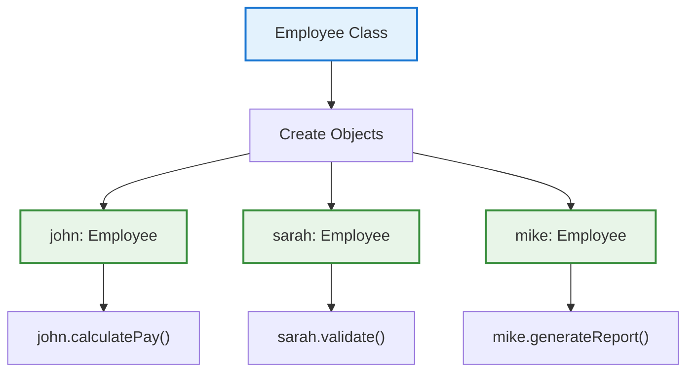

# 01A1_OOP-Core-Concepts

**Learning Level**: Beginner  
**Prerequisites**: Basic programming knowledge  
**Estimated Time**: 15 minutes  
**Series**: Part A1 of 4 - Core OOP Concepts
**Next**: [01A2_OOP-Classes-Blueprint.md](01A2_OOP-Classes-Blueprint.md)

---

## 🎯 Learning Objectives (15-Minute Session)

By the end of this session, you will:

- Understand what Object-Oriented Programming is
- Recognize the problems OOP solves
- See the fundamental OOP solution approach

---

## 📋 The OOP Revolution (15 minutes)

### **What is Object-Oriented Programming?**

**Object-Oriented Programming**: A programming paradigm that organizes code around objects and classes, enabling better code organization, reusability, and maintainability.

### **The Core Problem**

```text
❌ PROCEDURAL APPROACH
┌─────────────────┐    ┌─────────────────┐    ┌─────────────────┐
│ calculatePay()  │    │ validateUser()  │    │ generateReport() │
├─────────────────┤    ├─────────────────┤    ├─────────────────┤
│ - Global data   │    │ - Global data   │    │ - Global data   │
│ - Scattered     │    │ - Scattered     │    │ - Scattered     │
│   logic         │    │   validation    │    │   formatting    │
└─────────────────┘    └─────────────────┘    └─────────────────┘
```

**Problems with Procedural Code**:

- **Code duplication**: Same logic repeated everywhere
- **Tight coupling**: Functions depend on global state
- **Difficult maintenance**: Changes break multiple functions
- **Testing challenges**: Hard to isolate and test components
- **Poor organization**: Related code scattered across files

### **The OOP Solution**



### **OOP Benefits**

- ✅ **Organization**: Related data and behavior bundled together
- ✅ **Reusability**: Define once, create many instances
- ✅ **Maintainability**: Changes in one place affect all objects
- ✅ **Testability**: Objects can be isolated and tested independently
- ✅ **Modeling**: Natural representation of real-world entities

---

## ✅ Key Takeaways (2 minutes)

### **Essential Understanding**

1. **OOP organizes code** around objects instead of functions
2. **Solves major problems** of procedural programming
3. **Bundles data and behavior** together logically
4. **Enables better software design** through organization

### **What's Next**

**Part A2** will dive into:

- What classes are (the blueprints)
- How objects are created from classes
- The class-object relationship in detail

---

## 🔗 Series Navigation

- **Current**: Part A1 - Core Concepts ✅
- **Next**: [01A2_OOP-Classes-Blueprint.md](01A2_OOP-Classes-Blueprint.md)
- **Then**: [01B1_OOP-Objects-Creation.md](01B1_OOP-Objects-Creation.md)
- **Series**: Classes & Objects Foundation (Part A1 of 4)

**Last Updated**: September 10, 2025  
**Format**: 15-minute focused learning segment
