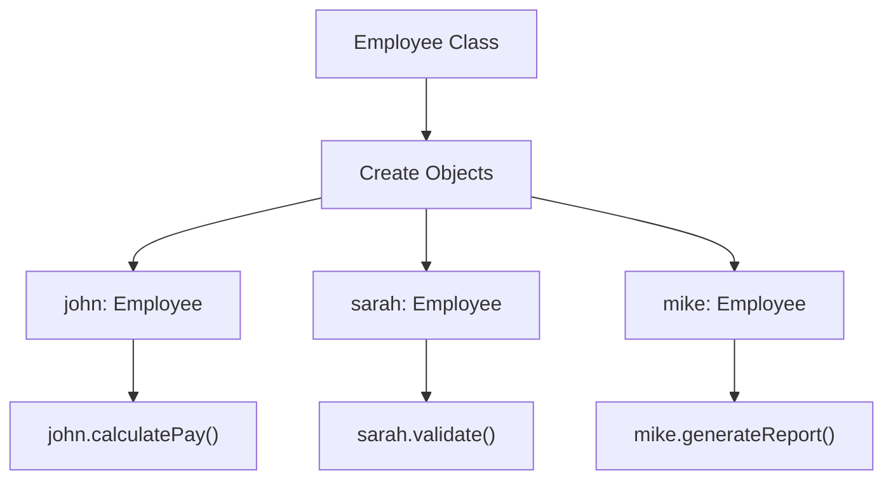
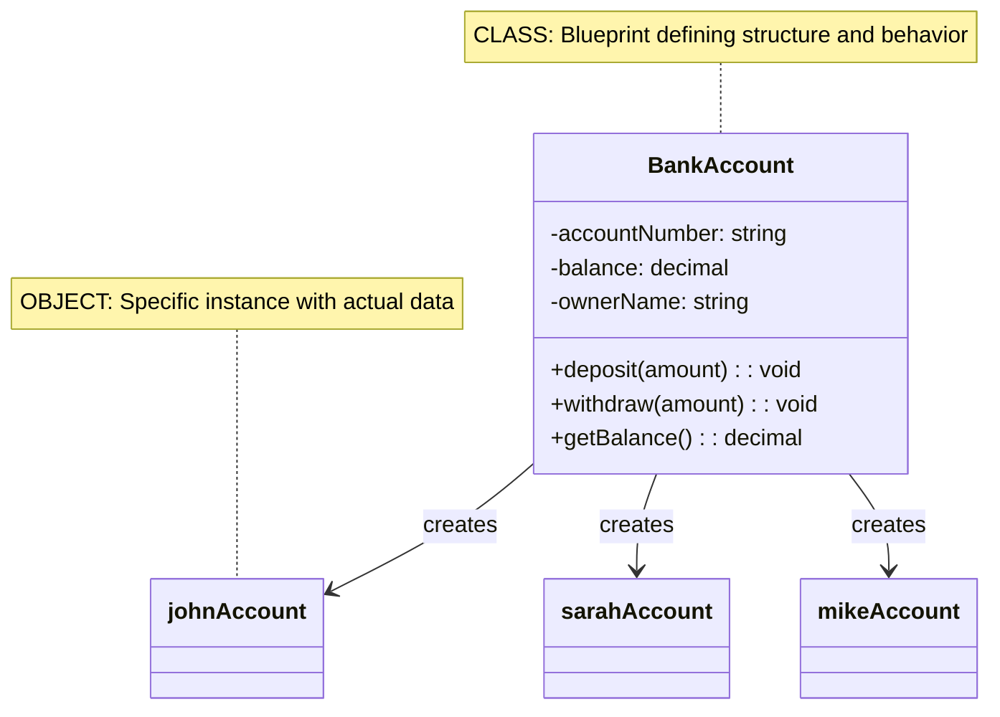

# 01A_OOP-Classes-Objects-Foundation

**Learning Level**: Beginner  
**Prerequisites**: Basic programming knowledge  
**Estimated Time**: 27 minutes  
**Series**: Part A of 2 - Classes & Objects Foundation
**Next**: [01B_OOP-Classes-Objects-Practice.md](01B_OOP-Classes-Objects-Practice.md)

---

## 🎯 Learning Objectives (27-Minute Session)

By the end of this session, you will:

- Understand the fundamental difference between classes and objects
- Master the concept of classes as blueprints
- Recognize objects as instances of classes
- Apply basic real-world modeling concepts

---

## 📋 Quick Overview (5 minutes)

**Object-Oriented Programming**: A programming paradigm that organizes code around objects and classes, enabling better code organization, reusability, and maintainability.

### **The Core Problem**

```text
❌ PROCEDURAL APPROACH
┌─────────────────┐    ┌─────────────────┐    ┌─────────────────┐
│ calculatePay()  │    │ validateUser()  │    │ generateReport() │
├─────────────────┤    ├─────────────────┤    ├─────────────────┤
│ - Global data   │    │ - Global data   │    │ - Global data   │
│ - Scattered     │    │ - Scattered     │    │ - Scattered     │
│   logic         │    │   validation    │    │   formatting    │
└─────────────────┘    └─────────────────┘    └─────────────────┘
```

**Problems**: Code duplication, tight coupling, difficult maintenance, testing challenges.

### **The OOP Solution**



---

## 🏗️ Core Concepts (15 minutes)

### **1. Classes: The Blueprint**

**Definition**: A class is a blueprint or template that defines the structure and behavior of objects.

**Real-World Analogy**: A house blueprint defines:

- Structure (rooms, layout)
- Features (windows, doors)
- Capabilities (electrical, plumbing)

**Pseudocode Template**:

```pseudocode
CLASS ClassName:
    // Attributes (data)
    PRIVATE attribute1: DataType
    PRIVATE attribute2: DataType
    
    // Constructor
    CONSTRUCTOR(parameters):
        // Initialize attributes
    
    // Methods (behavior)
    PUBLIC methodName():
        // Implementation
```

### **2. Objects: The Real Thing**

**Definition**: An object is an instance of a class - the actual "thing" created from the blueprint.

**Example Mapping**:

```text
CLASS: Vehicle Blueprint
├── Attributes: color, engine, wheels
├── Methods: start(), stop(), accelerate()
└── Constructor: Vehicle(color, engine)

OBJECTS: Actual Vehicles
├── car1 = Vehicle("red", "V6")
├── car2 = Vehicle("blue", "V8")  
└── truck1 = Vehicle("white", "diesel")
```

### **3. Class vs Object Relationship**



---

## 💡 Basic Implementation (5 minutes)

### **Simple Class Definition**

```pseudocode
// Define what all books have in common
CLASS Book:
    // Every book has these attributes
    PRIVATE title: string
    PRIVATE author: string
    PRIVATE pages: integer
    
    // Constructor to create a book
    CONSTRUCTOR Book(t: string, a: string, p: integer):
        this.title = t
        this.author = a  
        this.pages = p
    
    // What every book can do
    PUBLIC displayInfo(): void
    PUBLIC isLongBook(): boolean
```

### **Creating Objects**

```pseudocode
// Create specific book objects
book1 = NEW Book("The Hobbit", "J.R.R. Tolkien", 310)
book2 = NEW Book("1984", "George Orwell", 328)

// Each object has its own data
PRINT book1.displayInfo()  // Shows "The Hobbit" info
PRINT book2.displayInfo()  // Shows "1984" info
```

---

## ✅ Key Takeaways (2 minutes)

### **Essential Understanding**

1. **Class = Blueprint**: Defines what all instances will have
2. **Object = Instance**: Actual thing created from the class
3. **Multiple Objects**: One class can create many different objects
4. **Independent Data**: Each object has its own copy of attributes
5. **Shared Structure**: All objects share the same methods and attributes definition

### **Benefits Achieved**

- ✅ **Organization**: Related data and methods grouped together
- ✅ **Reusability**: One class definition, multiple objects
- ✅ **Maintainability**: Changes in class affect all objects
- ✅ **Modeling**: Natural representation of real-world entities

### **What's Next**

**Part B** will cover:

- Detailed implementation examples
- Memory management concepts
- Complex real-world scenarios
- Advanced object interactions

---

## 🔗 Series Navigation

- **Current**: Part A - Foundation Concepts ✅
- **Next**: [01B_OOP-Classes-Objects-Practice.md](01B_OOP-Classes-Objects-Practice.md)
- **Then**: [02_OOP-Encapsulation-Abstraction.md](02_OOP-Encapsulation-Abstraction.md)
- **Series**: Classes & Objects (Part A of 2)

**Last Updated**: September 10, 2025  
**Format**: 27-minute focused learning segment
