# 01B_OOP-Encapsulation-Abstraction

**Learning Level**: Beginner to Intermediate  
**Prerequisites**: Part 1A (Classes and Objects), basic programming concepts  
**Estimated Time**: 30 minutes  

## 🎯 Learning Objectives

By the end of this 30-minute session, you will:

- Master encapsulation: data hiding and controlled access
- Understand abstraction: simplifying complex systems
- Implement access modifiers (private, public, protected)
- Design classes with proper data security and interface clarity

---

## 📋 Content Sections (30-Minute Structure)

### Quick Review (3 minutes)

**Previous Learning**: Classes as blueprints, objects as instances
**Today's Focus**: Making our classes secure (encapsulation) and simple to use (abstraction)

### Core Concepts (20 minutes)

#### **1. Encapsulation: Data Security**

**Definition**: Bundling data and methods together while controlling access to internal details.

**Real-World Analogy**: A bank vault protects money (data) and only allows authorized access through specific procedures (methods).

```mermaid
graph LR
    A["🏦 Bank Account"] --> B["Private: balance"]
    A --> C["Private: accountNumber"]
    A --> D["Public: deposit()"]
    A --> E["Public: withdraw()"]
    A --> F["Public: getBalance()"]
    
    classDef privateData fill:#ffebee,stroke:#d32f2f,stroke-width:2px,color:#c62828
    classDef publicMethod fill:#e8f5e8,stroke:#4caf50,stroke-width:2px,color:#2e7d32
    
    class B,C privateData
    class D,E,F publicMethod
```



**ASCII Representation**:

```text
┌─────────────────────────────────────┐
│              BankAccount            │
├─────────────────────────────────────┤
│ 🔒 PRIVATE (Hidden from outside)    │
│   - balance: 50000                  │
│   - accountNumber: "ACC123"         │
├─────────────────────────────────────┤
│ 🌍 PUBLIC (Available to everyone)   │
│   + deposit(amount)                 │
│   + withdraw(amount)                │
│   + getBalance()                    │
└─────────────────────────────────────┘
```

**Pseudocode Example**:

```text
CLASS BankAccount
    // 🔒 ENCAPSULATED DATA (Private)
    PRIVATE balance = 0
    PRIVATE accountNumber = ""
    
    // 🌍 PUBLIC INTERFACE
    PUBLIC CONSTRUCTOR(accountNum, initialBalance)
        accountNumber = accountNum
        balance = initialBalance
    END
    
    PUBLIC METHOD deposit(amount)
        IF amount > 0 THEN
            balance = balance + amount
            RETURN "Deposit successful"
        ELSE
            RETURN "Invalid amount"
        END IF
    END
    
    PUBLIC METHOD withdraw(amount)
        IF amount > 0 AND amount <= balance THEN
            balance = balance - amount
            RETURN "Withdrawal successful"
        ELSE
            RETURN "Insufficient funds or invalid amount"
        END IF
    END
    
    PUBLIC METHOD getBalance()
        RETURN balance
    END
    
    // 🚫 No direct access to private data allowed
END CLASS
```

#### **2. Access Modifiers in Action**

```text
ACCESS LEVEL HIERARCHY:
┌─────────────────────────────────────────────────────┐
│                    🌍 PUBLIC                        │
│  ┌─────────────────────────────────────────────┐    │
│  │               🏠 PROTECTED                  │    │
│  │  ┌─────────────────────────────────────┐    │    │
│  │  │            🔒 PRIVATE               │    │    │
│  │  │                                     │    │    │
│  │  │  Only accessible within same class  │    │    │
│  │  └─────────────────────────────────────┘    │    │
│  │                                             │    │
│  │  Accessible by class + subclasses           │    │
│  └─────────────────────────────────────────────┘    │
│                                                     │
│  Accessible everywhere                              │
└─────────────────────────────────────────────────────┘
```

#### **3. Abstraction: Hiding Complexity**

**Definition**: Showing only essential features while hiding implementation details.

**Real-World Analogy**: Car steering wheel (simple interface) hides complex steering mechanism.

```mermaid
graph TD
    A["🚗 Car Interface"] --> B["turn()"]
    A --> C["accelerate()"]
    A --> D["brake()"]
    
    B --> E["Complex Steering System"]
    C --> F["Engine Management"]
    D --> G["Brake System"]
    
    E --> H["Power Steering Pump"]
    E --> I["Gear Ratios"]
    F --> J["Fuel Injection"]
    F --> K["Ignition Timing"]
    
    classDef simpleInterface fill:#e3f2fd,stroke:#1976d2,stroke-width:2px,color:#1565c0
    classDef hiddenComplexity fill:#fff3e0,stroke:#f57c00,stroke-width:1px,color:#ef6c00
    
    class A,B,C,D simpleInterface
    class E,F,G,H,I,J,K hiddenComplexity
```



**Abstraction Example**:

```text
CLASS EmailService
    // 🎯 SIMPLE PUBLIC INTERFACE
    PUBLIC METHOD sendEmail(recipient, subject, message)
        CALL validateEmailAddress(recipient)
        CALL formatMessage(subject, message)
        CALL establishConnection()
        CALL authenticateUser()
        CALL transmitEmail()
        CALL closeConnection()
        RETURN "Email sent successfully"
    END
    
    // 🔧 HIDDEN IMPLEMENTATION DETAILS
    PRIVATE METHOD validateEmailAddress(email)
        // Complex regex validation logic
    END
    
    PRIVATE METHOD formatMessage(subject, message)
        // HTML formatting, encoding logic
    END
    
    PRIVATE METHOD establishConnection()
        // SMTP server connection logic
    END
    
    PRIVATE METHOD authenticateUser()
        // OAuth/credential validation
    END
    
    PRIVATE METHOD transmitEmail()
        // Network protocol handling
    END
    
    PRIVATE METHOD closeConnection()
        // Cleanup and connection termination
    END
END CLASS

// 🎯 USER EXPERIENCE: Simple!
emailService = NEW EmailService()
emailService.sendEmail("user@example.com", "Hello", "Welcome!")
```

### Practical Implementation (5 minutes)

#### Exercise: Secure Student Grade System

```text
CLASS Student
    // 🔒 ENCAPSULATED DATA
    PRIVATE studentId = ""
    PRIVATE name = ""
    PRIVATE grades = []
    PRIVATE gpa = 0.0
    
    // 🌍 PUBLIC INTERFACE
    PUBLIC CONSTRUCTOR(id, studentName)
        studentId = id
        name = studentName
        grades = []
    END
    
    PUBLIC METHOD addGrade(subject, grade)
        IF grade >= 0 AND grade <= 100 THEN
            grades.append({subject: subject, grade: grade})
            CALL calculateGPA()  // Private method
            RETURN "Grade added successfully"
        ELSE
            RETURN "Invalid grade range"
        END IF
    END
    
    PUBLIC METHOD getGPA()
        RETURN gpa  // Controlled access to calculated value
    END
    
    PUBLIC METHOD getTranscript()
        // Return formatted grade summary (abstracted complexity)
        RETURN formatTranscript(grades)
    END
    
    // 🔧 HIDDEN COMPLEXITY
    PRIVATE METHOD calculateGPA()
        totalPoints = 0
        FOR each grade IN grades DO
            totalPoints = totalPoints + grade.grade
        END FOR
        gpa = totalPoints / grades.length
    END
    
    PRIVATE METHOD formatTranscript(gradeList)
        // Complex formatting logic hidden from user
    END
END CLASS
```

### Key Takeaways & Next Steps (2 minutes)

**✅ Mastered Today:**

- **Encapsulation**: Data hiding with access modifiers
- **Abstraction**: Simple interfaces hiding complex implementation
- **Security**: Controlled access to sensitive data
- **Usability**: Clean, intuitive class interfaces

**🎯 Success Patterns:**

1. **Make data private** - protect internal state
2. **Provide public methods** - controlled access points
3. **Hide complexity** - simple external interfaces
4. **Validate inputs** - secure boundary checking

**🚀 Tomorrow's Journey**: Part 1C - Inheritance & Polymorphism

---

## 🔗 Related Topics

**Prerequisites:**

- [Part 1A: Classes and Objects](./01A_OOP-Classes-and-Objects.md)

**Builds Upon:**

- Class design principles
- Object instantiation patterns

**Enables:**

- [Part 1C: Inheritance & Polymorphism](./01C_OOP-Inheritance-Polymorphism.md)
- Advanced design patterns
- Secure system architecture

**Cross-References:**

- [SOLID Principles](../02_SOLID-Principles/) - Design principle foundations
- [Design Patterns](../08_Design-Patterns/) - Advanced object relationships

---

*Part 1B of 4-part OOP Fundamentals series*  
*Next: [01C_OOP-Inheritance-Polymorphism.md](./01C_OOP-Inheritance-Polymorphism.md)*
