# 01C_OOP-Inheritance-Polymorphism

**Learning Level**: Beginner to Intermediate  
**Prerequisites**: Parts 1A-1B (Classes, Objects, Encapsulation, Abstraction)  
**Estimated Time**: 30 minutes  

## 🎯 Learning Objectives

By the end of this 30-minute session, you will:

- Master inheritance: code reuse through parent-child relationships
- Understand polymorphism: same interface, different behaviors
- Implement method overriding and interface implementation
- Design flexible class hierarchies for real-world systems

---

## 📋 Content Sections (30-Minute Structure)

### Quick Review (3 minutes)

**Previous Learning**: Classes, encapsulation, abstraction
**Today's Focus**: Reusing code (inheritance) and flexible behavior (polymorphism)

### Core Concepts (20 minutes)

#### **1. Inheritance: Code Reuse Through Relationships**

**Definition**: A mechanism where a new class inherits properties and methods from an existing class.

**Real-World Analogy**: Children inherit traits from parents, but can also have their own unique characteristics.

```mermaid
graph TD
    A["👥 Person"] --> B["👨‍💼 Employee"]
    A --> C["👩‍🎓 Student"]
    B --> D["👨‍💻 Developer"]
    B --> E["👩‍💼 Manager"]
    
    A --> A1["name, age, address"]
    B --> B1["employeeId, salary"]
    C --> C1["studentId, gpa"]
    D --> D1["programmingLanguages"]
    E --> E1["teamSize, budget"]
    
    classDef parent fill:#e3f2fd,stroke:#1976d2,stroke-width:3px,color:#1565c0
    classDef child fill:#e8f5e8,stroke:#4caf50,stroke-width:2px,color:#2e7d32
    classDef properties fill:#f3e5f5,stroke:#9c27b0,stroke-width:1px,color:#7b1fa2
    
    class A parent
    class B,C,D,E child
    class A1,B1,C1,D1,E1 properties
```



**ASCII Inheritance Tree**:

```text
                    ┌─────────────────────┐
                    │       Person        │
                    │ ─────────────────── │
                    │ + name: string      │
                    │ + age: int          │
                    │ + displayInfo()     │
                    └──────────┬──────────┘
                              │
              ┌───────────────┴───────────────┐
              ▼                               ▼
    ┌─────────────────────┐         ┌─────────────────────┐
    │      Employee       │         │       Student       │
    │ ─────────────────── │         │ ─────────────────── │
    │ + employeeId: string│         │ + studentId: string │
    │ + salary: money     │         │ + gpa: float        │
    │ + calculatePay()    │         │ + calculateGPA()    │
    └──────────┬──────────┘         └─────────────────────┘
              │
    ┌─────────┴─────────┐
    ▼                   ▼
┌─────────────────┐  ┌─────────────────┐
│   Developer     │  │    Manager      │
│ ─────────────── │  │ ─────────────── │
│ + languages[]   │  │ + teamSize: int │
│ + code()        │  │ + budget: money │
└─────────────────┘  └─────────────────┘
```

**Pseudocode Implementation**:

```text
CLASS Person
    PROTECTED name = ""
    PROTECTED age = 0
    PROTECTED address = ""
    
    PUBLIC CONSTRUCTOR(personName, personAge, personAddress)
        name = personName
        age = personAge
        address = personAddress
    END
    
    PUBLIC METHOD displayInfo()
        RETURN "Name: " + name + ", Age: " + age
    END
END CLASS

CLASS Employee INHERITS Person
    PRIVATE employeeId = ""
    PRIVATE salary = 0
    
    PUBLIC CONSTRUCTOR(name, age, address, empId, empSalary)
        SUPER(name, age, address)  // Call parent constructor
        employeeId = empId
        salary = empSalary
    END
    
    PUBLIC METHOD calculatePay()
        RETURN salary / 12  // Monthly pay
    END
    
    // Override parent method
    PUBLIC METHOD displayInfo()
        RETURN SUPER.displayInfo() + ", Employee ID: " + employeeId
    END
END CLASS

CLASS Developer INHERITS Employee
    PRIVATE programmingLanguages = []
    
    PUBLIC CONSTRUCTOR(name, age, address, empId, salary, languages)
        SUPER(name, age, address, empId, salary)
        programmingLanguages = languages
    END
    
    PUBLIC METHOD code(project)
        RETURN "Developing " + project + " using " + programmingLanguages[0]
    END
    
    // Further override
    PUBLIC METHOD displayInfo()
        RETURN SUPER.displayInfo() + ", Languages: " + programmingLanguages.join(", ")
    END
END CLASS
```

#### **2. Polymorphism: Same Interface, Different Behaviors**

**Definition**: The ability of objects to take multiple forms and respond differently to the same method call.

**Real-World Analogy**: Different animals make different sounds when you say "make a sound", but they all respond to the same command.

```mermaid
graph TD
    A["🎭 Polymorphism"] --> B["Same Method Call"]
    B --> C["animal.makeSound()"]
    
    C --> D["🐕 Dog: 'Woof!'"]
    C --> E["🐱 Cat: 'Meow!'"]
    C --> F["🐄 Cow: 'Moo!'"]
    C --> G["🐦 Bird: 'Chirp!'"]
    
    classDef interface fill:#fff3e0,stroke:#f57c00,stroke-width:2px,color:#ef6c00
    classDef implementation fill:#e8f5e8,stroke:#4caf50,stroke-width:1px,color:#2e7d32
    
    class A,B,C interface
    class D,E,F,G implementation
```



**Polymorphism Types**:

```text
┌─────────────────────────────────────────────────────────┐
│                    POLYMORPHISM TYPES                   │
├─────────────────────────────────────────────────────────┤
│                                                         │
│  🔄 RUNTIME POLYMORPHISM (Method Overriding)           │
│  ┌─────────────────────────────────────────────────┐    │
│  │  Parent class method → Child class override     │    │
│  │  Decision made at RUNTIME based on object type  │    │
│  └─────────────────────────────────────────────────┘    │
│                                                         │
│  ⚡ COMPILE-TIME POLYMORPHISM (Method Overloading)      │
│  ┌─────────────────────────────────────────────────┐    │
│  │  Same method name → Different parameters        │    │
│  │  Decision made at COMPILE-TIME                  │    │
│  └─────────────────────────────────────────────────┘    │
│                                                         │
└─────────────────────────────────────────────────────────┘
```

**Polymorphism Example**:

```text
// Base class with virtual method
CLASS Shape
    PROTECTED color = ""
    
    PUBLIC CONSTRUCTOR(shapeColor)
        color = shapeColor
    END
    
    // Virtual method to be overridden
    PUBLIC VIRTUAL METHOD calculateArea()
        RETURN 0  // Base implementation
    END
    
    PUBLIC VIRTUAL METHOD draw()
        RETURN "Drawing a " + color + " shape"
    END
END CLASS

CLASS Circle INHERITS Shape
    PRIVATE radius = 0
    
    PUBLIC CONSTRUCTOR(color, circleRadius)
        SUPER(color)
        radius = circleRadius
    END
    
    // Override: Different implementation
    PUBLIC OVERRIDE METHOD calculateArea()
        RETURN 3.14159 * radius * radius
    END
    
    PUBLIC OVERRIDE METHOD draw()
        RETURN "Drawing a " + color + " circle with radius " + radius
    END
END CLASS

CLASS Rectangle INHERITS Shape
    PRIVATE width = 0
    PRIVATE height = 0
    
    PUBLIC CONSTRUCTOR(color, rectWidth, rectHeight)
        SUPER(color)
        width = rectWidth
        height = rectHeight
    END
    
    // Override: Different implementation
    PUBLIC OVERRIDE METHOD calculateArea()
        RETURN width * height
    END
    
    PUBLIC OVERRIDE METHOD draw()
        RETURN "Drawing a " + color + " rectangle " + width + "x" + height
    END
END CLASS

// Polymorphism in action
FUNCTION processShapes(shapes[])
    FOR each shape IN shapes DO
        PRINT shape.draw()        // Calls appropriate override
        PRINT "Area: " + shape.calculateArea()  // Calls appropriate override
    END FOR
END FUNCTION

// Usage
shapes = [
    NEW Circle("red", 5),
    NEW Rectangle("blue", 10, 20),
    NEW Circle("green", 3)
]

processShapes(shapes)
// Output:
// Drawing a red circle with radius 5
// Area: 78.54
// Drawing a blue rectangle 10x20  
// Area: 200
// Drawing a green circle with radius 3
// Area: 28.27
```

#### **3. Method Overriding vs Overloading**

```text
┌─────────────────────────────────────────────────────────────────────┐
│                    METHOD OVERRIDING                                │
│  ┌─────────────────────────────────────────────────────────────┐    │
│  │  Parent: calculateArea() → returns 0                       │    │
│  │  Child:  calculateArea() → returns width * height         │    │
│  │                                                           │    │
│  │  ✅ Same method signature                                 │    │
│  │  ✅ Different implementation                              │    │
│  │  ✅ Runtime decision                                      │    │
│  └─────────────────────────────────────────────────────────────┘    │
└─────────────────────────────────────────────────────────────────────┘

┌─────────────────────────────────────────────────────────────────────┐
│                    METHOD OVERLOADING                               │
│  ┌─────────────────────────────────────────────────────────────┐    │
│  │  draw()                    → draws with default color      │    │
│  │  draw(color)               → draws with specified color    │    │
│  │  draw(color, size)         → draws with color and size     │    │
│  │                                                           │    │
│  │  ✅ Same method name                                      │    │
│  │  ✅ Different parameters                                  │    │
│  │  ✅ Compile-time decision                                 │    │
│  └─────────────────────────────────────────────────────────────┘    │
└─────────────────────────────────────────────────────────────────────┘
```

### Practical Implementation (5 minutes)

#### Exercise: Payment Processing System

```text
CLASS PaymentProcessor
    PROTECTED transactionId = ""
    
    PUBLIC CONSTRUCTOR(txnId)
        transactionId = txnId
    END
    
    PUBLIC VIRTUAL METHOD processPayment(amount)
        RETURN "Processing payment of " + amount
    END
    
    PUBLIC VIRTUAL METHOD getTransactionFee(amount)
        RETURN amount * 0.02  // 2% default fee
    END
END CLASS

CLASS CreditCardProcessor INHERITS PaymentProcessor
    PRIVATE cardNumber = ""
    
    PUBLIC CONSTRUCTOR(txnId, cardNum)
        SUPER(txnId)
        cardNumber = cardNum
    END
    
    PUBLIC OVERRIDE METHOD processPayment(amount)
        RETURN "Processing credit card payment of $" + amount + " on card ending " + cardNumber.substring(-4)
    END
    
    PUBLIC OVERRIDE METHOD getTransactionFee(amount)
        RETURN amount * 0.025  // 2.5% for credit cards
    END
END CLASS

CLASS PayPalProcessor INHERITS PaymentProcessor
    PRIVATE email = ""
    
    PUBLIC CONSTRUCTOR(txnId, userEmail)
        SUPER(txnId)
        email = userEmail
    END
    
    PUBLIC OVERRIDE METHOD processPayment(amount)
        RETURN "Processing PayPal payment of $" + amount + " for " + email
    END
    
    PUBLIC OVERRIDE METHOD getTransactionFee(amount)
        RETURN amount * 0.015  // 1.5% for PayPal
    END
END CLASS

// Polymorphic usage
FUNCTION processOrders(processors[], amounts[])
    FOR i = 0 TO processors.length - 1 DO
        processor = processors[i]
        amount = amounts[i]
        
        PRINT processor.processPayment(amount)
        PRINT "Fee: $" + processor.getTransactionFee(amount)
        PRINT "Total: $" + (amount + processor.getTransactionFee(amount))
        PRINT "---"
    END FOR
END FUNCTION
```

### Key Takeaways & Next Steps (2 minutes)

**✅ Mastered Today:**

- **Inheritance**: Code reuse through parent-child relationships
- **Polymorphism**: Flexible behavior with same interface
- **Method Overriding**: Different implementations of same method
- **Virtual Methods**: Enabling polymorphic behavior

**🎯 Success Patterns:**

1. **Use inheritance for "is-a" relationships** - Developer IS-A Employee
2. **Override methods for specialized behavior** - Different area calculations
3. **Design for polymorphism** - Same interface, different implementations
4. **Prefer composition over inheritance** - When relationship isn't "is-a"

**🚀 Tomorrow's Journey**: Part 1D - Advanced OOP Patterns & Best Practices

---

## 🔗 Related Topics

**Prerequisites:**

- [Part 1A: Classes and Objects](./01A_OOP-Classes-and-Objects.md)
- [Part 1B: Encapsulation & Abstraction](./01B_OOP-Encapsulation-Abstraction.md)

**Builds Upon:**

- Class hierarchies and relationships
- Method overriding techniques
- Interface design patterns

**Enables:**

- [Part 1D: Advanced OOP Patterns](./01D_OOP-Advanced-Patterns.md)
- Design patterns implementation
- Flexible system architectures

**Cross-References:**

- [SOLID Principles](../02_SOLID-Principles/) - Especially LSP and OCP
- [Design Patterns](../08_Design-Patterns/) - Strategy, Template Method patterns

---

*Part 1C of 4-part OOP Fundamentals series*  
*Next: [01D_OOP-Advanced-Patterns.md](./01D_OOP-Advanced-Patterns.md)*
