# 01D_OOP-Advanced-Patterns

**Learning Level**: Intermediate  
**Prerequisites**: Parts 1A-1C (Complete OOP fundamentals)  
**Estimated Time**: 30 minutes  

## 🎯 Learning Objectives

By the end of this 30-minute session, you will:

- Master composition vs inheritance decisions
- Understand interfaces and abstract classes
- Implement dependency injection patterns
- Apply OOP best practices for maintainable code

---

## 📋 Content Sections (30-Minute Structure)

### Quick Review (3 minutes)

**Previous Learning**: Classes, encapsulation, abstraction, inheritance, polymorphism
**Today's Focus**: Advanced patterns for professional, maintainable OOP design

### Core Concepts (20 minutes)

#### **1. Composition vs Inheritance: Making the Right Choice**

**The Golden Rule**: *"Favor composition over inheritance"*

```mermaid
graph LR
    A["🤔 Design Decision"] --> B["Is-A Relationship?"]
    B -->|Yes| C["✅ Use Inheritance"]
    B -->|No| D["Has-A Relationship?"]
    D -->|Yes| E["✅ Use Composition"]
    D -->|No| F["🔄 Reconsider Design"]
    
    classDef decision fill:#fff3e0,stroke:#f57c00,stroke-width:2px,color:#ef6c00
    classDef good fill:#e8f5e8,stroke:#4caf50,stroke-width:2px,color:#2e7d32
    classDef reconsider fill:#ffebee,stroke:#d32f2f,stroke-width:2px,color:#c62828
    
    class A,B,D decision
    class C,E good
    class F reconsider
```



**Composition Example**:

```text
// ❌ INHERITANCE MISUSE: Car IS-A Engine? No!
CLASS Car INHERITS Engine
    // This creates tight coupling and weird relationships
END CLASS

// ✅ COMPOSITION: Car HAS-A Engine
CLASS Engine
    PRIVATE horsepower = 0
    PRIVATE fuelType = ""
    
    PUBLIC METHOD start()
        RETURN "Engine started"
    END
    
    PUBLIC METHOD stop()
        RETURN "Engine stopped"
    END
END CLASS

CLASS Transmission
    PRIVATE gearCount = 0
    PRIVATE transmissionType = ""
    
    PUBLIC METHOD shiftGear(gear)
        RETURN "Shifted to gear " + gear
    END
END CLASS

CLASS Car
    PRIVATE engine           // HAS-A relationship
    PRIVATE transmission     // HAS-A relationship
    PRIVATE wheels = []      // HAS-A relationship
    PRIVATE model = ""
    
    PUBLIC CONSTRUCTOR(carModel, carEngine, carTransmission)
        model = carModel
        engine = carEngine
        transmission = carTransmission
        wheels = [NEW Wheel(), NEW Wheel(), NEW Wheel(), NEW Wheel()]
    END
    
    PUBLIC METHOD start()
        RETURN model + ": " + engine.start()
    END
    
    PUBLIC METHOD drive()
        startResult = engine.start()
        gearResult = transmission.shiftGear(1)
        RETURN startResult + " -> " + gearResult + " -> Driving!"
    END
END CLASS

// Flexible composition usage
sportsEngine = NEW Engine(400, "Gasoline")
manualTransmission = NEW Transmission(6, "Manual")
sportsCar = NEW Car("Ferrari F8", sportsEngine, manualTransmission)

economyEngine = NEW Engine(120, "Hybrid")
autoTransmission = NEW Transmission(8, "Automatic")
economyCar = NEW Car("Toyota Prius", economyEngine, autoTransmission)
```

#### **2. Abstract Classes vs Interfaces**

```text
┌─────────────────────────────────────────────────────────────────────┐
│                        ABSTRACT CLASSES                            │
│  ┌─────────────────────────────────────────────────────────────┐    │
│  │  ✅ Can have implemented methods (shared behavior)          │    │
│  │  ✅ Can have abstract methods (must override)               │    │
│  │  ✅ Can have properties and fields                         │    │
│  │  ✅ Can have constructors                                   │    │
│  │  ❌ Single inheritance only                                 │    │
│  │                                                           │    │
│  │  🎯 Use when: Common implementation + forced overrides     │    │
│  └─────────────────────────────────────────────────────────────┘    │
└─────────────────────────────────────────────────────────────────────┘

┌─────────────────────────────────────────────────────────────────────┐
│                           INTERFACES                               │
│  ┌─────────────────────────────────────────────────────────────┐    │
│  │  ✅ Pure contracts (method signatures only)                │    │
│  │  ✅ Multiple inheritance allowed                           │    │
│  │  ✅ Forces implementation of all methods                   │    │
│  │  ❌ No implementation (traditionally)                      │    │
│  │  ❌ No properties or constructors                          │    │
│  │                                                           │    │
│  │  🎯 Use when: Multiple inheritance or pure contracts       │    │
│  └─────────────────────────────────────────────────────────────┘    │
└─────────────────────────────────────────────────────────────────────┘
```

**Interface Example**:

```text
INTERFACE Drawable
    METHOD draw()
    METHOD resize(width, height)
END INTERFACE

INTERFACE Clickable
    METHOD onClick()
    METHOD onDoubleClick()
END INTERFACE

// Multiple interface implementation
CLASS Button IMPLEMENTS Drawable, Clickable
    PRIVATE text = ""
    PRIVATE width = 0
    PRIVATE height = 0
    
    PUBLIC METHOD draw()
        RETURN "Drawing button: " + text
    END
    
    PUBLIC METHOD resize(newWidth, newHeight)
        width = newWidth
        height = newHeight
    END
    
    PUBLIC METHOD onClick()
        RETURN "Button clicked: " + text
    END
    
    PUBLIC METHOD onDoubleClick()
        RETURN "Button double-clicked: " + text
    END
END CLASS

// Interface as contract
FUNCTION renderInterface(drawableItems[])
    FOR each item IN drawableItems DO
        PRINT item.draw()  // Guaranteed to exist via interface
    END FOR
END FUNCTION
```

**Abstract Class Example**:

```text
ABSTRACT CLASS DatabaseConnection
    PROTECTED connectionString = ""
    PROTECTED isConnected = false
    
    // Shared implementation
    PUBLIC METHOD getConnectionStatus()
        RETURN isConnected ? "Connected" : "Disconnected"
    END
    
    PUBLIC METHOD close()
        isConnected = false
        RETURN "Connection closed"
    END
    
    // Force subclasses to implement
    ABSTRACT METHOD connect()
    ABSTRACT METHOD executeQuery(query)
END CLASS

CLASS MySQLConnection INHERITS DatabaseConnection
    PUBLIC CONSTRUCTOR(connString)
        connectionString = connString
    END
    
    PUBLIC OVERRIDE METHOD connect()
        // MySQL-specific connection logic
        isConnected = true
        RETURN "Connected to MySQL: " + connectionString
    END
    
    PUBLIC OVERRIDE METHOD executeQuery(query)
        IF isConnected THEN
            RETURN "Executing MySQL query: " + query
        ELSE
            RETURN "Error: Not connected"
        END IF
    END
END CLASS
```

#### **3. Dependency Injection: Loose Coupling**

**Problem**: Hard dependencies make code difficult to test and modify.

```text
// ❌ TIGHT COUPLING (Bad)
CLASS OrderService
    PRIVATE emailService = NEW EmailService()  // Hard dependency!
    
    PUBLIC METHOD processOrder(order)
        // ... order processing logic ...
        emailService.sendConfirmation(order.customerEmail)
    END
END CLASS

// ✅ DEPENDENCY INJECTION (Good)
CLASS OrderService
    PRIVATE emailService  // Injected dependency
    
    PUBLIC CONSTRUCTOR(injectedEmailService)
        emailService = injectedEmailService
    END
    
    PUBLIC METHOD processOrder(order)
        // ... order processing logic ...
        emailService.sendConfirmation(order.customerEmail)
    END
END CLASS

// Flexible usage
emailService = NEW EmailService()
smsService = NEW SMSService()
pushNotificationService = NEW PushNotificationService()

// Same OrderService, different notification methods
orderService1 = NEW OrderService(emailService)
orderService2 = NEW OrderService(smsService)
orderService3 = NEW OrderService(pushNotificationService)
```

**Dependency Injection Types**:

```text
┌─────────────────────────────────────────────────────────────────────┐
│                   DEPENDENCY INJECTION TYPES                       │
├─────────────────────────────────────────────────────────────────────┤
│                                                                     │
│  🏗️ CONSTRUCTOR INJECTION (Recommended)                            │
│  ┌─────────────────────────────────────────────────────────────┐    │
│  │  Dependencies provided at object creation time              │    │
│  │  ✅ Immutable dependencies                                  │    │
│  │  ✅ Clear required dependencies                             │    │
│  └─────────────────────────────────────────────────────────────┘    │
│                                                                     │
│  ⚙️ SETTER INJECTION                                               │
│  ┌─────────────────────────────────────────────────────────────┐    │
│  │  Dependencies set after object creation                     │    │
│  │  ✅ Optional dependencies                                   │    │
│  │  ❌ Mutable dependencies (can break object state)          │    │
│  └─────────────────────────────────────────────────────────────┘    │
│                                                                     │
│  🔧 METHOD INJECTION                                               │
│  ┌─────────────────────────────────────────────────────────────┐    │
│  │  Dependencies provided per method call                      │    │
│  │  ✅ Dynamic dependencies                                    │    │
│  │  ❌ Verbose method signatures                               │    │
│  └─────────────────────────────────────────────────────────────┘    │
│                                                                     │
└─────────────────────────────────────────────────────────────────────┘
```

### Practical Implementation (5 minutes)

#### Exercise: Notification System with DI

```text
// Interface for loose coupling
INTERFACE NotificationService
    METHOD send(recipient, message)
END INTERFACE

// Multiple implementations
CLASS EmailNotificationService IMPLEMENTS NotificationService
    PUBLIC METHOD send(recipient, message)
        RETURN "Email sent to " + recipient + ": " + message
    END
END CLASS

CLASS SMSNotificationService IMPLEMENTS NotificationService
    PUBLIC METHOD send(recipient, message)
        RETURN "SMS sent to " + recipient + ": " + message
    END
END CLASS

CLASS SlackNotificationService IMPLEMENTS NotificationService
    PUBLIC METHOD send(recipient, message)
        RETURN "Slack message sent to " + recipient + ": " + message
    END
END CLASS

// Service using dependency injection
CLASS UserRegistrationService
    PRIVATE notificationService  // Interface, not concrete class
    PRIVATE logger
    
    // Constructor injection
    PUBLIC CONSTRUCTOR(notificationSvc, loggerSvc)
        notificationService = notificationSvc
        logger = loggerSvc
    END
    
    PUBLIC METHOD registerUser(userDetails)
        // Registration logic
        user = NEW User(userDetails)
        
        // Save to database (not shown)
        saveUserToDatabase(user)
        
        // Send welcome notification (flexible!)
        welcomeMessage = "Welcome to our platform, " + user.name + "!"
        result = notificationService.send(user.contact, welcomeMessage)
        
        logger.log("User registered: " + user.email)
        
        RETURN result
    END
END CLASS

// Usage: Same service, different notification methods
emailSvc = NEW EmailNotificationService()
smsSvc = NEW SMSNotificationService()
slackSvc = NEW SlackNotificationService()
logger = NEW FileLogger()

// Different configurations for different scenarios
emailRegistration = NEW UserRegistrationService(emailSvc, logger)
smsRegistration = NEW UserRegistrationService(smsSvc, logger)
slackRegistration = NEW UserRegistrationService(slackSvc, logger)

// Same interface, different behaviors!
userDetails = {name: "John Doe", email: "john@example.com", phone: "+1234567890"}
emailRegistration.registerUser(userDetails)  // Sends email
smsRegistration.registerUser(userDetails)    // Sends SMS
slackRegistration.registerUser(userDetails)  // Sends Slack message
```

### Key Takeaways & Next Steps (2 minutes)

**✅ Mastered Today:**

- **Composition over inheritance** - Flexible object relationships
- **Abstract classes vs interfaces** - When to use each pattern
- **Dependency injection** - Loose coupling for testability
- **Professional OOP patterns** - Enterprise-ready designs

**🎯 Success Patterns:**

1. **Ask "Is-A" or "Has-A"?** - Choose inheritance or composition
2. **Design for interfaces** - Program to contracts, not implementations
3. **Inject dependencies** - Avoid hard-coded dependencies
4. **Keep it simple** - Don't over-engineer, but design for change

**🚀 Next Adventures**: SOLID Principles, Design Patterns, Testing Strategies

---

## 🔗 Related Topics

**Prerequisites:**

- [Part 1A: Classes and Objects](./01A_OOP-Classes-and-Objects.md)
- [Part 1B: Encapsulation & Abstraction](./01B_OOP-Encapsulation-Abstraction.md)
- [Part 1C: Inheritance & Polymorphism](./01C_OOP-Inheritance-Polymorphism.md)

**Builds Upon:**

- Advanced class relationships
- Interface design principles
- Dependency management patterns

**Enables:**

- [SOLID Principles](../02_SOLID-Principles/) - Professional design principles
- [Design Patterns](../08_Design-Patterns/) - Proven architectural solutions
- [Unit Testing](../12_Testing-Strategies/) - Testable code design

**Cross-References:**

- [Dependency Injection Patterns](../09_Dependency-Injection/) - Advanced DI techniques
- [Interface Segregation](../02_SOLID-Principles/04_Interface-Segregation/) - Interface design

---

**🎉 CONGRATULATIONS!** You've completed the OOP Fundamentals series!

*Part 1D of 4-part OOP Fundamentals series - COMPLETE!*  
*Next Journey: [02_SOLID-Principles](../02_SOLID-Principles/README.md)*
