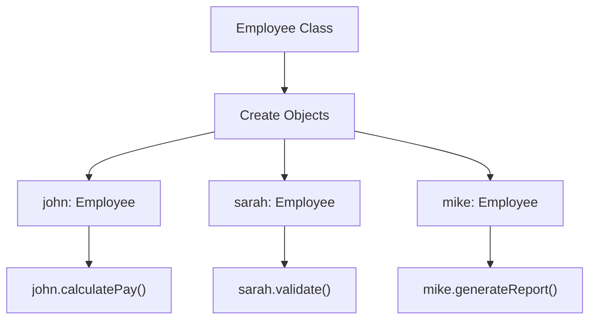
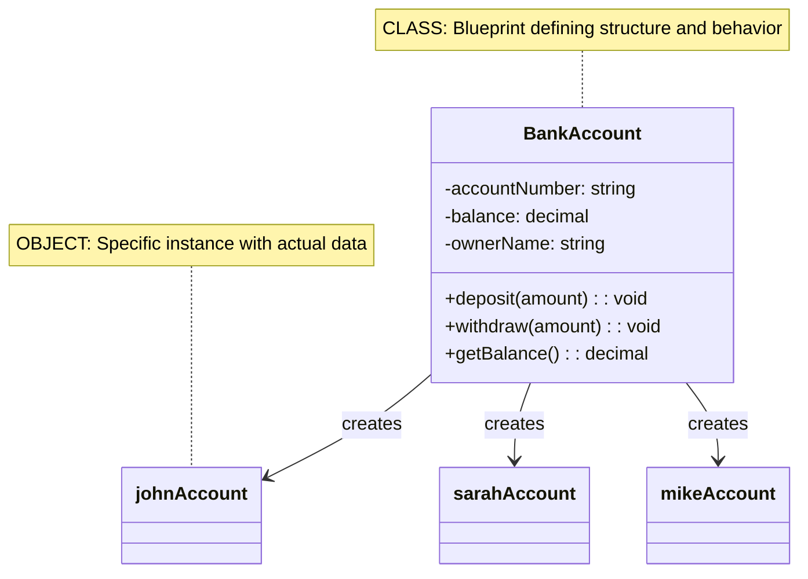

# 01_OOP-Classes-and-Objects

**Learning Level**: Beginner  
**Prerequisites**: Basic programming knowledge  
**Estimated Time**: 15 minutes (condensed overview)  
**Series**: Condensed Overview

---
## 🎯 Learning Objectives

By the end of this session, you will:

- [Add specific learning objectives]

---

By the end of this session, you will:

- Understand the difference between classes and objects
- Master class definition and object instantiation concepts
- Apply real-world modeling with classes and objects
- Use pseudocode to design object-oriented solutions

---

## 📋 Quick Overview (5 minutes)

**Object-Oriented Programming**: A programming paradigm that organizes code around objects and classes, enabling better code organization, reusability, and maintainability.

### **The Core Problem**

```text
❌ PROCEDURAL APPROACH
┌─────────────────┐    ┌─────────────────┐    ┌─────────────────┐
│ calculatePay()  │    │ validateUser()  │    │ generateReport() │
├─────────────────┤    ├─────────────────┤    ├─────────────────┤
│ - Global data   │    │ - Global data   │    │ - Global data   │
│ - Scattered     │    │ - Scattered     │    │ - Scattered     │
│   logic         │    │   validation    │    │   formatting    │
└─────────────────┘    └─────────────────┘    └─────────────────┘
```

**Problems**: Code duplication, tight coupling, difficult maintenance, testing challenges.

### **The OOP Solution**



---

## 🏗️ Core Concepts (15 minutes)

### **1. Classes: The Blueprint**

**Definition**: A class is a blueprint that defines structure (data) and behavior (methods) for objects.

**Class Template**:

```pseudocode
CLASS ClassName:
    // Attributes (data)
    PRIVATE attribute1: DataType
    PRIVATE attribute2: DataType
    
    // Constructor
    CONSTRUCTOR(parameters):
        // Initialize attributes
    
    // Methods (behavior)
    PUBLIC methodName():
        // Implementation
```

### **2. Objects: The Real Thing**

**Definition**: An object is an instance of a class - the actual "thing" created from the blueprint.

**Key Relationship**: One class → Multiple unique objects with individual data.

### **3. Class vs Object Relationship**



---

## 💡 Practical Implementation (8 minutes)

### **Real-World Example: Employee Management**

#### Step 1: Define the Class

```pseudocode
CLASS Employee:
    PRIVATE employeeId, name, department: string
    PRIVATE salary: decimal
    
    CONSTRUCTOR Employee(id, name, dept, sal)
    PUBLIC displayInfo(), calculateAnnualSalary(), updateDepartment()
```

#### Step 2: Create & Use Objects

```pseudocode
// Create objects from class
employee1 = NEW Employee("E001", "John Smith", "Engineering", 75000)
employee2 = NEW Employee("E002", "Sarah Johnson", "Marketing", 65000)

// Use objects independently  
employee1.displayInfo()              // John's data
employee2.calculateAnnualSalary()    // Sarah's calculation
employee1.updateDepartment("Senior Engineering")
```

**Result**: Each object has **independent data** but **shared methods** from the class blueprint.

---

## ✅ Key Takeaways (2 minutes)

### **Essential Understanding**

1. **Class = Blueprint**: Defines structure and behavior template
2. **Object = Instance**: Actual thing created from the class  
3. **Multiple Objects**: One class can create many different objects
4. **Independent Data**: Each object has its own copy of attributes
5. **Shared Behavior**: All objects share the same methods

### **Key Benefits**

- ✅ **Organization**: Related data and methods grouped together
- ✅ **Reusability**: One class definition, multiple objects  
- ✅ **Maintainability**: Changes in one place affect all objects

### **Next Steps**

- **Continue**: [02_OOP-Encapsulation-Abstraction.md](02_OOP-Encapsulation-Abstraction.md)
- **Practice**: Design 3 real-world entities as classes

---

## 🔗 Series Navigation

- **Current**: 01 - Classes & Objects ✅
- **Next**: [02_OOP-Encapsulation-Abstraction.md](02_OOP-Encapsulation-Abstraction.md)
- **Then**: [03_OOP-Inheritance-Polymorphism.md](03_OOP-Inheritance-Polymorphism.md)
- **Advanced**: [04A_OOP-Advanced-Patterns-PartA.md](04_OOP-Advanced-Patterns-PartA.md)
- **Advanced**: [04B_OOP-Advanced-Patterns-PartB.md](04_OOP-Advanced-Patterns-PartB.md)

**Last Updated**: September 10, 2025  
**Format**: 27-minute focused learning segment

