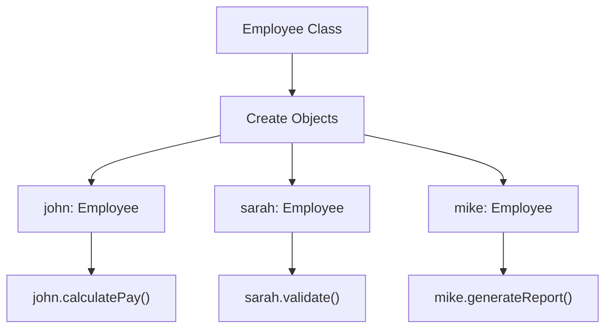
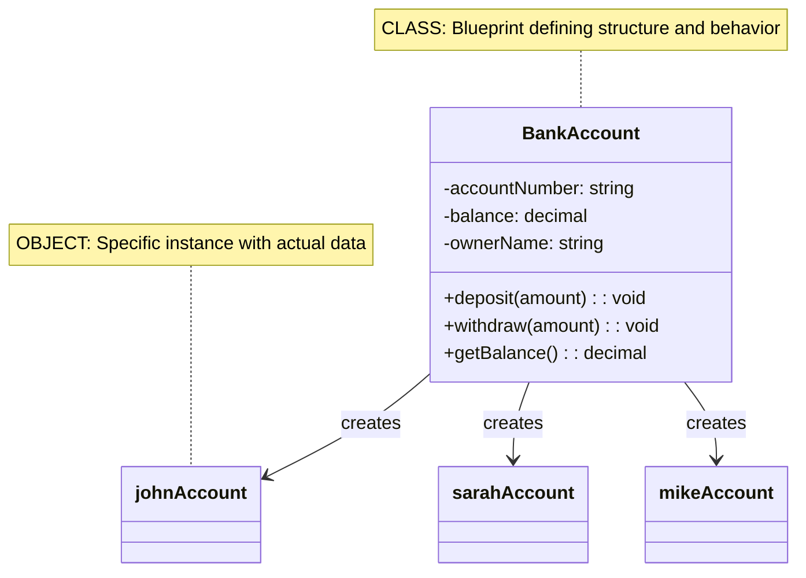

# OOP Fundamentals Part 1A: Classes & Objects

**Learning Level**: Beginner  
**Prerequisites**: Basic programming knowledge  
**Estimated Time**: 27 minutes  
**Next**: Part 1B - Encapsulation & Data Hiding

---

## 🎯 Learning Objectives (27-Minute Session)

By the end of this session, you will:

- Understand the difference between classes and objects
- Master class definition and object instantiation concepts
- Apply real-world modeling with classes and objects
- Use pseudocode to design object-oriented solutions

---

## 📋 Quick Overview (5 minutes)

**Object-Oriented Programming**: A programming paradigm that organizes code around objects and classes, enabling better code organization, reusability, and maintainability.

### **The Core Problem**

```text
❌ PROCEDURAL APPROACH
┌─────────────────┐    ┌─────────────────┐    ┌─────────────────┐
│ calculatePay()  │    │ validateUser()  │    │ generateReport() │
├─────────────────┤    ├─────────────────┤    ├─────────────────┤
│ - Global data   │    │ - Global data   │    │ - Global data   │
│ - Scattered     │    │ - Scattered     │    │ - Scattered     │
│   logic         │    │   validation    │    │   formatting    │
└─────────────────┘    └─────────────────┘    └─────────────────┘
```

**Problems**: Code duplication, tight coupling, difficult maintenance, testing challenges.

### **The OOP Solution**



---

## 🏗️ Core Concepts (15 minutes)

### **1. Classes: The Blueprint**

**Definition**: A class is a blueprint or template that defines the structure and behavior of objects.

**Real-World Analogy**: A house blueprint defines:

- Structure (rooms, layout)
- Features (windows, doors)
- Capabilities (electrical, plumbing)

**Pseudocode Template**:

```pseudocode
CLASS ClassName:
    // Attributes (data)
    PRIVATE attribute1: DataType
    PRIVATE attribute2: DataType
    
    // Constructor
    CONSTRUCTOR(parameters):
        // Initialize attributes
    
    // Methods (behavior)
    PUBLIC methodName():
        // Implementation
```

### **2. Objects: The Real Thing**

**Definition**: An object is an instance of a class - the actual "thing" created from the blueprint.

**Example Mapping**:

```text
CLASS: Vehicle Blueprint
├── Attributes: color, engine, wheels
├── Methods: start(), stop(), accelerate()
└── Constructor: Vehicle(color, engine)

OBJECTS: Actual Vehicles
├── car1 = Vehicle("red", "V6")
├── car2 = Vehicle("blue", "V8")
└── truck1 = Vehicle("white", "diesel")
```

### **3. Class vs Object Relationship**



---

## 💡 Practical Implementation (8 minutes)

### **Real-World Example: Employee Management**

#### Step 1: Identify the Class

```pseudocode
// What do all employees have in common?
CLASS Employee:
    // Data that every employee has
    PRIVATE employeeId: string
    PRIVATE name: string
    PRIVATE department: string
    PRIVATE salary: decimal
    
    // What can every employee do?
    PUBLIC displayInfo(): void
    PUBLIC calculateAnnualSalary(): decimal
    PUBLIC updateDepartment(newDept: string): void
```

#### Step 2: Create Objects

```pseudocode
// Constructor to create new employees
CONSTRUCTOR Employee(id: string, name: string, dept: string, sal: decimal):
    this.employeeId = id
    this.name = name
    this.department = dept
    this.salary = sal

// Creating specific employee objects
employee1 = NEW Employee("E001", "John Smith", "Engineering", 75000)
employee2 = NEW Employee("E002", "Sarah Johnson", "Marketing", 65000)
employee3 = NEW Employee("E003", "Mike Chen", "Sales", 70000)
```

#### Step 3: Using Objects

```pseudocode
// Each object has its own data
PRINT employee1.displayInfo()  // Shows John's information
PRINT employee2.displayInfo()  // Shows Sarah's information

// Each object can perform actions
john_annual = employee1.calculateAnnualSalary()  // 75000 * 12
sarah_annual = employee2.calculateAnnualSalary() // 65000 * 12

// Modify specific objects
employee1.updateDepartment("Senior Engineering")
```

### **Memory Visualization**

```text
MEMORY LAYOUT:
┌─────────────────┐    ┌─────────────────┐    ┌─────────────────┐
│   employee1     │    │   employee2     │    │   employee3     │
├─────────────────┤    ├─────────────────┤    ├─────────────────┤
│ id: "E001"      │    │ id: "E002"      │    │ id: "E003"      │
│ name: "John"    │    │ name: "Sarah"   │    │ name: "Mike"    │
│ dept: "Eng"     │    │ dept: "Mktg"    │    │ dept: "Sales"   │
│ salary: 75000   │    │ salary: 65000   │    │ salary: 70000   │
└─────────────────┘    └─────────────────┘    └─────────────────┘
     ↓ methods           ↓ methods           ↓ methods
 [Same methods]      [Same methods]      [Same methods]
```

---

## ✅ Key Takeaways (2 minutes)

### **Essential Understanding**

1. **Class = Blueprint**: Defines structure and behavior template
2. **Object = Instance**: Actual thing created from the class
3. **Multiple Objects**: One class can create many different objects
4. **Independent Data**: Each object has its own copy of attributes
5. **Shared Behavior**: All objects share the same methods

### **Benefits Achieved**

- ✅ **Organization**: Related data and methods grouped together
- ✅ **Reusability**: One class definition, multiple objects
- ✅ **Maintainability**: Changes in one place affect all objects
- ✅ **Modeling**: Natural representation of real-world entities

### **Next Steps**

- **Tomorrow**: Continue with Part 1B - Encapsulation & Data Hiding
- **Practice**: Think of 3 real-world entities as classes with attributes and methods
- **Preparation**: Consider how to protect data within objects

---

## 🔗 Series Navigation

- **Current**: Part 1A - Classes & Objects ✅
- **Next**: [Part 1B - Encapsulation & Data Hiding](01_OOP-Fundamentals-Part1B-Encapsulation.md)
- **Then**: [Part 1C - Inheritance & Polymorphism](01_OOP-Fundamentals-Part1C-Inheritance.md)
- **Finally**: [Part 1D - Abstraction & Integration](01_OOP-Fundamentals-Part1D-Abstraction.md)

**Last Updated**: September 9, 2025  
**Format**: 30-minute focused learning segment
