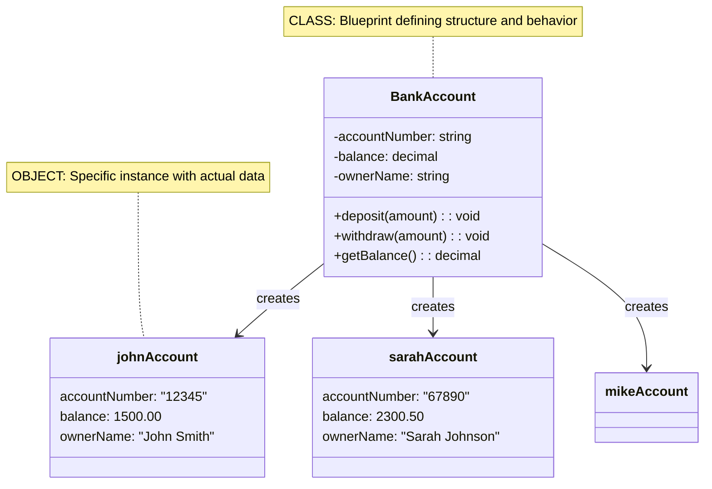

# 01_OOP-Objects-Creation-PartA

**Learning Level**: Beginner  
**Prerequisites**: [01_OOP-Core-Concepts-PartB.md](01_OOP-Core-Concepts-PartB.md)  
**Estimated Time**: 15 minutes (27-minute focused session)  
**Series**: Part A of 2 - Objects Creation

---

## 🎯 Learning Objectives (15-Minute Session)

By the end of this session, you will:

- Understand objects as instances of classes
- Master the object creation process
- See how multiple objects can exist independently

---

## 🏭 Creating Objects from Classes (15 minutes)

### **1. Objects: The Real Thing**

**Definition**: An object is an **instance** of a class - the actual "thing" created from the blueprint.

**Key Relationship**: **One class** → **Multiple unique objects** with individual data

### **2. Class vs Object Visualization**



### **3. Object Creation Process**

```pseudocode
// Step 1: Define the class (blueprint)
CLASS Employee:
    PRIVATE employeeId: string
    PRIVATE name: string
    PRIVATE department: string
    PRIVATE salary: decimal
    
    CONSTRUCTOR Employee(id, name, dept, sal):
        this.employeeId = id
        this.name = name
        this.department = dept
        this.salary = sal

// Step 2: Create objects (instances)
employee1 = NEW Employee("E001", "John Smith", "Engineering", 75000)
employee2 = NEW Employee("E002", "Sarah Johnson", "Marketing", 65000)
employee3 = NEW Employee("E003", "Mike Chen", "Sales", 70000)
```

### **4. Object Independence**

```text
MEMORY VISUALIZATION
┌─────────────────┐    ┌─────────────────┐    ┌─────────────────┐
│   employee1     │    │   employee2     │    │   employee3     │
├─────────────────┤    ├─────────────────┤    ├─────────────────┤
│ id: "E001"      │    │ id: "E002"      │    │ id: "E003"      │
│ name: "John"    │    │ name: "Sarah"   │    │ name: "Mike"    │
│ dept: "Eng"     │    │ dept: "Mktg"    │    │ dept: "Sales"   │
│ salary: 75000   │    │ salary: 65000   │    │ salary: 70000   │
└─────────────────┘    └─────────────────┘    └─────────────────┘

Each object has its own INDEPENDENT data storage
```

### **5. Using Objects**

```pseudocode
// Each object operates independently
employee1.displayInfo()              // Shows John's data
employee2.displayInfo()              // Shows Sarah's data

// Objects maintain separate state
employee1.giveRaise(5000)            // Only John gets raise
employee2.updateDepartment("Sales")  // Only Sarah changes dept

// Objects can be compared
IF employee1.salary > employee2.salary:
    PRINT "John earns more than Sarah"
```

---

## ✅ Key Takeaways (2 minutes)

### **Essential Understanding**

1. **Objects are instances** created from class blueprints
2. **Each object has independent data** but shared methods
3. **Multiple objects can exist** from one class
4. **Objects maintain separate state** and operate independently

### **What's Next**

**Part B2** will cover:

- Advanced object interactions
- Complex real-world scenarios
- Object lifecycle management

---

## 🔗 Series Navigation

- **Previous**: [01_OOP-Core-Concepts-PartB.md](01_OOP-Core-Concepts-PartB.md)
- **Current**: Part B1 - Objects Creation ✅
- **Next**: [01_OOP-Objects-Creation-PartB.md](01_OOP-Objects-Creation-PartB.md)
- **Series**: Classes & Objects Foundation (Part B1 of 4)

**Last Updated**: September 10, 2025  
**Format**: 15-minute focused learning segment


