# 02_OOP-Encapsulation-Abstraction

**Learning Level**: Beginner → Intermediate
**Prerequisites**: [01_OOP-Objects-Creation-PartB.md](01_OOP-Objects-Creation-PartB.md)
**Estimated Time**: 27 minutes (focused learning session)
**Series**: Core Pillars - Encapsulation & Abstraction

---

## 🎯 Learning Objectives

By the end of this session, you will:

- [Add specific learning objectives]

---
By the end of this 27-minute session, you will:

- Master encapsulation: data hiding and controlled access
- Understand abstraction: simplifying complex systems
- Implement access modifiers (private, public, protected)
- Design classes with proper data security and interface clarity

---

## 📋 Content Sections (27-Minute Structure)

### Quick Review (2 minutes)

**Previous Learning**: Classes as blueprints, objects as instances
**Today's Focus**: Making our classes secure (encapsulation) and simple to use (abstraction)

### Core Concepts (20 minutes)

#### **1. Encapsulation: Data Security**

**Definition**: Bundling data and methods together while controlling access to internal details.

**Real-World Analogy**: A bank vault protects money (data) and only allows authorized access through specific procedures (methods).

```mermaid
graph LR
    A["🏦 Bank Account"] --> B["Private: balance"]
    A --> C["Private: accountNumber"]
    A --> D["Public: deposit()"]
    A --> E["Public: withdraw()"]
    A --> F["Public: getBalance()"]

    classDef privateData fill:#ffebee,stroke:#d32f2f,stroke-width:2px,color:#c62828
    classDef publicMethod fill:#e8f5e8,stroke:#4caf50,stroke-width:2px,color:#2e7d32

    class B,C privateData
    class D,E,F publicMethod
```



**Pseudocode Example**:

```text
CLASS BankAccount
    // 🔒 ENCAPSULATED DATA (Private)
    PRIVATE balance = 0
    PRIVATE accountNumber = ""

    // 🌍 PUBLIC INTERFACE
    PUBLIC CONSTRUCTOR(accountNum, initialBalance)
        accountNumber = accountNum
        balance = initialBalance
    END

    PUBLIC METHOD deposit(amount)
        IF amount > 0 THEN
            balance = balance + amount
            RETURN "Deposit successful"
        END IF
    END

    PUBLIC METHOD getBalance()
        RETURN balance
    END
END CLASS
```

#### **2. Access Modifiers**

```text
ACCESS LEVELS:
🌍 PUBLIC     - Accessible everywhere
🏠 PROTECTED  - Class + subclasses only
🔒 PRIVATE    - Same class only
```

#### **3. Abstraction: Hiding Complexity**

**Definition**: Showing only essential features while hiding implementation details.

**Real-World Analogy**: Car steering wheel (simple interface) hides complex steering mechanism.

```text
CLASS EmailService
    // 🎯 SIMPLE PUBLIC INTERFACE
    PUBLIC METHOD sendEmail(recipient, subject, message)
        CALL validateEmail(recipient)
        CALL formatMessage(subject, message)
        CALL transmitEmail()
        RETURN "Email sent successfully"
    END

    // 🔧 HIDDEN IMPLEMENTATION
    PRIVATE METHOD validateEmail(email)
        // Complex validation logic
    END

    PRIVATE METHOD formatMessage(subject, message)
        // HTML formatting logic
    END

    PRIVATE METHOD transmitEmail()
        // Network protocol handling
    END
END CLASS

// 🎯 USER EXPERIENCE: Simple!
emailService = NEW EmailService()
emailService.sendEmail("user@example.com", "Hello", "Welcome!")
```

### Practical Implementation (3 minutes)

#### Exercise: Secure Student Grade System

```text
CLASS Student
    // 🔒 ENCAPSULATED DATA
    PRIVATE studentId = ""
    PRIVATE grades = []
    PRIVATE gpa = 0.0

    // 🌍 PUBLIC INTERFACE
    PUBLIC METHOD addGrade(subject, grade)
        IF grade >= 0 AND grade <= 100 THEN
            grades.append({subject: subject, grade: grade})
            CALL calculateGPA()
            RETURN "Grade added successfully"
        END IF
    END

    PUBLIC METHOD getGPA()
        RETURN gpa
    END

    // 🔧 HIDDEN COMPLEXITY
    PRIVATE METHOD calculateGPA()
        totalPoints = 0
        FOR each grade IN grades DO
            totalPoints = totalPoints + grade.grade
        END FOR
        gpa = totalPoints / grades.length
    END
END CLASS
```

### Key Takeaways & Next Steps (2 minutes)

**✅ Mastered Today:**

- **Encapsulation**: Data hiding with access modifiers
- **Abstraction**: Simple interfaces hiding complex implementation
- **Security**: Controlled access to sensitive data
- **Usability**: Clean, intuitive class interfaces

**🎯 Success Patterns:**

1. **Make data private** - protect internal state
2. **Provide public methods** - controlled access points
3. **Hide complexity** - simple external interfaces
4. **Validate inputs** - secure boundary checking

**🚀 Tomorrow's Journey**: Part 1C - Inheritance & Polymorphism

---

## 🔗 Related Topics

**Prerequisites:**

- [Part 1A: Classes and Objects](./01_OOP-Core-Concepts-PartA.md)

**Builds Upon:**

- Class design principles
- Object instantiation patterns

**Enables:**

- [Part 1C: Inheritance & Polymorphism](./03_OOP-Inheritance-Polymorphism.md)
- Advanced design patterns
- Secure system architecture

**Cross-References:**

- [SOLID Principles](../02_SOLID-Principles/) - Design principle foundations
- [Design Patterns](../03_Design-Patterns/) - Advanced object relationships

---

*Part 1B of 4-part OOP Fundamentals series*
*Next: [03_OOP-Inheritance-Polymorphism.md](./03_OOP-Inheritance-Polymorphism.md)*
