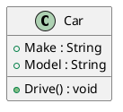
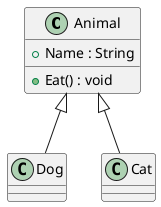
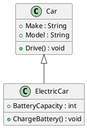
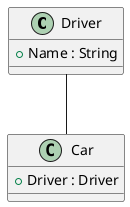

# **OOD in C# with Class Diagrams** - Part B

Object-Oriented Design (OOD) in C# revolves around designing systems by representing real-world entities as objects. Below is an explanation of key OOD concepts, each illustrated with C# examples and accompanied by class diagram links.

---

## Reference

> 1. <https://www.visual-paradigm.com/guide/uml-unified-modeling-language/uml-class-diagram-tutorial/>
> 1. <https://www.plantuml.com/plantuml/uml/SyfFKj2rKt3CoKnELR1Io4ZDoSa700002>

### **1. Class**

- **Definition**: A blueprint for creating objects. It encapsulates fields and methods.
- **C# Example**:

  ```csharp
  public class Car
  {
      public string Make { get; set; }
      public string Model { get; set; }

      public void Drive()
      {
          Console.WriteLine("Driving the car...");
      }
  }
  ```

- **Class Diagram**: [Class Diagram for Car](https://www.plantuml.com/plantuml/uml/SoWkIImgAStDuU9BoIhEIImk5D0e5L9Bo2vEpK_oiy9Ep4DiIW_8p4L9Q0dCJ4HMLtLKXL93qD__cCIFPMEx9bUsKc1FpjIFpmIQZJYIMZ3LtA4ZDA3n0000)

---

**Part B of 3**

Previous: [07_OOD-Basics-PartA.md](07_OOD-Basics-PartA.md)
Next: [07_OOD-Basics-PartC.md](07_OOD-Basics-PartC.md)

---

  public class Car
  {
      private Engine _engine;

      public Car(Engine engine)
      {
          _engine = engine;
      }

      public void StartCar() => _engine.Start();
  }

  ```

- **Class Diagram**: [Class Diagram for Dependency](https://www.plantuml.com/plantuml/uml/SoWkIImgAStDuKhEIImk5U9q54dCJYrBI40fN4vAp2DKJZDyLo50jPKVL0000)

---

### **9. Realization**

- **Definition**: When a class implements an interface, it "realizes" the behavior defined by the interface.
- **C# Example**:

  ```csharp
  public interface IVehicle
  {
      void Drive();
  }

  public class Car : IVehicle
  {
      public void Drive() => Console.WriteLine("Driving the car...");
  }
  ```

- **Class Diagram**: [Class Diagram for Realization](https://www.plantuml.com/plantuml/uml/SoWkIImgAStDuKhEIImk5U9q54dCJYrBI40jN4vAp2DKJZDyLo50jPKXL0000)

---

### **Summary**

These principles, combined with their corresponding diagrams, help design systems that are modular, reusable, and scalable. The class diagrams illustrate relationships, making it easier to visualize complex systems.

The links I provided earlier use placeholders for online UML tools like PlantUML, which you can use to visualize class diagrams. Here's how you can generate and view them:

1. **Copy the PlantUML Code**:
   Copy the provided code snippets and paste them into a PlantUML-compatible viewer.

2. **Online Editors**:

   - Use [PlantText](https://www.planttext.com/) or [PlantUML Editor](https://plantuml.com/plantuml-editor).
   - Paste the PlantUML code into the editor, and it will render the diagram.

3. **Local Setup**:
   If you prefer a local setup, install PlantUML:
   - Install [Java Runtime Environment (JRE)](https://www.oracle.com/java/technologies/javase-jre8-downloads.html).
   - Download the [PlantUML jar file](https://plantuml.com/download).
   - Run it locally to generate UML diagrams.

Here are updated PlantUML scripts you can use for each concept.

---

### **1. Class**



---

### **2. Generalization**



---

### **3. Specialization**



---

### **4. Association**



---
