# **OOD in C# with Class Diagrams** - Part B

**Learning Level**: Intermediate

**Prerequisites**: [07_OOD-Basics-PartA.md](07_OOD-Basics-PartA.md)
**Estimated Time**: 27 minutes (focused learning session)

## **Series**: Part B of 3 - OOD Basics

## 🎯 Learning Objectives

By the end of this session, you will

- [Add specific learning objectives]

---

### **1. Class**

- **Definition**: A blueprint for creating objects. It encapsulates fields and methods

- **C# Example**:

  ```csharp

  public class Car
  {

```csharp
  public string Make { get; set; }
```csharp
```csharp
  public string Model { get; set; }
```csharp
```csharp
  public void Drive()
```csharp
```csharp
  {
```csharp
```csharp
      Console.WriteLine("Driving the car...");
```csharp
```csharp
  }
```csharp
  }

## ```csharp
- **Class Diagram**: [Class Diagram for Car](https://www.plantuml.com/plantuml/uml/SoWkIImgAStDuU9BoIhEIImk5D0e5L9Bo2vEpK_oiy9Ep4DiIW_8p4L9Q0dCJ4HMLtLKXL93qD__cCIFPMEx9bUsKc1FpjIFpmIQZJYIMZ3LtA4ZDA3n0000)

### Part B of 3

Previous: [07_OOD-Basics-PartA.md](07_OOD-Basics-PartA.md)

## Next: [07_OOD-Basics-PartC.md](07_OOD-Basics-PartC.md)

  public class Car

  {
```csharp
  private Engine _engine;
```csharp
```csharp
  public Car(Engine engine)
```csharp
```csharp
  {
```csharp
```csharp
      _engine = engine;
```csharp
```csharp
  }
```csharp
```csharp
  public void StartCar() => _engine.Start();
```csharp
  }

## ```csharp
- **Class Diagram**: [Class Diagram for Dependency](https://www.plantuml.com/plantuml/uml/SoWkIImgAStDuKhEIImk5U9q54dCJYrBI40fN4vAp2DKJZDyLo50jPKVL0000)

### **9. Realization**


- **Definition**: When a class implements an interface, it "realizes" the behavior defined by the interface

- **C# Example**:

  ```csharp

  public interface IVehicle
  {
```csharp
  void Drive();
```csharp
  }
  public class Car : IVehicle
  {
```csharp
  public void Drive() => Console.WriteLine("Driving the car...");
```csharp
  }

## ```csharp- **Class Diagram**: [Class Diagram for Realization](https://www.plantuml.com/plantuml/uml/SoWkIImgAStDuKhEIImk5U9q54dCJYrBI40jN4vAp2DKJZDyLo50jPKXL0000)

### **Summary**


These principles, combined with their corresponding diagrams, help design systems that are modular, reusable, and scalable. The class diagrams illustrate relationships, making it easier to visualize complex systems
The links I provided earlier use placeholders for online UML tools like PlantUML, which you can use to visualize class diagrams. Here's how you can generate and view them:

1. **Copy the PlantUML Code**:

   Copy the provided code snippets and paste them into a PlantUML-compatible viewer.
1. **Online Editors**:

   - Use [PlantText](https://www.planttext.com/) or [PlantUML Editor](https://plantuml.com/plantuml-editor).

- Paste the PlantUML code into the editor, and it will render the diagram.

1. **Local Setup**:

   If you prefer a local setup, install PlantUML:

- Install [Java Runtime Environment (JRE)](https://www.oracle.com/java/technologies/javase-jre8-downloads.html).
- Download the [PlantUML jar file](https://plantuml.com/download).
- Run it locally to generate UML diagrams.

## Here are updated PlantUML scripts you can use for each concept

### **1. Class** 2

```plantuml

@startuml
class Car {
```csharp
+Make : String
```csharp
```csharp
+Model : String
```csharp
```csharp
+Drive() : void
```csharp
}
@enduml
```csharp---

### **2. Generalization**




```plantuml

@startuml
class Animal {
```csharp
+Name : String
```csharp
```csharp
+Eat() : void
```csharp
}
class Dog
class Cat
Animal <|-- Dog
Animal <|-- Cat
@enduml
```csharp---

### **3. Specialization**




```plantuml

@startuml
class Car {
```csharp
+Make : String
```csharp
```csharp
+Model : String
```csharp
```csharp
+Drive() : void
```csharp
}
class ElectricCar {
```csharp
+BatteryCapacity : int
```csharp
```csharp
+ChargeBattery() : void
```csharp
}
Car <|-- ElectricCar
@enduml
```csharp---

### **4. Association**




```plantuml

@startuml
class Driver {
```csharp
+Name : String
```csharp
}
class Car {
```csharp
+Driver : Driver
```csharp
}
Driver -- Car
@enduml
```




---
