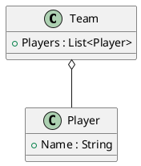
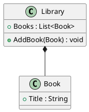
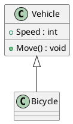
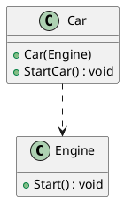
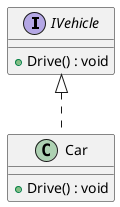

# **OOD in C# with Class Diagrams** - Part C

**Learning Level**: Intermediate
**Prerequisites**: [07_OOD-Basics-PartB.md](07_OOD-Basics-PartB.md)
**Estimated Time**: 27 minutes (focused learning session)
**Series**: Part C of 3 - OOD Basics

---

## 🎯 Learning Objectives

By the end of this session, you will:

- [Add specific learning objectives]

---
### **1. Class**

- **Definition**: A blueprint for creating objects. It encapsulates fields and methods.
- **C# Example**:

  ```csharp
  public class Car
  {
      public string Make { get; set; }
      public string Model { get; set; }

      public void Drive()
      {
          Console.WriteLine("Driving the car...");
      }
  }
  ```

- **Class Diagram**: [Class Diagram for Car](https://www.plantuml.com/plantuml/uml/SoWkIImgAStDuU9BoIhEIImk5D0e5L9Bo2vEpK_oiy9Ep4DiIW_8p4L9Q0dCJ4HMLtLKXL93qD__cCIFPMEx9bUsKc1FpjIFpmIQZJYIMZ3LtA4ZDA3n0000)

---

**Part C of 3**

Previous: [07_OOD-Basics-PartB.md](07_OOD-Basics-PartB.md)

---

### **5. Aggregation**



---

### **6. Composition**



---

### **7. Inheritance**



---

### **8. Dependency**



---

### **9. Realization**



---

### Steps to View

1. Copy one of the PlantUML scripts.
2. Paste it into the online editor ([PlantText](https://www.planttext.com/)).
3. Generate the UML diagram.

Let me know if you need help with setup or any specific part of this process!
