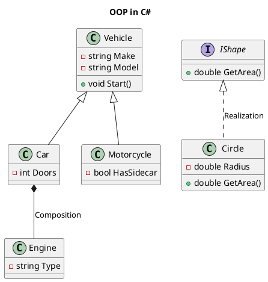

# OOP Abstraction and Encapsulation - Part C

**Learning Level**: Intermediate
**Prerequisites**: [08_OOP-Abstraction-Encapsulation-PartB.md](08_OOP-Abstraction-Encapsulation-PartB.md)
**Estimated Time**: 27 minutes (focused learning session)
**Series**: Part C of 3 - Abstraction & Encapsulation

---

## 🎯 Learning Objectives

By the end of this session, you will:

- [Add specific learning objectives]

---
By the end of this 27-minute session, you will:

- Understand the fundamental differences between abstraction and encapsulation
- Apply both principles effectively in object-oriented design
- Recognize when and how to use each principle for better code organization

**Abstraction** and **Encapsulation** are two fundamental principles of Object-Oriented Programming (OOP), and while they are closely related, they serve different purposes. Here's a comparison:

---

**Part C of 3**

Previous: [08_OOP-Abstraction-Encapsulation-PartB.md](08_OOP-Abstraction-Encapsulation-PartB.md)

---

### **8. Dependency**

- **Definition**: When one class relies on another to perform its operations.
- **Key Points**:
  - Promotes loose coupling with dependency injection.

#### **Example**

```csharp
class Service {
    public void PerformOperation() {
        Console.WriteLine("Operation performed.");
    }
}

class Client {
    private Service service;

    public Client(Service service) {
        this.service = service;
    }

    public void Start() {
        service.PerformOperation();
    }
}
```

---

### **9. Realization**

- **Definition**: A class implements the behavior defined by an interface.
- **Purpose**: Provides a contract that a class must adhere to.

#### **Example**

```csharp
interface IShape {
    double GetArea();
}

class Circle : IShape {
    private double radius;

    public Circle(double radius) {
        this.radius = radius;
    }

    public double GetArea() {
        return Math.PI * radius * radius;
    }
}
```

---

### **OOP Principles:**

| Principle         | Definition                                                | C# Implementation                  | Example                            |

| ----------------- | --------------------------------------------------------- | ---------------------------------- | ---------------------------------- |
| **Encapsulation** | Hiding internal state and exposing controlled access.     | Access Modifiers, Properties       | `private`, `public`, `protected`   |
| **Abstraction**   | Hiding implementation details and exposing functionality. | Abstract Classes, Interfaces       | `abstract`, `interface`            |
| **Inheritance**   | Acquiring properties and behavior of another class.       | Derived Classes                    | `class Dog : Animal`               |
| **Polymorphism**  | Using a single interface to represent different types.    | Method Overriding, Virtual Methods | `virtual`, `override`, `interface` |

---

### UML Class Diagram for OOP in C #

#### **Description**

- A simple UML class diagram can represent relationships such as aggregation, composition, inheritance, and realization in the context of OOP in C#.
- Example: A `Vehicle` class (generalization) has subclasses like `Car` and `Motorcycle`, and an `Engine` class (composition) is part of the `Car`.

#### **Link to Learn UML**

- [Lucidchart UML Basics](https://www.lucidchart.com/pages/uml-class-diagram)
- [PlantUML Online Tool](https://plantuml.com/class-diagram)

If you need further UML diagrams or detailed code examples for each principle, let me know!

Here’s the **PlantUML** text for a class diagram that illustrates the **OOP principles in C#**. It includes relationships like inheritance, composition, and realization:



---

### **Explanation of the Diagram**

1. **Inheritance**:

   - `Vehicle` is the parent class, and `Car` and `Motorcycle` are child classes.
   - Represented by the `<|--` notation.

2. **Composition**:

   - `Car` contains an `Engine`, indicating a "has-a (strong)" relationship.
   - Represented by the `*--` notation.

3. **Realization**:

   - `Circle` implements the `IShape` interface.
   - Represented by the `<|..` notation.

4. **Class Members**:
   - Fields and methods are specified within classes.
   - `+` denotes public, `-` denotes private.
