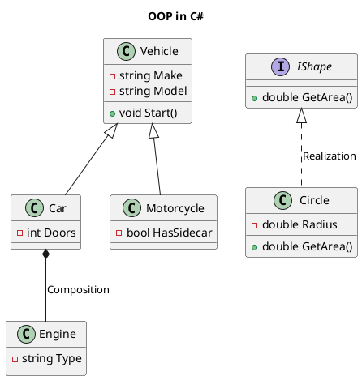

**Abstraction** and **Encapsulation** are two fundamental principles of Object-Oriented Programming (OOP), and while they are closely related, they serve different purposes. Here's a comparison:

---

## **Abstraction**

### Definition

- **Hiding implementation details** and exposing only the essential features of an object.
- Focuses on **what an object does**, not **how it does it**.

### Key Points

1. **Purpose**: Simplify complex systems by showing only relevant data to the user.
2. **Implementation**: Achieved using **abstract classes** or **interfaces** in languages like C# and Java.
3. **Use Case**: When you want to define behavior without worrying about how it is implemented.
4. **Example**:
   - A `Vehicle` class exposes methods like `Start()` or `Stop()`, but the internal workings of the engine are hidden from the user.

#### **Code Example (C#):**

```csharp
abstract class Shape {
    public abstract double GetArea(); // Abstract method: must be implemented in derived classes
}

class Circle : Shape {
    private double radius;

    public Circle(double radius) {
        this.radius = radius;
    }

    public override double GetArea() {
        return Math.PI * radius * radius; // Implementation specific to Circle
    }
}

class Program {
    static void Main() {
        Shape shape = new Circle(5);
        Console.WriteLine($"Area: {shape.GetArea()}"); // Only GetArea() is exposed
    }
}
```

---

## **Encapsulation**

### Definition

- **Restricting access** to certain components of an object and bundling data with methods that operate on it.
- Focuses on **how data is protected** and controlled.

### Key Points

1. **Purpose**: Safeguard object data and prevent unauthorized access or modification.
2. **Implementation**: Achieved using **access modifiers** like `private`, `protected`, and `public`.
3. **Use Case**: When you want to control or validate how external entities interact with the internal state of an object.
4. **Example**:
   - A `BankAccount` class restricts direct access to its `balance` field but allows controlled access through methods like `Deposit()` or `Withdraw()`.

#### **Code Example (C#):**

```csharp
class BankAccount {
    private double balance; // Encapsulated field

    public double GetBalance() {
        return balance; // Controlled access
    }

    public void Deposit(double amount) {
        if (amount > 0) {
            balance += amount; // Validation logic
        }
    }

    public void Withdraw(double amount) {
        if (amount > 0 && amount <= balance) {
            balance -= amount; // Validation logic
        }
    }
}

class Program {
    static void Main() {
        BankAccount account = new BankAccount();
        account.Deposit(100);
        Console.WriteLine($"Balance: {account.GetBalance()}");
        account.Withdraw(50);
        Console.WriteLine($"Balance: {account.GetBalance()}");
    }
}
```

---

## **Comparison**

| Aspect             | **Abstraction**                                                           | **Encapsulation**                                                          |
| ------------------ | ------------------------------------------------------------------------- | -------------------------------------------------------------------------- |
| **Focus**          | Hiding implementation details and exposing functionality.                 | Hiding data and protecting it from unauthorized access.                    |
| **Purpose**        | Simplify the interface and show only what is necessary.                   | Protect the integrity of the data.                                         |
| **Implementation** | Achieved using **abstract classes**, **interfaces**, or **polymorphism**. | Achieved using **access modifiers** and **getters/setters**.               |
| **Example**        | Only exposing `GetArea()` method in a `Shape` class.                      | Restricting direct access to the `balance` field in a `BankAccount` class. |

---

### **In a Nutshell**

- **Abstraction** is about **hiding the complexity** of implementation.
- **Encapsulation** is about **hiding the object's data** and controlling access.

Both principles are complementary and often work together in designing robust and secure applications.

Here’s a detailed explanation of **OOP in C#**, covering its core principles with examples and comparisons:

---

## **Object-Oriented Programming (OOP) in C#**

OOP is a programming paradigm based on the concept of objects, which encapsulate data and behavior. C# is inherently an object-oriented language, and its design supports the following key principles:

---

### **1. Class**

- **Definition**: A blueprint for creating objects. It defines the structure and behavior (data members and methods) that the objects of the class will have.
- **Key Points**:
  - Contains fields, properties, methods, constructors, etc.
  - Supports access modifiers like `public`, `private`, and `protected`.

#### **Example**

```csharp
class Car {
    public string Make { get; set; }
    public string Model { get; set; }
    public int Year { get; set; }

    public void DisplayInfo() {
        Console.WriteLine($"{Year} {Make} {Model}");
    }
}

class Program {
    static void Main() {
        Car car = new Car { Make = "Toyota", Model = "Camry", Year = 2022 };
        car.DisplayInfo(); // Output: 2022 Toyota Camry
    }
}
```

---

### **2. Generalization**

- **Definition**: The process of extracting shared characteristics from two or more classes to create a generalized parent class.
- **Purpose**: Helps in code reuse and abstraction.

#### **Example**

```csharp
class Vehicle {
    public string Make { get; set; }
    public string Model { get; set; }

    public void Start() {
        Console.WriteLine("Vehicle started.");
    }
}

class Car : Vehicle {
    public int Doors { get; set; }
}

class Motorcycle : Vehicle {
    public bool HasSidecar { get; set; }
}
```

---

### **3. Specialization**

- **Definition**: Adding more specific features to a subclass that are not present in the parent class.
- **Purpose**: Represents the unique properties of a derived class.

#### **Example**

```csharp
class Vehicle {
    public string Make { get; set; }
    public string Model { get; set; }
}

class Car : Vehicle {
    public int Doors { get; set; } // Specialization for cars
}
```

---

### **4. Association**

- **Definition**: A relationship between two classes that allows one object to use another.
- **Types**:
  - One-to-One
  - One-to-Many
  - Many-to-Many

#### **Example**

```csharp
class Driver {
    public string Name { get; set; }
}

class Car {
    public Driver Driver { get; set; } // Association

    public void AssignDriver(Driver driver) {
        this.Driver = driver;
    }
}
```

---

### **5. Aggregation (Has-A Relationship - Weak)**

- **Definition**: A special form of association where one class contains another as part of its attributes, but the contained object can exist independently.

#### **Example**

```csharp
class Engine {
    public string Type { get; set; }
}

class Car {
    public Engine Engine { get; set; } // Aggregation
}
```

---

### **6. Composition (Has-A Relationship - Strong)**

- **Definition**: A form of association where the contained object’s lifecycle is tied to the lifecycle of the container object.
- **Key Difference from Aggregation**: In composition, if the container object is destroyed, the contained object is also destroyed.

#### **Example**

```csharp
class Engine {
    public string Type { get; set; }
}

class Car {
    private Engine engine = new Engine(); // Composition
}
```

---

### **7. Inheritance (Is-A Relationship)**

- **Definition**: A mechanism by which one class can acquire properties and methods of another class.
- **Purpose**: Enables code reuse and supports polymorphism.

#### **Example**

```csharp
class Animal {
    public void Eat() {
        Console.WriteLine("Eating...");
    }
}

class Dog : Animal {
    public void Bark() {
        Console.WriteLine("Barking...");
    }
}

class Program {
    static void Main() {
        Dog dog = new Dog();
        dog.Eat(); // From Animal class
        dog.Bark(); // From Dog class
    }
}
```

---

### **8. Dependency**

- **Definition**: When one class relies on another to perform its operations.
- **Key Points**:
  - Promotes loose coupling with dependency injection.

#### **Example**

```csharp
class Service {
    public void PerformOperation() {
        Console.WriteLine("Operation performed.");
    }
}

class Client {
    private Service service;

    public Client(Service service) {
        this.service = service;
    }

    public void Start() {
        service.PerformOperation();
    }
}
```

---

### **9. Realization**

- **Definition**: A class implements the behavior defined by an interface.
- **Purpose**: Provides a contract that a class must adhere to.

#### **Example**

```csharp
interface IShape {
    double GetArea();
}

class Circle : IShape {
    private double radius;

    public Circle(double radius) {
        this.radius = radius;
    }

    public double GetArea() {
        return Math.PI * radius * radius;
    }
}
```

---

### **OOP Principles:**

| Principle         | Definition                                                | C# Implementation                  | Example                            |
| ----------------- | --------------------------------------------------------- | ---------------------------------- | ---------------------------------- |
| **Encapsulation** | Hiding internal state and exposing controlled access.     | Access Modifiers, Properties       | `private`, `public`, `protected`   |
| **Abstraction**   | Hiding implementation details and exposing functionality. | Abstract Classes, Interfaces       | `abstract`, `interface`            |
| **Inheritance**   | Acquiring properties and behavior of another class.       | Derived Classes                    | `class Dog : Animal`               |
| **Polymorphism**  | Using a single interface to represent different types.    | Method Overriding, Virtual Methods | `virtual`, `override`, `interface` |

---

### UML Class Diagram for OOP in C #

#### **Description**

- A simple UML class diagram can represent relationships such as aggregation, composition, inheritance, and realization in the context of OOP in C#.
- Example: A `Vehicle` class (generalization) has subclasses like `Car` and `Motorcycle`, and an `Engine` class (composition) is part of the `Car`.

#### **Link to Learn UML**

- [Lucidchart UML Basics](https://www.lucidchart.com/pages/uml-class-diagram)
- [PlantUML Online Tool](https://plantuml.com/class-diagram)

If you need further UML diagrams or detailed code examples for each principle, let me know!

Here’s the **PlantUML** text for a class diagram that illustrates the **OOP principles in C#**. It includes relationships like inheritance, composition, and realization:



---

### **Explanation of the Diagram**

1. **Inheritance**:

   - `Vehicle` is the parent class, and `Car` and `Motorcycle` are child classes.
   - Represented by the `<|--` notation.

2. **Composition**:

   - `Car` contains an `Engine`, indicating a "has-a (strong)" relationship.
   - Represented by the `*--` notation.

3. **Realization**:

   - `Circle` implements the `IShape` interface.
   - Represented by the `<|..` notation.

4. **Class Members**:
   - Fields and methods are specified within classes.
   - `+` denotes public, `-` denotes private.

---

### Generating the Diagram

1. Copy and paste the above text into any **PlantUML editor**:

   - [PlantUML Editor](https://plantuml.com/plantuml-online)
   - [VS Code with PlantUML Extension](https://marketplace.visualstudio.com/items?itemName=jebbs.plantuml)

2. Render the diagram to visualize the relationships and class structure.

Let me know if you’d like me to add more details or relationships!
