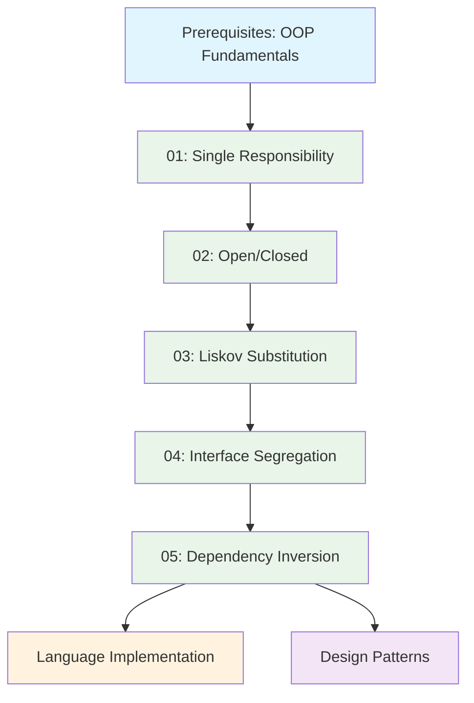

# 🏛️ SOLID Principles - Enterprise Design Foundation

**Learning Level**: Intermediate  
**Prerequisites**: [01_OOP-fundamentals](../01_OOP-fundamentals/) - Classes, objects, inheritance, polymorphism  
**Estimated Time**: 5-7 hours comprehensive mastery  

## 🎯 Learning Objectives

By completing this module, you will:

- Master all five SOLID principles with practical implementations
- Apply Single Responsibility, Open/Closed, Liskov Substitution, Interface Segregation, and Dependency Inversion principles
- Identify and refactor SOLID violations in existing codebases
- Design maintainable, extensible software architectures
- Implement SOLID principles across multiple programming languages
**Strategic Purpose**: Enterprise-grade design principles for Lead Architect excellence

---

## 🎯 Purpose

This domain contains the **five fundamental SOLID principles** that form the backbone of maintainable, extensible software architecture. These principles are essential for any Lead Architect designing enterprise systems that must evolve and scale.

**SOLID Acronym**: Single Responsibility, Open/Closed, Liskov Substitution, Interface Segregation, Dependency Inversion

---

## 📚 Complete SOLID Foundation Series

### **✅ Granular Learning Path (Recommended)**

| Module | Principle | Focus | Time | Status |
|--------|-----------|-------|------|--------|
| **[01: Single Responsibility](01_SOLID-Part1-Single-Responsibility-PartA.md)** | SRP | One reason to change | 30 min | ✅ Complete |
| **[02: Open/Closed](02_SOLID-Part2-Open-Closed-Principle-PartA.md)** | OCP | Extension without modification | 30 min | ✅ Complete |
| **[03: Liskov Substitution](03_SOLID-Part3-Liskov-Substitution-Principle-PartA.md)** | LSP | Behavioral substitutability | 35 min | ✅ Complete |
| **[04: Interface Segregation](04_SOLID-Part4-Interface-Segregation-Principle-PartA.md)** | ISP | Client-specific interfaces | 30 min | ✅ Complete |
| **[05: Dependency Inversion](05_SOLID-Part5-Dependency-Inversion-Principle-PartA.md)** | DIP | Depend on abstractions | 35 min | ✅ Complete |

### **📋 Supporting Resources**

- **[SOLID Principles Track](01_SOLID-Principles-Track-PartA.md)** - Complete learning progression guide
- **[Complete Design Guide](02_Complete-Design-Principles-Guide.md)** - Comprehensive reference
- **[Deep Dive Analysis](04_SOLID-Principles-Deep-Dive-PartA.md)** - Advanced enterprise patterns

---

## 🎯 Why SOLID Principles Matter for Lead Architects

### **Enterprise Impact**

- **Maintainability**: Code that's easy to modify and extend
- **Testability**: Designs that support comprehensive testing
- **Scalability**: Architecture that grows with business needs  
- **Team Collaboration**: Clear boundaries for distributed development

### **Strategic Decision Making**

- **Code Reviews**: SOLID violations indicate design problems
- **Architecture Planning**: SOLID compliance ensures long-term success
- **Refactoring**: SOLID principles guide improvement efforts

---

## 🔗 Language-Specific Implementations

**Learn principles here, implement in language domains:**

### **Available Implementations**

- **C#**: [C# SOLID Implementation](../../03_CSharp/04_SOLID-Implementation/)
- **Python**: [Python SOLID Implementation](../../02_Python/06_SOLID-Implementation/)
- **Java**: [Java SOLID Implementation](../../04_Java/03_SOLID-Implementation/)

### **Future Languages**

- TypeScript, Go, Rust implementations coming soon

---

## 🗺️ Learning Progression

### **Recommended Learning Path**

### **Alternative Learning Paths**

- **Quick Review**: Use Track guide for rapid overview
- **Deep Study**: Use Deep Dive for comprehensive analysis
- **Reference Use**: Jump to specific principles as needed

---

## 🎯 Success Criteria

By completing this series, you will:

- ✅ **Identify SOLID violations** in existing codebases
- ✅ **Refactor code** to comply with SOLID principles
- ✅ **Design new systems** with SOLID principles from the start
- ✅ **Lead code reviews** using SOLID as quality gates
- ✅ **Mentor teams** on SOLID principle application
- ✅ **Make architectural decisions** based on SOLID compliance

---

## 🔗 Related Topics

### **Prerequisites**

- [OOP Fundamentals](../01_OOP-fundamentals/) - Essential foundation

### **Builds Upon**

- Object-oriented design concepts
- Basic software engineering principles

### **Enables**

- [Design Patterns](../03_Design-Patterns/) - GoF patterns and beyond
- [Clean Architecture](../04_Architectural-Patterns/) - Enterprise architecture
- [Advanced Principles](../05_Advanced-Principles/) - Modern design concepts

### **Cross-References**

- **Testing**: [TDD Principles](../07_Testability-and-TDD/)
- **Performance**: [Performance by Design](../10_Scalability-and-Performance-Principles/)
- **Security**: [Security by Design](../11_Security-by-Design/)

---

*Last Updated: September 11, 2025*  
*Part of STSA Lead Architect Knowledge Base*
