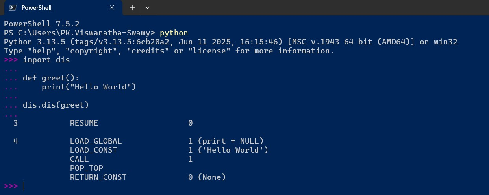

# 🐍 Python Compilation and Interpretation Process

## Understanding How Python Code Executes

---

## 🎯 Overview

Python is often called an "interpreted language," but the reality is more nuanced. Python uses a **hybrid approach** that combines compilation and interpretation to execute code efficiently.

---

## 📝 Key Concepts

### **Compilation vs Interpretation**

| Aspect              | Compilation                                   | Interpretation                            |
| ------------------- | --------------------------------------------- | ----------------------------------------- |
| **Process**         | Source code → Machine code (before execution) | Source code → Executed line by line       |
| **Speed**           | Faster execution (pre-compiled)               | Slower execution (real-time parsing)      |
| **Error Detection** | Compile-time errors                           | Runtime errors                            |
| **Examples**        | C, C++, Java (to bytecode)                    | JavaScript, PHP, Traditional interpreters |

---

## 🔄 Python's Hybrid Approach

Python follows a **two-step process**:

1. **Compilation**: Source code → Bytecode
2. **Interpretation**: Bytecode → Execution via Python Virtual Machine (PVM)

---

## 📊 Python Compilation Process



```mermaid
graph LR
    A[app.py] --> B[Compiler]
    B --> C[Bytecode]

    style A fill:#e1f5fe
    style B fill:#f3e5f5
    style C fill:#ffebee
```

### **Step-by-Step Breakdown: Compilation Flow**

1. **Source Code (`app.py`)**: Your Python file with human-readable code
2. **Python Compiler**: Parses and compiles source code
3. **Bytecode**: Intermediate representation (stored in `.pyc` files)

**Key Points**:

- Bytecode is **platform-independent**
- Stored in `__pycache__` directory
- Reused if source code hasn't changed (performance optimization)

---

## 🚀 Python Interpretation Process

```mermaid
graph LR
    A[Bytecode] --> B[PVM<br/>Python Virtual Machine]
    B --> C["Output Result"]

    style A fill:#ffebee
    style B fill:#e8f5e8
    style C fill:#f0f4c3
```

### **Step-by-Step Breakdown: Execution Flow**

1. **Bytecode**: Platform-independent intermediate code
2. **Python Virtual Machine (PVM)**: Executes bytecode instructions
3. **Output**: Final program execution results

**Key Points**:

- PVM is the **runtime engine** of Python
- Executes bytecode line by line
- Handles memory management, garbage collection

---

## 🔍 Complete Python Execution Flow

```mermaid
graph TD
    A[Source Code<br/>app.py] --> B[Python Compiler]
    B --> C[Bytecode<br/>.pyc files]
    C --> D[Python Virtual Machine<br/>PVM]
    D --> E[Program Output]

    F[__pycache__] -.-> C
    C -.-> F

    style A fill:#e1f5fe
    style B fill:#f3e5f5
    style C fill:#ffebee
    style D fill:#e8f5e8
    style E fill:#f0f4c3
    style F fill:#fff3e0
```

### **Process Flow**

1. **Write** Python source code (`app.py`)
2. **Compile** to bytecode (automatic, transparent)
3. **Store** bytecode in `__pycache__` (for reuse)
4. **Execute** bytecode via PVM
5. **Display** program output

---

## 💡 Why This Hybrid Approach?

### **Benefits of Python's Design**

| Benefit               | Description                                             |
| --------------------- | ------------------------------------------------------- |
| **Portability**       | Bytecode runs on any platform with Python installed     |
| **Performance**       | Faster than pure interpretation (bytecode optimization) |
| **Development Speed** | No explicit compilation step needed                     |
| **Debugging**         | Line-by-line execution makes debugging easier           |

### **Trade-offs**

| Advantage                     | Disadvantage                      |
| ----------------------------- | --------------------------------- |
| ✅ Fast development cycle     | ❌ Slower than compiled languages |
| ✅ Platform independence      | ❌ Requires Python runtime        |
| ✅ Dynamic typing flexibility | ❌ Runtime error detection        |

---

## 🔧 Practical Examples

### **Observing Bytecode Generation**

```python
# app.py
def greet(name):
    return f"Hello, {name}!"

print(greet("World"))
```

**What happens**:

1. First run: Creates `__pycache__/app.cpython-39.pyc`
2. Subsequent runs: Reuses bytecode (faster startup)
3. If source changes: Recompiles automatically

### **Viewing Bytecode (Advanced)**

```python
import dis

def sample_function():
    x = 10
    y = 20
    return x + y

# View bytecode
dis.dis(sample_function)
```

---

## 🎯 Key Takeaways

### **For OOP Learning**

- Understanding execution helps optimize class design
- Bytecode caching affects module import performance
- Dynamic nature enables flexible inheritance

### **For Development**

- No manual compilation step required
- Bytecode files can be safely deleted (regenerated automatically)
- Platform independence simplifies deployment

### **For Performance**

- First run compiles to bytecode
- Subsequent runs use cached bytecode
- Consider tools like PyPy for performance-critical applications

---

## 🔗 Connection to Your Learning Journey

This foundational knowledge supports:

- **Week 1 OOP**: Understanding how classes are compiled and executed
- **Python Development**: Efficient coding practices
- **Architecture Decisions**: When to choose Python vs compiled languages

---

## 📚 Next Steps

1. **Explore** `__pycache__` directory in your projects
2. **Experiment** with bytecode generation
3. **Learn** about Python optimization techniques
4. **Compare** with Java and C# compilation processes

---

**📅 Last Updated**: July 18, 2025  
**📌 Source**: Daily learning - Python fundamentals  
**🎯 Purpose**: Foundation for OOP learning and Python development  
**📍 Learning Context**: Day 1 of Week 1 OOP journey
