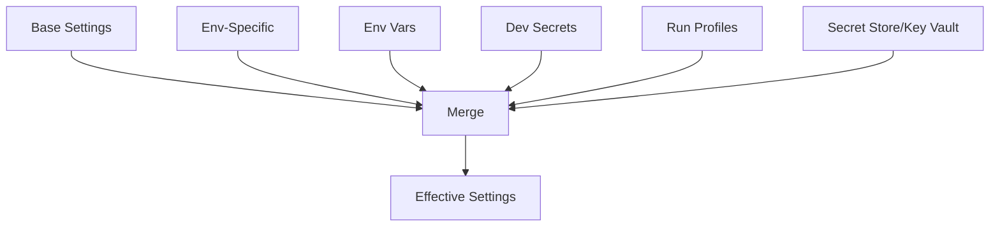
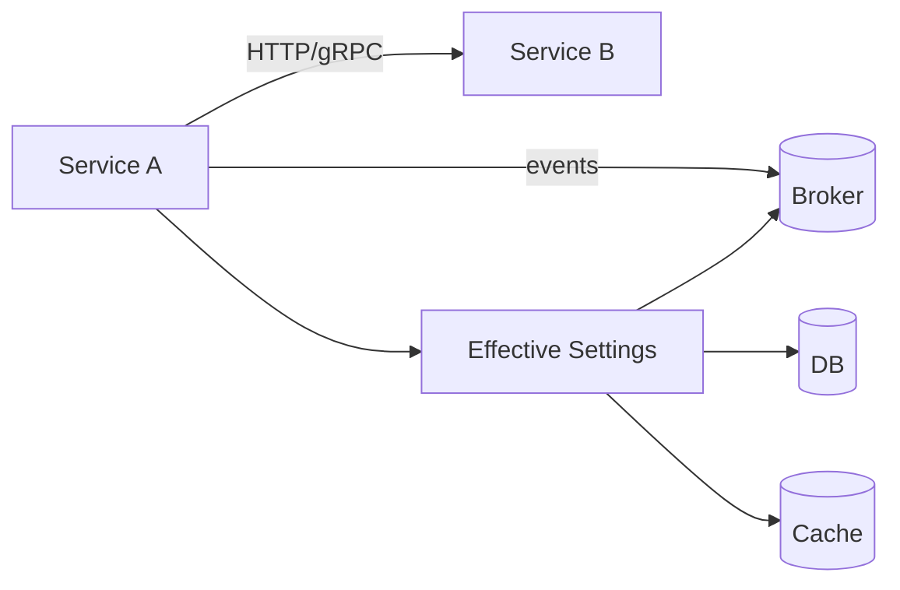

# 03_.NET Aspire: Service Wiring & Dependencies

**Learning Level**: Practitioner  
**Prerequisites**: Aspire overview, developer loop  
**Estimated Time**: 20–30 minutes

> Navigation: [Enterprise Development](./README.md) › Aspire: Service Wiring & Dependencies

## 🎯 Objectives

- Learn configuration layering, connection patterns, and local attached resources

## Conceptual Foundation (Original Synthesis)

Service wiring is how your app gets configuration, discovers peers, and connects to backing services (databases, caches, queues, object stores). Aspire streamlines this in development while preparing you for production.

Key ideas:

- Configuration layering: defaults → environment → secrets → runtime overlays
- Contracts first: HTTP/OpenAPI or gRPC/Protobuf for service‑to‑service calls
- Backing services as attached resources with clear interfaces and lifecycle controls
- Discovery via well‑known endpoints or a service registry (platform dependent)

### How config becomes “effective settings”

```text
[appsettings.json]
  + [appsettings.Development.json]
  + [Environment Variables]
  + [User Secrets / Dev Secrets]
  + [Launch/Run Profiles]
  + [Key Vault / Secret Store]
  ---------------------------------
                      ↓ merge
              [Effective Settings]
```



Practical tip: print a redacted snapshot of “effective settings” at startup (mask secrets) to confirm wiring.

### Wiring to backing services (local and cloud)

- Databases: use a single canonical connection name, e.g., `ConnectionStrings__Primary`
- Cache: advertise a feature flag (`Caching__Enabled=true`) and an endpoint `Caching__Redis__Connection`
- Messaging: standardize queue/topic names; expose `Messaging__Broker__Uri`

Startup behavior:

- Validate required settings early; fail fast with actionable error messages
- Apply connection timeouts and retry with jitter; avoid infinite hangs
- For dev: auto-create databases/queues guarded behind a “dev only” toggle

### Service‑to‑service contracts

- REST (OpenAPI): version routes (e.g., `/v1/`), support idempotent POSTs with idempotency keys
- gRPC: use explicit deadlines/timeouts and error codes; document protobufs
- Event contracts: treat message schemas like APIs; version and validate them

### Discovery patterns in dev

- Fixed ports and `localhost` URLs for simplicity
- Central run composition provides endpoints via env vars (e.g., `Services__Catalog__Url`)
- Optional: DNS names in a local network (when mimicking cluster DNS)

### ASCII wiring overview

```text
 [Service A]
  |  \
  |   \-------> HTTP/gRPC → [Service B]
  |                       ↘ events → [Broker]
  |
  config → [Effective Settings] → connections → [DB][Cache][ObjectStore]
```



### Practical Patterns

- 12‑Factor config: prefer env vars; map hierarchies with double underscores
- Secrets: never in Git; use User Secrets locally and a managed secret store in cloud
- Health model: liveness (process up), readiness (dependencies ready), startup (init done)
- Connection policy: timeouts, circuit breakers, exponential backoff with jitter
- Data seeding: dev‑only seeders; avoid accidental prod seeds

### Mini reference (env keys)

```text
ASPNETCORE_URLS=http://localhost:5001
ConnectionStrings__Primary=Server=localhost;Database=app;User Id=dev;Password=...;
Services__Catalog__Url=http://localhost:5100
Caching__Enabled=true
Caching__Redis__Connection=localhost:6379
Messaging__Broker__Uri=amqp://localhost:5672
```

### Checklist

- [ ] Effective settings printed at startup (secrets masked)
- [ ] Required config validated with clear errors
- [ ] Health endpoints for liveness/readiness/startup
- [ ] Standardized env keys for services and dependencies
- [ ] Retry/backoff and timeouts applied to all outbound calls
- [ ] Dev‑only auto‑provision guarded behind a flag

### Common Pitfalls

- Secrets committed to source control
- Implicit defaults that differ between environments
- Chatty cross‑service calls due to missing aggregation
- No timeouts → hung threads and cascading failures

## Next Steps

- Continue with [04_Observability](./04_DotNet-Aspire-Observability.md)
