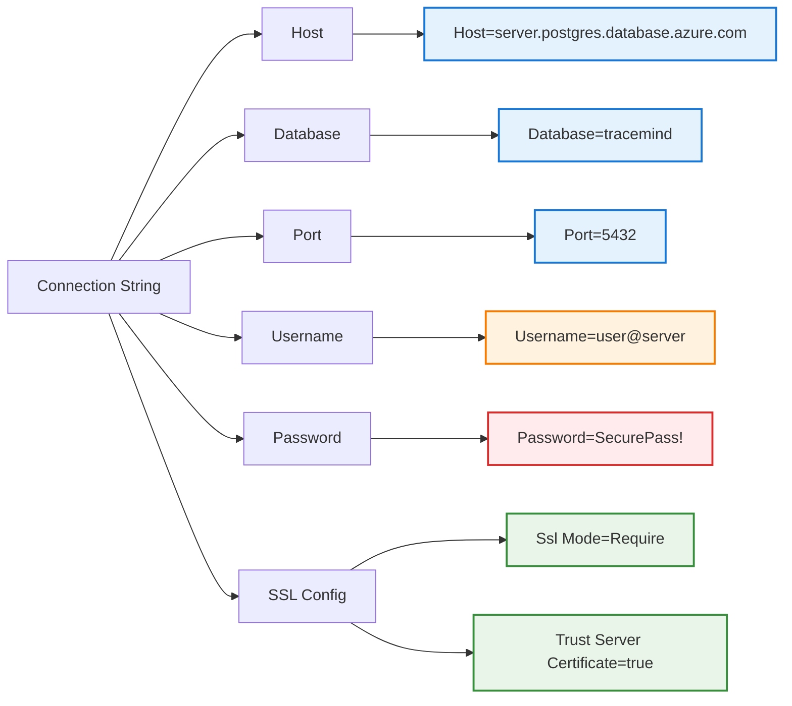

# Azure PostgreSQL Connection Strings with EF Core

**Learning Level**: Intermediate  
**Prerequisites**: Basic EF Core migrations, PowerShell fundamentals, Azure PostgreSQL setup  
**Estimated Time**: 27 minutes

## 🎯 Learning Objectives

By the end of this 27-minute session, you will:

1. Understand Azure PostgreSQL connection string requirements for EF Core
2. Master PowerShell syntax for handling connection strings safely
3. Use connection string variables securely in migration commands
4. Troubleshoot common Azure PostgreSQL + EF Core connection issues
5. Apply PowerShell best practices for special characters in connection strings

## 📋 Quick Overview (5 minutes)

### The Azure PostgreSQL + EF Core Connection Challenge

When working with **Azure PostgreSQL** and **Entity Framework Core**, you must navigate three critical considerations:

```text
┌──────────────────────────────────────────────────────────────┐
│  Azure PostgreSQL + EF Core Connection Stack                  │
├──────────────────────────────────────────────────────────────┤
│                                                                │
│  ┌────────────────────┐         ┌─────────────────────┐      │
│  │  PowerShell Shell  │         │  Azure PostgreSQL   │      │
│  │  Syntax Rules      │  ────►  │  Connection Format  │      │
│  │                    │         │                     │      │
│  │  • Semicolons (;)  │         │  • Host= syntax     │      │
│  │  • Special chars   │         │  • SSL required     │      │
│  │  • Variable syntax │         │  • Azure username   │      │
│  └────────────────────┘         └─────────────────────┘      │
│           │                               │                   │
│           └───────────┬───────────────────┘                   │
│                       ▼                                       │
│           ┌─────────────────────┐                            │
│           │  Npgsql Provider    │                            │
│           │  EF Core 9.x        │                            │
│           │                     │                            │
│           │  • Connection parse │                            │
│           │  • SSL validation   │                            │
│           │  • Migration apply  │                            │
│           └─────────────────────┘                            │
│                                                                │
└──────────────────────────────────────────────────────────────┘
```

**Key Challenge**: PowerShell treats semicolons (`;`) as command separators, but PostgreSQL connection strings use semicolons as parameter delimiters.

### The Three Essential Patterns

| Scenario | PowerShell Syntax | Use Case |
|----------|-------------------|----------|
| **Inline String** | `--connection 'Host=...;Database=...'` | Quick testing, one-time migrations |
| **Variable with Quotes** | `--connection "$PostgreSQLConn"` | Reusable, cleaner syntax |
| **Secure Storage** | Load from Key Vault/Credential Manager | Production environments |

## 🔍 Core Concepts (15 minutes)

### 1. Azure PostgreSQL Connection String Anatomy



**ASCII Fallback**:

```text
Azure PostgreSQL Connection String Components:
┌─────────────────────────────────────────────────────────────┐
│ Host=traceminddb.postgres.database.azure.com ← Azure FQDN   │
│ Database=tracemind ← Target database name                   │
│ Port=5432 ← Standard PostgreSQL port                        │
│ Username=swamy@traceminddb ← user@servername format         │
│ Password=MyStrongPassword! ← Secure credential              │
│ Ssl Mode=Require ← Azure enforces SSL                       │
│ Trust Server Certificate=true ← Accept Azure SSL cert       │
└─────────────────────────────────────────────────────────────┘
```

#### Critical Azure-Specific Requirements

| Component | Standard PostgreSQL | Azure PostgreSQL | Why Different? |
|-----------|---------------------|------------------|----------------|
| **Host** | `Host=localhost` | `Host=server.postgres.database.azure.com` | Azure uses FQDN |
| **Username** | `Username=admin` | `Username=admin@servername` | Azure authentication format |
| **SSL** | Optional | **Required** (`Ssl Mode=Require`) | Azure security policy |
| **Certificate** | Not needed | `Trust Server Certificate=true` | Azure SSL validation |

### 2. PowerShell Connection String Handling

#### The Semicolon Problem

```powershell
# ❌ WRONG - PowerShell interprets ; as command separator
dotnet ef database update --connection Host=server;Database=db

# Result: PowerShell tries to run TWO commands:
#   1. dotnet ef database update --connection Host=server
#   2. Database=db  ← Treated as separate command (fails)
```

#### The Three Safe Solutions

```powershell
# ✅ Solution 1: Single quotes (literal string)
dotnet ef database update --connection 'Host=server;Database=db;Username=user'

# ✅ Solution 2: Double quotes (allows variable expansion)
$conn = "Host=server;Database=db"
dotnet ef database update --connection "$conn"

# ✅ Solution 3: Here-string (multi-line, readable)
$conn = @"
Host=server.postgres.database.azure.com;
Database=tracemind;
Port=5432;
Username=swamy@server;
Password=SecurePass!;
Ssl Mode=Require;
Trust Server Certificate=true
"@ -replace "`r`n", ""  # Remove line breaks
```

### 3. EF Core Migration Command Structure

```text
Multi-Project Solution Structure:
┌─────────────────────────────────────────────────────────────┐
│ TraceMind.sln                                                │
│ ├── TraceMind.MinimalApi/         ← --startup-project       │
│ │   ├── Program.cs                  (DI configuration)      │
│ │   └── appsettings.json            (connection strings)    │
│ │                                                            │
│ └── TraceMind.IdentityPersistence/ ← --project              │
│     ├── ApplicationDbContext.cs     (DbContext)             │
│     └── Migrations/                 (migration files)       │
└─────────────────────────────────────────────────────────────┘

Command Flow:
dotnet ef database update
  ├── --project TraceMind.IdentityPersistence  ← Where migrations live
  ├── --startup-project TraceMind.MinimalApi   ← DI & config source
  └── --connection "..."                       ← Override connection
```

**Why Both Projects?**

- `--project`: Contains `DbContext` and migration files
- `--startup-project`: Has DI configuration, connection strings, services registration
- EF Core builds the startup project first, then applies migrations from the project

## 🛠️ Practical Implementation (5 minutes)

### Pattern 1: Inline Connection String (Testing)

```powershell
# Quick one-off migration for testing
dotnet ef database update `
  --project TraceMind.IdentityPersistence `
  --startup-project TraceMind.MinimalApi `
  --connection 'Host=traceminddb.postgres.database.azure.com;Database=tracemind;Port=5432;Username=swamy@traceminddb;Password=TestPass123!;Ssl Mode=Require;Trust Server Certificate=true'
```

**When to use**: Local development, testing, quick experiments

### Pattern 2: PowerShell Variable (Recommended)

```powershell
# Define connection string as variable
$PostgreSQLConn = "Host=traceminddb.postgres.database.azure.com;Database=tracemind;Port=5432;Username=swamy@traceminddb;Password=MyStrongPassword!;Ssl Mode=Require;Trust Server Certificate=true"

# Verify the variable (optional)
Write-Host "Connection String: $PostgreSQLConn"

# Use in EF Core command with DOUBLE QUOTES
dotnet ef database update `
  --project TraceMind.IdentityPersistence `
  --startup-project TraceMind.MinimalApi `
  --connection "$PostgreSQLConn"
```

**Critical Rules**:

- ✅ Use **double quotes** `"$var"` for variable expansion
- ❌ Don't use single quotes `'$var'` (treats literally as `$var`)
- ✅ Always quote the variable: `"$PostgreSQLConn"`, not `$PostgreSQLConn`

### Pattern 3: Secure Storage (Production)

#### Option A: Windows Credential Manager

```powershell
# Store connection string securely
cmdkey /generic:AzurePostgreSQL /user:TraceMind /pass:"Host=...full-string..."

# Retrieve in script
$cred = Get-StoredCredential -Target "AzurePostgreSQL"
$PostgreSQLConn = $cred.GetNetworkCredential().Password

# Use in EF command
dotnet ef database update `
  --project TraceMind.IdentityPersistence `
  --startup-project TraceMind.MinimalApi `
  --connection "$PostgreSQLConn"
```

#### Option B: Environment Variable

```powershell
# Set environment variable (session-only)
$env:AZURE_POSTGRES_CONN = "Host=traceminddb.postgres.database.azure.com;Database=tracemind;Port=5432;Username=swamy@traceminddb;Password=SecurePass!;Ssl Mode=Require;Trust Server Certificate=true"

# Use in EF command
dotnet ef database update `
  --project TraceMind.IdentityPersistence `
  --startup-project TraceMind.MinimalApi `
  --connection "$env:AZURE_POSTGRES_CONN"
```

#### Option C: Azure Key Vault (Enterprise)

```powershell
# Install Azure PowerShell module
Install-Module -Name Az.KeyVault

# Retrieve secret
Connect-AzAccount
$secret = Get-AzKeyVaultSecret -VaultName "TraceMindVault" -Name "PostgreSQLConnection"
$PostgreSQLConn = $secret.SecretValue | ConvertFrom-SecureString -AsPlainText

# Use in EF command
dotnet ef database update `
  --project TraceMind.IdentityPersistence `
  --startup-project TraceMind.MinimalApi `
  --connection "$PostgreSQLConn"
```

### Special Characters Handling

```powershell
# ❌ PROBLEMATIC passwords (contain PowerShell special chars)
$password = "Pass$word123!"  # $ is variable prefix in PowerShell
$password = "Pass`nword"     # ` is escape character
$password = "Pass&word"      # & is command separator

# ✅ SOLUTION: Use single quotes for literal strings
$safePassword = 'Pass$word123!'

# ✅ Or escape special characters with backtick
$safePassword = "Pass`$word123!"

# Build connection string with safe password
$PostgreSQLConn = "Host=server.postgres.database.azure.com;Database=db;Username=user@server;Password=$safePassword;Ssl Mode=Require;Trust Server Certificate=true"
```

### Troubleshooting Checklist

```powershell
# 1. Verify EF Core tools version matches runtime
dotnet ef --version
dotnet list package | Select-String "EntityFrameworkCore"

# 2. Test connection string parsing
Write-Host "Connection: $PostgreSQLConn"

# 3. Verify Npgsql provider is installed
dotnet list package | Select-String "Npgsql"

# 4. Check migration history
dotnet ef migrations list `
  --project TraceMind.IdentityPersistence `
  --startup-project TraceMind.MinimalApi

# 5. Dry-run migration (generate SQL script)
dotnet ef migrations script `
  --project TraceMind.IdentityPersistence `
  --startup-project TraceMind.MinimalApi `
  --output migration.sql
```

## 💡 Key Takeaways & Next Steps (2 minutes)

### Essential Takeaways

1. **Azure Username Format**: Always use `username@servername` for Azure PostgreSQL
2. **Host Syntax**: Use `Host=` (not `Server=`) for Npgsql provider
3. **PowerShell Quoting**: Use single quotes for literals, double quotes for variable expansion
4. **SSL Requirement**: Azure PostgreSQL requires `Ssl Mode=Require;Trust Server Certificate=true`
5. **Multi-Project Structure**: Use `--project` for migrations, `--startup-project` for configuration

### Quick Reference Card

```powershell
# Standard Pattern (copy-paste ready)
$PostgreSQLConn = "Host=YOUR-SERVER.postgres.database.azure.com;Database=YOUR-DB;Port=5432;Username=YOUR-USER@YOUR-SERVER;Password=YOUR-PASSWORD;Ssl Mode=Require;Trust Server Certificate=true"

dotnet ef database update `
  --project YOUR.Persistence `
  --startup-project YOUR.Api `
  --connection "$PostgreSQLConn"
```

### Common Errors and Solutions

| Error | Cause | Solution |
|-------|-------|----------|
| `The term 'Database' is not recognized` | PowerShell parsed `;` as separator | Wrap connection string in quotes |
| `FATAL: password authentication failed` | Wrong username format | Use `user@server` format |
| `SSL connection is required` | Missing SSL parameters | Add `Ssl Mode=Require;Trust Server Certificate=true` |
| `could not translate host name` | Wrong Host parameter | Use `Host=` not `Server=` |

### Next Steps

1. **Immediate**: Test connection string with your Azure PostgreSQL instance
2. **Short-term**: Set up secure credential storage (Key Vault or Credential Manager)
3. **Long-term**: Create PowerShell scripts for common migration workflows
4. **Advanced**: Learn migration rollback strategies and production deployment patterns

## 🔗 Related Topics

### Prerequisites

- [EF Core Version Mismatch Resolution](01_Version-Mismatch-Resolution.md) - Ensure tool/runtime alignment
- [.NET CLI Fundamentals](../../10_NET-Framework/) - Understanding dotnet commands
- PowerShell Basics - Variable syntax and quoting rules

### Builds Upon

- [C# Dependency Injection](../../03_CSharp/) - Understanding DbContext registration
- [Software Design Principles](../../01_software-design-principles/) - Connection string management

### Enables

- **EF Core Migrations** (Coming Soon) - Creating and applying schema changes
- **Azure PostgreSQL Best Practices** (Coming Soon) - Performance and security
- [.NET Minimal APIs](../../10_NET-Framework/) - Building APIs with Azure PostgreSQL

### Cross-References

- [Development Approaches](../../18_Development-Approaches/) - Connection string security patterns
- Azure Security - Key Vault integration for secrets management

---

## 📚 STSA Metadata

```yaml
module: azure-postgresql-ef-core-connection-strings
track: Development
domain: Entity Framework Core
level: Intermediate
duration: 27 minutes
topics:
  - Entity Framework Core
  - Azure PostgreSQL
  - PowerShell
  - Connection Strings
  - Security
updated: 2025-10-05
status: Active
```

---

**Lead Architect Learning Track** - Development Domain
