# 10_LLM-GenAI-Agents-AgenticAI-Comparative-Guide

Learning Level: Intermediate  
Prerequisites: Basics of transformers and LLMs, prompt enginee---

## 🔤 Deep Dive: Tokenization and Embedding Foundations

Before understanding how LLMs process language, we need to understand the fundamental building blocks: how text becomes numbers.fundamentals  
Estimated Ti---

## 🔌 Boundary contracts (inputs/outputs, errors) 60–90 minutes

---

## 🎯 Learning Objectives

By the end of this guide, you can:

- Distinguish LLMs, Generative AI systems, AI Agents, and Agentic AI by purpose, inputs, state, and autonomy
- Choose the right approach for a problem and anticipate failure modes
- Sketch system boundaries and hand-off points between the four layers
- Map your solution to the rest of this track (LLMs → MCP → Agents)

---

## 🔎 One-sentence archetypes

- LLM: A probabilistic language engine that predicts the next token conditioned on context.
- AI Agent: A goal-driven orchestrator that uses tools and calls models to complete tasks.
- Agentic AI: A self-directing system that plans, monitors, adapts, and learns across episodes.

## 🧭 Problem-routing cheat sheet

- Need high-quality text/code completions with tight latency? Start with an LLM.
- Need to synthesize or transform content (summaries, images from text, speech-to-text)? Use Generative AI patterns.
- Need to accomplish multi-step tasks that require tools, APIs, or data sources? Use an AI Agent.
- Need systems that pursue objectives over time, adapt strategies, and coordinate sub-agents? Consider Agentic AI.

---

## Stop conflating: four distinct layers

- LLM
  - A token predictor: maps context → next tokens.
  - No intent, no task execution, no memory beyond the prompt window.
  - Best for fast, constrained completions and structured outputs.

- Generative AI
  - A content creator: turns inputs (text/code/image/audio) into new artifacts.
  - Understands and navigates latent spaces; still waits for explicit instructions.
  - Best for synthesis, transformation, and style-constrained generation.

- AI Agents
  - A task executor: detects intent, plans steps, calls tools/APIs, handles responses.
  - Modular, inspectable pipelines; autonomy limited to the task/session.
  - Best for multi-step work that touches external systems or data.

- Agentic AI
  - An objective-driven system: operates with goals, policies, context, and memory.
  - Reasons, adapts, spawns sub-agents, monitors progress, decides next actions.
  - Best for long-horizon, evolving workflows with minimal human instruction.

> Design shift: this is not just “more features.” It’s a move from prediction → orchestration → autonomy, which changes architecture, tooling, risk, and evaluation.

---

## 🧬 Capability matrix (what changes across the stack)

| Dimension | LLM | Generative AI | AI Agent | Agentic AI |
|---|---|---|---|---|
| Core goal | Predict tokens well | Produce new content | Achieve a task | Pursue objectives over time |
| Inputs | Prompt + context | Multi-modal prompts | Goals + environment state | Objectives + world/organizational state |
| State | Context window | Context + artifacts | Working memory + tools | Long-term memory + policies |
| Tool use | Implicit (via prompting) | Optional (toolformer/routing) | Explicit (APIs, files, MCP) | Orchestrated, dynamic, multi-agent |
| Autonomy | None | Low | Medium | High |
| Planning | None | Light (templates) | Explicit plans | Hierarchical, adaptive |
| Feedback | Human-in-the-loop | Review/critique | Self-check + user | Self-evaluation + governance |
| Typical failure | Hallucination | Low-fidelity or off-style output | Tool misuse, loop failures | Goal drift, safety/regulatory risks |

---

## 🧩 Architecture impact: choosing stack depth

| Layer | Architecture focus | Tooling | State & memory | Orchestration | Risk profile | Primary value |
|---|---|---|---|---|---|---|
| LLM | Prompt design, structured outputs, caching | Model SDKs, routers | Ephemeral context window | None | Content quality, hallucination | Speed, low integration cost |
| Generative AI | Content pipelines, constraints, safety filters | Model providers + media libs | Artifact store, prompt templates | Light templates/workflows | IP/safety/style drift | Consistent content throughput |
| AI Agent | Tool abstraction (MCP), planner, evals, logs | Agent/orchestration frameworks, MCP | Short-term memory, run logs | Deterministic control flow, retries | Tool misuse, loops, side-effects | Task completion across systems |
| Agentic AI | Policies, governance, long-horizon memory, monitoring | Multi-agent frameworks, schedulers, dashboards | Vector/graph memories, metrics store | Dynamic planning, adaptation | Goal drift, runaway cost, compliance | Autonomy and adaptability |

### Quick self-check

- Do you only need a single artifact? → LLM/GenAI.
- Do you need tools/APIs and multi-step plans? → AI Agent.
- Do you need ongoing objectives with monitoring and adaptation? → Agentic AI.

---

## 🔁 Lifecycle patterns (Mermaid + plain-text)

### Mermaid version (optional)

Rendering note: If your viewer doesn't support Mermaid, the diagram below may appear as code. Use the plain-text diagram that follows.

```mermaid
flowchart TB
  subgraph LLM [LLM Inference]
    A1[Prompt and context] --> A2[Token sampling] --> A3[Completion]
  end

  subgraph GEN [Generative AI]
    B1[Inputs: text, image, audio] --> B2[Representation and constraints]
    B2 --> B3[Generation] --> B4[Quality pass: rules and critique] --> B5[Deliver artifact]
  end

  subgraph AGT [AI Agent]
    C1[Goal or task] --> C2[Plan] --> C3[Call tools via MCP]
    C3 --> C4[Update memory] --> C5{Stop criteria met?}
    C5 -- yes --> C6[Deliver result]
    C5 -- no  --> C2
  end

  subgraph AGIC [Agentic AI]
    D1[Objective and policies] --> D2[Situation assessment]
    D2 --> D3[Strategy and subgoals] --> D4[Multi-agent and tool execution]
    D4 --> D5[Monitoring and anomaly handling] --> D6[Adapt strategy]
    D6 --> D7[Evaluate and learn] --> D2
  end
```



```text
LLM Inference:
  [Prompt & Context] -> [Token Sampling] -> [Completion]

Generative AI:
  [Inputs (txt/img/audio)] -> [Representation & Constraints] -> [Generation]
  -> [Quality Pass (rules/critique)] -> [Deliver Artifact]

AI Agent:
  [Goal/Task] -> [Plan] -> [Call Tools via MCP] -> [Update Memory]
  -> [Check Stop Criteria] -> (yes -> Deliver Result | no -> Plan)

Agentic AI:
  [Objective & Policies] -> [Situation Assessment] -> [Strategy & Subgoals]
  -> [Multi-Agent/Tool Execution] -> [Monitoring & Anomaly Handling]
  -> [Adapt Strategy] -> [Evaluate & Learn] -> (loop back to Situation Assessment)
```

Notes:

- MCP = Model Context Protocol (see 06_MCP-Servers/) for secure, standardized tool access.
- Agentic loop adds strategy adaptation and long-horizon evaluation, not just repeated planning.

---

## � Deep Dive: Tokenization and Embedding Foundations

Before understanding how LLMs process language, we need to understand the fundamental building blocks: how text becomes numbers.

### **Tokenization: Breaking Language into Processing Units**

**Core Concept**: Tokenization converts human language into discrete units that models can mathematically process.

**Original Examples:**

Consider the recipe instruction: "Sauté mushrooms until golden brown"

**Word-Level Tokenization:**

```text
Input: "Sauté mushrooms until golden brown"
Tokens: ["Sauté", "mushrooms", "until", "golden", "brown"]
Count: 5 tokens
```

**Subword Tokenization (BPE-style):**

```text
Input: "Sauté mushrooms until golden brown"  
Tokens: ["Sa", "uté", "mushroom", "s", "until", "golden", "brown"]
Count: 7 tokens
```

**Character-Level Tokenization:**

```text
Input: "Sauté mushrooms until golden brown"
Tokens: ["S", "a", "u", "t", "é", " ", "m", "u", "s", "h", ...]
Count: 33 tokens
```

### **Why Different Tokenization Strategies Matter**

**Vocabulary Size vs Granularity Trade-off:**

```text
Strategy      | Vocab Size | Handles New Words | Context Efficiency
------------- |------------|-------------------|-------------------
Word-level    | 50K-100K   | Poorly           | High
Subword (BPE) | 30K-50K    | Well             | Medium  
Character     | 100-1000   | Perfectly        | Low
```

**Real Impact Example:**

- Programming term: "async/await"
- Word tokenizer: ["async", "/", "await"] or ["UNKNOWN", "UNKNOWN"]
- Subword tokenizer: ["async", "/", "aw", "ait"]
- Character tokenizer: ["a", "s", "y", "n", "c", "/", "a", "w", "a", "i", "t"]

### **Embedding: From Tokens to Meaning Vectors**

**Core Concept**: Embedding transforms discrete tokens into high-dimensional vectors that capture semantic relationships.

**Visualization with Kitchen Appliances:**

```text
Token: "blender"     → Vector: [0.2, -0.8, 0.1, 0.9, -0.3, ...]
Token: "mixer"       → Vector: [0.3, -0.7, 0.2, 0.8, -0.4, ...]  
Token: "toaster"     → Vector: [-0.1, 0.4, -0.6, 0.2, 0.9, ...]
Token: "refrigerator"→ Vector: [0.1, 0.3, -0.2, -0.5, 0.7, ...]
```

**Semantic Relationships Emerge:**

- "blender" and "mixer" vectors are close (both mixing appliances)
- "toaster" is distant from "refrigerator" (heat vs cold)
- Mathematical operations reveal relationships:
  - blender + powerful ≈ food_processor
  - toaster + larger ≈ oven

### **Practical Tokenization Scenarios**

#### Scenario 1: Scientific Writing

```text
Input: "The mitochondria produces ATP through oxidative phosphorylation"

GPT-style Tokenizer:
["The", "mit", "och", "ondria", "produces", "ATP", "through", "ox", "id", "ative", "phosph", "oryl", "ation"]

Why this matters:
- Scientific terms split unpredictably
- Model needs to learn "mit+och+ondria" = organelle
- "phosph+oryl+ation" = biochemical process
```

#### Scenario 2: Code Documentation

```text
Input: "Initialize the DatabaseManager class with connection_string parameter"

Tokens might be:
["Initialize", "the", "Database", "Manager", "class", "with", "connection", "_", "string", "parameter"]

Challenges:
- CamelCase splitting varies by tokenizer
- Underscore handling inconsistent  
- Technical terms may fragment unpredictably
```

#### Scenario 3: Multilingual Content

```text
Input: "Hello, こんにちは, Bonjour, Hola"

Tokenization differences:
- English: Clean word boundaries
- Japanese: No spaces, complex character handling
- French: Accented characters, elision
- Spanish: Punctuation attachment varies
```

### **Embedding Quality: Measuring Semantic Understanding**

**Distance Metrics in Vector Space:**

```text
Cosine Similarity Examples:
- "doctor" ↔ "physician": 0.89 (very similar)
- "doctor" ↔ "nurse": 0.71 (related profession)  
- "doctor" ↔ "teacher": 0.52 (both help people)
- "doctor" ↔ "pizza": 0.12 (unrelated)
```

**Clustering in Kitchen Context:**

```text
Cooking Methods: [sauté, braise, roast, bake, grill]
Utensils: [spatula, whisk, ladle, tongs, strainer]  
Ingredients: [flour, eggs, butter, sugar, salt]
```

Quality embeddings cluster these by function, not just appearance.

### **Common Tokenization Pitfalls**

#### Issue 1: Out-of-Vocabulary Handling

```text
Training: "The server crashed"
New input: "The database_server crashed"
- "database_server" → ["<UNK>"] (information lost)
- Better: ["database", "_", "server"] (meaning preserved)
```

#### Issue 2: Inconsistent Formatting

```text
"Dr. Smith" vs "Dr.Smith" vs "Doctor Smith"
- Different tokenizations for same meaning
- Model sees these as distinct patterns
- Solution: Preprocessing normalization
```

#### Issue 3: Context Window Efficiency

```text
Character-level: "extraordinary" = 13 tokens
Subword-level: "extraordinary" = 3-4 tokens  
Word-level: "extraordinary" = 1 token

Choice affects how much context fits in model's attention window.
```

### **Embedding Dimensions and Model Capacity**

**Typical Embedding Sizes:**

```text
Model Type    | Embedding Dims | Vocabulary | Parameters
------------- |----------------|------------|------------
Small GPT     | 768           | 50K        | 124M
Medium GPT    | 1024          | 50K        | 355M  
Large GPT     | 1536          | 50K        | 774M
GPT-3.5       | 4096          | 100K       | 175B
```

**What Higher Dimensions Enable:**

- More nuanced semantic relationships
- Better context integration
- Improved few-shot learning
- Higher computational cost

### **Practical Applications Across Our Stack**

**LLM Level:**

- Token prediction accuracy depends on quality embeddings
- Vocabulary size vs context window trade-offs
- Tokenization affects prompt engineering effectiveness

**Generative AI Level:**  

- Cross-modal embeddings (text→image, audio→text)
- Style transfer through embedding space manipulation
- Content filtering via embedding similarity thresholds

**AI Agent Level:**

- Tool/API parameter embedding for semantic matching
- Task embedding for plan similarity and reuse
- Memory retrieval via embedding-based search

**Agentic AI Level:**

- Goal embedding for objective alignment measurement
- Experience embedding for transfer learning across episodes
- Multi-agent coordination through shared embedding spaces

---

## �🔌 Boundary contracts (inputs/outputs, errors)

- LLM
  - Input: {prompt, context} → Output: {text tokens}
  - Errors: token limit, hallucination, style/format drift
- Generative AI
  - Input: {prompt + constraints} → Output: {content artifact}
  - Errors: low fidelity, safety filters, bias artifacts
- AI Agent
  - Input: {task, tools, data connections} → Output: {task result, logs}
  - Errors: tool failures, plan loops, stale memory
- Agentic AI
  - Input: {objective, policies, resources} → Output: {outcomes, metrics, audit}
  - Errors: goal misalignment, runaway cost, governance breaches

---

## 🧪 Choosing the right level (decision guide)

1) Is the output a single artifact with clear format? Prefer LLM/GenAI.
2) Does the solution require external data/tools or multi-step actions? Prefer Agent.
3) Must the system adapt over time with monitoring and governance? Prefer Agentic AI.

---

## 🛠️ Implementation hints (practical)

- LLMs: Use system prompts, structured outputs (JSON), and small eval sets (rubrics) for stability.
- Generative AI: Add a critique step (self-review) and domain stylebooks; cache high-value artifacts.
- AI Agents: Externalize tools via MCP; maintain short-term memory; add stop/timeout guards.
- Agentic AI: Define policies, observations, reward/score functions; implement safety rails and dashboards.

---

## ⚠️ Common pitfalls

- Blurring boundaries: forcing agents to write content when a single LLM call suffices.
- Unlimited loops: missing stop criteria, budget caps, or watchdogs.
- Hidden state: undocumented memory/state causing nondeterminism.
- Evaluation gaps: no task-ground truth, no replay logs.

---

## 🔗 Related Topics

- 05_LargeLanguageModels/ — foundations and practicals for LLM work
- 06_MCP-Servers/ — how agents call tools and resources
- 07_AI-Agents/ — architectures, development, and deployment
- 04_NaturalLanguageProcessing/ — NLP fundamentals that underpin LLMs

---

Created: August 2025  
Maintainer: Swamy's Tech Skills Academy  
Purpose: Original comparative guide to clarify scope and hand-offs across LLMs, Generative AI, Agents, and Agentic AI.
