# Vector Representations in NLP - Foundation Methods

**Learning Level**: Beginner  
**Prerequisites**: Basic Python, understanding of vectors and matrices  
**Estimated Time**: 30-40 minutes  

---

## 🎯 Learning Objectives

By the end of this module, you will:

- **Understand the vector representation paradigm** for text processing
- **Master three foundational approaches**: One-hot, frequency-based, and statistical methods
- **Evaluate trade-offs** between simplicity, memory efficiency, and semantic capture
- **Choose appropriate methods** for different NLP tasks and constraints

---

## 🧩 The Vector Representation Challenge

### **From Words to Numbers: The NLP Translation Problem**

Natural language processing requires converting human language into mathematical representations that machines can process. This fundamental challenge has three key considerations:

```mermaid
graph TD
    subgraph "🎯 The Vector Representation Design Space"
        SPARSE[🎯 Sparse Representations<br/>High-dimensional, memory-intensive<br/>One-hot encoding approach]
        FREQ[📊 Frequency-Based<br/>Statistical patterns, TF-IDF<br/>Bag-of-words foundation]
        DENSE[🧠 Dense Representations<br/>Low-dimensional, semantic-aware<br/>Neural embedding approach]
    end
    
    subgraph "🔄 Trade-off Considerations"
        MEMORY[💾 Memory Efficiency]
        SEMANTIC[🎭 Semantic Capture]
        SIMPLICITY[⚙️ Implementation Complexity]
        PERFORMANCE[⚡ Computational Speed]
    end
    
    SPARSE --> MEMORY
    FREQ --> PERFORMANCE  
    DENSE --> SEMANTIC
```



---

## 🎯 Method 1: One-Hot Encoding - Simplicity First

### **Conceptual Foundation**

One-hot encoding represents each token by a vector where exactly one element is 1 and the rest are 0. This creates a **sparse, orthogonal representation** where:

- **Rows**: Token positions in sequence (preserves order)
- **Columns**: Unique vocabulary items  
- **Values**: Binary presence indicators (0 or 1)

### **Educational Example: Restaurant Review**

```text
Sentence: "Great food, terrible service"
Vocabulary: ["Great", "food", "terrible", "service"]

One-Hot Matrix:
Position 1 (Great):    [1, 0, 0, 0]
Position 2 (food):     [0, 1, 0, 0]  
Position 3 (terrible): [0, 0, 1, 0]
Position 4 (service):  [0, 0, 0, 1]
```

### **When to Use One-Hot Encoding**

✅ **Ideal for:**

- Small vocabularies (< 1000 words)
- Quick prototyping and proof-of-concepts  
- Cases where word order and exact position matter
- Educational demonstrations of vector concepts

❌ **Avoid when:**

- Large vocabularies (memory explosion)
- Semantic similarity is important
- Working with real-world text corpora

---

## 📊 Method 2: Bag-of-Words - Frequency Patterns

### **Moving Beyond Position: Document-Level Patterns**

Bag-of-Words (BoW) shifts focus from **position-sensitive encoding** to **document-level frequency patterns**. Instead of preserving word order, BoW captures the overall "flavor" of a document through word occurrence counts.

### **Educational Example: Product Reviews**

```text
Review 1: "Amazing product! Great quality, amazing value"
Review 2: "Poor quality product, terrible value"

BoW Vocabulary: ["Amazing", "product", "Great", "quality", "value", "Poor", "terrible"]

Review 1 BoW: [2, 1, 1, 1, 1, 0, 0]  # "Amazing" appears twice
Review 2 BoW: [0, 1, 0, 1, 1, 1, 1]  # Different frequency pattern
```

### **Strategic Applications**

✅ **Excellent for:**

- Document classification (spam detection, sentiment analysis)
- Information retrieval and search ranking
- Topic modeling and content categorization
- Large vocabularies with manageable frequency distributions

❌ **Limitations:**

- Loses word order and context ("not good" vs "good")
- Treats all words as equally important
- Suffers from sparse representation in large vocabularies

---

## 🎯 Method 3: TF-IDF - Statistical Weighting

### **Beyond Raw Counts: Importance-Weighted Representations**

Term Frequency-Inverse Document Frequency (TF-IDF) enhances bag-of-words by weighing terms based on their **discriminative power across a collection of documents**.

**Core Insight**: Words that appear frequently in one document but rarely across the entire collection are more informative for characterizing that specific document.

### **Mathematical Foundation**

```text
TF-IDF(term, document) = TF(term, document) × IDF(term, collection)

Where:
- TF = Term Frequency in document
- IDF = log(Total Documents / Documents containing term)
```

### **Educational Example: Research Paper Abstracts**

```text
Paper 1: "Machine learning algorithms neural networks deep learning"
Paper 2: "Database systems algorithms optimization performance"  
Paper 3: "Computer vision algorithms image processing neural networks"

TF-IDF Analysis:
- "algorithms" → High TF, Low IDF (appears in all papers) → Low TF-IDF
- "neural" → Medium TF, Medium IDF (appears in 2/3 papers) → Medium TF-IDF  
- "database" → Low TF, High IDF (appears in 1/3 papers) → High TF-IDF
```

### **TF-IDF Applications and Use Cases**

✅ **Powerful for:**

- Search engines and information retrieval
- Document similarity and clustering
- Feature extraction for machine learning
- Content recommendation systems

❌ **Consider alternatives when:**

- Semantic relationships matter more than statistical patterns
- Working with short texts (insufficient statistical signal)
- Need to capture word order and syntactic relationships

---

## 🔄 Method Comparison and Selection Strategy

### **Decision Matrix for Vector Representation Choice**

| Criteria | One-Hot | Bag-of-Words | TF-IDF |
|----------|---------|--------------|--------|
| **Memory Efficiency** | Poor (sparse) | Good (dense counts) | Good (dense weights) |
| **Semantic Capture** | None | None | Statistical only |
| **Implementation** | Trivial | Simple | Moderate |
| **Vocabulary Scale** | Small only | Medium-Large | Medium-Large |
| **Word Order** | Preserves | Loses | Loses |
| **Best Use Cases** | Education, Prototyping | Classification, IR | Search, Clustering |

### **Educational Progression Strategy**

1. **Start with One-Hot**: Build intuition for vector representations
2. **Progress to BoW**: Understand frequency-based patterns  
3. **Master TF-IDF**: Grasp statistical weighting concepts
4. **Prepare for Neural**: Foundation for dense embeddings

This progression avoids the **author-sequence trap** by organizing around **increasing representational sophistication** rather than historical development order.

---

## 🎯 Key Takeaways

- **Vector representations solve the fundamental NLP translation problem**
- **Each method involves specific trade-offs** between memory, semantics, and complexity
- **Method selection depends on task requirements** and data characteristics  
- **These foundations prepare you for neural embedding approaches**
- **Educational progression builds from simple to sophisticated representations**

**Next Learning Path**: Neural Embeddings and Dense Representations

## Code policy (single source of truth)

- Runnable code lives in the external canonical repo. This page shows reference-only pseudocode to explain the idea.
- If you need runnable examples, use the repo linked below. If no repo exists for this topic, ask for code and we’ll generate it externally.

## Practical Example

Sentence: "I like pizza"

Vocabulary (sorted, lowercase): ["i", "like", "pizza"]

Matrix (rows = tokens in order, columns = vocabulary):

| Token | i | like | pizza |
|-------|---|------|-------|
| i     | 1 | 0    | 0     |
| like  | 0 | 1    | 0     |
| pizza | 0 | 0    | 1     |

## Reference pseudocode (non-runnable)

```text
function one_hot(tokens):
    vocab := sorted(unique(tokens))
    index := { word -> position } from vocab order
    matrix := []
    for each token t in tokens:
        row := zeros(length(vocab))
        row[index[t]] := 1
        append row to matrix
    return matrix, vocab, index
```

## Common Pitfalls

- Large vocabulary → huge sparse matrices (memory-inefficient)
- No semantics: "pizza" and "pasta" are orthogonal (0 similarity)
- OOV words (not in the vocabulary) need a strategy (e.g., [UNK])

## Next Steps

- Bag-of-Words and term frequency (TF)
- TF-IDF to weight importance
- Distributed representations (word2vec, GloVe, fastText)

## Canonical Code Location

- External repo (single source of truth for runnable code):
  - GitHub: [Swamy-s-Tech-Skills-Academy-AI-ML-Data/llm-agents-learning](https://github.com/Swamy-s-Tech-Skills-Academy-AI-ML-Data/llm-agents-learning)

## 🔗 Related Topics

- Prerequisites: `../01_Basics/01_Tokenization.md` (create if missing)
- Related: `../01_Basics/02_Bag-of-Words.md` (create if missing)
- Advanced: `../../05_LargeLanguageModels/01_LLM-Fundamentals.md`
