# LLM Fundamentals - The Scale Revolution in AI

**Learning Level**: Intermediate  
**Prerequisites**: Basic understanding of neural networks and NLP  
**Estimated Time**: 3-4 hours  

---

## 🎯 Learning Objectives

By completing this module, you will:

- **Understand the scale vs. cleverness paradigm** that revolutionized AI
- **Grasp why LLMs outperform traditional algorithms** despite being "less clever"
- **Recognize emergent capabilities** that arise at scale without ex- [ ] Recognize the limitations that lead to agent development needs
- [ ] Can design systems that leverage LLM strengths effectively

---

## 🔧 **LLM Architecture Variants: From Raw Power to Specialized Intelligence**

### **Understanding the LLM Evolution Spectrum**

Large Language Models exist in multiple forms, each optimized for different use cases and deployment scenarios. Understanding these variants helps you choose the right approach for your specific needs.gramming

- **Connect theoretical understanding** to practical LLM capabilities
- **Prepare for advanced topics** like prompt engineering and agent development

---

## 📊 **The Performance Revolution: Scale Beats Cleverness**

### **Visual Understanding from Research**

The attached diagram reveals a fundamental shift in AI development philosophy:

```mermaid
graph TD
    subgraph "📊 Algorithm Performance Spectrum"
        LLM[🎯 Large Language Models<br/>Massive Scale, Simple Architecture<br/>Superior Performance]
        CNN[🔍 Convolutional Neural Networks<br/>More Algorithmic Cleverness<br/>Limited Performance]
        LSTM[🔄 Long Short-Term Memory<br/>Sophisticated Design<br/>Moderate Performance]
        XGB[⚡ XGBoost<br/>Highly Clever Algorithm<br/>Good but Limited Performance]
    end
    
    subgraph "🎨 Performance Characteristics"
        BETTER[📈 Better Performance<br/>More Capable<br/>Broader Applications]
        WORSE[📉 Worse Performance<br/>Limited Scope<br/>Narrow Applications]
    end
    
    subgraph "🧠 Cleverness Spectrum"
        LESS[Less Clever<br/>Brute Force Approach<br/>Scale-Based Learning]
        MORE[More Clever<br/>Sophisticated Algorithms<br/>Hand-Crafted Features]
    end
    
    LLM --> BETTER
    LLM -.-> LESS
    
    CNN --> WORSE
    CNN -.-> MORE
    
    LSTM --> WORSE
    LSTM -.-> MORE
    
    XGB --> WORSE
    XGB -.-> MORE
    
    classDef llm fill:#ff69b4,stroke:#8b008b,stroke-width:4px
    classDef traditional fill:#87ceeb,stroke:#4682b4,stroke-width:2px
    classDef performance fill:#f0f8ff,stroke:#1e90ff,stroke-width:2px
    classDef cleverness fill:#f5f5dc,stroke:#daa520,stroke-width:2px
    
    class LLM llm
    class CNN,LSTM,XGB traditional
    class BETTER,WORSE performance
    class LESS,MORE cleverness
```



### **🎯 Key Insight: The Paradigm Shift**

**Traditional AI Philosophy**:

- More sophisticated algorithms = better performance
- Hand-craft features and constraints
- Encode human domain expertise into the algorithm
- Optimize for computational efficiency

**LLM Philosophy**:

- Scale beats sophistication
- Minimal constraints, maximum data
- Let the model discover patterns from massive datasets
- Trade computational efficiency for capability

---

## 🧠 **Understanding the "Dumber" Success**

### **Why LLMs Win Despite Being "Less Clever"**

1. **📊 Data Advantage**: Access to virtually all human knowledge
2. **🔢 Parameter Scale**: Billions/trillions of learnable parameters
3. **🎯 Emergent Behavior**: Capabilities emerge from scale, not design
4. **🔄 Generalization**: Single architecture works across domains

### **What Makes Traditional Algorithms "Cleverer"**

- **Hand-crafted features**: Human expertise encoded into the algorithm
- **Domain-specific optimizations**: Tailored for specific problem types
- **Computational efficiency**: Designed to work with limited resources
- **Interpretable logic**: Clear reasoning paths and decision trees

---

## 🏗️ **LLM Architecture: Simple Yet Powerful**

### **The Complete Processing Pipeline**

Large Language Models follow a straightforward but powerful processing pipeline that transforms human language into actionable outputs:

```text
Complete LLM Processing Pipeline:

┌─────────────────────────────────────┐
│         📝 Input Text               │  ← Raw human language prompt
│    "Explain quantum computing"     │
└─────────────┬───────────────────────┘
              │ Step 1: Text Processing
              ▼
┌─────────────────────────────────────┐
│           🔤 Token                  │  ← Discrete text units
│   ["Explain", " quantum",          │
│    " computing"]                    │
└─────────────┬───────────────────────┘
              │ Step 2: Numerical Conversion
              ▼
┌─────────────────────────────────────┐
│         📊 Embedding                │  ← High-dimensional vectors
│   [0.2, -0.8, 1.3, ...] per token  │
└─────────────┬───────────────────────┘
              │ Step 3: Context Processing
              ▼
┌─────────────────────────────────────┐
│         🧠 Encoder                  │  ← Multi-head attention
│    (Understanding context &        │    + feed-forward layers
│     building representations)      │
└─────────────┬───────────────────────┘
              │ Step 4: Output Generation
              ▼
┌─────────────────────────────────────┐
│         🎯 Decoder                  │  ← Generative layer
│     (Creating responses)            │
└─────────────┬───────────────────────┘
              │ Step 5: Dual Output Types
              ▼
┌─────────────────────┐     ┌─────────────────────┐
│   Generated Text    │     │    Numerical        │
│   (completion)      │     │  Representation     │
│                     │     │                     │
│ • Chat responses    │     │ • Embeddings        │
│ • Code generation   │     │ • Vector search     │
│ • Content creation  │     │ • "Bring your own   │
│ • Language tasks    │     │   data" scenarios   │
└─────────────────────┘     └─────────────────────┘

Scale Factors that Enable Breakthrough Performance:
├── 📚 Training Data: Petabytes of text from internet
├── 🔢 Parameters: Billions to trillions of weights
├── 💻 Compute: Massive GPU clusters for training
└── 🧠 Transformer Architecture: Attention mechanisms
```

### **🎯 Simplicity + Scale = Breakthrough Performance**

**Core Insight**: The Transformer architecture is relatively simple:

- **Attention mechanisms**: Learn what to focus on
- **Feed-forward networks**: Transform information
- **Layer normalization**: Stabilize training
- **Residual connections**: Enable deep learning

But when scaled to massive size with enormous datasets, it achieves unprecedented capabilities.

### **🔄 Dual Output Capabilities**

The same LLM architecture can serve two fundamentally different purposes:

**1. Text Generation (What most people think of as "AI")**:

- Conversational AI and chatbots
- Code generation and programming assistance  
- Content creation and writing assistance
- Language translation and text transformation

**2. Numerical Representations (The "Bring Your Own Data" revolution)**:

- Convert any text into meaningful vectors (embeddings)
- Enable semantic search across your documents
- Power Retrieval-Augmented Generation (RAG) systems
- Support classification, clustering, and recommendation systems
- Build custom knowledge bases that understand context and meaning

This dual capability makes LLMs incredibly versatile - they're not just text generators, they're universal text understanding engines.

---

## 🎯 **The Token Prediction Engine: How LLMs Really Generate Text**

### **Autoregressive Generation Process**

Understanding how LLMs actually generate text reveals the elegant simplicity behind their apparent intelligence. The process is fundamentally **autoregressive** - predicting one token at a time based on all previous tokens.

```text
Token-by-Token Prediction Flow:

Input Sequence: "Python helps developers build"
                 ↓ Tokenize
┌────────┬─────┬──────────┬─────┐
│ Python │helps│developers│build│ → Input tokens converted to vectors
└────────┴─────┴──────────┴─────┘
    ◆      ◆       ◆        ◆    ← Vector representations (embeddings)
    │      │       │        │
    └──────┼───────┼────────┘
           └───────┼──────────────→ Feed through LLM layers
                   └──────────────→ Multi-head attention processing
                                 ↓
                         🧠 LLM Processing
                         (Transformer layers)
                                 ↓
                      ◆ → Output vector representation
                                 ↓
                      📊 Probability Distribution
                                 ↓
    ┌─────────────────────────────────────┐
    │ Next Token Probabilities:           │
    │ "applications"  → 0.28 (28%) ← Top │
    │ "software"      → 0.22 (22%)       │  
    │ "websites"      → 0.18 (18%)       │
    │ "programs"      → 0.15 (15%)       │
    │ "solutions"     → 0.09 (9%)        │
    │ "tools"         → 0.08 (8%)        │
    └─────────────────────────────────────┘
                                 ↓
              ✨ Select "applications" (highest probability)
                                 ↓
         Updated Sequence: "Python helps developers build applications"
```

### **🔍 Understanding Tokenization: From Text to Numbers**

Before LLMs can process text, they must convert human language into numerical representations. This process, called **tokenization**, is fundamental to how modern language models work and directly impacts their performance and capabilities.

#### **The Tokenization Challenge**

**Why Simple Word Splitting Doesn't Work:**

```text
Challenge: "The researcher's anti-establishment viewpoint was groundbreaking."

Simple Word Split:
["The", "researcher's", "anti-establishment", "viewpoint", "was", "groundbreaking."]
Problems:
• "researcher's" contains punctuation 
• "anti-establishment" is hyphenated
• "groundbreaking." includes period
• Limited vocabulary leads to many unknown words
```

#### Modern Solution: Subword Tokenization

```text
Byte-Pair Encoding (BPE) Approach:
["The", " research", "er", "'s", " anti", "-", "establish", "ment", " view", "point", " was", " ground", "break", "ing", "."]

Benefits:
• Handles unknown words by breaking into known subparts
• Captures common prefixes, suffixes, and roots
• Balances vocabulary size with representation flexibility
• Works across multiple languages efficiently
```

#### **Why BPE Succeeds: The Technical Advantages**

**Four Key Properties That Make BPE Superior:**

##### 1. 🔄 Reversible and Lossless

- **Perfect Reconstruction**: Can recover original text exactly from tokens
- **No Information Loss**: Unlike other compression methods, preserves all characters
- **Debugging Capability**: Developers can trace back from tokens to original input

```text
Example: Reversibility in Action
Original: "The AI system's debugging capabilities"
Tokenized: ["The", " AI", " system", "'s", " debug", "ging", " capabil", "ities"]
Reconstructed: "The AI system's debugging capabilities" ← Exactly matches original
```

##### 2. 📊 Intelligent Compression

- **Shorter Sequences**: Reduces token count compared to character-level approaches
- **Computational Efficiency**: Fewer tokens mean faster processing and lower costs
- **Memory Optimization**: Smaller token sequences require less memory

```text
Compression Comparison:
Text: "The developers are implementing advanced debugging features"

Character-level: 51 characters = 51 tokens
Word-level: 8 words but "implementing", "debugging" might be unknown
BPE: 12 tokens with perfect handling of complex words

Result: ~75% compression over character-level with full understanding
```

##### 3. 🧠 Grammar Pattern Recognition

- **Morphological Awareness**: Recognizes word formation patterns automatically
- **Cross-Language Generalization**: Learns universal language patterns
- **Semantic Grouping**: Related word forms get similar token representations

```text
English Grammar Patterns Learned:
Base Form → BPE Breakdown → Pattern Recognition

"develop" → ["develop"]
"developing" → ["develop", "ing"] ← Recognizes progressive suffix
"developer" → ["develop", "er"] ← Recognizes agent suffix  
"development" → ["develop", "ment"] ← Recognizes noun suffix

Result: Model learns that "develop" family shares core meaning
```

##### 4. 🌍 Universal Text Handling

- **Unseen Text Capability**: Handles any input, even completely new domains
- **Multilingual Support**: Single tokenizer works across different languages
- **Domain Adaptability**: No retraining needed for new text types

```text
Robust Handling Examples:

Technical Jargon: "The Kubernetes orchestration microservices architecture"
BPE: ["The", " Kubernetes", " orch", "estration", " micro", "services", " architect", "ure"]

Code Mixed with Text: "Use numpy.array() for efficient matrix operations"
BPE: ["Use", " numpy", ".", "array", "()", " for", " efficient", " matrix", " operations"]

Foreign Terms: "The café's ambiance was très magnifique"
BPE: ["The", " caf", "é", "'s", " amb", "iance", " was", " tr", "ès", " magn", "if", "ique"]

Result: Everything tokenizes successfully without vocabulary gaps
```

#### **Practical Tokenization Example**

**Input Text Analysis:**

```python
# Original text processing demonstration
text = "Machine learning revolutionizes data analysis workflows."

# Character-level (too granular):
# ['M','a','c','h','i','n','e',' ','l','e','a','r','n','i','n','g'...]
# Result: 54 tokens, loses semantic meaning

# Word-level (too rigid):
# ['Machine', 'learning', 'revolutionizes', 'data', 'analysis', 'workflows.']
# Problem: "revolutionizes" might be unknown, "workflows." includes punctuation

# BPE Subword (optimal balance):
# ['Machine', ' learning', ' revolution', 'izes', ' data', ' analysis', ' work', 'flows', '.']
# Result: 9 tokens, handles complexity while preserving meaning
```

#### **Token Count and Model Efficiency**

**Why Token Count Matters:**

1. **Computational Cost**: More tokens = higher processing time and memory usage
2. **Context Limits**: Models have maximum token limits (e.g., 4K, 8K, 128K tokens)
3. **API Pricing**: Many LLM services charge based on token count
4. **Performance**: Efficient tokenization improves model understanding

**Real-World Token Efficiency:**

```text
Comparing Tokenization Strategies:

Text: "The AI system's performance optimization yielded impressive results."

Strategy 1 - Character Level:
Tokens: 68 | Efficiency: Poor | Understanding: Fragmented

Strategy 2 - Word Level:  
Tokens: 9 | Efficiency: Good | Understanding: Limited by vocabulary

Strategy 3 - BPE Subword:
Tokens: 12 | Efficiency: Optimal | Understanding: Comprehensive

Key Insight: BPE strikes the perfect balance between efficiency and semantic preservation.
```

#### **Tokenizer-Model Compatibility**

**Critical Relationship**: Each LLM is trained with a specific tokenizer that creates its vocabulary. Using the wrong tokenizer can severely impact performance.

```text
Model Family Examples:

OpenAI Models (GPT series):
├── Tokenizer: tiktoken with BPE algorithm
├── Vocabulary: ~50K tokens optimized for English
├── Special handling: Code, mathematical expressions
└── Installation: pip install tiktoken

Google Models (PaLM, Gemini):
├── Tokenizer: SentencePiece with BPE variants
├── Vocabulary: ~32K tokens with multilingual focus
├── Special handling: Multiple languages, scientific text
└── Integration: Through official APIs

Meta Models (LLaMA):
├── Tokenizer: SentencePiece with custom modifications
├── Vocabulary: ~32K tokens with research focus
├── Special handling: Academic and technical content
└── Access: Through Hugging Face transformers
```

#### **Practical Tokenization Tools**

**For Development and Analysis:**

```python
# Example workflow for token analysis
def analyze_tokenization(text):
    """
    Demonstrates tokenization analysis for LLM applications
    """
    # Step 1: Count characters vs tokens
    char_count = len(text)
    # Using representative tokenizer (implementation varies)
    estimated_tokens = char_count // 4  # Rough approximation
    
    # Step 2: Analyze efficiency
    efficiency_ratio = char_count / estimated_tokens
    
    # Step 3: Cost estimation (example rates)
    estimated_cost = estimated_tokens * 0.0001  # $0.0001 per token
    
    return {
        'characters': char_count,
        'estimated_tokens': estimated_tokens,
        'efficiency_ratio': efficiency_ratio,
        'estimated_cost': estimated_cost
    }
```

**Development Best Practices:**

1. **Always use the correct tokenizer** for your target model
2. **Test token counts** during development to avoid surprises
3. **Optimize prompts** to reduce unnecessary tokens
4. **Consider token limits** when designing conversation systems
5. **Monitor costs** in production applications

**Connection to Our Token Prediction**: The tokenization process we've explored here creates the exact input tokens that feed into the prediction engine we discussed earlier - making this the crucial first step in the LLM pipeline.

### **🏗️ Advanced Tokenization Architectures**

#### **Beyond Basic BPE: Four Major Approaches**

While BPE provides an excellent foundation, different model families have developed specialized tokenization strategies to optimize for specific use cases. Understanding these approaches helps developers choose the right models and tools for their applications.

##### **WordPiece: Vocabulary Optimization Strategy**

**Core Innovation**: Instead of just frequency-based merging, WordPiece optimizes for **likelihood maximization** during vocabulary construction.

```text
WordPiece Algorithm Approach:
Problem: How to split "debugging" for maximum model understanding?

Traditional BPE: Merge most frequent pairs
WordPiece: Choose splits that maximize training data likelihood

Example Analysis:
Word: "troubleshooting"

Candidate Splits:
Option A: ["trouble", "shoot", "ing"] → Higher likelihood (semantic units)
Option B: ["troub", "lesh", "ooting"] → Lower likelihood (arbitrary cuts)
Option C: ["trouble", "shooting"] → Optimal likelihood (meaningful chunks)

Selected: Option C because it maximizes model's ability to predict this word
```

**Real-World Application**:

```text
Software Development Vocabulary:
Input: "The microservice architecture enables containerized deployment strategies"

WordPiece Breakdown:
["The", " micro", "service", " architect", "ure", " enables", " container", "ized", " deploy", "ment", " strateg", "ies"]

Benefits:
• "microservice" → ["micro", "service"] (recognizes compound technical terms)
• "containerized" → ["container", "ized"] (handles technical suffixes)
• "deployment" → ["deploy", "ment"] (separates action from noun form)
• "strategies" → ["strateg", "ies"] (manages plural technical terms)

Result: Technical vocabulary handled efficiently with semantic preservation
```

##### **SentencePiece: Language-Agnostic Framework**

**Core Innovation**: Treats text as a **raw byte sequence** without assuming word boundaries, making it truly universal across languages and scripts.

```text
SentencePiece Advantage: No Language Assumptions

Challenge Text: "API响应时间optimization requires careful测试methodology"
(Mixed English, Chinese, and technical terms)

Traditional Approach Problems:
• Where are word boundaries in Chinese?
• How to handle mixed-script technical terms?
• Different languages have different spacing rules

SentencePiece Solution:
Input: Raw character sequence (no pre-segmentation)
Process: Learn optimal segmentation from data itself
Output: ["API", "响应", "时间", "optim", "ization", " requires", " careful", "测试", "method", "ology"]

Benefits:
• Handles Chinese characters naturally (响应 = response, 时间 = time, 测试 = testing)
• Preserves technical terms across language boundaries
• No manual language-specific rules needed
```

**Advanced Hybrid Approach**:

```text
Modern Implementation: BPE + WordPiece Combined

Framework: SentencePiece can implement both BPE and WordPiece algorithms
Configuration: Choose algorithm based on target application

Use Case Examples:
Research Papers: WordPiece for better academic vocabulary handling
Multilingual Chat: BPE for broader language coverage
Code Documentation: Hybrid approach for technical precision

Implementation Flexibility:
model = SentencePieceProcessor()
model.set_vocabulary_size(32000)
model.set_algorithm('bpe')  # or 'word' for WordPiece
model.train(input_text='development_corpus.txt')
```

##### **T5 Tokenizer: Text-to-Text Optimization**

**Core Innovation**: Designed specifically for **text-to-text transfer learning** where every task becomes a text generation problem.

```text
T5 Text-to-Text Paradigm:
Traditional Task-Specific Approaches:
• Classification: Input → Class Label
• Translation: Source Language → Target Language  
• Summarization: Long Text → Summary
• Q&A: Question + Context → Answer

T5 Unified Approach: All tasks become "Text → Text"
• Classification: "classify sentiment: I love this product" → "positive"
• Translation: "translate English to French: Hello world" → "Bonjour le monde"
• Summarization: "summarize: [long article]" → "[concise summary]"
• Q&A: "question: What is AI? context: [article]" → "[answer]"
```

**Specialized Tokenization Features**:

```text
T5 Tokenizer Optimizations:
Problem: How to handle task prefixes efficiently?

Example Input: "translate English to Spanish: The machine learning model performed exceptionally well"

Standard Tokenization:
["translate", " English", " to", " Spanish", ":", " The", " machine", " learning", ...]
Issues:
• Task instructions take many tokens
• Inconsistent prefix handling
• Reduced context space for actual content

T5 Optimized Approach:
["<translate_en_es>", " The", " machine", " learning", " model", " performed", " except", "ionally", " well"]
Benefits:
• Single token for task specification (<translate_en_es>)
• More context space for content
• Consistent task instruction encoding
• Efficient multi-task learning
```

##### **XLM Tokenizer: Cross-Lingual Intelligence**

**Core Innovation**: Designed for **cross-lingual transfer learning** with shared vocabulary across multiple languages to enable knowledge transfer.

```text
Cross-Lingual Challenge:
Goal: Train once in English, apply to multiple languages

Traditional Problem:
English Model: ["The", " develop", "er", " implement", "ed", " the", " solution"]
Spanish Text: "El desarrollador implementó la solución"
Result: No vocabulary overlap, no transfer possible

XLM Solution: Shared Multilingual Vocabulary
English: ["The", " develop", "er", " implement", "ed", " the", " solution"]
Spanish: ["El", " desarroll", "ador", " implement", "ó", " la", " solu", "ción"]
Shared Roots: "develop/desarroll", "implement/implement", "solution/solución"

Result: Model recognizes related concepts across languages
```

**Advanced Multilingual Tokenization**:

```text
XLM Cross-Lingual Optimization:
Technical Documentation Example:

English: "The database optimization requires indexing strategies"
French: "L'optimisation de base de données nécessite des stratégies d'indexation"
German: "Die Datenbankoptimierung erfordert Indexierungsstrategien"
Spanish: "La optimización de base de datos requiere estrategias de indexación"

XLM Shared Vocabulary Creates:
├── "optim" appears in all languages (optimization/optimisation/optimierung)
├── "database/base" shared concepts
├── "index" universal technical term
└── "strateg" cross-lingual strategy recognition

Benefits:
• Train on English technical docs, apply to multilingual support
• Consistent behavior across language interfaces
• Efficient vocabulary for global applications
• Natural handling of code-switching (mixed languages)
```

#### **Choosing the Right Tokenization Strategy**

```text
Decision Matrix for Development Projects:

Application Type → Recommended Tokenizer
├── English-Only Consumer Apps → WordPiece (BERT-style efficiency)
├── Multilingual Business Tools → SentencePiece (Universal handling)
├── Task-Specific AI Systems → T5 Tokenizer (Task optimization)
├── Global Technical Platforms → XLM Tokenizer (Cross-lingual transfer)
└── Research & Experimentation → SentencePiece (Maximum flexibility)

Performance Considerations:
• Vocabulary Size: 16K-50K tokens typical
• Training Time: Larger vocabularies = slower training
• Inference Speed: Fewer tokens = faster generation
• Memory Usage: Vocabulary size affects model memory
• Domain Adaptation: Some tokenizers better for technical content
```

**Connection to Our Token Prediction**: The tokenization process we've explored here creates the exact input tokens that feed into the prediction engine we discussed earlier - making this the crucial first step in the LLM pipeline.

### **🔄 Iterative Generation Cycle**

#### Step 1: Vector Conversion

- Each input token becomes a high-dimensional vector (typically 1024-4096 dimensions)
- These vectors capture semantic meaning and relationships

#### Step 2: Context Processing

- All token vectors processed together through transformer layers
- Attention mechanisms determine how tokens relate to each other
- Each position builds understanding from all previous positions

#### Step 3: Probability Calculation

- Final layer converts internal representation to probability distribution
- Each possible next token gets a probability score
- Distribution reflects learned patterns from training data

#### Step 4: Token Selection

- Model selects next token based on probability distribution
- Various strategies: greedy (highest), sampling, beam search
- Selected token added to sequence for next iteration

#### Step 5: Repeat Process

- New token becomes part of input for next prediction
- Process continues until stopping condition (end token, length limit)
- Each prediction considers full context of conversation/document

### **🎨 The Art of Probability Distribution**

**What Makes This Powerful**:

```text
For input "Machine learning enables us to..."

Traditional Algorithm Prediction:
├── Rule-based: "automate" (if technology domain detected)
├── Pattern-matching: "improve" (most frequent completion in training)
└── Template-based: "{{action_verb}}" (fill predefined slots)

LLM Probability Distribution:
├── "create" (0.19) - if context suggests innovation/building
├── "understand" (0.16) - if context emphasizes comprehension  
├── "predict" (0.14) - if discussing forecasting capabilities
├── "automate" (0.13) - in efficiency/productivity contexts
├── "discover" (0.11) - when exploring unknown patterns
├── "optimize" (0.09) - in performance improvement scenarios
├── "analyze" (0.08) - for data examination contexts
└── [others] (0.10) - contextually nuanced completions
```

**Key Insight**: LLMs don't just predict words - they predict **contextually appropriate** words based on deep understanding of language patterns, semantic relationships, and pragmatic context.

### **🧠 Why This Approach Works So Well**

**1. Contextual Awareness**: Every prediction considers the entire conversation/document history
**2. Probabilistic Flexibility**: Multiple valid continuations with appropriate weighting
**3. Learned Intelligence**: Patterns come from massive exposure to human language
**4. Compositional Power**: Simple mechanism produces complex, coherent outputs
**5. Scalable Architecture**: Same process works for short phrases or long documents

**Connection to Foundation Models**: This autoregressive prediction is the core capability that foundation models excel at - pattern recognition and probabilistic generation at massive scale.

---

## 🔄 **The Training Revolution**

### **From Clever Algorithms to Clever Data**

```mermaid
graph LR
    subgraph "🎯 Traditional ML"
        FEAT[🔧 Feature Engineering<br/>Human crafted features]
        ALG[⚙️ Algorithm Selection<br/>Careful model choice]
        TUNE[🎛️ Hyperparameter Tuning<br/>Manual optimization]
        PERF1[📊 Limited Performance]
    end
    
    subgraph "🚀 LLM Approach"
        DATA[📚 Massive Data Collection<br/>Internet-scale corpus]
        SCALE[📈 Scale Everything<br/>More data, more parameters]
        TRAIN[🏃 Self-Supervised Learning<br/>Predict next token]
        PERF2[🎯 Breakthrough Performance]
    end
    
    FEAT --> ALG --> TUNE --> PERF1
    DATA --> SCALE --> TRAIN --> PERF2
    
    classDef traditional fill:#e3f2fd,stroke:#1976d2,stroke-width:2px
    classDef modern fill:#f3e5f5,stroke:#7b1fa2,stroke-width:2px
    
    class FEAT,ALG,TUNE,PERF1 traditional
    class DATA,SCALE,TRAIN,PERF2 modern
```



---

## 🎯 **Practical Implications**

### **What This Means for Developers**

1. **🏗️ Architecture Choices**: Focus on scalable, simple designs
2. **📊 Data Strategy**: Prioritize data quality and quantity over algorithm sophistication
3. **🔧 Tool Selection**: Embrace LLM-based solutions over hand-crafted algorithms
4. **📈 Performance Expectations**: Expect continued improvement through scale

### **Building on LLM Foundations**

- **🤖 Agent Development**: Use LLMs as reasoning engines
- **🔧 Tool Integration**: Connect LLMs to external capabilities
- **📝 Prompt Engineering**: Design effective LLM interactions
- **🎯 Fine-Tuning**: Adapt pre-trained models to specific domains

---

## ⚡ **Emergent Capabilities: When Scale Creates New Intelligence**

### **The Emergence Phenomenon**

One of the most remarkable aspects of large language models is the appearance of **emergent capabilities** - abilities that spontaneously arise at scale without being explicitly programmed. These capabilities represent a fundamental shift from narrow, task-specific AI to genuinely intelligent behavior.

```mermaid
graph TD
    subgraph "📏 Scale Progression"
        SMALL[🔬 Small Models<br/>< 1B parameters<br/>Basic pattern matching]
        MEDIUM[🔍 Medium Models<br/>1B - 10B parameters<br/>Improved fluency]
        LARGE[🧠 Large Models<br/>10B - 100B+ parameters<br/>Emergent capabilities]
    end
    
    subgraph "⚡ Emergent Abilities"
        CONTEXT[📚 In-Context Learning<br/>Learn from examples in prompt]
        REASONING[🧮 Chain-of-Thought<br/>Multi-step problem solving]
        ANALOGY[🔗 Analogical Reasoning<br/>Pattern transfer across domains]
        LOGIC[⚖️ Arithmetic & Logic<br/>Mathematical computations]
        LANGUAGE[🎭 Abstract Language<br/>Metaphors and humor]
        MULTITASK[🎯 Multi-Task Mastery<br/>Simultaneous capabilities]
    end
    
    SMALL --> MEDIUM --> LARGE
    
    LARGE --> CONTEXT
    LARGE --> REASONING
    LARGE --> ANALOGY
    LARGE --> LOGIC
    LARGE --> LANGUAGE
    LARGE --> MULTITASK
    
    classDef scale fill:#e3f2fd,stroke:#1976d2,stroke-width:2px
    classDef emergent fill:#f3e5f5,stroke:#7b1fa2,stroke-width:2px
    classDef highlight fill:#ffebee,stroke:#c62828,stroke-width:3px
    
    class SMALL,MEDIUM scale
    class LARGE highlight
    class CONTEXT,REASONING,ANALOGY,LOGIC,LANGUAGE,MULTITASK emergent
```



### **🧠 Six Revolutionary Emergent Capabilities**

#### **1. 📚 In-Context Learning: Learning Without Training**

**What It Is**: The ability to learn new tasks simply by seeing examples in the prompt, without any fine-tuning or parameter updates.

**Before LLMs**: Small models required explicit retraining for each new task.

**With Large LLMs**: Models can adapt to new tasks instantly through examples.

```text
Traditional Approach:
Task: Sentiment Analysis → Collect Dataset → Train Model → Deploy

LLM In-Context Learning:
Task: Sentiment Analysis → Show Examples in Prompt → Instant Capability

Example:
"Classify sentiment as positive or negative:
'I love this product!' → Positive
'This is terrible.' → Negative
'The weather is amazing today!' → ?"

LLM Response: "Positive"
```

**Practical Applications**:

- Rapid prototyping of new AI applications
- Custom classification without training data
- Adaptive user interfaces that learn preferences
- Quick domain adaptation for specialized tasks

#### **2. 🧮 Chain-of-Thought Reasoning: Thinking Step by Step**

**What It Is**: The ability to break down complex problems into intermediate reasoning steps, dramatically improving problem-solving accuracy.

**Mathematical Example**:

```text
Problem: "Sarah has 3 boxes with 8 apples each. She gives away 5 apples. How many apples does she have left?"

Without Chain-of-Thought:
LLM → "19 apples" (often incorrect)

With Chain-of-Thought:
LLM → "Let me think step by step:
1. Sarah starts with 3 boxes × 8 apples = 24 apples
2. She gives away 5 apples
3. 24 - 5 = 19 apples remaining
Answer: 19 apples" (consistently correct)
```

**Logical Reasoning Example**:

```text
Problem: "If all birds can fly, and penguins are birds, can penguins fly?"

Chain-of-Thought Response:
"Let me analyze this step by step:
1. Premise: All birds can fly
2. Premise: Penguins are birds
3. Logical conclusion: Penguins can fly
4. However, this conflicts with real-world knowledge that penguins cannot fly
5. This indicates the first premise is incorrect - not all birds can fly"
```

#### **3. 🔗 Analogical Reasoning: Pattern Transfer Mastery**

**What It Is**: The ability to identify and apply patterns across different domains, similar to human cognitive processing.

**Classic Examples**:

```text
Verbal Analogies:
"Cat is to kitten as dog is to..." → "puppy"
"King is to kingdom as president is to..." → "country/nation"
"Warm is to hot as cool is to..." → "cold"

Conceptual Analogies:
"Explain photosynthesis using the analogy of a factory"
→ "Photosynthesis is like a solar-powered factory where:
   - Sunlight = energy source
   - Chloroplasts = factory machines
   - CO2 + Water = raw materials
   - Glucose = manufactured product
   - Oxygen = beneficial byproduct"
```

**Advanced Pattern Recognition**:

- Cross-domain problem solving (applying business strategies to personal challenges)
- Scientific reasoning (using known phenomena to understand new discoveries)
- Creative problem solving (adapting solutions from one field to another)

#### **4. ⚖️ Arithmetic and Logic: Computational Emergence**

**What It Is**: The spontaneous development of mathematical and logical reasoning capabilities, despite not being explicitly trained for computation.

**Mathematical Capabilities**:

```text
Multi-digit Arithmetic:
347 × 89 = 30,883 (computed step by step)

Algebraic Reasoning:
"If 2x + 5 = 15, what is x?"
→ "2x = 15 - 5 = 10, so x = 5"

Word Problems:
"A train traveling at 60 mph needs to cover 180 miles. How long will it take?"
→ "Time = Distance ÷ Speed = 180 ÷ 60 = 3 hours"
```

**Logical Reasoning**:

```text
Syllogistic Logic:
- All humans are mortal
- Socrates is human
- Therefore, Socrates is mortal

Conditional Logic:
"If it's raining, then the ground is wet. The ground is not wet. What can we conclude?"
→ "It's not raining (modus tollens)"
```

#### **5. 🎭 Abstract Language Understanding: Metaphors and Humor**

**What It Is**: The ability to understand and generate abstract language patterns including metaphors, idioms, and humor.

**Metaphor Interpretation**:

```text
"Time is money" → Understanding efficiency and value relationships
"Her voice is music to my ears" → Recognizing aesthetic appreciation
"The classroom was a zoo" → Interpreting chaos and disorder
```

**Humor Generation**:

```text
Puns: "I wondered why the baseball kept getting bigger. Then it hit me."
Wordplay: "The math teacher called in sick with algebra."
Situational: "I told my wife she was drawing her eyebrows too high. She looked surprised."
```

**Cultural and Contextual Understanding**:

- Recognizing sarcasm and irony
- Understanding cultural references
- Adapting communication style to context
- Interpreting implicit meanings and subtext

#### **6. 🎯 Multi-Task Generalization: Universal Capability**

**What It Is**: The ability to simultaneously handle multiple different types of tasks without task-specific training or configuration.

**Simultaneous Capabilities in Single Session**:

```text
Temperature Conversion: "Convert 25°C to Fahrenheit" → "77°F"
Summarization: "Summarize this article..." → [Coherent summary]
Q&A: "What's the capital of Japan?" → "Tokyo"
Code Generation: "Write a Python function to sort a list" → [Working code]
Creative Writing: "Write a haiku about mountains" → [Original poem]
Analysis: "Analyze the pros and cons of remote work" → [Balanced analysis]
```

**Cross-Task Learning Transfer**:

- Knowledge from translation improves text generation
- Mathematical reasoning enhances logical analysis
- Creative capabilities inform problem-solving approaches
- Language understanding supports code comprehension

### **🔬 Why Emergent Capabilities Matter**

#### **Scientific Significance**

- **Unexpected Intelligence**: Capabilities not explicitly programmed into the system
- **Scale-Dependent**: Only appear when models reach sufficient size
- **Human-Like**: Resemble cognitive abilities previously thought unique to humans
- **Transferable**: Apply across domains without additional training

#### **Practical Implications**

- **Reduced Development Time**: One model handles multiple tasks
- **Lower Maintenance Costs**: Fewer specialized systems to maintain
- **Improved Flexibility**: Adaptive to new requirements without retraining
- **Enhanced Capability**: Performance exceeds sum of individual components

#### **Connection to Foundation Models**

Emergent capabilities validate the foundation model approach:

- Train once on diverse data → Multiple capabilities emerge
- Scale effects create qualitatively new behaviors
- General intelligence enables specialized applications
- Transfer learning works at unprecedented levels

---

## 🔗 **Connection to Agent Development**

### **Why Understanding This Matters for Agentic AI**

```mermaid
graph TD
    subgraph "🏗️ LLM Foundation"
        UNDERSTAND[🧠 Language Understanding<br/>Comprehend instructions]
        REASON[🤔 Reasoning Capability<br/>Plan and strategize]
        GENERATE[✍️ Text Generation<br/>Communicate effectively]
    end
    
    subgraph "🤖 Agent Capabilities"
        GOALS[🎯 Goal Pursuit<br/>Work toward objectives]
        TOOLS[🛠️ Tool Usage<br/>Interact with world]
        MEMORY[💭 Memory Systems<br/>Learn from experience]
    end
    
    UNDERSTAND --> GOALS
    REASON --> TOOLS
    GENERATE --> MEMORY
    
    classDef foundation fill:#e8f5e8,stroke:#388e3c,stroke-width:2px
    classDef capability fill:#ffebee,stroke:#c62828,stroke-width:2px
    
    class UNDERSTAND,REASON,GENERATE foundation
    class GOALS,TOOLS,MEMORY capability
```



**Critical Connection**: Agents are LLMs + additional capabilities. Understanding LLM strengths and limitations is essential for effective agent design.

---

## 🎓 **Knowledge Check**

### **Conceptual Understanding**

- [ ] Can explain why LLMs outperform more "clever" algorithms
- [ ] Understand the scale vs. sophistication trade-off
- [ ] Recognize emergent capabilities and their significance
- [ ] Identify the six key emergent abilities (in-context learning, chain-of-thought, analogical reasoning, arithmetic/logic, abstract language, multi-task generalization)
- [ ] Recognize the paradigm shift from hand-crafted to data-driven AI
- [ ] Connect LLM capabilities to agent development requirements

### **Applied Understanding**

- [ ] Know when to choose LLM-based vs. traditional algorithmic approaches
- [ ] Understand how to leverage emergent capabilities in applications
- [ ] Recognize the relationship between model scale and capability emergence
- [ ] Understand the resource requirements for LLM deployment
- [ ] Recognize the limitations that lead to agent development needs
- [ ] Can design systems that leverage LLM strengths effectively

### **Model Type Selection**

- [ ] Distinguish between base LLMs, instruction-based LLMs, and fine-tuned LLMs
- [ ] Understand the relationship between LLMs and foundation models
- [ ] Choose appropriate model types based on use case requirements
- [ ] Recognize when SLMs might be preferable to large LLMs
- [ ] Understand the trade-offs between model size, performance, and efficiency

---

## 🤖 **LLM Architecture Variants: From Raw Power to Specialized Intelligence**

### **The LLM Evolution Spectrum**

Large Language Models exist in multiple forms, each optimized for different use cases and deployment scenarios. Understanding these variants helps you choose the right approach for your specific needs.

```text
🏗️ LLM Architecture Evolution

Foundation Models    →    Instruction Models    →    Domain Specialists
     ↓                         ↓                         ↓
   Raw Power              Guided Behavior         Targeted Expertise
   Broad Capability       Task-Oriented           Industry-Specific
   Massive Scale          User-Friendly           Optimized Performance
```

### **📊 The Three Fundamental LLM Types**

| LLM Type | Core Description | Key Characteristics | Use Cases |
|----------|------------------|-------------------|-----------|
| **Base LLM** | Original models trained on massive text corpus | Learn powerful general representations; Generate text from learned patterns; Sometimes called "raw language models"; Can be used out-of-the-box | Custom application development; Research and experimentation; Foundation for specialized models; Cost-sensitive deployments |
| **Instruction-Based LLM** | Base models enhanced with instruction-following | Trained to follow explicit instructions; Respond to prompts like "Translate..." or "Summarize..."; Also called "instruction-tuned LLMs"; Better user interaction | General-purpose applications; Educational tools; Consumer-facing products; Rapid prototyping |
| **Fine-Tuned LLM** | Base models specialized for specific domains | Additional training on domain-specific data; Enhanced accuracy in particular tasks; Requires additional data and training time; Domain expertise embedded | Medical/legal applications; Industry-specific tools; Customer service bots; Regulatory compliance needs |

### **🔍 Model Type Comparison: Same Task, Different Approaches**

**Task**: "Explain what pneumonia is"

**Base LLM Response:**

```text
Pneumonia refers to inflammation of lung tissue, typically caused by infection. 
The condition affects alveoli which become filled with fluid or pus, making 
breathing difficult. Symptoms include cough, fever, and chest pain. Various 
pathogens including bacteria, viruses, and fungi can cause pneumonia...
```

**Instruction-Based LLM Response:**

```text
Here's an explanation of pneumonia:

Definition: Pneumonia is an infection that inflames air sacs in one or both lungs.

Key symptoms:
- Cough with phlegm or pus
- Fever and chills  
- Difficulty breathing
- Chest pain when breathing or coughing

Pneumonia can be caused by bacteria, viruses, or fungi and ranges from 
mild to life-threatening.
```

**Medical Fine-Tuned LLM Response:**

```text
Pneumonia is an acute respiratory infection characterized by inflammation 
of the alveolar spaces. Classification includes:

- Community-acquired pneumonia (CAP)
- Hospital-acquired pneumonia (HAP) 
- Ventilator-associated pneumonia (VAP)

Common pathogens: Streptococcus pneumoniae, Haemophilus influenzae, 
atypical organisms. Diagnosis via chest X-ray, CBC with differential, 
and blood cultures. Treatment follows IDSA/ATS guidelines based on 
severity scores (CURB-65, PSI).
```

**Key Insight**: Each model type serves different audiences and use cases, with increasing specialization and domain accuracy.

### **🏛️ Connection to Foundation Models**

**Important Conceptual Understanding:**

> All LLMs are foundation models, but not all foundation models are LLMs.

**What this means:**

- **Base LLMs** are foundation models specialized for language tasks
- **Foundation model principles** (scale, transfer learning, emergence) apply to all LLM types
- **Multi-modal foundation models** extend beyond language to vision, audio, and other domains
- **LLM variants** represent different adaptation strategies of the foundation model paradigm

**Foundation Model Spectrum:**

```text
Foundation Models (Broad Category)
├── Language Models (LLMs)
│   ├── Base LLMs (GPT-3 DaVinci, LLaMA base)
│   ├── Instruction LLMs (ChatGPT, Claude, Gemini)
│   └── Fine-tuned LLMs (BioBERT, FinBERT, CodeT5)
├── Vision Models (CLIP, DALL-E, Stable Diffusion)
├── Multi-modal Models (GPT-4V, Gemini Ultra)
├── Code Models (GitHub Copilot, CodeT5)
└── Scientific Models (AlphaFold, weather prediction)
```

**Practical Implications:**

1. **Transfer Learning**: Knowledge from foundation training applies across all LLM types
2. **Emergent Capabilities**: Scale effects benefit all foundation model applications
3. **Adaptability**: Foundation models can be specialized for countless domains
4. **Cross-Modal Integration**: Future systems will combine language with other modalities

### **⚡ The Emerging Trend: Small Language Models (SLMs)**

While LLMs demonstrate the power of scale, **Small Language Models (SLMs)** represent a complementary approach focusing on efficiency and specialization:

**SLM Characteristics:**

- **Parameter Count**: Typically under 7 billion parameters (vs. 100B+ for large LLMs)
- **Resource Efficiency**: Lower computational requirements, faster inference
- **Task Specialization**: Optimized for specific, well-defined use cases
- **Edge Deployment**: Can run on mobile devices and constrained environments

**SLM vs. LLM Trade-offs:**

| Aspect | Small Language Models (SLMs) | Large Language Models (LLMs) |
|--------|------------------------------|------------------------------|
| **Performance** | Task-specific excellence | Broad capability |
| **Efficiency** | Fast, low-resource | Slower, resource-intensive |
| **Deployment** | Edge devices, mobile apps | Cloud infrastructure |
| **Cost** | Low operational cost | High operational cost |
| **Customization** | Highly customizable | General-purpose |

**Strategic Insight**: The future likely involves **hybrid approaches** that intelligently combine SLMs and LLMs based on task requirements, latency needs, and resource constraints.

**📚 Deep Dive**: For comprehensive SLM coverage, see: `01_AI/12_Small-Language-Models-SLMs.md`

---

### **Foundation Models: The Computational Powerhouses**

**Core Characteristics**:

- **Pre-trained on massive, diverse datasets** covering web text, books, academic papers, and code
- **Learn general language patterns** without specific task optimization
- **Exhibit emergent capabilities** that weren't explicitly programmed
- **Require sophisticated prompting** to achieve desired behaviors

**Practical Applications**:

```text
Raw Foundation Model Usage:
Input:  "The temperature conversion formula"
Output: "is F = (C × 9/5) + 32, where C represents Celsius degrees and F represents Fahrenheit degrees. This formula is widely used in scientific calculations and everyday applications..."

Characteristics: Comprehensive but verbose, requires careful prompting
```

**Examples in Practice**: GPT-3 DaVinci, PaLM, LLaMA base models

### **Instruction-Optimized Models: User-Friendly Intelligence**

**Core Characteristics**:

- **Built on foundation models** with additional training on instruction-following datasets
- **Respond naturally to direct commands** without complex prompting strategies
- **Balance capability with usability** for general-purpose applications
- **Maintain broad knowledge** while improving task adherence

**Practical Applications**:

```text
Instruction-Optimized Usage:
Input:  "Convert 25°C to Fahrenheit and explain the process"
Output: "25°C equals 77°F. Here's how I calculated it:
         1. Multiply 25 by 9/5 = 45
         2. Add 32 = 77°F
         The formula is: F = (C × 9/5) + 32"

Characteristics: Direct, helpful, follows instructions precisely
```

**Examples in Practice**: ChatGPT, Claude, Gemini for general use

### **Domain-Specialized Models: Targeted Expertise**

**Core Characteristics**:

- **Fine-tuned on domain-specific data** like medical literature, legal documents, or scientific papers
- **Enhanced accuracy in specialized fields** at the cost of general capability
- **Optimized for industry applications** with relevant terminology and context
- **Require ongoing maintenance** for domain knowledge updates

**Practical Applications**:

```text
Medical Domain Specialist:
Input:  "Convert patient temperature from 37°C to Fahrenheit"
Output: "37°C = 98.6°F (normal body temperature). Note: Fever threshold is typically 38°C (100.4°F). Monitor for symptoms if approaching febrile range."

Characteristics: Domain-aware context, relevant professional insights
```

**Examples in Practice**: BioBERT for biomedical, FinBERT for financial analysis, CodeT5 for programming

### **Choosing the Right LLM Architecture**

```text
Selection Framework:

📊 Use Foundation Models When:
   • Building custom applications requiring fine control
   • Research environments needing maximum flexibility
   • Cost-sensitive applications with sophisticated prompt engineering
   • Developing your own specialized systems

🎯 Use Instruction Models When:
   • General-purpose applications requiring user interaction
   • Rapid prototyping and development cycles
   • Educational or consumer-facing applications
   • Balancing capability with ease of use

🏥 Use Domain Specialists When:
   • Industry-specific accuracy is critical
   • Professional liability requires specialized knowledge
   • Working with domain-specific terminology and context
   • Regulatory compliance demands specialized understanding
```

### **Performance Trade-offs Across Architectures**

| Architecture Type | General Capability | Domain Accuracy | Ease of Use | Resource Cost |
|------------------|-------------------|-----------------|-------------|---------------|
| **Foundation**   | Highest           | Variable        | Complex     | High          |
| **Instruction**  | High              | Good            | Simple      | Medium        |
| **Specialized**  | Lower             | Highest         | Domain-Easy | Variable      |

---

## 🤖🚀 **Next Steps**

1. **[03_Transformer-Deep-Dive.md](03_Transformer-Deep-Dive.md)** - Detailed architecture understanding
2. **[05_Prompt-Engineering.md](05_Prompt-Engineering.md)** - Practical LLM interaction
3. **[07_LLM-to-Agent-Bridge.md](07_LLM-to-Agent-Bridge.md)** - Connecting to autonomous systems

---

*🎯 **Key Takeaway**: The LLM revolution demonstrates that scale and simplicity often beat algorithmic sophistication, with emergent capabilities providing unprecedented intelligence that bridges the gap from language models to autonomous agents.*

