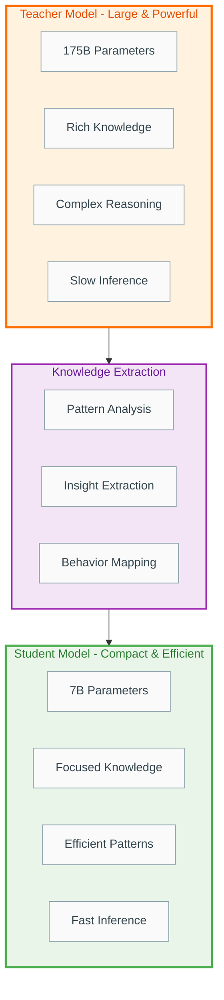

# 10_Advanced-Training-Techniques: Efficient Optimization and Reasoning Patterns

**Learning Level**: Advanced  
**Prerequisites**: Basic transformer training, fine-tuning fundamentals, optimization concepts  
**Estimated Time**: 90-120 minutes  
**Last Updated**: September 5, 2025

---

## 🎯 Learning Objectives

By completing this module, you will:

- **Master parameter-efficient fine-tuning** techniques that reduce computational costs by 90%
- **Understand knowledge transfer mechanisms** that enable small models to match large model performance
- **Implement reasoning enhancement patterns** that improve model logical thinking capabilities
- **Design training strategies** that balance efficiency, performance, and specialized capabilities

---

## 🧠 The Efficiency Revolution in Model Training

### The Resource Challenge

Training large language models presents significant challenges:

```text
Traditional Full Fine-Tuning Problems:

💰 Cost: $50,000+ for 7B parameter model fine-tuning
⏰ Time: 2-4 weeks on enterprise hardware
🔋 Energy: Equivalent to 100+ homes' monthly electricity usage
💾 Storage: Multiple 14GB+ model checkpoints per experiment
🎯 Specialization: Often leads to catastrophic forgetting
```

### The Surgical Approach

**Core Insight**: Instead of retraining everything, modify only the essential components.

**Medical Analogy**: Rather than replacing an entire engine, adjust specific valves and sensors for optimal performance.

---

## 🎛️ Parameter-Efficient Fine-Tuning (PEFT) Techniques

### 1. Low-Rank Adaptation (LoRA): The Smart Shortcut

**Fundamental Concept**: Most neural network changes during fine-tuning happen in low-dimensional subspaces.

#### The Mathematics Made Simple

Think of model weights as a complex symphony orchestra where only a few instruments need adjustment:

```text
Orchestra Analogy:

Original Performance (Base Model):
🎻 Violins    🎺 Trumpets    🥁 Drums    🎹 Piano
  (Good)       (Good)       (Good)      (Good)

Fine-Tuning Needed:
🎻 Violins    🎺 Trumpets    🥁 Drums    🎹 Piano
(Needs small  (Perfect!)   (Perfect!)  (Small tweak
 adjustment)                           needed)

LoRA Solution: Adjust only violins and piano with auxiliary musicians
```

#### Practical LoRA Implementation Strategy

#### Step 1: Identify Adaptation Points

```text
Transformer Layer Components:

Query Projection:    [Apply LoRA] ← Key learning target
Key Projection:      [Apply LoRA] ← Key learning target  
Value Projection:    [Apply LoRA] ← Key learning target
Output Projection:   [Apply LoRA] ← Key learning target
Feed-Forward Layer:  [Optional LoRA]
Layer Normalization: [Keep Frozen] ← Minimal benefit
```

#### Step 2: Configure Low-Rank Parameters

```text
LoRA Configuration Example:

Original Weight Matrix: [4096 × 4096] = 16.7M parameters
LoRA Decomposition:
  - Matrix A: [4096 × 16] = 65K parameters  
  - Matrix B: [16 × 4096] = 65K parameters
  - Total LoRA: 130K parameters (0.8% of original!)

Memory Savings: 99.2% reduction in trainable parameters
Training Speed: 3-5x faster convergence
Quality: 95-98% of full fine-tuning performance
```

### 2. Adapter Layers: The Modular Enhancement

**Design Philosophy**: Add small, specialized modules that can be activated or deactivated.

#### Adapter Architecture Pattern

```text
Transformer Block with Adapters:

Input
  ↓
Multi-Head Attention ──→ [Adapter Module] ──→ Add & Norm
  ↓                        (2-8% of layer size)
Feed-Forward Network ──→ [Adapter Module] ──→ Add & Norm  
  ↓                        (2-8% of layer size)
Output

Benefits:
✅ Task-specific behavior without base model modification
✅ Multiple adapters can coexist for different capabilities
✅ Easy to share, combine, or remove specific adaptations
```

#### Practical Adapter Strategies

**Domain Adapters**: Specialized knowledge modules

```text
Example: Legal Document Analysis System

Base Model: General language understanding
  ↓
Legal Terminology Adapter: Contract language patterns
  ↓  
Citation Format Adapter: Legal reference structures
  ↓
Risk Analysis Adapter: Liability and compliance patterns

Result: Specialized legal AI without full model retraining
```

### 3. Prefix and Prompt Tuning: The Context Controllers

**Core Idea**: Instead of changing the model, change how we present information to it.

#### Prefix Tuning Mechanics

Think of prefix tuning as giving the model a specialized "briefing document" before each task:

```text
Traditional Approach:
User Input: "Summarize this legal contract"
Model: [Attempts summarization with general knowledge]

Prefix Tuning Approach:
Legal Prefix: [Specialized legal analysis context vectors]
User Input: "Summarize this legal contract"  
Model: [Processes with legal domain context activated]

Technical Implementation:
- Add learnable prefix tokens to input sequence
- Prefix contains 20-100 specialized context vectors
- Model learns optimal prefix patterns during training
```

#### Prompt Tuning for Specific Tasks

```text
Prompt Tuning Strategy:

Soft Prompts (Learned Tokens):
[LEGAL_ANALYSIS_MODE] [CONTRACT_SUMMARIZATION] [USER_INPUT]
     ↑                        ↑                    ↑
  Learned vectors       Learned vectors      Actual text

Training Process:
1. Initialize random prompt tokens
2. Feed examples with task-specific prompts
3. Update only prompt embeddings, freeze model
4. Result: Task-specific "activation codes"
```

---

## 🧪 Knowledge Distillation: Training Smart Students

### The Teacher-Student Learning Framework

**Educational Parallel**: A master chef training apprentices by demonstrating techniques rather than just sharing recipes.

#### Distillation Process Architecture



```text
Knowledge Transfer Pipeline:

┌─────────────────────┐
│    Teacher Model    │ ← Large, powerful, expensive
│   (175B parameters) │
│  • Rich knowledge  │
│  • Complex reasoning│
│  • Slow inference  │
└─────────────────────┘
           ↓ Distillation Process
    ┌─────────────┐
    │  Knowledge  │ ← Extracted insights and patterns
    │ Extraction  │
    └─────────────┘
           ↓
┌─────────────────────┐
│   Student Model     │ ← Compact, efficient, fast
│   (7B parameters)   │
│ • Focused knowledge│
│ • Efficient patterns│
│ • Fast inference   │
└─────────────────────┘
```

#### Multi-Level Knowledge Transfer

**1. Output-Level Distillation** (Basic Approach)

```text
Process:
Teacher generates responses → Student learns to mimic outputs

Example: Customer Service Training
Teacher (Large Model): 
  Input: "My order is late, I want a refund"
  Output: "I understand your frustration. Let me check your order 
          status and provide options including a full refund..."

Student (Small Model): 
  Learns to generate similar helpful, empathetic responses
```

**2. Feature-Level Distillation** (Advanced Approach)

```text
Process:
Teacher internal representations → Student learns hidden patterns

Benefits:
- Student learns "how to think" not just "what to say"
- Better generalization to unseen scenarios  
- More robust performance across diverse inputs
```

**3. Attention-Based Distillation** (Sophisticated Approach)

```text
Teacher Attention Patterns: "What information is most important?"
Student Learning: "How to focus on the right details"

Example: Document Analysis
Teacher: Focuses on key financial metrics, dates, and legal clauses
Student: Learns same attention patterns for efficient analysis
```

### Specialized Distillation Strategies

#### Progressive Distillation

```mermaid
flowchart TD
    subgraph Stage1 [Stage 1: Foundation Knowledge]
        T1[Teacher Model<br/>175B Parameters<br/>🧠 Full Capability]
        direction TB
        T1 --> I1[Intermediate Student<br/>30B Parameters<br/>📚 Core Learning]
    end
    
    subgraph Stage2 [Stage 2: Specialized Knowledge]
        I2[Intermediate Model<br/>30B Parameters<br/>🎯 Focused Skills]
        direction TB  
        I2 --> S1[Final Student<br/>7B Parameters<br/>⚡ Efficient Expert]
    end
    
    subgraph Stage3 [Stage 3: Performance Optimization]
        S2[Final Student<br/>7B Parameters<br/>🔧 Raw Performance]
        direction TB
        S2 --> S3[Optimized Student<br/>7B Parameters<br/>🚀 Production Ready]
    end
    
    I1 --> I2
    S1 --> S2
    
    classDef teacherStyle fill:#ffebee,stroke:#d32f2f,stroke-width:3px,color:#c62828
    classDef intermediateStyle fill:#fff3e0,stroke:#f57c00,stroke-width:2px,color:#ef6c00  
    classDef studentStyle fill:#e8f5e8,stroke:#388e3c,stroke-width:2px,color:#2e7d32
    classDef optimizedStyle fill:#e3f2fd,stroke:#1976d2,stroke-width:3px,color:#1565c0
    classDef stageStyle fill:#f8f9fa,stroke:#6c757d,stroke-width:1px,color:#495057
    
    class T1 teacherStyle
    class I1,I2 intermediateStyle
    class S1,S2 studentStyle
    class S3 optimizedStyle
    class Stage1,Stage2,Stage3 stageStyle
```



```text
Multi-Stage Learning:

Stage 1: Foundation Knowledge
Teacher (175B) → Intermediate Student (30B)
Focus: Basic language understanding and reasoning

Stage 2: Specialized Knowledge  
Intermediate (30B) → Final Student (7B)
Focus: Task-specific patterns and efficiency

Stage 3: Performance Optimization
Final Student → Optimized Student (same size)
Focus: Speed and memory efficiency

Result: Maximum knowledge retention with minimum resources
```

---

## 🤔 Reasoning Enhancement Patterns

### The Chain-of-Thought Revolution

**Problem**: Traditional models often jump to conclusions without showing their work.

**Solution**: Train models to externalize their reasoning process.

#### Reasoning Pattern Training

#### Step-by-Step Problem Solving

```text
Traditional Response:
Question: "If a train leaves Boston at 2 PM traveling 60 mph, and another 
         leaves New York at 3 PM traveling 80 mph, when do they meet?"
Answer: "4:30 PM"

Reasoning-Enhanced Response:
Question: [Same as above]
Reasoning: "Let me work through this step by step:
1. Distance between Boston and NYC: approximately 200 miles
2. Train 1: leaves at 2 PM, speed 60 mph
3. Train 2: leaves at 3 PM, speed 80 mph  
4. By 3 PM, Train 1 has traveled 60 miles
5. Remaining distance: 140 miles
6. Combined approach speed: 60 + 80 = 140 mph
7. Time to meet: 140 miles ÷ 140 mph = 1 hour
8. Meeting time: 3 PM + 1 hour = 4 PM"
Answer: "4:00 PM"
```

#### Self-Consistency Training

**Core Principle**: Generate multiple reasoning paths and verify consistency.

```text
Multi-Path Reasoning:

Problem: Complex reasoning task
  ↓
Path 1: Algebraic approach
Path 2: Geometric approach  
Path 3: Logical deduction
  ↓
Consistency Check: Do all paths lead to same conclusion?
  ↓
Final Answer: Most consistent result

Training Strategy:
- Reward models for diverse, consistent reasoning
- Penalize contradictory or incomplete reasoning
- Build robustness through multiple verification
```

### Advanced Reasoning Architectures

#### Tree-of-Thought Processing

```mermaid
graph TD
    P[🧩 Complex Problem]
    
    subgraph Linear [Traditional Linear Thinking]
        P1[Problem] --> S1[Step 1] --> S2[Step 2] --> S3[Step 3] --> A1[Single Answer]
    end
    
    subgraph Tree [Tree-of-Thought Approach]
        P2[🧩 Problem]
        
        P2 --> O1[Option 1A<br/>🔍 Algebraic]
        P2 --> O2[Option 1B<br/>📐 Geometric] 
        P2 --> O3[Option 1C<br/>💭 Logical]
        
        O1 --> S1A[Step 2A1]
        O1 --> S1B[Step 2A2]
        O2 --> S2A[Step 2B1] 
        O2 --> S2B[Step 2B2]
        O3 --> S3A[Step 2C1]
        O3 --> S3B[Step 2C2]
        
        S1A --> E1[Evaluate Path]
        S1B --> E2[Evaluate Path]
        S2A --> E3[Evaluate Path]
        S2B --> E4[Evaluate Path]
        S3A --> E5[Evaluate Path]
        S3B --> E6[Evaluate Path]
        
        E1 --> OPT[🎯 Optimal Solution]
        E2 --> OPT
        E3 --> OPT
        E4 --> OPT
        E5 --> OPT
        E6 --> OPT
    end
    
    classDef problemStyle fill:#fff3e0,stroke:#ff8f00,stroke-width:3px,color:#e65100
    classDef optionStyle fill:#e8f5e8,stroke:#4caf50,stroke-width:2px,color:#2e7d32
    classDef stepStyle fill:#e3f2fd,stroke:#2196f3,stroke-width:1px,color:#1565c0
    classDef evalStyle fill:#f3e5f5,stroke:#9c27b0,stroke-width:1px,color:#6a1b9a
    classDef resultStyle fill:#ffebee,stroke:#f44336,stroke-width:3px,color:#c62828
    classDef linearStyle fill:#f5f5f5,stroke:#9e9e9e,stroke-width:1px,color:#616161
    
    class P,P1,P2 problemStyle
    class O1,O2,O3 optionStyle
    class S1A,S1B,S2A,S2B,S3A,S3B,S1,S2,S3 stepStyle
    class E1,E2,E3,E4,E5,E6 evalStyle
    class OPT,A1 resultStyle
    class Linear linearStyle
```



```text
Traditional Linear Thinking:
Problem → Step 1 → Step 2 → Step 3 → Answer

Tree-of-Thought Approach:
Problem → Multiple possible Step 1 options
   ↓         ↓              ↓
        Each option branches into multiple Step 2 possibilities
           ↓               ↓               ↓
      Evaluate all paths and select optimal reasoning chain

Benefits:
- Explores multiple solution strategies
- Recovers from reasoning errors
- Finds optimal solutions through exploration
```

#### Verification and Critique Training

```mermaid
flowchart LR
    subgraph Cycle [Self-Improvement Cycle]
        IR[🎯 Initial Response<br/>First attempt solution]
        SC[🔍 Self-Critique<br/>Identify weaknesses]
        ImR[✨ Improved Response<br/>Enhanced solution]
        PE[📊 Performance Evaluation<br/>Quality assessment]
        QC[✅ Quality Check<br/>Verification process]
        FL[🔄 Feedback Loop<br/>Learning integration]
        
        IR --> SC
        SC --> ImR
        ImR --> QC
        QC --> PE
        PE --> FL
        FL --> IR
    end
    
    subgraph Components [Training Components]
        C1[1️⃣ Solution Generation<br/>Create initial answer]
        C2[2️⃣ Error Detection<br/>Identify potential problems]
        C3[3️⃣ Solution Refinement<br/>Improve based on critique]
        C4[4️⃣ Verification<br/>Confirm improved quality]
    end
    
    classDef responseStyle fill:#e8f5e8,stroke:#4caf50,stroke-width:2px,color:#2e7d32
    classDef critiqueStyle fill:#fff3e0,stroke:#ff9800,stroke-width:2px,color:#f57c00
    classDef evaluationStyle fill:#e3f2fd,stroke:#2196f3,stroke-width:2px,color:#1976d2
    classDef improvementStyle fill:#f3e5f5,stroke:#9c27b0,stroke-width:2px,color:#7b1fa2
    classDef componentStyle fill:#fafafa,stroke:#607d8b,stroke-width:1px,color:#455a64
    
    class IR,ImR responseStyle
    class SC,PE critiqueStyle
    class QC,FL evaluationStyle
    class Components improvementStyle
    class C1,C2,C3,C4 componentStyle
```



```text
Self-Improvement Cycle:

Initial Response → Self-Critique → Improved Response
      ↑                               ↓
   Feedback Loop ← Performance Evaluation ← Quality Check

Training Components:
1. Solution Generation: Create initial answer
2. Error Detection: Identify potential problems
3. Solution Refinement: Improve based on critique
4. Verification: Confirm improved quality
```

---

## 🎯 Practical Implementation Strategies

### Choosing the Right Technique

#### Decision Framework

```text
Use LoRA When:
✅ Limited compute budget (< $5,000)
✅ Need quick experimentation cycles
✅ Working with standard transformer architectures
✅ Want to maintain base model capabilities

Use Adapters When:
✅ Need multiple specialized capabilities
✅ Want to enable/disable features dynamically
✅ Planning to share modules across models
✅ Building modular AI systems

Use Knowledge Distillation When:
✅ Need production deployment efficiency
✅ Have access to large teacher models
✅ Quality is more important than training time
✅ Want to compress specific expertise

Use Reasoning Enhancement When:
✅ Tasks require complex problem-solving
✅ Transparency and explainability matter
✅ Working with multi-step reasoning problems
✅ Need reliable and verifiable outputs
```

### Resource Planning Guidelines

#### Computational Requirements

```text
Training Technique Comparison:

Full Fine-Tuning:
- GPU Memory: 40-80GB per model
- Training Time: 2-4 weeks
- Cost: $50,000-200,000
- Quality: 100% baseline

LoRA (Rank 16):
- GPU Memory: 8-16GB per model  
- Training Time: 2-5 days
- Cost: $500-2,000
- Quality: 95-98% of baseline

Adapter Tuning:
- GPU Memory: 12-24GB per model
- Training Time: 3-7 days  
- Cost: $1,000-5,000
- Quality: 90-95% of baseline

Knowledge Distillation:
- GPU Memory: 20-40GB (teacher + student)
- Training Time: 1-2 weeks
- Cost: $10,000-30,000
- Quality: 85-95% with 10x efficiency
```

---

## 🔗 Integration with Model Development Pipeline

### End-to-End Training Strategy

#### Phase 1: Foundation Preparation

```text
Week 1-2: Base Model Selection and Evaluation
- Choose appropriate foundation model size
- Establish baseline performance metrics
- Prepare training infrastructure and data pipelines
```

#### Phase 2: Efficient Adaptation

```text
Week 3-4: Parameter-Efficient Training
- Implement LoRA or adapter-based fine-tuning
- Optimize hyperparameters for target domain
- Monitor training stability and convergence
```

#### Phase 3: Knowledge Optimization

```text
Week 5-6: Distillation and Compression  
- Train student models from teacher outputs
- Implement reasoning enhancement patterns
- Validate performance on held-out test sets
```

#### Phase 4: Production Preparation

```text
Week 7-8: Deployment Optimization
- Quantization and inference optimization
- A/B testing against baseline models
- Integration with production systems
```

---

## 🔍 Common Pitfalls and Solutions

### Training Stability Issues

**Problem**: LoRA training becomes unstable with high learning rates

**Solution**: Progressive learning rate scheduling

```text
Learning Rate Strategy:

Phase 1 (20% of training): Very low LR (1e-6)
  - Gentle adaptation to prevent catastrophic changes
  
Phase 2 (60% of training): Optimal LR (1e-4 to 5e-4)  
  - Active learning and adaptation
  
Phase 3 (20% of training): Decay LR (1e-5)
  - Fine-tuning and stabilization
```

### Knowledge Distillation Failures

**Problem**: Student model fails to learn teacher capabilities

**Root Causes and Solutions**:

```text
Cause 1: Temperature mismatch in distillation
Solution: Progressive temperature annealing (start high, decrease)

Cause 2: Insufficient training data diversity  
Solution: Augment with synthetic examples from teacher

Cause 3: Student model too small for teacher knowledge
Solution: Use progressive distillation through intermediate models

Cause 4: Poor feature alignment between teacher and student
Solution: Add feature matching losses at multiple layers
```

---

## 🚀 Future Directions and Research Trends

### Emerging Techniques

**1. Dynamic Adaptation**: Models that adjust their own adaptation strategies

**2. Multi-Modal Efficiency**: Extending PEFT to vision-language models

**3. Continual Learning**: Preventing catastrophic forgetting across multiple tasks

**4. Automated Architecture Search**: AI-designed efficient training methods

---

## 🔗 Related Topics

**Prerequisites:**

- `04_Training-and-Fine-Tuning.md` - Basic training concepts
- `03_Transformer-Deep-Dive.md` - Architecture understanding
- `09_Neural-Learning-Mechanics.md` - Learning fundamentals

**Builds Upon:**

- `01_LLM-Fundamentals.md` - Foundation model concepts
- `02_Framework-Fundamentals-101.md` - Implementation tools

**Enables:**

- `06_LLM-Limitations-and-Challenges.md` - Understanding constraints
- `07_LLM-to-Agent-Bridge.md` - Building advanced systems

**Cross-References:**

- `01_AI/12_Small-Language-Models-SLMs.md` - Efficiency strategies
- `06_MCP-Servers/` - Deployment considerations

---

## 🎓 Practical Exercises

### Exercise 1: LoRA Implementation Analysis

Compare training efficiency between full fine-tuning and LoRA on a 1B parameter model

### Exercise 2: Knowledge Distillation Pipeline

Design a teacher-student setup for domain-specific expertise transfer

### Exercise 3: Reasoning Pattern Training

Implement chain-of-thought training for mathematical problem solving

---

**STSA Metadata:**

- **Domain**: AI & ML → Large Language Models → Advanced Training
- **Difficulty**: Advanced
- **Type**: Technical Deep-Dive
- **Format**: Theory + Implementation Guidance
