# LLM to Agent Bridge - From Foundation to Autonomy

**Learning Level**: Advanced  
**Prerequisites**: LLM fundamentals, understanding of scale vs. cleverness paradigm  
**Estimated Time**: 2-3 hours  

---

## 🎯 Learning Objectives

By completing this module, you will:

- **Connect LLM capabilities** to agent development requirements
- **Understand the limitations** that drive the need for agentic systems
- **Design the bridge** from language models to autonomous agents
- **Prepare for agent development** with solid foundational understanding

---

## 🌉 **The Critical Bridge: From Language Model to Autonomous Agent**

### **What LLMs Excel At vs. What Agents Need**

```mermaid
graph TD
    subgraph "🗣️ LLM Strengths"
        LANG[📝 Language Understanding<br/>Comprehend natural language]
        REASON[🤔 Reasoning Capability<br/>Logical thinking and planning]
        KNOW[🧠 Knowledge Synthesis<br/>Vast information integration]
        GEN[✍️ Text Generation<br/>Coherent communication]
    end
    
    subgraph "🤖 Agent Requirements"
        GOAL[🎯 Goal Persistence<br/>Long-term objective pursuit]
        TOOL[🛠️ Tool Integration<br/>Interact with external world]
        MEM[💭 Memory Management<br/>Learn from experience]
        AUTO[⚡ Autonomous Operation<br/>Independent decision-making]
    end
    
    subgraph "🌉 The Bridge"
        ARCH[🏗️ Agent Architecture<br/>Orchestrating LLM + Extensions]
        PLAN[📋 Planning Systems<br/>Breaking down complex goals]
        PERSIST[💾 Persistence Layer<br/>Memory and state management]
        INTER[🔌 Interface Layer<br/>Tool and environment connection]
    end
    
    LANG --> ARCH
    REASON --> PLAN
    KNOW --> PERSIST
    GEN --> INTER
    
    ARCH --> GOAL
    PLAN --> TOOL
    PERSIST --> MEM
    INTER --> AUTO
    
    classDef llm fill:#e3f2fd,stroke:#1976d2,stroke-width:2px
    classDef agent fill:#ffebee,stroke:#c62828,stroke-width:2px
    classDef bridge fill:#f3e5f5,stroke:#7b1fa2,stroke-width:3px
    
    class LANG,REASON,KNOW,GEN llm
    class GOAL,TOOL,MEM,AUTO agent
    class ARCH,PLAN,PERSIST,INTER bridge
```



---

## 🔍 **LLM Limitations That Drive Agent Development**

### **Understanding the Gaps**

1. **🕐 Temporal Limitations**
   - **LLM**: Single conversation context, no persistence
   - **Agent Need**: Long-term memory and goal pursuit

2. **🌍 Environmental Isolation**
   - **LLM**: Text-in, text-out only
   - **Agent Need**: Interact with real-world systems and tools

3. **🎯 Goal Limitations**
   - **LLM**: Responds to prompts, no intrinsic objectives
   - **Agent Need**: Autonomous goal pursuit and planning

4. **🔄 Action Limitations**
   - **LLM**: Can suggest actions but cannot execute them
   - **Agent Need**: Direct action in environment

### **The Enhancement Formula**

```mermaid
graph LR
    subgraph "🧮 Core Enhancement Equation"
        LLM[🗣️ Large Language Model<br/>Foundation Intelligence]
        PLUS1[➕]
        PLAN[📋 Planning System<br/>Goal decomposition]
        PLUS2[➕]
        MEM[💭 Memory System<br/>Experience persistence]
        PLUS3[➕]
        TOOLS[🛠️ Tool Integration<br/>World interaction]
        EQUALS[🟰]
        AGENT[🤖 Autonomous Agent<br/>Goal-oriented system]
    end
    
    LLM --> PLUS1 --> PLAN --> PLUS2 --> MEM --> PLUS3 --> TOOLS --> EQUALS --> AGENT
    
    classDef component fill:#e8f5e8,stroke:#388e3c,stroke-width:2px
    classDef operator fill:#fff3e0,stroke:#f57f17,stroke-width:2px
    classDef result fill:#ffebee,stroke:#c62828,stroke-width:3px
    
    class LLM,PLAN,MEM,TOOLS component
    class PLUS1,PLUS2,PLUS3,EQUALS operator
    class AGENT result
```



---

## 🏗️ **Agent Architecture Patterns**

### **Building on LLM Foundation**

```mermaid
graph TD
    subgraph "🎯 Agent Architecture Stack"
        USER[👤 User Interface<br/>Goals and feedback]
        CONTROL[🎮 Agent Controller<br/>Orchestration logic]
        LLM_CORE[🧠 LLM Core<br/>Reasoning engine]
        PLANNING[📋 Planning Module<br/>Goal decomposition]
        MEMORY[💾 Memory System<br/>Context and experience]
        TOOLS[🛠️ Tool Interface<br/>External capabilities]
        ENV[🌍 Environment<br/>Real world systems]
    end
    
    USER <--> CONTROL
    CONTROL <--> LLM_CORE
    CONTROL <--> PLANNING
    CONTROL <--> MEMORY
    CONTROL <--> TOOLS
    TOOLS <--> ENV
    
    classDef interface fill:#e3f2fd,stroke:#1976d2,stroke-width:2px
    classDef core fill:#f3e5f5,stroke:#7b1fa2,stroke-width:3px
    classDef module fill:#e8f5e8,stroke:#388e3c,stroke-width:2px
    classDef external fill:#fff3e0,stroke:#f57f17,stroke-width:2px
    
    class USER,CONTROL interface
    class LLM_CORE core
    class PLANNING,MEMORY,TOOLS module
    class ENV external
```



### **🎯 Key Architectural Decisions**

1. **LLM as Reasoning Engine**: Use LLM for planning and decision-making
2. **External Memory**: Persistent storage beyond LLM context window
3. **Tool Abstraction**: Standardized interface for environment interaction
4. **Control Loop**: Orchestrate between reasoning, memory, and action

---

## 🔄 **From Reactive to Proactive**

### **The Fundamental Shift**

```mermaid
graph LR
    subgraph "🔄 Reactive Systems (Traditional LLMs)"
        PROMPT[📝 User Prompt]
        PROCESS[🤔 Process Request]
        RESPOND[💬 Generate Response]
        END1[🏁 Conversation End]
    end
    
    subgraph "🎯 Proactive Systems (Agents)"
        GOAL[🎯 Goal Setting]
        PLAN[📋 Plan Creation]
        ACTION[⚡ Execute Actions]
        MONITOR[👁️ Monitor Progress]
        ADAPT[🔄 Adapt Strategy]
        ACHIEVE[🏆 Goal Achievement]
    end
    
    PROMPT --> PROCESS --> RESPOND --> END1
    
    GOAL --> PLAN --> ACTION --> MONITOR --> ADAPT
    ADAPT --> PLAN
    MONITOR --> ACHIEVE
    
    classDef reactive fill:#e3f2fd,stroke:#1976d2,stroke-width:2px
    classDef proactive fill:#ffebee,stroke:#c62828,stroke-width:2px
    
    class PROMPT,PROCESS,RESPOND,END1 reactive
    class GOAL,PLAN,ACTION,MONITOR,ADAPT,ACHIEVE proactive
```



**Critical Difference**: Agents maintain goals and work toward them over time, while LLMs respond to individual prompts.

---

## 🛠️ **Building the Bridge: Practical Implementation**

### **Phase 1: Enhanced LLM (Basic Agent)**

```python
class BasicAgent:
    def __init__(self, llm_model, goal):
        self.llm = llm_model
        self.goal = goal
        self.memory = []
        self.plan = []
    
    def pursue_goal(self):
        # Use LLM to create plan
        self.plan = self.llm.generate_plan(self.goal)
        
        # Execute plan steps
        for step in self.plan:
            result = self.execute_step(step)
            self.memory.append((step, result))
            
            # Use LLM to assess progress
            if self.llm.is_goal_achieved(self.goal, self.memory):
                return "Goal achieved!"
```

### **Phase 2: Tool-Enabled Agent**

```python
class ToolEnabledAgent(BasicAgent):
    def __init__(self, llm_model, goal, available_tools):
        super().__init__(llm_model, goal)
        self.tools = available_tools
    
    def execute_step(self, step):
        # Use LLM to select appropriate tool
        tool_choice = self.llm.select_tool(step, self.tools)
        
        # Execute action with chosen tool
        result = tool_choice.execute(step)
        
        return result
```

### **Phase 3: Memory-Persistent Agent**

```python
class PersistentAgent(ToolEnabledAgent):
    def __init__(self, llm_model, goal, tools, memory_system):
        super().__init__(llm_model, goal, tools)
        self.long_term_memory = memory_system
    
    def learn_from_experience(self, experience):
        # Store experience for future use
        self.long_term_memory.store(experience)
        
        # Use LLM to extract patterns
        patterns = self.llm.identify_patterns(
            self.long_term_memory.retrieve_similar(experience)
        )
        
        return patterns
```

---

## 🎓 **Design Patterns for LLM-Agent Bridge**

### **1. The Orchestrator Pattern**

- **LLM Role**: Central reasoning and planning engine
- **Agent Role**: Orchestrate between LLM, memory, and tools
- **Use Case**: Complex multi-step tasks requiring coordination

### **2. The Advisor Pattern**

- **LLM Role**: Provide advice and suggestions
- **Agent Role**: Make final decisions and execute actions
- **Use Case**: Human-in-the-loop scenarios with agent assistance

### **3. The Specialist Pattern**

- **LLM Role**: Domain-specific reasoning and knowledge
- **Agent Role**: Focus on particular problem domains
- **Use Case**: Expert systems in specific fields

---

## 🔗 **Connection to Agent Frameworks**

### **Popular Framework Approaches**

```mermaid
graph TD
    subgraph "🏗️ Framework Categories"
        LANG[🦜 LangChain/LangGraph<br/>Tool orchestration focus]
        CREW[👥 CrewAI<br/>Multi-agent collaboration]
        SEMANTIC[🧠 Semantic Kernel<br/>Microsoft's agent platform]
        CUSTOM[🔧 Custom Implementations<br/>Tailored solutions]
    end
    
    subgraph "🎯 Common Patterns"
        TOOLS_PATTERN[🛠️ Tool Integration]
        MEMORY_PATTERN[💭 Memory Management]
        PLANNING_PATTERN[📋 Planning Systems]
        COLLAB_PATTERN[🤝 Agent Collaboration]
    end
    
    LANG --> TOOLS_PATTERN
    CREW --> COLLAB_PATTERN
    SEMANTIC --> PLANNING_PATTERN
    CUSTOM --> MEMORY_PATTERN
    
    classDef framework fill:#e8f5e8,stroke:#388e3c,stroke-width:2px
    classDef pattern fill:#f3e5f5,stroke:#7b1fa2,stroke-width:2px
    
    class LANG,CREW,SEMANTIC,CUSTOM framework
    class TOOLS_PATTERN,MEMORY_PATTERN,PLANNING_PATTERN,COLLAB_PATTERN pattern
```



---

## 🚀 **The Intelligence Evolution Paradigm: Why Agents Are Inevitable**

### **From Reactive to Proactive Intelligence**

The transition from Large Language Models to AI Agents represents a fundamental shift in how we approach artificial intelligence - moving from **reactive response systems** to **proactive goal-oriented intelligence**.

```mermaid
graph LR
    subgraph "🔄 Intelligence Evolution Timeline"
        REACTIVE[📞 Reactive Phase<br/>LLMs respond to prompts<br/>Stateless interactions]
        BRIDGE[🌉 Transition Phase<br/>Enhanced LLMs with tools<br/>Limited persistence]
        PROACTIVE[🎯 Proactive Phase<br/>Goal-oriented agents<br/>Autonomous operation]
    end
    
    REACTIVE --> BRIDGE --> PROACTIVE
    
    subgraph "⚡ Capability Expansion"
        direction TB
        FOUNDATION[🧠 Foundation Intelligence<br/>Language understanding & reasoning]
        MEMORY[💭 Persistent Memory<br/>Learn and adapt over time]
        TOOLS[🛠️ Tool Mastery<br/>Interact with real systems]
        AUTONOMY[🎯 Goal Autonomy<br/>Independent decision-making]
        
        FOUNDATION --> MEMORY --> TOOLS --> AUTONOMY
    end
    
    classDef phase fill:#e3f2fd,stroke:#1976d2,stroke-width:2px
    classDef capability fill:#f3e5f5,stroke:#7b1fa2,stroke-width:2px
    classDef highlight fill:#ffebee,stroke:#c62828,stroke-width:3px
    
    class REACTIVE,BRIDGE phase
    class PROACTIVE highlight
    class FOUNDATION,MEMORY,TOOLS,AUTONOMY capability
```



### **The Fundamental Advantages: Why Agents Outperform Standard LLMs**

#### **1. 🧠 Adaptive Intelligence Through Memory**

**Standard LLM Limitation:**

```text
User: "Remember our discussion about the marketing strategy from last week"
LLM: "I don't have access to previous conversations..."
```

**Agent Enhancement:**

```text
User: "How's our marketing strategy progressing?"
Agent: "Based on our discussion from September 1st, I've monitored the metrics 
        we defined. Conversion rates increased 15% after implementing 
        the A/B testing approach we planned. Should we scale the 
        winning variant?"
```

**Technical Foundation:**

- **Episodic Memory**: Stores specific interactions and outcomes
- **Semantic Memory**: Builds knowledge from accumulated experiences  
- **Working Memory**: Maintains context across extended task sequences
- **Meta-Memory**: Learns how to learn more effectively over time

#### **2. 🎯 Sequential Task Mastery**

**Standard LLM Approach:**

- Single-shot responses to individual queries
- No persistence between related tasks
- User must manually coordinate multi-step workflows

**Agent Approach:**

- **Goal Decomposition**: Breaks complex objectives into manageable steps
- **Progress Tracking**: Monitors completion status across task sequence
- **Dynamic Adaptation**: Adjusts plan based on intermediate results
- **Error Recovery**: Handles failures and finds alternative paths

```mermaid
graph TD
    subgraph "🎯 Agent Multi-Step Task Example"
        GOAL[📋 Goal: Analyze Market Trends<br/>and Recommend Strategy]
        
        STEP1[🔍 Step 1: Gather Data<br/>Search industry reports]
        STEP2[📊 Step 2: Analyze Patterns<br/>Process data for insights]
        STEP3[💡 Step 3: Generate Options<br/>Create strategy alternatives]
        STEP4[⚖️ Step 4: Evaluate Trade-offs<br/>Assess risks and benefits]
        STEP5[📝 Step 5: Present Recommendation<br/>Structured proposal with evidence]
        
        MONITOR[👁️ Continuous Monitoring<br/>Track progress and adapt]
        
        GOAL --> STEP1
        STEP1 --> STEP2
        STEP2 --> STEP3
        STEP3 --> STEP4
        STEP4 --> STEP5
        
        MONITOR -.-> STEP1
        MONITOR -.-> STEP2
        MONITOR -.-> STEP3
        MONITOR -.-> STEP4
        MONITOR -.-> STEP5
    end
    
    classDef goal fill:#ffebee,stroke:#c62828,stroke-width:3px
    classDef step fill:#e8f5e8,stroke:#388e3c,stroke-width:2px
    classDef monitor fill:#fff3e0,stroke:#f57f17,stroke-width:2px
    
    class GOAL goal
    class STEP1,STEP2,STEP3,STEP4,STEP5 step
    class MONITOR monitor
```



#### **3. 🌍 Real-World Integration Through Tool Mastery**

**The Tool Advantage:**

- **API Connections**: Live data from external systems
- **Database Queries**: Access to organizational knowledge
- **Service Integration**: Email, calendars, project management tools
- **Environment Interaction**: File systems, cloud services, IoT devices

**Practical Example - Research Agent:**

```python
# Agent can orchestrate multiple tools seamlessly
research_results = agent.execute_research_workflow(
    topic="sustainable energy trends 2025",
    tools=[
        "web_search",      # Get latest articles
        "database_query",  # Internal company data  
        "api_call",        # Industry databases
        "document_analysis", # Process PDF reports
        "synthesis_engine"   # Combine insights
    ]
)
```

#### **4. ⚡ Computational Efficiency Through Specialization**

**The Efficiency Paradigm:**

Unlike monolithic LLMs that process everything through massive general-purpose models, agents can employ **specialized, smaller models** for specific tasks while maintaining overall capability.

```mermaid
graph LR
    subgraph "🏭 Monolithic LLM Approach"
        BIG[🐘 Large Unified Model<br/>175B+ parameters<br/>High computational cost<br/>General purpose processing]
    end
    
    subgraph "🎯 Specialized Agent Approach" 
        COORD[🎮 Coordinator<br/>7B parameters<br/>Planning & orchestration]
        TOOL1[🔧 Tool Specialist<br/>1.3B parameters<br/>API interactions]
        TOOL2[📊 Analysis Specialist<br/>3B parameters<br/>Data processing]
        TOOL3[✍️ Communication Specialist<br/>7B parameters<br/>Response generation]
        
        COORD --> TOOL1
        COORD --> TOOL2  
        COORD --> TOOL3
    end
    
    classDef monolithic fill:#ffcdd2,stroke:#d32f2f,stroke-width:2px
    classDef efficient fill:#c8e6c9,stroke:#388e3c,stroke-width:2px
    
    class BIG monolithic
    class COORD,TOOL1,TOOL2,TOOL3 efficient
```



**Benefits of the Specialized Approach:**

- **Reduced Inference Cost**: Smaller models for specific tasks
- **Faster Response Times**: Optimized models for particular functions
- **Better Accuracy**: Task-specific fine-tuning improves performance
- **Scalable Architecture**: Add specialists without rebuilding everything

### **The Decision-Making Revolution**

#### **Independent Cognitive Operations**

Agents represent a shift from **consultation tools** to **cognitive partners** that can:

- **Evaluate Context**: Understand situational nuances and constraints
- **Apply Accumulated Knowledge**: Build on past experiences and outcomes
- **Navigate Trade-offs**: Balance competing objectives and limitations
- **Make Autonomous Decisions**: Act without constant human oversight

**Example Decision Framework:**

```python
class AutonomousDecision:
    def evaluate_options(self, context, constraints, goals):
        # Analyze current situation
        situation_assessment = self.assess_context(context)
        
        # Apply learned patterns
        relevant_experiences = self.memory.find_similar_cases(situation_assessment)
        
        # Generate options considering constraints
        viable_options = self.generate_options(goals, constraints)
        
        # Predict outcomes based on experience
        outcome_predictions = self.predict_results(viable_options, relevant_experiences)
        
        # Select optimal approach
        return self.optimize_selection(outcome_predictions, goals)
```

### **From Passive Tools to Active Participants**

**The Fundamental Shift:**

| **Standard LLM** | **→** | **AI Agent** |
|------------------|-------|---------------|
| 📞 **Reactive**: Waits for prompts | **→** | 🎯 **Proactive**: Pursues objectives |
| 🔄 **Stateless**: No memory between interactions | **→** | 💭 **Stateful**: Learns and adapts continuously |
| 💬 **Conversational**: Text-based dialogue only | **→** | 🛠️ **Operational**: Takes real-world actions |
| 🎪 **Performance**: Demonstrates knowledge | **→** | 🏆 **Achievement**: Accomplishes goals |
| 👤 **Assistant**: Supports human decisions | **→** | 🤝 **Collaborator**: Independent contribution |

This evolution represents the transition from artificial intelligence as a **sophisticated search and synthesis tool** to artificial intelligence as an **autonomous cognitive agent** capable of independent reasoning, learning, and action in complex environments.

---

## 🎯 **Preparing for Agent Development**

### **Essential Understanding Checklist**

- [ ] **LLM Capabilities**: What language models can and cannot do
- [ ] **Agent Requirements**: What additional capabilities agents need
- [ ] **Bridge Architecture**: How to combine LLMs with agent features
- [ ] **Design Patterns**: Common approaches to agent implementation

### **Practical Skills to Develop**

- [ ] **API Integration**: Working with LLM APIs (OpenAI, Claude, etc.)
- [ ] **Tool Design**: Creating interfaces for agent-environment interaction
- [ ] **Memory Systems**: Implementing persistence beyond context windows
- [ ] **Planning Logic**: Breaking down goals into actionable steps

---

## 🚀 **Next Steps: Agent Development Track**

### **Ready for Advanced Topics**

1. **[07_AI-Agents/03_AI-Agent-Fundamentals.md](../07_AI-Agents/03_AI-Agent-Fundamentals.md)** - Core agent concepts
2. **[07_AI-Agents/04_Agent-Architectures-Patterns.md](../07_AI-Agents/04_Agent-Architectures-Patterns.md)** - Design patterns
3. **[07_AI-Agents/05_Agent-Development-Fundamentals.md](../07_AI-Agents/05_Agent-Development-Fundamentals.md)** - Hands-on implementation

### **Foundational Understanding Achieved**

With LLM fundamentals and this bridge understanding, you're now prepared to:

- **Design effective agent architectures**
- **Choose appropriate frameworks and tools**
- **Understand the role of LLMs in agent systems**
- **Build autonomous AI systems with confidence**

---

*🎯 **Critical Success**: You now understand how LLMs serve as the foundation for autonomous agents, and how additional capabilities transform language models into goal-oriented systems.*
