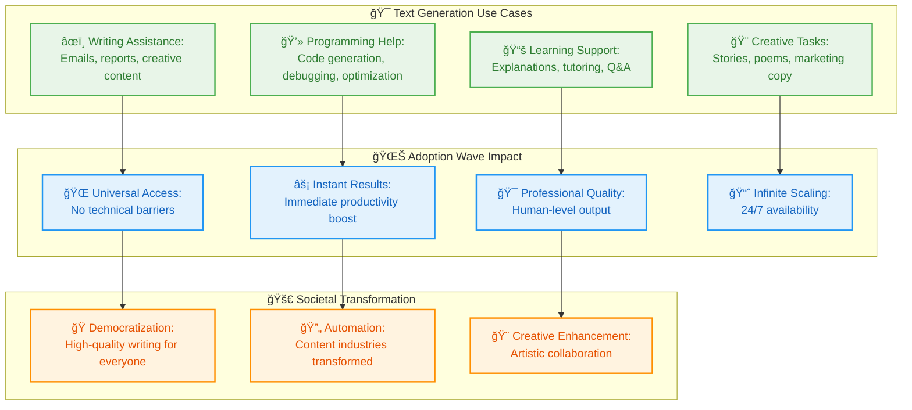
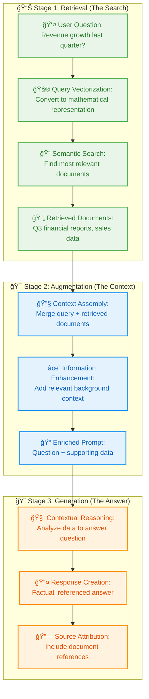
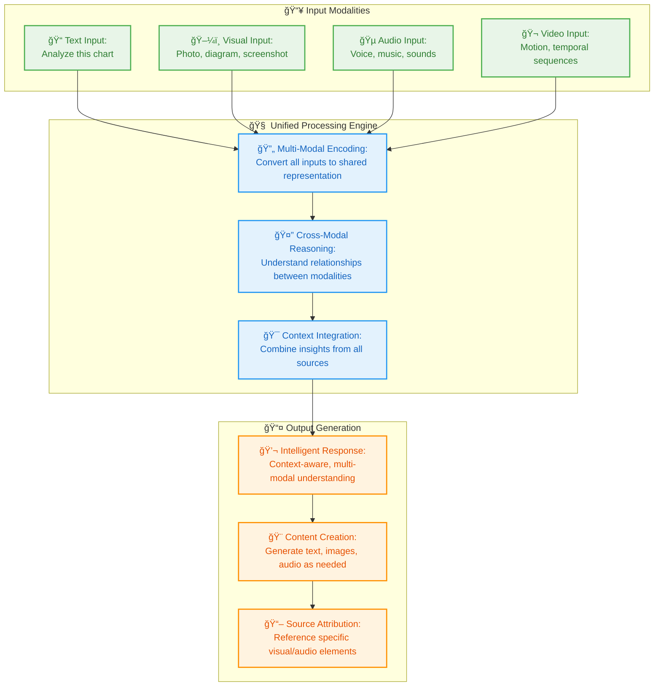
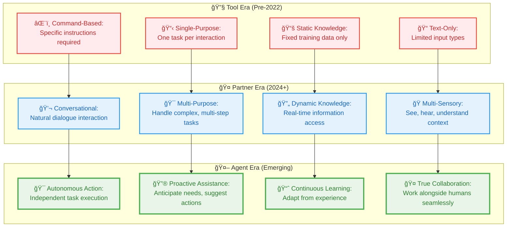

# 13_The-Journey-to-AI-Agents

**Learning Level**: Intermediate  
**Prerequisites**: Foundation Models understanding, LLM capabilities  
**Estimated Time**: 50 minutes  

---

## 🯠Learning Objectives

By the end of this module, you will:

- **Trace the evolutionary path** from simple text generation to intelligent agent systems
- **Understand text generation** as the foundational capability that launched the AI revolution
- **Master Retrieval-Augmented Generation (RAG)** for connecting models to real-world data
- **Grasp multimodal capabilities** that enable AI to perceive and interact like humans
- **Recognize the progression** that makes modern AI agents possible

---

## 🌱 The Genesis: Text Generation Revolution

### **From Command Lines to Conversations**

Imagine the transformation from using a **telegraph** (sending coded messages) to having a **video call with a fluent translator**. Traditional computing required learning specific commands and syntax. Then suddenly, we could simply talk to machines in natural language and receive thoughtful, human-like responses.

```text
The Communication Evolution:

Traditional Computing Era:
User: SELECT * FROM products WHERE category = 'electronics' AND price < 500;
Computer: [Returns database results]
Limitation: Users must learn specialized commands

AI Text Generation Era:
User: "Show me affordable electronics under $500"
AI: "I'd be happy to help you find electronics under $500! Here are some 
     great options: smartphones, tablets, headphones, and smart watches. 
     Would you like me to focus on any particular category?"
Revolution: Natural conversation replaces technical commands
```

### **The Breakthrough Moment**

Text generation became the **gateway drug to AI adoption** because it solved an immediate, universal need—**communication enhancement**:



**Real-World Impact Examples**:

```text
Professional Writing Revolution:

Marketing Manager (Before AI):
- Draft campaign email: 2 hours
- Research competitor messaging: 4 hours  
- Create multiple variants: 6 hours
- Total: 12 hours for email campaign

Marketing Manager (With AI):
- Prompt: "Create an email campaign for our new eco-friendly water bottle, 
   targeting environmentally conscious millennials"
- AI generates: Subject lines, body copy, call-to-action variations
- Human refines: 30 minutes of editing and personalization
- Total: 1 hour for complete campaign

Productivity Multiplier: 12x improvement!

Student Research (Before AI):
- Literature review: Days of library research
- Note organization: Hours of manual sorting
- Draft writing: Struggling with structure and flow
- Result: Often incomplete or delayed assignments

Student Research (With AI):
- Query: "Explain the causes of the French Revolution for a college essay"
- AI provides: Structured outline, key points, relevant examples
- Student adds: Personal analysis, specific sources, original insights
- Result: Higher quality work completed faster

Quality + Speed = Educational transformation
```

### **The Limitation Discovery**

But like a brilliant librarian who only knows books from 2021, early AI had a **knowledge cutoff problem**:

```text
The Parametric Knowledge Trap:

AI's Built-in Knowledge:
✅ Historical facts up to training date
✅ General scientific principles  
✅ Common cultural knowledge
✅ Programming languages and frameworks

AI's Knowledge Gaps:
⌠Recent events or developments
⌠Your company's internal documents
⌠Personal files and private data  
⌠Real-time information (stock prices, weather)
⌠Specialized domain knowledge not in training data

User Frustration Examples:
"What's the latest news about our competitor's product launch?"
AI: "I don't have access to recent news or real-time information..."

"Analyze our Q3 sales performance"  
AI: "I can't access your company's proprietary data..."

"What did the CEO say in yesterday's meeting?"
AI: "I don't have access to your private communications..."

The Solution Need: Connect AI to YOUR data, not just world knowledge
```

---

## 🔗 The Data Connection: Retrieval-Augmented Generation (RAG)

### **From Isolated Genius to Connected Expert**

RAG transformed AI from an **isolated genius with a great memory** into a **connected expert with access to live information**. Think of it like giving a brilliant researcher the ability to instantly access any library, database, or filing cabinet in your organization.

```text
The Knowledge Connection Analogy:

Traditional LLM (Isolated Expert):
"I know a lot about general topics, but I can only work with information 
 from my training. I'm like a scholar locked in a room with encyclopedia 
 from 2021—very knowledgeable but limited to what's in those books."

RAG-Enhanced LLM (Connected Expert):  
"I retain my analytical abilities, but now I can also search through 
 your documents, databases, and real-time information. I'm like that 
 same scholar, but now with instant access to your entire organization's 
 knowledge plus live internet connectivity."

Transformation:
Static Knowledge → Dynamic Information Access
General Responses → Context-Specific Answers  
Possible Hallucination → Grounded, Verifiable Facts
Generic Advice → Personalized Recommendations
```

### **The RAG Architecture: Three-Stage Intelligence**

RAG operates like a **research assistant with photographic memory and instant search capabilities**:



### **Vector Embeddings: The Semantic GPS System**

Vector embeddings work like a **GPS system for meaning**—converting text into mathematical coordinates that represent conceptual relationships:

```text
The Semantic GPS Analogy:

Physical GPS:
- Converts locations to coordinates (latitude, longitude)
- Similar locations have similar coordinates
- Distance between coordinates = physical distance

Semantic GPS (Embeddings):
- Converts text to vector coordinates [0.2, -0.1, 0.7, ...]
- Similar meanings have similar vector coordinates  
- Distance between vectors = semantic similarity

Example Vector Relationships:
Query: "quarterly revenue performance"
Vector: [0.8, 0.2, -0.1, 0.6, ...]

Document Matches by Similarity:
1. "Q3 2024 Financial Results" → Distance: 0.1 (very close)
2. "Revenue Growth Analysis Q3" → Distance: 0.15 (close)  
3. "Marketing Budget Q3" → Distance: 0.4 (moderately related)
4. "Office Lunch Menu" → Distance: 0.9 (completely unrelated)

Search Result: Returns top 3 most semantically similar documents
```

### **Practical RAG Implementation**

Here's how RAG transforms a typical business scenario:

```text
Business Intelligence RAG Example:

Traditional Approach (Manual Research):
CEO Question: "How did our new product launch impact customer satisfaction?"
Process:
1. Assistant searches through customer survey files
2. Reviews support ticket database  
3. Analyzes social media mentions
4. Compiles quarterly customer feedback reports
5. Creates summary presentation
Time: 2-3 days

RAG-Enhanced Approach (Instant Intelligence):
CEO Question: "How did our new product launch impact customer satisfaction?"

RAG Process:
1. Query vectorized and matched against:
   - Customer survey responses (vectorized)
   - Support tickets with product mentions
   - Social media sentiment analysis  
   - NPS score trends
   - Customer retention data

2. Retrieved context includes:
   "Post-launch NPS increased from 7.2 to 8.4"
   "Support tickets decreased 23% for product category"  
   "92% positive sentiment in customer feedback"
   "Customer retention improved 15% in product segment"

3. AI generates comprehensive response:
   "The product launch significantly improved customer satisfaction:
   - Net Promoter Score increased 17% (7.2→8.4)
   - Support issues decreased 23% indicating better user experience
   - Customer sentiment analysis shows 92% positive feedback
   - Retention rates improved 15% in the product segment
   
   Sources: Q3 Customer Survey (p.12), Support Analytics Dashboard, 
   Social Sentiment Report Q3"

Time: 30 seconds
Quality: Comprehensive, sourced, accurate
```

### **RAG Benefits: The Trust Revolution**

RAG solves the fundamental trust problem in AI by making responses **verifiable and transparent**:

```text
Trust Transformation:

Before RAG (The Black Box Problem):
User: "What's our company policy on remote work?"
AI: "Most companies allow 2-3 days remote work per week..."
User Concern: "Is this our actual policy or just general advice?"
Trust Level: Low (unverifiable, possibly hallucinated)

After RAG (The Transparent Expert):
User: "What's our company policy on remote work?"
AI: "According to your Employee Handbook (Section 4.2, updated March 2024):
     'Employees may work remotely up to 3 days per week with manager 
     approval. Remote work requests must be submitted via HR portal 
     at least 48 hours in advance.'
     
     Additionally, the Q2 All-Hands Meeting Notes indicate this policy 
     will be reviewed again in Q4 2024."
Trust Level: High (sourced, verifiable, specific to organization)

Key Trust Factors:
✅ Specific document references  
✅ Section and page numbers
✅ Update dates and version information
✅ Multiple confirming sources
✅ Clear distinction between policy and interpretation
```

---

## 🭠The Sensory Expansion: Multimodal AI

### **From Text-Only to Full Human Experience**

Multimodal AI represents the evolution from **text-based conversations** to **full sensory interaction**—like upgrading from reading letters to having face-to-face conversations where you can see expressions, hear tone, and share visual references.

```text
The Sensory Evolution:

Human Communication Richness:
ğŸ‘ï¸ Visual: Facial expressions, gestures, diagrams, images
👂 Auditory: Tone, emphasis, music, environmental sounds  
âœï¸ Textual: Words, symbols, written communication
🤠Contextual: Body language, spatial relationships

AI Communication Evolution:
2022: Text-only LLMs
"Tell me about this image" → "I cannot see images"

2024: Multimodal AI  
"Tell me about this image" → [Analyzes visual content]
"The image shows a bustling coffee shop with vintage decor. 
 I can see exposed brick walls, hanging Edison bulbs, and 
 customers working on laptops. The barista appears to be 
 preparing a latte with artistic foam designs."

Impact: AI can now participate in human-like, multi-sensory communication
```

### **The Unified Intelligence Architecture**

Modern multimodal models work like a **universal translator with multiple senses**—they can process any type of input and respond appropriately:



### **Practical Multimodal Applications**

Multimodal AI transforms how we solve real-world problems by **combining different types of information** naturally:

```text
Business Process Revolution:

Traditional Document Analysis:
Task: Analyze quarterly financial presentation
Process:
1. Extract text from PowerPoint slides
2. Manually transcribe chart data
3. Separate analysis of images vs text
4. Struggle to correlate visual and textual information
Time: Hours of manual work

Multimodal AI Analysis:
Task: Analyze quarterly financial presentation  
Process:
Input: "Analyze this quarterly presentation and summarize key insights"
[Upload PowerPoint file]

AI Response:
"This Q3 presentation reveals strong performance across key metrics:

Financial Highlights (from charts on slides 3-5):
- Revenue grew 23% QoQ, significantly above the 15% target shown in your forecast chart
- Profit margins improved from 12% to 18% (visual trend analysis from slide 4)
- Customer acquisition costs decreased 8% (pie chart breakdown, slide 5)

Strategic Insights (from text and imagery):
- The product comparison matrix (slide 7) shows competitive advantages in 3/5 categories
- Geographic expansion visualized in the world map (slide 9) indicates Europe represents 67% of new growth
- Team photos and org chart (slide 12) suggest staffing increased 15% in engineering

Concerns Identified:
- The customer satisfaction graph (slide 8) shows a slight decline trend
- Supply chain diagram (slide 10) highlights potential bottlenecks in Q4

Sources: Integrated analysis of text, charts, diagrams, and visual elements across all slides"

Time: 2 minutes
Quality: Comprehensive, cross-referential, actionable
```

### **The Reasoning Preservation Revolution**

The most significant breakthrough is that multimodal models **maintain their reasoning capabilities** across all input types:

```text
Cross-Modal Reasoning Examples:

Visual Problem-Solving:
Input: [Photo of a messy desk with scattered papers, calculator, coffee stains]
Query: "Help me organize this workspace for better productivity"

AI Analysis:
"I can see several productivity challenges in your workspace:

Immediate Issues:
- Papers scattered without clear organization system
- Coffee stains near electronics (potential hazard)
- Calculator placement suggests frequent number work but hard to access

Organizational Recommendations:
1. Create dedicated zones: Paper filing area (left side), electronics zone (right)
2. Add protective barriers for liquids (coasters, separate beverage area)
3. Position calculator within arm's reach of primary work area
4. Implement paper tray system for 'incoming,' 'working,' and 'completed' items

Reasoning: The scattered layout creates cognitive load and inefficiency. 
Strategic zoning will reduce task-switching time and protect equipment."

Cross-Modal Puzzle Solving:
Input: [Image of a logic puzzle with numbers and symbols]
Query: "Solve this puzzle and explain your reasoning"

AI Response:
"Analyzing the visual pattern, I can see this is a sequence puzzle:

Pattern Recognition:
- Row 1: Numbers increase by 3 (2, 5, 8, ?)
- Row 2: Symbols rotate 90° clockwise (⬆ï¸, â¡ï¸, ⬇ï¸, ?)
- Row 3: Colors follow RGB sequence (Red, Green, Blue, ?)

Solution Logic:
- Missing number: 11 (continuing +3 sequence)
- Missing symbol: â¬…ï¸ (completing 360° rotation)
- Missing color: Yellow (starting new color cycle)

Visual-Logical Integration: The puzzle tests both mathematical progression 
and visual pattern recognition simultaneously."

Capability: AI demonstrates human-like ability to "see" and "think" about visual information
```

---

## 🚀 The Agent Foundation: Connecting the Capabilities

### **The Convergence Point**

These three revolutionary capabilities—**text generation**, **data connection**, and **multimodal perception**—create the perfect foundation for AI agents:

```text
Agent Prerequisites Checklist:

✅ Communication Ability (Text Generation):
   Can engage in natural dialogue with humans
   Understands context and maintains conversation flow
   Generates clear, actionable responses

✅ Knowledge Access (RAG):
   Can retrieve and use real-time information
   Connects to organizational data and systems
   Provides verifiable, sourced responses

✅ Sensory Perception (Multimodal):
   Can see, hear, and understand visual information
   Processes complex, multi-format inputs
   Maintains reasoning across different media types

Agent Capability = Communication + Knowledge + Perception + Action

The Missing Piece: Autonomous action and decision-making
```

### **From Tools to Teammates**

The evolution represents a fundamental shift from **AI as a tool** to **AI as a collaborative partner**:



### **The Road Ahead: Agent Capabilities**

With the foundational capabilities established, AI agents represent the next evolutionary leap:

```text
Agent Development Pipeline:

Current Capabilities (Mastered):
✅ Natural language fluency
✅ Real-time information access
✅ Multi-sensory perception and reasoning
✅ Task-specific fine-tuning
✅ Context maintenance across interactions

Emerging Agent Capabilities:
🔄 Tool Integration: Use external systems and APIs
🯠Goal Decomposition: Break complex objectives into actionable steps
🤔 Decision Making: Choose appropriate actions based on context
🔠Iterative Refinement: Learn from results and adjust approach
🤠Multi-Agent Collaboration: Coordinate with other AI systems

Future Agent Vision:
🌟 Personal Assistant: Manages calendar, tasks, communications proactively
🢠Business Analyst: Conducts research, generates insights, creates reports
🔧 Technical Support: Diagnoses issues, implements solutions, monitors results
🨠Creative Partner: Brainstorms ideas, develops concepts, produces content
📠Learning Companion: Adapts teaching style, tracks progress, suggests improvements

The Foundation is Complete → Agent Development Can Begin
```

---

## 🔗 Related Topics

### **Prerequisites**

- **Builds Upon**: [11_Foundation-Models-and-LLM-Evolution](11_Foundation-Models-and-LLM-Evolution.md) - Understanding foundation model capabilities
- **Requires**: [12_Breakthrough-Innovations-in-GenAI](12_Breakthrough-Innovations-in-GenAI.md) - Latest efficiency and reasoning advances

### **Enables**

- **Next Steps**: [../07_AI-Agents/](../07_AI-Agents/) - Building autonomous AI systems
- **Applications**: [../06_MCP-Servers/](../06_MCP-Servers/) - Tool integration for agents
- **Practice**: RAG implementation and multimodal application development

### **Cross-References**

- **Development Track**: [../../01_Development/](../../01_Development/) - Implementation frameworks for agent systems
- **Data Science**: [../../03_Data-Science/](../../03_Data-Science/) - Data preparation for RAG and multimodal systems
- **AI Strategy**: [../01_AI/](../01_AI/) - Strategic implications of agent capabilities

---

## 🯠Key Takeaways

1. **Text generation democratized AI access** by enabling natural language interaction, removing technical barriers and creating universal adoption

2. **RAG solves the knowledge limitation** by connecting static AI models to dynamic, real-world data sources with verifiable, sourced responses

3. **Multimodal capabilities enable human-like perception** allowing AI to see, hear, and understand context across multiple input types while maintaining reasoning abilities

4. **The convergence of these three capabilities** creates the perfect foundation for autonomous AI agents that can communicate, access information, and perceive the world

5. **Evolution from tools to teammates** represents a fundamental shift toward collaborative AI that can work alongside humans as intelligent partners

6. **Agent development is now possible** because the foundational capabilities—communication, knowledge access, and perception—have been mastered

**Remember**: The journey to AI agents isn't just about technological advancement—it's about creating systems that can truly understand, interact with, and assist humans in natural, intuitive ways. Each milestone builds toward the ultimate goal of autonomous, collaborative AI partners.

---

**Last Updated**: September 5, 2025  
**Next Review**: December 2025  
**Maintained By**: STSA Learning System
