# 11_Foundation-Models-and-LLM-Evolution

**Learning Level**: Beginner to Intermediate  
**Prerequisites**: Basic understanding of machine learning concepts  
**Estimated Time**: 45 minutes  

---

## 🎯 Learning Objectives

By the end of this module, you will:

- **Understand the paradigm shift** from task-specific AI to universal foundation models
- **Grasp how foundation models work** as universal knowledge repositories
- **Recognize LLMs as language specialists** within the foundation model family
- **Comprehend the inference process** and practical deployment considerations
- **Distinguish between private and open-source** LLM ecosystems

---

## 🧩 The Great AI Unification: From Specialists to Generalists

### **The Old Way: AI as a Collection of Tools**

Imagine building a house where every task required a completely different craftsperson with specialized tools. Need to cut wood? Hire a carpenter with saws. Need to lay bricks? Find a mason with trowels. Want electrical work? Call an electrician with specialized testing equipment.

This was the traditional AI landscape—a world of **hyper-specialized systems**:

```text
Email Classification Task:
Raw Emails → Email Preprocessor → Spam Feature Extractor → Binary Classifier → Spam/Not Spam

Named Entity Recognition:
Text Documents → Text Tokenizer → Entity Feature Engineer → NER Model → Person/Place/Organization

Text Summarization:
Long Articles → Content Analyzer → Summary Generator → Length Controller → Short Summary

Problems with this approach:
❌ Each system learned from scratch
❌ No knowledge transfer between tasks  
❌ Expensive to build and maintain
❌ Brittle when data patterns changed
❌ Required domain experts for each use case
```

### **The Foundation Model Revolution: Universal Craftsmen**

Now imagine instead hiring a **master craftsperson** who has learned construction principles so thoroughly they can adapt to any building task. They understand materials, structural engineering, and design principles at a fundamental level. When faced with a new challenge, they don't start from zero—they apply their deep foundational knowledge.

This is the foundation model paradigm:

```mermaid
graph TD
    subgraph "🏗️ Foundation Model Creation"
        RAW[📚 Massive Diverse Dataset<br/>Web pages, books, code<br/>Scientific papers, dialogue]
        TRAIN[🧠 Large-Scale Pretraining<br/>Learn universal patterns<br/>Language structure, reasoning]
        BASE[🎯 Foundation Model<br/>Universal knowledge repository]
    end
    
    subgraph "🎨 Task Adaptation Phase"
        BASE --> FINE1[📧 Email Classification]
        BASE --> FINE2[🏷️ Entity Recognition]
        BASE --> FINE3[📝 Text Summarization]
        BASE --> FINE4[🌐 Translation]
        BASE --> FINE5[💬 Conversation]
    end
    
    subgraph "✨ Key Benefits"
        BENEFIT1[🚀 Faster Development<br/>Minimal task-specific data]
        BENEFIT2[🎯 Better Performance<br/>Rich pretrained knowledge]
        BENEFIT3[💰 Cost Effective<br/>Reuse base model investment]
    end
    
    RAW --> TRAIN
    TRAIN --> BASE
    
    classDef dataStyle fill:#e8f5e8,stroke:#4caf50,stroke-width:2px,color:#2e7d32
    classDef processStyle fill:#e3f2fd,stroke:#2196f3,stroke-width:2px,color:#1565c0
    classDef modelStyle fill:#fff3e0,stroke:#ff8f00,stroke-width:3px,color:#e65100
    classDef taskStyle fill:#f3e5f5,stroke:#9c27b0,stroke-width:1px,color:#6a1b9a
    classDef benefitStyle fill:#ffebee,stroke:#f44336,stroke-width:2px,color:#c62828
    
    class RAW dataStyle
    class TRAIN processStyle
    class BASE modelStyle
    class FINE1,FINE2,FINE3,FINE4,FINE5 taskStyle
    class BENEFIT1,BENEFIT2,BENEFIT3 benefitStyle
```



### **The Transfer Learning Magic**

Think of foundation models like a **polyglot scholar** who has spent years studying languages, literature, science, and culture from around the world. When you ask them to translate a technical manual from German to English, they don't need to relearn German grammar or English vocabulary—they apply their vast accumulated knowledge to this specific task.

**Transfer Learning Process**:

```text
Knowledge Transfer Analogy:

Base Knowledge (Foundation Model):
"I understand language patterns, grammar rules, semantic relationships, 
 world knowledge, reasoning patterns, and how concepts connect"

New Task (Fine-tuning):
"Apply this knowledge to medical document analysis"

Result:
"I can now analyze medical texts by combining my language understanding 
 with the specific medical patterns you've shown me"

Efficiency Gains:
📊 90% less training data needed
⚡ 5-10x faster training time  
🎯 Better performance than training from scratch
💎 Robust handling of edge cases
```

---

## 🎭 LLMs: The Language Virtuosos

### **What Makes LLMs Special?**

If foundation models are **universal scholars**, then Large Language Models (LLMs) are **master linguists**—specialists who have dedicated their vast intelligence specifically to understanding and generating human language.

**LLM Core Design Philosophy**:

```text
The Prediction Game That Changed Everything:

Training Objective: "Given this sequence of words, predict the next word"
Example: "The coffee shop on Main Street serves the best ___"

Simple Goal → Complex Emergent Behaviors:

🎯 Conversational Ability
   "How can I improve my morning routine?"
   
🧮 Mathematical Reasoning  
   "If I save $50 monthly for 3 years at 4% interest, what's my total?"
   
💻 Code Generation
   "Write a Python function to calculate compound interest"
   
🎨 Creative Writing
   "Compose a haiku about artificial intelligence"
   
🔍 Analytical Thinking
   "Compare the pros and cons of remote vs. office work"
```

### **The Emergent Behavior Phenomenon**

Here's where LLMs become truly fascinating. Imagine teaching someone to predict the next word in sentences, and discovering they've spontaneously learned to:

- **Solve math problems** by breaking them into logical steps
- **Write poetry** with rhythm and metaphor
- **Debug code** by understanding programming logic
- **Engage in philosophical discussions** about complex topics

This is **emergence**—complex capabilities that arise naturally when simple objectives are scaled to massive proportions.

```text
Emergent Capability Examples:

📚 In-Context Learning:
Input: "Dog: Puppy, Cat: Kitten, Horse: ?"
Output: "Foal" (learned the pattern without explicit training)

🔗 Chain-of-Thought Reasoning:
Problem: "Sarah has 3 times as many apples as John. Together they have 24 apples. How many does Sarah have?"
LLM Response: "Let me work through this step by step:
1. Let John have x apples
2. Then Sarah has 3x apples  
3. Together: x + 3x = 24
4. So 4x = 24, which means x = 6
5. Therefore, Sarah has 3 × 6 = 18 apples"

🌐 Cross-Domain Knowledge Application:
Query: "How is photosynthesis like a solar panel?"
Response: "Both convert light energy into usable power. Photosynthesis uses chlorophyll to capture sunlight and create glucose, while solar panels use photovoltaic cells to convert light into electricity..."
```

---

## ⚙️ Inside the LLM Engine: From Words to Vectors

### **The Text-to-Numbers Transformation**

LLMs can't directly process human language—they need to convert words into mathematical representations. Think of this like creating a **universal translation dictionary** where every word gets a unique numerical "fingerprint."

```text
The Tokenization & Embedding Process:

Step 1 - Tokenization (Breaking Down Language):
Text: "The AI revolution is transforming everything"
Tokens: ["The", "AI", "revolution", "is", "transform", "ing", "everything"]

Note: Some words split into subwords for efficiency and handling rare terms

Step 2 - Embedding (Mathematical Representation):
Each token becomes a vector of numbers that captures its meaning:

"The" → [0.1, -0.3, 0.8, 0.2, ...]     (common article)
"AI" → [0.9, 0.7, -0.1, 0.5, ...]      (technology concept)  
"revolution" → [0.6, -0.2, 0.9, 0.3, ...] (change/movement)

These vectors are learned during training so that similar concepts 
end up close together in mathematical space.
```

```text
Vector Space Relationships (Simplified 2D View):

    Technology Words
         ↑
    [AI]   [computer]
         |
[revolution] ---- [change] ---- [transform]
         |           |
    [innovation] [progress]
         ↓
    Change Words
    
In reality, these vectors have hundreds or thousands of dimensions,
capturing subtle meaning relationships.
```

### **The Transformer Architecture: Attention Is All You Need**

The heart of modern LLMs is the **Transformer**—a neural network architecture that excels at understanding relationships between words, regardless of how far apart they appear in text.

**The Attention Mechanism Analogy**:

Imagine you're a simultaneous interpreter at the United Nations. As you listen to a speech, you don't just focus on the current word—you're constantly tracking:

- **What was mentioned earlier** that relates to the current topic
- **Which previous statements** provide context for the current sentence  
- **How different concepts** connect across the entire speech

This is what **attention** does in LLMs:

```text
Attention in Action:

Sentence: "The company's CEO announced that she will retire next year after leading major innovations."

When processing "she":
Attention mechanism looks back and connects:
"she" → "CEO" (high attention score)
"she" → "company's" (medium attention score)  
"she" → "announced" (low attention score)

When processing "leading":
Attention connects:
"leading" → "CEO" (high attention score)
"leading" → "innovations" (high attention score)
"leading" → "retire" (medium attention score)

This allows the model to maintain coherent understanding 
across long passages of text.
```

### **Training: Learning From the Internet's Wisdom**

LLM training is like giving a student access to the world's largest library and asking them to read everything, then test their comprehension by predicting missing words:

```text
Training Process Visualization:

Training Data: Billions of web pages, books, articles
Example Training Instance:

Input: "The capital of France is ___"
Target: "Paris"
Model Prediction: "London" (initially wrong)

Learning Process:
1. Model makes prediction → "London"
2. Compare with correct answer → "Paris"  
3. Calculate error → "You're wrong by X amount"
4. Adjust internal parameters → Make "Paris" more likely next time
5. Repeat with billions of examples

After massive-scale training:
Input: "The capital of France is ___"
Model now correctly predicts: "Paris" (with high confidence)

Scale Impact:
- Modern LLMs: 175B+ parameters
- Training data: Hundreds of billions of words
- Training time: Months using thousands of GPUs
- Cost: Millions of dollars per model
```

---

## 🚀 LLM Deployment: From Training to Production

### **Inference: Putting Trained Models to Work**

Once an LLM is trained, using it is called **inference**—the process of generating responses to new prompts. Think of inference like **consulting with an expert**:

```text
Inference Process Flow:

User Input: "Explain quantum computing in simple terms"
    ↓
Tokenization: Convert text to numerical tokens
    ↓  
Model Processing: Pass through transformer layers
    ↓
Attention Calculation: Focus on relevant parts of prompt
    ↓
Next Token Prediction: Generate most likely next word
    ↓
Repeat: Continue until completion signal or max length
    ↓
Output: "Quantum computing uses quantum mechanical phenomena..."

Resource Requirements:
💾 Memory: 100GB+ for large models (store all parameters)
⚡ Processing: Significant GPU/TPU compute per request
🕐 Latency: 0.5-5 seconds for typical responses
💰 Cost: $0.01-0.10+ per 1000 tokens (varies by model size)
```

### **API-First Architecture: LLMs as Services**

Most developers access LLMs through **APIs**—cloud-based services that handle the complexity of running massive models. This is like having access to a **world-class expert consultant** without hiring them full-time:

```text
API Consumption Pattern:

Your Application
    ↓ HTTP Request
Cloud LLM Service (OpenAI, Azure, etc.)
    ↓ Model Inference  
Powerful GPU Clusters
    ↓ HTTP Response
Your Application receives generated text

Sample API Request Structure:
{
  "model": "gpt-4",
  "messages": [
    {"role": "user", "content": "Write a product description for eco-friendly water bottles"}
  ],
  "temperature": 0.7,        // Creativity level
  "max_tokens": 150,         // Response length limit
  "stream": true            // Real-time streaming response
}

Benefits of API Approach:
✅ No infrastructure investment needed
✅ Automatic scaling for demand spikes  
✅ Latest model versions automatically available
✅ Enterprise security and compliance
✅ Pay only for usage
```

### **Streaming: Real-Time Response Generation**

Modern LLM APIs support **streaming**—delivering responses word-by-word as they're generated, rather than waiting for the complete response. This creates a **live conversation experience**:

```text
Traditional vs. Streaming Response:

Traditional (Batch):
User: "Explain machine learning"
[Wait 8 seconds...]
LLM: [Complete response appears all at once]

Streaming:
User: "Explain machine learning"  
LLM: "Machine" [0.1s]
LLM: "Machine learning" [0.2s]
LLM: "Machine learning is" [0.3s]
LLM: "Machine learning is a subset" [0.4s]
... [response builds in real-time]

User Experience Impact:
⚡ Perceived latency: Much faster
👁️ Engagement: Users see immediate progress
🔄 Interactivity: Can interrupt or provide feedback
💬 Natural feel: Like human conversation
```

---

## 🔐 Private vs. Open Source: The LLM Ecosystem Divide

### **Private LLMs: The Proprietary Powerhouses**

**Private LLMs** are like exclusive research laboratories—companies invest heavily in creating cutting-edge models but keep the "secret sauce" protected:

```text
Private LLM Characteristics:

Examples: GPT-4, Claude, Gemini, Copilot

Access Model:
┌─────────────────┐
│   Your App     │
│       ↓        │  
│   API Call     │
│       ↓        │
│ Company Servers │ ← The model runs here
│       ↓        │
│   Response     │
└─────────────────┘

Advantages:
🏆 State-of-the-art performance
⚡ Optimized infrastructure
🛡️ Enterprise security
📈 Continuous improvements
🔧 Managed maintenance

Trade-offs:
💰 Pay-per-use costs
🔒 No model access/customization
📍 Data must leave your infrastructure
⚖️ Subject to provider policies
🌐 Requires internet connectivity
```

### **Open Source LLMs: The Community Revolution**

**Open Source LLMs** are like **open laboratories**—the complete model, training code, and architecture are freely available for anyone to use, modify, and deploy:

```text
Open Source LLM Characteristics:

Examples: Llama 2/3, Mistral, Falcon, Code Llama

Access Model Options:
Option 1 - Local Deployment:
┌─────────────────┐
│   Your App     │
│       ↓        │
│ Your Local GPU │ ← You run the model
│       ↓        │
│   Response     │
└─────────────────┘

Option 2 - Hosted APIs:
┌─────────────────┐
│   Your App     │
│       ↓        │
│ Hugging Face/  │ ← Third-party hosting
│ Azure AI Foundry│
│       ↓        │
│   Response     │
└─────────────────┘

Advantages:
🆓 No usage costs (if self-hosted)
🔧 Full customization control
🏠 Data stays on your infrastructure
🔍 Complete transparency
🎯 Can fine-tune for specific needs

Considerations:
💻 Requires technical expertise
⚡ Hardware investment needed
🔧 Maintenance responsibility
📊 May lag behind private models in performance
```

### **Choosing Your LLM Strategy**

The choice between private and open source LLMs depends on your specific needs:

```text
Decision Framework:

Choose Private LLMs When:
✅ You need cutting-edge performance
✅ Development speed is priority
✅ You have budget for API costs
✅ Compliance allows external data processing
✅ You want managed infrastructure

Choose Open Source LLMs When:
✅ Data privacy/sovereignty is critical
✅ You need model customization
✅ Long-term cost control is important
✅ You have infrastructure capabilities
✅ Regulatory requirements demand local deployment

Hybrid Approach:
Many organizations use both:
- Private LLMs for general-purpose tasks
- Open source for specialized/sensitive workloads
- Private for prototyping, open source for production
```

---

## 🔗 Related Topics

### **Prerequisites**

- **Builds Upon**: [02_Framework-Fundamentals-101](02_Framework-Fundamentals-101.md) - Basic ML framework understanding
- **Requires**: [../04_NaturalLanguageProcessing/](../04_NaturalLanguageProcessing/) - Text processing fundamentals

### **Enables**

- **Next Steps**: [03_Transformer-Deep-Dive](03_Transformer-Deep-Dive.md) - Detailed architecture exploration
- **Applications**: [07_LLM-to-Agent-Bridge](07_LLM-to-Agent-Bridge.md) - Building intelligent agents
- **Practice**: [05_Prompt-Engineering](05_Prompt-Engineering.md) - Effective LLM interaction

### **Cross-References**

- **AI Track**: [../01_AI/](../01_AI/) - Broader AI context and strategy
- **Development**: [../../01_Development/](../../01_Development/) - Implementation frameworks
- **Data Science**: [../../03_Data-Science/](../../03_Data-Science/) - Data preparation and analysis

---

## 🎯 Key Takeaways

1. **Foundation Models revolutionized AI** by replacing task-specific systems with universal knowledge repositories that can be adapted to any domain

2. **LLMs are specialized foundation models** that focus on language understanding and generation, achieving remarkable emergent capabilities through scale

3. **Transfer learning is the key innovation** that makes foundation models efficient—learning once, applying everywhere

4. **The inference process** transforms user prompts into mathematical computations, generating human-like responses through attention mechanisms

5. **API-first deployment** makes powerful LLMs accessible without massive infrastructure investment, enabling rapid application development

6. **The private vs. open source divide** offers different trade-offs between performance, control, cost, and customization—choose based on your specific requirements

**Remember**: Foundation models and LLMs represent a fundamental shift from algorithmic cleverness to scale-based learning. Understanding this paradigm is essential for building modern AI applications and advancing toward more sophisticated AI agents.

---

**Last Updated**: September 5, 2025  
**Next Review**: December 2025  
**Maintained By**: STSA Learning System
