# 12_Breakthrough-Innovations-in-GenAI

**Learning Level**: Intermediate to Advanced  
**Prerequisites**: Foundation Models understanding, LLM fundamentals  
**Estimated Time**: 60 minutes  

---

## 🎯 Learning Objectives

By the end of this module, you will:

- **Understand the efficiency revolution** driving Small Language Models and strategic specialization
- **Master fine-tuning techniques** that maximize performance while minimizing computational costs
- **Grasp knowledge distillation** as a method for creating lightweight yet powerful models
- **Recognize reasoning models** as the next evolution in AI problem-solving capabilities
- **Analyze breakthrough innovations** that are reshaping the competitive AI landscape

---

## 🚀 The Efficiency Revolution: Small Language Models Rise

### **The Resource Reality Check**

Imagine running a multinational corporation where every decision requires assembling a board of 1,000 executives in a massive conference room. While you'd get incredibly thoughtful decisions, the cost and time would be prohibitive for daily operations. Sometimes you need a small, focused team of 20 specialists who can deliver 90% of the quality in 10% of the time.

This is the **Small Language Model (SLM) revolution**—strategic downsizing for maximum efficiency:

```text
The Scale Spectrum:

🏢 Large Language Models (LLMs):
Parameters: 100B+ (GPT-4, Claude, etc.)
Use Case: "Corporate Headquarters" - Maximum capability
Resource Needs: Massive GPU clusters, high latency, expensive inference
Best For: Complex reasoning, research, general-purpose excellence

🏪 Small Language Models (SLMs):  
Parameters: 1M - 10B (specialized models)
Use Case: "Local Branch Office" - Focused expertise  
Resource Needs: Single GPU, low latency, cost-effective
Best For: Domain-specific tasks, edge deployment, real-time applications

Real-World Analogy:
LLM = Swiss Army Knife with 100 tools (heavy, expensive, versatile)
SLM = Specialized scalpel (lightweight, precise, affordable)
```

### **Strategic Specialization: The Focus Advantage**

SLMs excel through **domain expertise** rather than general knowledge. Think of them as **specialized consultants** who know one field incredibly well:

```mermaid
graph TD
    subgraph "🎯 SLM Specialization Strategy"
        GENERAL[🌐 General Knowledge<br/>Broad but shallow]
        SPEC1[🏥 Medical SLM<br/>Deep healthcare expertise]
        SPEC2[⚖️ Legal SLM<br/>Focused legal knowledge]
        SPEC3[💰 Finance SLM<br/>Specialized financial analysis]
        SPEC4[🔧 Code SLM<br/>Programming-specific capabilities]
    end
    
    subgraph "✨ Efficiency Benefits"
        DEPLOY[📱 Edge Deployment<br/>Mobile devices, IoT]
        SPEED[⚡ Real-Time Response<br/>Low latency applications]
        COST[💰 Cost Effective<br/>Reduced inference costs]
        OFFLINE[🔌 Offline Capable<br/>No internet required]
    end
    
    GENERAL -.-> SPEC1
    GENERAL -.-> SPEC2
    GENERAL -.-> SPEC3
    GENERAL -.-> SPEC4
    
    SPEC1 --> DEPLOY
    SPEC2 --> SPEED
    SPEC3 --> COST
    SPEC4 --> OFFLINE
    
    classDef generalStyle fill:#f5f5f5,stroke:#9e9e9e,stroke-width:2px,color:#616161
    classDef specStyle fill:#e3f2fd,stroke:#2196f3,stroke-width:2px,color:#1565c0
    classDef benefitStyle fill:#e8f5e8,stroke:#4caf50,stroke-width:2px,color:#2e7d32
    
    class GENERAL generalStyle
    class SPEC1,SPEC2,SPEC3,SPEC4 specStyle
    class DEPLOY,SPEED,COST,OFFLINE benefitStyle
```



**Practical SLM Applications**:

```text
Customer Service Chatbot (SLM vs LLM):

SLM Approach:
- Trained specifically on company FAQ, policies, common issues
- 500M parameters focused on customer support scenarios
- Deployment: Runs locally on company servers
- Performance: 95% accuracy on company-specific queries
- Response time: 200ms average
- Cost: $0.001 per interaction

LLM Approach:
- General-purpose model with broad knowledge
- 100B+ parameters with universal capabilities  
- Deployment: API calls to external service
- Performance: 98% accuracy on diverse topics
- Response time: 2-5 seconds
- Cost: $0.05 per interaction

Result: SLM delivers 95% of the quality at 2% of the cost!
```

---

## 🎨 Advanced Fine-Tuning: Precision Customization

### **The Sculptor's Approach to AI**

Fine-tuning is like **sculpture**—starting with a beautiful marble statue (pre-trained model) and carefully chiseling specific details to create exactly what you need. You're not rebuilding from raw stone; you're adding specialized refinements.

```text
Fine-Tuning vs. Training from Scratch:

Traditional Training (Building from Raw Materials):
Step 1: Gather massive diverse dataset (months)
Step 2: Design architecture from scratch (weeks)  
Step 3: Train for months using thousands of GPUs
Step 4: Achieve general-purpose capabilities
Cost: $10M+ and 6+ months

Fine-Tuning (Specialized Customization):
Step 1: Choose appropriate foundation model (hours)
Step 2: Prepare task-specific dataset (days)
Step 3: Fine-tune for hours/days using few GPUs  
Step 4: Achieve specialized excellence
Cost: $1,000-$10,000 and 1-2 weeks

Analogy: Training = Building a house from foundation
         Fine-tuning = Renovating a beautiful existing home
```

### **Precision Fine-Tuning Techniques**

Modern fine-tuning uses **surgical precision** rather than wholesale modification. Think of these as different **renovation strategies**:

#### **Low-Rank Adaptation (LoRA): The Modular Upgrade**

LoRA is like adding **smart home technology** to an existing house—you install small, efficient modules that enhance functionality without rewiring everything:

```text
LoRA Innovation Explained:

Traditional Fine-Tuning (Full Renovation):
❌ Modify all 175 billion parameters  
❌ Requires storing entire modified model
❌ High memory and computational costs
❌ Risk of catastrophic forgetting

LoRA Approach (Smart Modules):
✅ Add small adaptive layers (0.1% extra parameters)
✅ Original model stays frozen and unchanged
✅ Multiple LoRA adapters can coexist
✅ Minimal memory footprint

Practical Example:
Base Model: 7B parameters (14GB storage)
LoRA Adapter: 3M parameters (6MB storage)
Result: Task-specific expertise with 99.96% parameter efficiency!

Multiple Adapters:
- Medical LoRA (6MB) for healthcare queries
- Legal LoRA (6MB) for legal document analysis  
- Code LoRA (6MB) for programming assistance
- Creative LoRA (6MB) for content generation
All sharing the same 14GB base model!
```

#### **Adapter Tuning: The Plugin Architecture**

Adapters work like **browser extensions**—small modules that add specific capabilities without changing the core browser:

```text
Adapter Architecture Pattern:

Core Model Layer:
    Input → [Frozen Transformer Block] → Original Output
                      ↓
             [Small Adapter Module] ← Only this gets trained!
                      ↓  
                Adapter Output
                      ↓
            [Combine & Normalize] → Final Enhanced Output

Benefits:
🎯 Surgical precision: Only adapter weights change
🔄 Modularity: Swap adapters for different tasks
💾 Efficiency: 2-8% additional parameters per task
🚀 Speed: Fast training and deployment

Real-World Application:
E-commerce Chatbot with Adapters:
- Product recommendation adapter (handles "suggest items")
- Customer service adapter (handles complaints/issues)  
- Technical support adapter (handles troubleshooting)
- Order tracking adapter (handles status inquiries)

Each adapter: ~10MB
Total system: Base model + 4 lightweight adapters = 40MB overhead
```

#### **Prefix & Prompt Tuning: The Context Whisperer**

These techniques are like giving the model **specialized instruction cards** that guide its behavior without changing its core personality:

```text
Prompt/Prefix Tuning Analogy:

Think of an actor preparing for different roles:
- Same person (base model)
- Different character backgrounds (prompts/prefixes)
- Each background guides the performance

Prefix Tuning Example:
Original prompt: "Translate this text to French"
Enhanced with learned prefix: [EXPERT_TRANSLATOR_CONTEXT] "Translate this text to French"

The prefix context teaches the model:
"You are a professional translator with expertise in nuanced 
 cultural adaptation, maintaining formal tone and technical accuracy"

Prompt Tuning Process:
1. Start with task examples: {"input": "Hello", "output": "Bonjour"}
2. Learn optimal prompt tokens that trigger best behavior
3. Result: Model now "knows" how to excel at translation

Efficiency:
- Prefix vectors: ~1% of model parameters
- Training time: Hours instead of days
- Quality: Often matches full fine-tuning performance
```

---

## 🧪 Knowledge Distillation: Master to Apprentice Learning

### **The Mentorship Model**

Knowledge distillation is like a **master craftsperson training an apprentice**—transferring years of expertise efficiently without requiring the apprentice to learn everything from scratch:

```text
The Traditional vs. Distillation Learning Path:

Traditional Training (Learning Alone):
Apprentice: Learns by trial and error over years
Process: Makes mistakes, slowly improves
Result: Eventually develops expertise (maybe)
Cost: High time, resources, and frustration

Knowledge Distillation (Master-Apprentice):
Master: Shows not just what to do, but why
Apprentice: Learns from master's reasoning process
Process: Understands both success and near-misses  
Result: Rapid expertise acquisition
Cost: Efficient knowledge transfer

AI Translation:
Teacher Model: GPT-4 (175B parameters, $100/hour to run)
Student Model: Custom SLM (1B parameters, $0.10/hour to run)
Knowledge Transfer: Student learns teacher's "thought process"
```

### **The Soft Knowledge Advantage**

In distillation, the **teacher's uncertainty** is often more valuable than the final answer. Think of a chess master explaining not just the best move, but why other moves were almost as good:

```mermaid
graph TD
    subgraph "🎯 Knowledge Distillation Process"
        TEACHER[👨‍🏫 Teacher Model<br/>Large, Expensive, Accurate]
        HARD[📋 Hard Labels<br/>Final answers only]
        SOFT[🧠 Soft Labels<br/>Probability distributions]
        STUDENT[👨‍🎓 Student Model<br/>Small, Efficient, Learning]
    end
    
    subgraph "🎨 Learning Richness"
        NUANCE[🎭 Nuanced Understanding<br/>Why alternatives exist]
        CONFIDENCE[📊 Confidence Levels<br/>Certainty vs uncertainty]
        REASONING[🤔 Decision Process<br/>How to think, not just what]
    end
    
    subgraph "🏆 Distillation Outcomes"
        EFFICIENCY[⚡ 10x Faster Inference]
        ACCURACY[🎯 95% of Teacher Performance]
        DEPLOYMENT[📱 Edge Device Ready]
        COST[💰 90% Cost Reduction]
    end
    
    TEACHER --> HARD
    TEACHER --> SOFT
    SOFT --> STUDENT
    HARD --> STUDENT
    
    SOFT --> NUANCE
    SOFT --> CONFIDENCE  
    SOFT --> REASONING
    
    STUDENT --> EFFICIENCY
    STUDENT --> ACCURACY
    STUDENT --> DEPLOYMENT
    STUDENT --> COST
    
    classDef teacherStyle fill:#fff3e0,stroke:#ff8f00,stroke-width:3px,color:#e65100
    classDef labelStyle fill:#f3e5f5,stroke:#9c27b0,stroke-width:2px,color:#6a1b9a
    classDef studentStyle fill:#e3f2fd,stroke:#2196f3,stroke-width:2px,color:#1565c0
    classDef processStyle fill:#e8f5e8,stroke:#4caf50,stroke-width:1px,color:#2e7d32
    classDef outcomeStyle fill:#ffebee,stroke:#f44336,stroke-width:2px,color:#c62828
    
    class TEACHER teacherStyle
    class HARD,SOFT labelStyle
    class STUDENT studentStyle
    class NUANCE,CONFIDENCE,REASONING processStyle
    class EFFICIENCY,ACCURACY,DEPLOYMENT,COST outcomeStyle
```



**Practical Distillation Example**:

```text
Language Translation Distillation:

Input: "I love this book"
Teacher (GPT-4) Probability Distribution:
- "J'aime ce livre" (90% confidence) ← Most likely
- "J'adore ce livre" (7% confidence) ← Strong alternative  
- "Je kiffe ce livre" (2% confidence) ← Informal option
- Other translations (1% confidence)

Traditional Training: Student only sees "J'aime ce livre"
Distillation Training: Student learns the full distribution

Result: Student understands:
✅ Primary translation with high confidence
✅ When strong alternatives exist  
✅ Formal vs informal register options
✅ Uncertainty patterns that indicate difficulty

Student Model Outcome:
- Size: 50x smaller than teacher
- Speed: 20x faster inference
- Accuracy: 94% of teacher quality
- Cost: 95% reduction in deployment expenses
```

---

## 🧠 Reasoning Models: The Deep Thinkers

### **From Instant Response to Deliberate Thinking**

Traditional LLMs are like **quick-thinking conversationalists**—they respond immediately with whatever comes to mind. Reasoning models are like **thoughtful philosophers**—they pause, consider multiple perspectives, and work through problems step by step.

```text
Traditional LLM vs Reasoning Model:

Traditional LLM Process:
User: "Solve: If 3x + 7 = 22, what is x?"
Model: [Instant] "x = 5" 
Time: 0.5 seconds

Reasoning Model Process:
User: "Solve: If 3x + 7 = 22, what is x?"
Model: [Internal deliberation]
- "I need to isolate x"
- "First, subtract 7 from both sides: 3x = 15"  
- "Then divide by 3: x = 5"
- "Let me verify: 3(5) + 7 = 15 + 7 = 22 ✓"
Model: "To solve 3x + 7 = 22, I'll work step by step..."
Time: 3-8 seconds

Trade-off Analysis:
Traditional: Fast but may make errors on complex problems
Reasoning: Slower but dramatically more accurate on hard tasks
```

### **The Private Chain-of-Thought Revolution**

Reasoning models develop an **internal monologue**—like having a conversation with themselves before speaking aloud:

```text
Private Chain-of-Thought in Action:

Problem: "Plan a 3-day itinerary for Tokyo in December"

Internal Model Reasoning (Private):
"December in Tokyo... winter season, so I need to consider:
1. Weather: Cold (5-15°C), possible snow
2. Daylight: Short days, around 9.5 hours
3. Winter illuminations: Special seasonal events
4. Indoor attractions: Good for cold weather
5. Cultural considerations: Year-end traditions

Day 1 strategy: Mix indoor/outdoor, start with major sites
Day 2 strategy: Focus on seasonal experiences  
Day 3 strategy: Cultural immersion and relaxation

Let me structure this logically..."

Public Response (What user sees):
"Here's a thoughtfully planned 3-day Tokyo itinerary for December..."

Benefits:
🎯 Comprehensive consideration of factors
🔍 Self-correction during reasoning process
🎨 More nuanced and practical recommendations  
🧠 Evidence of actual "thinking" rather than pattern matching
```

### **Breakthrough Reasoning Models**

Recent innovations have created models that excel at **complex problem-solving**:

```text
Reasoning Model Capabilities:

Mathematical Excellence:
- Complex multi-step word problems
- Advanced calculus and theoretical math
- Competition-level mathematics (75%+ accuracy)

Scientific Reasoning:  
- Research hypothesis generation
- Experimental design evaluation
- Complex system analysis

Code Problem Solving:
- Algorithm optimization challenges
- Debug complex multi-file projects
- Architecture design decisions

Abstract Reasoning:
- Novel pattern recognition
- Analogical thinking tasks
- Creative problem decomposition

Performance Improvements:
Traditional LLM: 40% accuracy on complex math
Reasoning Model: 85% accuracy on same problems
Cost: 3-10x higher computational requirements
Use Case: When accuracy matters more than speed
```

---

## 🌊 The Efficiency Wave: Game-Changing Innovations

### **The Democratization Revolution**

Recent breakthroughs have shown that **innovation trumps resources**—smaller teams with clever approaches can compete with tech giants:

```text
The New Competitive Landscape:

Traditional AI Development (Old Paradigm):
Requirements:
- Massive datasets (billions of examples)
- Enormous compute clusters (thousands of GPUs)  
- Teams of hundreds of researchers
- Budgets in the hundreds of millions
- Years of development time

Result: Only tech giants could compete

Breakthrough Approach (New Paradigm):
Innovation Examples:
- Pure reinforcement learning training
- Synthetic data generation
- Efficient hardware utilization
- Open-source collaboration
- Multi-stage optimization

Result: $5M budget competing with $500M projects!

Democratization Impact:
✅ More players can enter the AI race
✅ Faster innovation cycles
✅ Diverse approaches and perspectives
✅ Open-source knowledge sharing
✅ Lower barriers to AI adoption
```

### **The Training Innovation Revolution**

Modern AI training has evolved from **brute force** to **intelligent strategy**:

```mermaid
graph TD
    subgraph "🎯 Traditional Training (Brute Force)"
        BIGDATA[📊 Massive Human-Labeled Data<br/>Expensive, slow to create]
        BIGCOMPUTE[💻 Maximum Hardware<br/>Thousands of GPUs]
        LONGTIME[⏰ Extended Training<br/>Months of computation]
        EXPENSE[💸 Enormous Costs<br/>$100M+ budgets]
    end
    
    subgraph "🚀 Breakthrough Training (Smart Strategy)"
        SYNTHETIC[🎭 Synthetic Data Generation<br/>AI creates training examples]
        EFFICIENT[⚡ Optimized Hardware Use<br/>Better algorithms, not just more GPUs]
        STAGED[🎯 Multi-Stage Learning<br/>Strategic training phases]
        AFFORDABLE[💰 Cost-Effective<br/>$1-10M budgets]
    end
    
    subgraph "🏆 Revolutionary Results"
        COMPETITIVE[🥇 Competitive Performance<br/>Match giant's capabilities]
        OPEN[🌐 Open Source<br/>Knowledge sharing]
        ACCESSIBLE[🌍 Global Access<br/>Democratized AI]
    end
    
    BIGDATA --> BIGCOMPUTE
    BIGCOMPUTE --> LONGTIME  
    LONGTIME --> EXPENSE
    
    SYNTHETIC --> EFFICIENT
    EFFICIENT --> STAGED
    STAGED --> AFFORDABLE
    
    AFFORDABLE --> COMPETITIVE
    COMPETITIVE --> OPEN
    OPEN --> ACCESSIBLE
    
    classDef traditionalStyle fill:#ffebee,stroke:#f44336,stroke-width:2px,color:#c62828
    classDef breakthroughStyle fill:#e8f5e8,stroke:#4caf50,stroke-width:2px,color:#2e7d32
    classDef resultStyle fill:#e3f2fd,stroke:#2196f3,stroke-width:3px,color:#1565c0
    
    class BIGDATA,BIGCOMPUTE,LONGTIME,EXPENSE traditionalStyle
    class SYNTHETIC,EFFICIENT,STAGED,AFFORDABLE breakthroughStyle
    class COMPETITIVE,OPEN,ACCESSIBLE resultStyle
```



**Training Strategy Innovation Example**:

```text
Multi-Stage Training Breakthrough:

Stage 1 - Foundation Building:
- Small, high-quality dataset for language basics
- Establish strong linguistic foundation
- Cost: Relatively low compute requirements

Stage 2 - Reinforcement Learning:  
- Model learns through trial and error
- Rewards for good reasoning, penalties for poor logic
- Develops problem-solving capabilities

Stage 3 - Synthetic Data Generation:
- Model creates its own training examples
- High-quality synthetic problems and solutions
- Filters out poor examples automatically

Stage 4 - Refinement Training:
- Train on filtered synthetic data
- Improve consistency and reliability
- Final optimization pass

Result: World-class model trained for <$10M
Traditional approach would cost $100M+ for similar quality
```

---

## 🔗 Related Topics

### **Prerequisites**

- **Builds Upon**: [11_Foundation-Models-and-LLM-Evolution](11_Foundation-Models-and-LLM-Evolution.md) - Understanding foundation model paradigm
- **Requires**: [10_Advanced-Training-Techniques](10_Advanced-Training-Techniques.md) - Parameter-efficient training methods

### **Enables**

- **Next Steps**: [../07_AI-Agents/](../07_AI-Agents/) - Building intelligent agents with efficient models
- **Applications**: Model deployment strategies and optimization
- **Practice**: Cost-effective AI system design

### **Cross-References**

- **Development Track**: [../../01_Development/](../../01_Development/) - Implementation frameworks for efficient AI
- **Data Science**: [../../03_Data-Science/](../../03_Data-Science/) - Data preparation for specialized models
- **DevOps**: [../../04_DevOps/](../../04_DevOps/) - Deployment of lightweight AI systems

---

## 🎯 Key Takeaways

1. **Small Language Models represent strategic specialization**—achieving 90%+ of LLM performance with 10% of the resources through domain focus

2. **Advanced fine-tuning techniques** (LoRA, Adapters, Prefix/Prompt tuning) enable precise customization without expensive full retraining

3. **Knowledge distillation transforms expertise transfer**—master models teach apprentice models their reasoning patterns, not just final answers

4. **Reasoning models prioritize accuracy over speed**—deliberate internal processing dramatically improves complex problem-solving capabilities

5. **Innovation is democratizing AI development**—clever training strategies can achieve world-class results with dramatically reduced resources

6. **The efficiency revolution enables new deployment scenarios**—edge computing, mobile applications, and offline AI become practical with optimized models

**Remember**: The latest breakthroughs show that **strategic efficiency often beats brute force scaling**. Understanding these innovations is crucial for building cost-effective, high-performance AI systems and staying competitive in the rapidly evolving GenAI landscape.

---

**Last Updated**: September 5, 2025  
**Next Review**: December 2025  
**Maintained By**: STSA Learning System
