# Large Language Models (LLMs) - The Foundation of Modern AI

**Learning Level**: Intermediate to Advanced  
**Prerequisites**: Natural Language Processing fundamentals, Transformer architecture understanding  
**Estimated Time**: 15-20 hours comprehensive study  

---

## 🎯 Learning Objectives

By mastering this track, you will:

- **Understand the LLM paradigm shift** from algorithmic cleverness to scale-based performance
- **Grasp the performance vs. cleverness trade-off** illustrated in modern AI systems
- **Build foundational knowledge** essential for Agentic AI development
- **Connect NLP theory** to practical LLM implementation and usage

---

## 📊 **The LLM Performance Revolution**

### **Scale vs. Cleverness Paradigm**

```mermaid
graph TD
    subgraph "🧠 Traditional AI Approach"
        TRAD[🔧 Algorithmic Cleverness<br/>Hand-crafted features<br/>Domain expertise encoding]
        PERF1[📈 Performance<br/>Limited by human insight]
    end
    
    subgraph "🚀 LLM Approach"
        LLM[📊 Scale-Based Learning<br/>Massive data + parameters<br/>Minimal constraints]
        PERF2[🎯 Superior Performance<br/>Emergent capabilities]
    end
    
    subgraph "⚖️ Trade-off Analysis"
        CLEVER[More Clever Algorithms<br/>CNN, LSTM, XGBoost]
        SIMPLE[Less Clever but Scaled<br/>Transformer + Massive Data]
        RESULT[🏆 LLMs Dominate Performance]
    end
    
    TRAD --> PERF1
    LLM --> PERF2
    CLEVER -.-> SIMPLE
    SIMPLE --> RESULT
    
    classDef traditional fill:#e3f2fd,stroke:#1976d2,stroke-width:2px
    classDef modern fill:#f3e5f5,stroke:#7b1fa2,stroke-width:2px
    classDef insight fill:#ffebee,stroke:#c62828,stroke-width:3px
    
    class TRAD,PERF1 traditional
    class LLM,PERF2 modern
    class CLEVER,SIMPLE,RESULT insight
```

> Insight: LLMs achieve superior performance through scale rather than algorithmic sophistication

---

## 📚 Learning Progression

### **Module Structure**

1. **[01_LLM-Fundamentals.md](01_LLM-Fundamentals.md)** - Core concepts and architecture
2. **[02_Framework-Fundamentals-101.md](02_Framework-Fundamentals-101.md)** - TensorFlow, PyTorch & JAX hands-on
3. **[03_Transformer-Deep-Dive.md](03_Transformer-Deep-Dive.md)** - Attention mechanisms and scaling
4. **[04_Training-and-Fine-Tuning.md](04_Training-and-Fine-Tuning.md)** - Model development lifecycle
5. **[05_Prompt-Engineering.md](05_Prompt-Engineering.md)** - Effective LLM interaction
6. **[06_LLM-Limitations-and-Challenges.md](06_LLM-Limitations-and-Challenges.md)** - Understanding boundaries
7. **[07_LLM-to-Agent-Bridge.md](07_LLM-to-Agent-Bridge.md)** - Connecting to Agentic AI
8. **[08_Text-Generation-App-Ideas.md](08_Text-Generation-App-Ideas.md)** - Practical application concepts
9. **[09_Neural-Learning-Mechanics.md](09_Neural-Learning-Mechanics.md)** - How LLMs learn from experience
10. **[10_Advanced-Training-Techniques.md](10_Advanced-Training-Techniques.md)** - Efficient optimization and reasoning patterns

---

## 🌉 **Critical Bridge to Agentic AI**

### **Why This Track is Essential**

Understanding LLMs is **absolutely critical** before jumping into Agentic AI because:

- **🏗️ Foundational Technology**: Agents are built on top of LLM capabilities
- **📊 Performance Understanding**: Know why scale beats cleverness in modern AI
- **🎯 Limitation Awareness**: Understand what LLMs can't do (leading to agent needs)
- **🔧 Practical Implementation**: Learn how to work with LLM APIs and models

### **Learning Flow Integration**

---

## 🔗 Cross-References

### **Prerequisites**

- **[04_NaturalLanguageProcessing/](../04_NaturalLanguageProcessing/)** - Language processing fundamentals
- **[03_DeepLearning/01_Transformer-Architecture.md](../03_DeepLearning/01_Transformer-Architecture.md)** - Transformer basics

### **Connections**

- **[07_AI-Agents/](../07_AI-Agents/)** - Building on LLM foundation
- **[01_AI/05_How-Language-Models-Work.md](../01_AI/05_How-Language-Models-Work.md)** - Basic concepts

### **Applications**

- **[06_MCP-Servers/](../06_MCP-Servers/)** - LLM integration patterns
- **Enterprise AI Development** - Production LLM usage
- **Research & Innovation** - Advanced LLM applications

---

## 🎓 Success Metrics

### **Knowledge Validation**

- [ ] Explain why LLMs outperform more "clever" algorithms
- [ ] Understand the scale vs. sophistication trade-off
- [ ] Connect LLM capabilities to agent requirements
- [ ] Design effective prompts for different use cases

### **Practical Skills**

- [ ] Work with multiple LLM APIs (OpenAI, Claude, local models)
- [ ] Implement basic fine-tuning workflows
- [ ] Design prompt engineering strategies
- [ ] Prepare for agent development using LLM foundations

---

*🎯 **Critical Success Factor**: This track transforms theoretical NLP knowledge into practical LLM mastery, enabling effective Agentic AI development.*
