# 07_AI-Agents: Autonomous AI Systems Learning Track

**Learning Domain**: AI Agents and Autonomous Systems  
**Track Level**: Intermediate to Advanced  
**Prerequisites**: Understanding of AI fundamentals, LLMs, and basic programming concepts  
**Total Estimated Time**: 15-20 hours across 8 modules  

---

## 🎯 Track Overview

This learning track guides you through the evolution from simple chatbots to sophisticated autonomous AI systems. You'll master the principles, architectures, and practical implementation of AI agents that can plan, reason, use tools, and collaborate to achieve complex goals.

### **What You'll Build**

By completing this track, you'll understand how to create:

- **Goal-oriented AI agents** that can break down complex tasks
- **Multi-agent systems** that collaborate and coordinate
- **Tool-using agents** that interact with external systems
- **Production-ready agent architectures** for enterprise applications

### **🗺️ Industry Alignment**

This track is aligned with the **[Agentic AI Learning Roadmap](01_Agentic-AI-Learning-Roadmap.md)**, covering all essential components from programming foundations to enterprise deployment. See our comprehensive learning roadmap for detailed skill progression paths and career guidance.

Note: Prefer a time-boxed plan? See the Express Track 2025 — Step-by-Step Roadmap in the same roadmap document.

---

## 🏗️ Learning Architecture

### **Conceptual Foundation**

**Agentic AI Technology Stack:**

```mermaid
graph TD
    subgraph "🎯 Application Layer"
        APPS[🤖 AI Applications<br/>ChatGPT, Claude, Custom Agents]
    end
    
    subgraph "🧠 Intelligence Layer"
        AGENT[🎯 Agentic Capabilities<br/>Planning + Tools + Memory]
        LLM[🗣️ Large Language Models<br/>GPT-4, Claude, Gemini]
    end
    
    subgraph "🏗️ Foundation Layer"
        TRANS[🧬 Transformers Architecture<br/>Attention Mechanisms]
        DATA[📚 Text Data Training<br/>Massive Internet Corpus]
    end
    
    APPS --> AGENT
    AGENT --> LLM
    LLM --> TRANS
    TRANS --> DATA
    
    classDef application fill:#ffebee,stroke:#c62828,stroke-width:2px
    classDef intelligence fill:#f3e5f5,stroke:#7b1fa2,stroke-width:2px
    classDef foundation fill:#e3f2fd,stroke:#1976d2,stroke-width:2px
    
    class APPS application
    class AGENT,LLM intelligence
    class TRANS,DATA foundation
```



**Core Enhancement Formula:**

```text
AI Agent = LLM + Planning + Memory + Tools + Actions

Simple Chatbot → Task-Oriented Agent → Multi-Agent System → Agentic AI
```

### **Where Agentic AI Fits in the AI Landscape**

```mermaid
graph TB
    subgraph "🌍 AI Ecosystem"
        AI[🧠 Artificial Intelligence<br/>All forms of machine intelligence]
        ML[🤖 Machine Learning<br/>Learning from data patterns]
        DL[🧬 Deep Learning<br/>Neural network architectures]
        NLP[💬 Natural Language Processing<br/>Understanding & generating text]
        LLM[🗣️ Large Language Models<br/>GPT-4, Claude, Gemini]
        AGENT[🎯 AGENTIC AI<br/>Goal-Oriented + Autonomous<br/>Systems with Agency]
    end
    
    subgraph "🔧 Core Agent Capabilities"
        PLANNING[📋 Strategic Planning]
        MEMORY[🧠 Context Memory]
        TOOLS[🛠️ Tool Integration]
        REASONING[🤔 Logical Reasoning]
        EXECUTION[⚡ Action Execution]
    end
    
    subgraph "📈 Evolution Path"
        CHATBOT[💬 Simple Chatbot]
        TASK[📋 Task-Oriented Agent]
        MULTI[🤝 Multi-Agent System]
        AGENTIC[🎯 Agentic AI]
    end
    
    AI --> ML --> DL --> NLP --> LLM --> AGENT
    
    AGENT --> PLANNING
    AGENT --> MEMORY
    AGENT --> TOOLS
    AGENT --> REASONING
    AGENT --> EXECUTION
    
    CHATBOT --> TASK --> MULTI --> AGENTIC
    
    classDef foundation fill:#e3f2fd,stroke:#1976d2,stroke-width:2px
    classDef capability fill:#f3e5f5,stroke:#7b1fa2,stroke-width:2px
    classDef evolution fill:#e8f5e8,stroke:#388e3c,stroke-width:2px
    classDef highlight fill:#ffebee,stroke:#d32f2f,stroke-width:3px
    
    class AI,ML,DL,NLP,LLM foundation
    class PLANNING,MEMORY,TOOLS,REASONING,EXECUTION capability
    class CHATBOT,TASK,MULTI evolution
    class AGENT,AGENTIC highlight
```



### **Progression Philosophy**

1. **Foundation First**: Understanding what makes an AI system "agentic"
2. **Architecture Understanding**: Core patterns and design principles  
3. **Hands-On Building**: Progressive complexity from simple to advanced
4. **Real-World Application**: Production patterns and enterprise deployment
5. **Advanced Concepts**: Multi-agent orchestration and emergent behaviors

---

## 📚 Quick Reference

### **📚 [Agentic AI Learning Lexicon - Essential Concepts](02_Agentic-AI-Learning-Lexicon.md)**

Your comprehensive A-Z reference for all Agentic AI concepts! This glossary includes:

- **Complete Definitions**: Clear explanations for every term from Agentic AI to Zero-Shot Reasoning
- **Practical Examples**: Working code implementations for key concepts
- **Cross-References**: Integration with all learning modules
- **Quick Lookup**: Organized by concept type for rapid reference

**💡 Pro Tip**: Bookmark this glossary and reference it throughout your learning journey!

---

## 📚 Learning Progression

### **Preparation Phase** (45-60 minutes)

**01_The-Evolution-to-AI-Agents** *(35-45 minutes)* ⭐ **New Module**

- **Purpose**: Understand how foundational AI capabilities converge to enable autonomous agents
- **Key Concepts**: Multimodal processing, goal-oriented execution, capability convergence
- **Practical Focus**: Evolution from text generation to autonomous action

**01_Agentic-AI-Learning-Roadmap** *(30 minutes)*

- **Purpose**: Understand the complete learning journey and career pathways
- **Key Concepts**: Progressive skill building, learning strategies, career alignment
- **Practical Focus**: Personal learning path selection and goal setting

**02_Agentic-AI-Learning-Lexicon** *(15 minutes)*

- **Purpose**: Essential vocabulary and concept reference for the entire track
- **Key Concepts**: Foundational terminology, cross-references, quick lookup
- **Practical Focus**: Bookmark as ongoing reference throughout learning journey

### **Foundation Phase** (4-5 hours)

**03_AI-Agent-Fundamentals** *(90 minutes)*

- **Purpose**: Understand the conceptual leap from chatbots to agents
- **Key Concepts**: Autonomy, goal-orientation, planning, memory, tool use
- **Practical Focus**: Agent vs. chatbot comparison, core capabilities analysis

**04_Agent-Architectures-Patterns** *(120 minutes)*

- **Purpose**: Master the fundamental architectural patterns for AI agents
- **Key Concepts**: ReAct, Plan-and-Execute, Reflexion, Tree of Thoughts
- **Practical Focus**: Architecture decision framework, pattern selection guide

### **Implementation Phase** (5-6 hours)

**05_Agent-Development-Fundamentals** *(150 minutes)*

- **Purpose**: Build your first functional AI agent from scratch
- **Key Concepts**: Framework selection, component integration, testing strategies
- **Practical Focus**: Hands-on development with LangChain/CrewAI/Semantic Kernel

**06_Multi-Agent-Systems** *(180 minutes)*

- **Purpose**: Design and implement collaborative agent ecosystems
- **Key Concepts**: Agent communication, coordination, conflict resolution
- **Practical Focus**: Multi-agent workflow creation, role specialization

### **Advanced Phase** (3-4 hours)

**07_Agentic-AI-Advanced-Systems** *(120 minutes)*

- **Purpose**: Understand sophisticated reasoning and planning capabilities
- **Key Concepts**: Advanced planning, emergent behavior, self-improvement
- **Practical Focus**: Complex scenario handling, adaptive behavior design

**08_Agent-Production-Deployment** *(90 minutes)*

- **Purpose**: Deploy agents in production environments safely and effectively
- **Key Concepts**: Security, monitoring, guardrails, compliance, scaling
- **Practical Focus**: Enterprise deployment patterns, monitoring strategies

---

## 🎓 Learning Paths

### **🚀 Quick Start Path** (8-10 hours)

#### For experienced developers wanting core agent capabilities

1. **03_AI-Agent-Fundamentals** (condensed) - 60 min
2. **04_Agent-Architectures-Patterns** (focus on ReAct) - 90 min  
3. **05_Agent-Development-Fundamentals** (single framework) - 120 min
4. **06_Multi-Agent-Systems** (basic collaboration) - 120 min
5. **08_Agent-Production-Deployment** (deployment basics) - 60 min

### **🏗️ Architecture-Focused Path** (12-15 hours)

#### For system architects and technical leads

1. **03_AI-Agent-Fundamentals** (full) - 90 min
2. **04_Agent-Architectures-Patterns** (all patterns) - 120 min
3. **05_Agent-Development-Fundamentals** (framework comparison) - 150 min
4. **07_Agentic-AI-Advanced-Systems** (architecture focus) - 120 min
5. **08_Agent-Production-Deployment** (enterprise patterns) - 90 min

### **🔬 Research-Oriented Path** (15-20 hours)

#### For comprehensive understanding and innovation

Complete all modules in sequence with additional research extensions and experimental projects.

---

## 🔗 Cross-References

### **Prerequisites from Other Tracks**

- **[01_AI/03_AI-Fundamentals-Overview.md](../01_AI/03_AI-Fundamentals-Overview.md)** - Core AI concepts and LLM understanding
- **[01_AI/07_AI-Terms-Learning-Order.md](../01_AI/07_AI-Terms-Learning-Order.md)** - AI terminology foundation
- **[02_MachineLearning/](../02_MachineLearning/)** - Machine learning fundamentals
- **[04_NaturalLanguageProcessing/](../04_NaturalLanguageProcessing/)** - Language processing basics

### **Related Technologies**

- **[06_MCP-Servers/](../06_MCP-Servers/)** - Model Context Protocol for agent-data integration
- **[../../01_Development/02_software-design-principles/](../../01_Development/02_software-design-principles/)** - Software architecture patterns
- **[../../03_Data-Science/](../../03_Data-Science/)** - Data integration and processing

### **Application Domains**

- **Enterprise Automation**: Business process automation, customer service
- **Software Development**: Code generation, testing, debugging assistance  
- **Research & Analysis**: Information gathering, report generation, decision support
- **Creative Applications**: Content generation, design assistance, workflow orchestration

---

## 🛠️ Technical Requirements

### **Development Environment**

- **Python 3.9+** with virtual environment support
- **API Access**: OpenAI, Azure OpenAI, or local LLM setup
- **Framework Installation**: LangChain, CrewAI, or Semantic Kernel
- **Database**: SQLite for development, PostgreSQL for production examples

### **Optional but Recommended**

- **Docker** for containerized development and deployment
- **Git** for version control and collaboration
- **VS Code** with Python and AI/ML extensions
- **Jupyter Notebooks** for interactive development and testing

---

## 🏆 Learning Outcomes

### **Technical Mastery**

By completing this track, you will:

- **Design autonomous AI systems** that can operate independently toward goals
- **Implement multi-agent architectures** with proper coordination and communication
- **Select appropriate frameworks** and design patterns for different use cases
- **Deploy production-grade agents** with proper security and monitoring

### **Conceptual Understanding**

You'll gain deep insight into:

- **The fundamental differences** between reactive and proactive AI systems
- **Architectural trade-offs** in agent design and implementation
- **Emergent behaviors** in multi-agent systems and how to manage them
- **Production considerations** for deploying autonomous AI in enterprise environments

### **Professional Applications**

- **Enable business process automation** with intelligent, adaptive agents
- **Build sophisticated AI assistants** that can handle complex, multi-step tasks
- **Design collaborative AI systems** that can work alongside humans and other agents
- **Implement responsible AI practices** for autonomous systems in production

---

## 📈 Progress Tracking

### **Module Completion Checklist**

- [ ] **03_AI-Agent-Fundamentals**: Understand agent capabilities and limitations
- [ ] **04_Agent-Architectures-Patterns**: Master core architectural patterns
- [ ] **05_Agent-Development-Fundamentals**: Build and test functional agents
- [ ] **06_Multi-Agent-Systems**: Implement collaborative agent workflows
- [ ] **07_Agentic-AI-Advanced-Systems**: Design sophisticated reasoning systems
- [ ] **08_Agent-Production-Deployment**: Deploy agents in production environments

### **Practical Projects**

- [ ] **Simple Task Agent**: Build an agent that can accomplish single-step goals
- [ ] **Tool-Using Agent**: Create an agent that can use external APIs and tools
- [ ] **Multi-Agent Collaboration**: Implement a system with specialized agent roles
- [ ] **Production Deployment**: Deploy an agent with proper monitoring and guardrails

---

## 🌟 Success Metrics

### **Knowledge Validation**

- **Conceptual Clarity**: Can explain the difference between chatbots and agents
- **Design Proficiency**: Can select appropriate architectures for different scenarios
- **Implementation Skills**: Can build functional agents using multiple frameworks
- **Production Readiness**: Understands deployment, monitoring, and maintenance requirements

### **Practical Capabilities**

- **Problem Decomposition**: Can break complex tasks into agent-suitable workflows
- **Architecture Selection**: Can choose the right patterns for specific use cases
- **Framework Utilization**: Can effectively use major agent development frameworks
- **System Integration**: Can integrate agents with existing enterprise systems

---

## 🚀 Beyond This Track

### **Advanced Specializations**

- **Multi-Modal Agents**: Agents that work with text, images, audio, and video
- **Robotic Process Automation**: Combining agents with RPA for comprehensive automation
- **Agent-Human Collaboration**: Designing effective human-in-the-loop systems
- **Autonomous Software Development**: Agents that can write, test, and deploy code

### **Research Frontiers**

- **Emergent Intelligence**: Understanding how complex behaviors arise from simple rules
- **Agent Communication Languages**: Formal protocols for multi-agent communication
- **Self-Improving Agents**: Systems that can modify and enhance their own capabilities
- **Ethical Autonomous Systems**: Ensuring responsible behavior in autonomous AI

---

**💡 Track Philosophy**: AI Agents represent the next evolution in human-computer interaction. This track doesn't just teach you to build agents—it teaches you to think about intelligence, autonomy, and collaboration in fundamentally new ways.

---

**Last Updated**: August 29, 2025  
**Maintained By**: Swamy's Tech Skills Academy  
**Next Review**: November 2025
