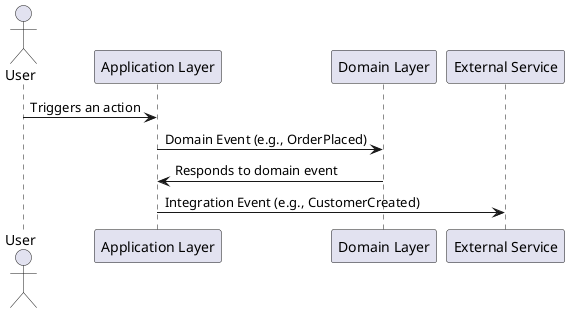

Choosing the right database for your application depends on the specific use case, data requirements, scalability needs, and consistency models. Here's a guide to help you decide between **SQL**, **NoSQL**, and specific databases like **Cassandra**, **MongoDB**, **Cosmos DB**, etc.:

---

## **1. SQL Databases**

### Characteristics

- RelationalHere's a Venn diagram to illustrate CAP Theorem:

```text
   Consistency (C)
      _______
     |       |
     |       | Availability (A)
     |_______|
       Partitionth structured data stored in tables.
- Schema-based, with strong consistency and ACID properties.
- Supports complex queries using SQL.

### When to Use

- **Transactional Applications**: Banking, e-commerce, and financial systems.
- **Data Integrity**: When strong relationships and constraints (e.g., foreign keys) are required.
- **Complex Queries**: Applications that require complex joins or aggregations.
- **Examples**: MySQL, PostgreSQL, SQL Server, Oracle.

---

## **2. NoSQL Databases**

NoSQL databases are schema-less and designed for horizontal scalability and distributed architecture.

### Types of NoSQL Databases

#### **Key-Value Stores**

- **Characteristics**: Simple and efficient for storing and retrieving key-value pairs.
- **Examples**: Redis, DynamoDB.
- **Use Cases**:
  - Caching layers.
  - Session storage.

#### **Document Databases**

- **Characteristics**: Store semi-structured data (JSON-like documents).
- **Examples**: MongoDB, Cosmos DB (Document API).
- **Use Cases**:
  - Flexible schemas (e.g., content management systems).
  - Data with hierarchical structures (e.g., product catalogs).

#### **Columnar Databases**

- **Characteristics**: Data stored in columns instead of rows; optimized for write-heavy workloads.
- **Examples**: Cassandra, HBase.
- **Use Cases**:
  - Time-series data (e.g., logs, metrics).
  - IoT applications with high write throughput.

#### **Graph Databases**

- **Characteristics**: Data modeled as nodes and edges, suitable for highly connected data.
- **Examples**: Neo4j, Amazon Neptune.
- **Use Cases**:
  - Social networks.
  - Recommendation engines.

---

## **3. Choosing Specific Databases**

### **Cassandra**

#### Characteristics

- Distributed, highly scalable, column-family database.
- Optimized for write-heavy applications.
- Eventual consistency model.

#### Use Cases

- High write throughput (e.g., logs, telemetry, IoT).
- Large-scale systems with ever-increasing data (e.g., time-series databases).

---

### **MongoDB**

#### Characteristics

- Document-oriented NoSQL database with flexible schema.
- Supports ACID transactions starting from v4.0.
- JSON-like document storage.

#### Use Cases

- Semi-structured or hierarchical data (e.g., product catalogs, user profiles).
- Quick prototyping and iterative development.
- Applications with frequent schema changes.

---

### **Cosmos DB**

#### Characteristics

- Globally distributed, multi-model database by Microsoft.
- Supports multiple APIs (Document, Graph, Table, MongoDB, Cassandra).
- Five consistency levels (Strong, Bounded Staleness, Session, Consistent Prefix, Eventual).

#### Use Cases

- Multi-region distributed applications.
- Applications requiring low-latency reads and writes.
- Real-time analytics and IoT solutions.

---

### **Relational Databases (RDBMS)**

#### Examples: MySQL, PostgreSQL, SQL Server

#### Use Cases

- Applications with structured, relational data.
- Strong consistency and transaction requirements.
- Systems needing robust query capabilities.

---

## **Decision-Making Criteria**

### **1. Data Structure**

| Type                 | Best Database                    |
| -------------------- | -------------------------------- |
| Structured (Tabular) | SQL Databases (e.g., PostgreSQL) |
| Semi-Structured      | MongoDB, Cosmos DB               |
| Unstructured         | Cassandra, S3 (Blob Storage)     |
| Highly Connected     | Graph Databases (e.g., Neo4j)    |

---

### **2. Scalability**

| Requirement                    | Best Option                  |
| ------------------------------ | ---------------------------- |
| Vertical Scaling (Scale Up)    | SQL Databases                |
| Horizontal Scaling (Scale Out) | Cassandra, DynamoDB, MongoDB |

---

### **3. Consistency vs Availability (CAP Theorem)**

| Priority             | Database Example               |
| -------------------- | ------------------------------ |
| Strong Consistency   | Cosmos DB (Strong Mode), RDBMS |
| Eventual Consistency | Cassandra, DynamoDB            |

---

### **4. Query Requirements**

| Query Type           | Best Database                      |
| -------------------- | ---------------------------------- |
| Complex Joins        | SQL Databases                      |
| Simple Lookups       | Key-Value Stores (e.g., Redis)     |
| Hierarchical Queries | Document Databases (e.g., MongoDB) |
| Graph Traversals     | Neo4j, Amazon Neptune              |

---

### **5. Use Case-Specific Recommendations**

| Use Case            | Recommended Database           |
| ------------------- | ------------------------------ |
| E-commerce          | SQL (PostgreSQL), MongoDB      |
| Real-time Analytics | Cassandra, DynamoDB, Redshift  |
| Content Management  | MongoDB                        |
| IoT Applications    | Cassandra, Cosmos DB, InfluxDB |
| Social Networking   | Neo4j, DynamoDB                |

---

## **Final Thoughts**

Choosing the right database depends on the trade-offs you are willing to make between consistency, scalability, and query complexity. For many modern applications, a combination of databases is used, leveraging the strengths of each type (e.g., SQL for transactions and NoSQL for analytics).

Let me know if you'd like a specific example or deeper insights into a particular database!

Choosing the right database depends on the specific requirements of your application. Here's a structured guide to help you decide between **SQL**, **NoSQL**, and popular NoSQL databases like **Cassandra**, **MongoDB**, and **Cosmos DB**:

---

## 1. **Understand Your Data and Use Case**

### **Key Factors:**

1. **Data Structure:**

   - Relational (structured, tabular data): **SQL**
   - Semi-structured or unstructured: **NoSQL**

2. **Scalability Needs:**

   - Vertical scaling (scale up by adding resources): **SQL**
   - Horizontal scaling (scale out by adding servers): **NoSQL**

3. **Consistency vs. Availability:**

   - Strong consistency: **SQL**, **Cosmos DB (with specific consistency levels)**
   - Eventual consistency: **NoSQL**, **Cassandra**

4. **Workload Type:**
   - High read and write throughput: **NoSQL**
   - Complex queries, joins, and transactions: **SQL**

---

## 2. **SQL vs. NoSQL**

### **SQL Databases**

- **Best For:** Structured, relational data with ACID guarantees.
- **Examples:** MySQL, PostgreSQL, Microsoft SQL Server.
- **When to Use:**
  - Transaction-heavy applications (e.g., banking, e-commerce).
  - Applications with complex relationships (e.g., ERPs, CRMs).
  - Use cases requiring strong consistency.

### **NoSQL Databases**

- **Best For:** Semi-structured, unstructured, or rapidly changing data.
- **Categories:**
  - **Document Stores (e.g., MongoDB, Cosmos DB):**
    - JSON-like documents, flexible schema.
    - Great for content management, catalogs, IoT.
  - **Key-Value Stores (e.g., DynamoDB, Redis):**
    - Key-value pairs for fast lookups.
    - Use for caching, session management.
  - **Columnar Databases (e.g., Cassandra):**
    - Optimized for write-heavy workloads and large datasets.
    - Ideal for time-series data, analytics.
  - **Graph Databases (e.g., Neo4j):**
    - Handles relationships effectively.
    - Great for social networks, fraud detection.

---

## 3. **Database Comparisons**

| Feature             | SQL               | MongoDB              | Cassandra              | Cosmos DB               |
| ------------------- | ----------------- | -------------------- | ---------------------- | ----------------------- |
| **Data Model**      | Relational        | Document             | Columnar               | Multi-model             |
| **Schema**          | Fixed             | Flexible             | Flexible               | Flexible                |
| **Consistency**     | Strong (ACID)     | Eventual/Strong      | Eventual               | Configurable (5 levels) |
| **Scaling**         | Vertical          | Horizontal           | Horizontal             | Horizontal              |
| **Use Case**        | Complex queries   | Semi-structured data | Write-heavy workloads  | Global distributed apps |
| **Best For**        | Financial systems | CMS, catalogs        | IoT, logs, time-series | Multi-region apps       |
| **Example Systems** | MySQL, PostgreSQL | eBay, Expedia        | Netflix, Spotify       | Microsoft Azure apps    |

---

## 4. **When to Choose Specific Databases**

### **Cassandra**

- **Best For:**
  - Write-heavy workloads (IoT, logs, analytics).
  - Time-series data.
  - Applications needing high availability.
- **Example Use Cases:**
  - Monitoring systems, metrics storage.

### **MongoDB**

- **Best For:**
  - Semi-structured data.
  - Rapid development (no schema migration required).
- **Example Use Cases:**
  - Content management systems, real-time analytics.

### **Cosmos DB**

- **Best For:**
  - Multi-region applications with global distribution.
  - Applications requiring configurable consistency models.
- **Example Use Cases:**
  - Multi-region e-commerce platforms, IoT hubs.

---

## 5. **Decision-Making Framework**

### **Step 1: Analyze Your Data**

- Is the data structured? **SQL**
- Is the data semi-structured or unstructured? **NoSQL**

### **Step 2: Consider Scalability**

- Do you need to scale vertically? **SQL**
- Do you need to scale horizontally? **NoSQL**

### **Step 3: Assess Consistency Needs**

- Do you need strong consistency? **SQL, Cosmos DB**
- Is eventual consistency acceptable? **MongoDB, Cassandra**

### **Step 4: Evaluate Workload Type**

- Transactional: **SQL**
- Analytics or high write throughput: **NoSQL**

---

## 6. **Best Practices**

- **Start Small, Scale Later:** Use SQL for MVPs or early-stage projects unless specific NoSQL features are required.
- **Hybrid Approach:** Combine SQL and NoSQL where appropriate (e.g., SQL for transactions, NoSQL for analytics).
- **Experiment:** Use cloud-managed databases like AWS RDS, DynamoDB, or Azure Cosmos DB to test features.

Would you like help with a specific use case or implementation?

The **CAP Theorem**, also known as **Brewer's Theorem**, is a fundamental principle in distributed systems that states:

**In a distributed data system, it is impossible to simultaneously guarantee all three of the following properties:**

1. **Consistency (C)**

   - Every read from the system returns the most recent write or an error.
   - All nodes see the same data at the same time.
   - Example: In a bank, if one node processes a deposit, all other nodes should reflect the updated balance immediately.

2. **Availability (A)**

   - Every request receives a response (either success or failure), even if some nodes are down.
   - The system remains operational for reads and writes despite failures.
   - Example: A web application where every user gets a response regardless of system issues.

3. **Partition Tolerance (P)**
   - The system continues to function despite network partitions (communication breakdowns between nodes).
   - Data may be partitioned across different locations, and the system should tolerate network failures between them.
   - Example: A globally distributed application.

---

### **Implications of CAP Theorem**

- You **cannot achieve all three properties simultaneously** in a distributed system. You must pick two:
  - **CP (Consistency + Partition Tolerance):**
    - Sacrifices availability.
    - Example: A database that ensures consistency at the cost of being unavailable during network partitions (e.g., HBase, MongoDB in certain configurations).
  - **AP (Availability + Partition Tolerance):**
    - Sacrifices consistency.
    - Example: A system that remains operational even if the data might be stale (e.g., DynamoDB, Cassandra).
  - **CA (Consistency + Availability):**
    - Sacrifices partition tolerance (less applicable in distributed systems, since network partitions are inevitable).
    - Example: Traditional relational databases in a single-node setup.

---

### **Visual Representation**

Here’s a Venn diagram to illustrate CAP Theorem:

```

   Consistency (C)
      _______
     |       |
     |       | Availability (A)
     |_______|
       Partition
       Tolerance (P)

```text

Each intersection represents a trade-off.

---

### **Real-World Examples**

| System Type                                 | Guarantees                                                            | Example Systems                                  |
| ------------------------------------------- | --------------------------------------------------------------------- | ------------------------------------------------ |
| **CP (Consistency + Partition Tolerance)**  | Data consistency during partitions, but may sacrifice availability.   | MongoDB (with majority writes), HBase            |
| **AP (Availability + Partition Tolerance)** | High availability, even with partitions, but eventual consistency.    | DynamoDB, Cassandra                              |
| **CA (Consistency + Availability)**         | Strong consistency and availability, but no tolerance for partitions. | Relational Databases (RDBMS) without replication |

---

### **CAP Theorem in Context**

- Distributed databases like Cassandra, DynamoDB, and MongoDB often prioritize **AP** (eventual consistency) to ensure availability and partition tolerance in global systems.
- Systems requiring financial accuracy (e.g., banking) often lean towards **CP** to ensure consistency, even if it means downtime during network failures.

---

Would you like a deeper dive into the theorem’s proof, practical applications, or examples in system design?

In Domain-Driven Design (DDD), events play a crucial role in capturing the state changes and communication between different parts of the domain model and the system. Here are the **types of events in DDD**:

---

### **1. Domain Events**

- **Definition**: Represent something significant that has happened in the domain.
- **Purpose**:
  - To signal state changes in the domain model.
  - To communicate between aggregates or bounded contexts without tight coupling.
- **Examples**:
  - `OrderPlaced`
  - `PaymentReceived`
  - `UserRegistered`
- **Characteristics**:
  - Immutable.
  - Named using past tense to indicate something has already occurred.

---

### **2. Integration Events**

- **Definition**: Used to communicate between different systems or bounded contexts.
- **Purpose**:
  - To ensure consistency and synchronization across distributed systems.
  - Facilitates **event-driven architecture**.
- **Examples**:
  - `CustomerCreated` (broadcast to other services like CRM, analytics, etc.)
  - `OrderShipped`
- **Characteristics**:
  - Typically processed by external systems.
  - May include additional metadata for integration (e.g., timestamps, correlation IDs).

---

### **3. Application Events**

- **Definition**: Related to the application layer, indicating that something significant occurred within the application context.
- **Purpose**:
  - To trigger application-specific workflows or processes.
  - Orchestrate actions outside the domain (e.g., sending an email).
- **Examples**:
  - `EmailSent`
  - `SMSNotificationTriggered`
- **Characteristics**:
  - Not strictly tied to the domain model.
  - Serve operational needs of the application.

---

### **4. Lifecycle Events**

- **Definition**: Capture events related to the lifecycle of aggregates or entities.
- **Purpose**:
  - To monitor or track the creation, update, and deletion of entities.
- **Examples**:
  - `CustomerActivated`
  - `CustomerDeleted`
- **Characteristics**:
  - Often used for auditing or logging purposes.

---

### **5. Process/Workflow Events**

- **Definition**: Represent events that occur as part of a business process or workflow.
- **Purpose**:
  - To coordinate multiple steps or activities in a process.
  - Drive state machines or sagas.
- **Examples**:
  - `OrderValidated`
  - `InventoryChecked`
- **Characteristics**:
  - Often used in long-running workflows or sagas.

---

### **6. Reactive/UI Events** _(Optional in DDD-specific discussions)_

- **Definition**: Capture interactions in the user interface or reactive layers.
- **Purpose**:
  - To handle events triggered by users or external systems.
- **Examples**:
  - `ButtonClicked`
  - `FileUploaded`
- **Characteristics**:
  - Often considered outside the scope of core DDD but may interact with application events.

---

### Visual Representation (Optional UML Diagram)

To visualize the interaction of these events in a system, you can create a **sequence diagram** in PlantUML:



### Notes

- **Bounded Contexts**: Integration events often cross bounded contexts, while domain events usually stay within their context.
- **Event-Driven Architecture**: Events are a cornerstone of reactive systems in DDD and help achieve eventual consistency.

Would you like me to elaborate on event handling, storage, or examples in code?
