# 🗺️ DevOps & Infrastructure Pathway

**Purpose**: Learning sequence and cross-links across DevOps domains  
**Audience**: DevOps engineers, SREs, platform engineers, infrastructure architects  
**Last Updated**: September 3, 2025

---

## 🎯 **Learning Progression Sequence**

### **Foundation Level (3-4 weeks)**

```mermaid
graph TD
    subgraph "🔄 CI/CD Foundation"
        A[Git Workflows] --> B[Pipeline Basics]
        B --> C[Automated Testing]
        C --> D[Deployment Automation]
    end
    
    subgraph "🏗️ Infrastructure Basics"
        D --> E[Cloud Fundamentals<br/>(06_Cloud-Architecture)]
        E --> F[Container Basics]
        F --> G[IaC Introduction]
    end
    
    classDef foundation fill:#e3f2fd,stroke:#1976d2,stroke-width:2px
    class A,B,C,D,E,F,G foundation
```

### **Intermediate Level (4-6 weeks)**


### **Advanced Level (6-8 weeks)**

```mermaid
graph TD
    subgraph "🔧 Platform Engineering"
        O[Multi-Cloud Strategy] --> P[Service Mesh]
        P --> Q[GitOps Workflows]
        Q --> R[Chaos Engineering]
    end
    
    subgraph "🛡️ Security & Compliance"
        S[Security Scanning] --> T[Compliance Automation]
        T --> U[Policy as Code]
    end
    
    classDef advanced fill:#ffebee,stroke:#c62828,stroke-width:2px
    class O,P,Q,R,S,T,U advanced
```



---

## 🔗 **Domain Integration Map**

### **Core Dependencies**

```text
Development Fundamentals (Prerequisites)
    ↓
CI/CD Fundamentals (Entry Point)
    ↓ ↘
Infrastructure-as-Code    Observability
    ↓ ↗                      ↓
Release Strategies (Convergence Point)
```

### **Cross-Track Connections**

```mermaid
graph LR
    subgraph "📁 Other Tracks"
        DEV[Development Track<br/>Git, Testing, Code Quality]
        AI[AI & ML Track<br/>MLOps, Model Deployment]
        DATA[Data Science Track<br/>Data Pipelines, Analytics]
    end
    
    subgraph "⚙️ DevOps Domains"
        CICD[CI/CD Fundamentals]
        IAC[Infrastructure-as-Code]
        OBS[Observability]
        REL[Release Strategies]
    end
    
    DEV --> CICD
    AI --> REL
    AI --> OBS
    DATA --> IAC
    DATA --> CICD
    
    classDef track fill:#e8f5e8,stroke:#388e3c,stroke-width:2px
    classDef devops fill:#fff3e0,stroke:#f57f17,stroke-width:2px
    
    class DEV,AI,DATA track
    class CICD,IAC,OBS,REL devops
```



---

## 🎯 **Role-Based Learning Paths**

### **DevOps Engineer Journey**

```text
Week 1-2: Git Workflows + Pipeline Basics
Week 3-4: Container Fundamentals + IaC Introduction
Week 5-6: Monitoring Setup + Deployment Automation
Week 7-8: Blue-Green Deployments + Alerting
Week 9-12: Advanced IaC + Performance Analysis
Week 13-16: GitOps + Multi-Cloud Strategy
```

### **Site Reliability Engineer Journey**

```text
Week 1-2: Pipeline Basics + Monitoring Setup
Week 3-4: Logging Systems + Performance Analysis
Week 5-6: Alerting Rules + Incident Response
Week 7-8: Chaos Engineering + Reliability Patterns
Week 9-12: Advanced Observability + SLI/SLO
Week 13-16: Capacity Planning + Disaster Recovery
```

### **Platform Engineer Journey**

```text
Week 1-2: IaC Introduction + Container Orchestration
Week 3-4: Service Mesh + API Gateway
Week 5-6: Developer Experience + Self-Service Platforms
Week 7-8: Multi-Tenancy + Resource Management
Week 9-12: Platform Security + Compliance
Week 13-16: Platform Analytics + Cost Optimization
```

---

## 📚 **Learning Resource Mapping**

### **01_CI-CD-Fundamentals**

| Topic | Learning Resource | Hands-On Project |
|-------|------------------|------------------|
| Git Workflows | Branching strategies guide | Multi-feature development |
| Pipeline Design | CI/CD architecture patterns | Build automation setup |
| Testing Integration | Automated testing pyramid | Test suite implementation |
| Deployment Automation | Deployment pipeline design | Production deployment |

### **02_Infrastructure-as-Code**

| Topic | Learning Resource | Hands-On Project |
|-------|------------------|------------------|
| Cloud Fundamentals | Multi-cloud comparison | Resource provisioning |
| Container Platform | Container orchestration | Microservices deployment |
| IaC Tools | Terraform/Ansible guides | Infrastructure automation |
| Security Integration | IaC security scanning | Secure infrastructure |

### **06_Cloud-Architecture**

| Topic | Learning Resource | Hands-On Project |
|-------|------------------|------------------|
| Azure Services | Azure compute, storage, AI | Azure resource deployment |
| AWS Platform | EC2, S3, Lambda services | AWS infrastructure setup |
| GCP Solutions | Compute Engine, Cloud Storage | GCP application deployment |
| Cloud Security | Identity, encryption, compliance | Multi-cloud security config |
| Hybrid Strategies | On-premises integration | Hybrid cloud architecture |

### **03_Observability-and-Monitoring**

| Topic | Learning Resource | Hands-On Project |
|-------|------------------|------------------|
| Metrics & Monitoring | Prometheus/Grafana setup | Dashboard creation |
| Logging Strategy | Centralized logging design | Log aggregation system |
| Distributed Tracing | OpenTelemetry integration | Service tracing setup |
| Alerting & Response | Incident response playbooks | Alert rule configuration |

### **04_Release-Strategies**

| Topic | Learning Resource | Hands-On Project |
|-------|------------------|------------------|
| Deployment Patterns | Blue-green implementation | Zero-downtime deployment |
| Canary Releases | Progressive delivery setup | Gradual rollout system |
| Feature Management | Feature flag architecture | A/B testing platform |
| Rollback Strategies | Incident recovery procedures | Automated rollback system |

---

## 🔄 **Integration Points**

### **With AI & ML Track**

- **Model Deployment**: CI/CD for ML models and training pipelines
- **Model Monitoring**: Observability for model performance and drift
- **MLOps Platforms**: Infrastructure for ML workflow automation
- **Experiment Management**: Release strategies for model experimentation

### **With Data Science Track**

- **Data Pipeline Automation**: CI/CD for data processing workflows
- **Data Infrastructure**: IaC for big data platforms and analytics
- **Data Quality Monitoring**: Observability for data pipelines
- **Analytics Deployment**: Release strategies for BI and reporting systems

### **With Development Track**

- **Code Quality Gates**: Integration with development workflows
- **Environment Management**: Consistent dev/staging/prod environments
- **Security Scanning**: Automated security checks in pipelines
- **Developer Experience**: Self-service deployment and monitoring tools

---

## 📈 **Progression Checkpoints**

### **Foundation Milestones**

- [ ] Set up basic CI/CD pipeline with automated testing
- [ ] Deploy infrastructure using IaC tools
- [ ] Implement basic monitoring and alerting
- [ ] Execute successful blue-green deployment

### **Intermediate Milestones**

- [ ] Design multi-environment deployment strategy
- [ ] Implement comprehensive observability stack
- [ ] Set up canary release process with automated rollback
- [ ] Create disaster recovery procedures

### **Advanced Milestones**

- [ ] Design and implement GitOps workflow
- [ ] Set up multi-cloud infrastructure management
- [ ] Implement chaos engineering practices
- [ ] Create self-service platform for development teams

---

## 🚀 **Next Steps After Completion**

### **Specialization Paths**

- **Security Engineering**: Focus on DevSecOps and compliance automation
- **Platform Architecture**: Design large-scale platform engineering solutions
- **Cloud Architecture**: Specialize in multi-cloud and hybrid strategies
- **Reliability Engineering**: Master advanced SRE practices and culture

### **Advanced Topics**

- Kubernetes operators and custom controllers
- Service mesh architecture and implementation
- Edge computing and distributed systems
- AI/ML infrastructure and MLOps platforms

---

## 🔗 **Quick Navigation**

- **Track Home**: [README.md](README.md)
- **Domain Guides**: [01_CI-CD-Fundamentals/](01_CI-CD-Fundamentals/) | [02_Infrastructure-as-Code/](02_Infrastructure-as-Code/) | [03_Observability-and-Monitoring/](03_Observability-and-Monitoring/) | [04_Release-Strategies/](04_Release-Strategies/) | [06_Cloud-Architecture/](06_Cloud-Architecture/)
- **Legacy Resources**: `../04_LegacyContent/_Backup/07_DevOps/`
- **Cross-References**: [Development Track](../01_Development/README.md) | [AI & ML Track](../02_AI-and-ML/README.md) | [Data Science Track](../03_Data-Science/README.md)

---

**💡 Usage Tip**: Start with the Foundation Level regardless of experience - DevOps practices evolve rapidly, and establishing current best practices is essential for success.
