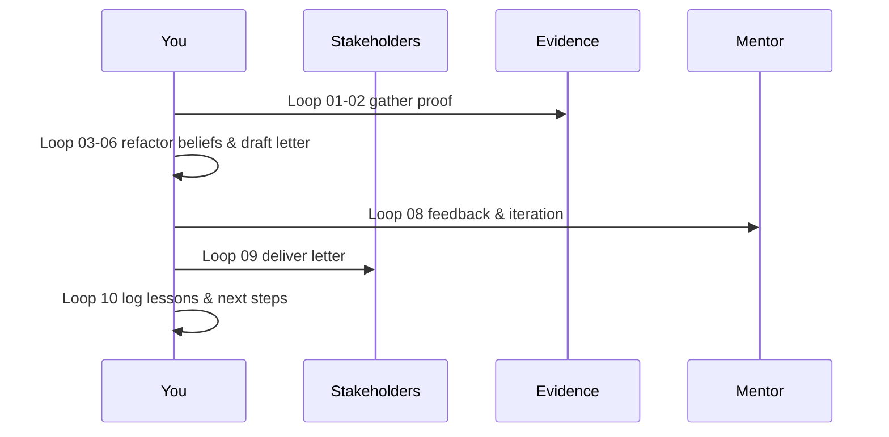

# 01A_Week01_Mindset_Reorientation

**Learning Level**: Advanced (Lead Architect Reset)  
**Prerequisites**: Phase 01 overview, leadership retrospectives, baseline system design fluency  
**Estimated Time**: 4.5 hours (10 × 27-minute loops)

## 🎯 Learning Objectives

By the end of this 27-minute loop series, you will:

- Surface and retire three legacy beliefs that block current strategy execution.
- Author a narrative that aligns personal mission with enterprise objectives.
- Define adoption rituals that make the rebooted mindset observable to teams.

## 📋 Week Structure (Ten Loops)

| Loop | Focus | Output |
| --- | --- | --- |
| 01 | State the legacy mindset and current mission gap | Belief inventory entry |
| 02 | Gather signals (exec priorities, customer data, market moves) | Annotated insight board |
| 03 | Translate insights into three replacement belief statements | Draft belief stack |
| 04 | Stress-test beliefs against a high-stakes initiative | Scenario decision notes |
| 05 | Capture stakeholder reactions and psychological friction | Resistance journal |
| 06 | Draft the perspective reset letter (outline + opening) | Letter skeleton |
| 07 | Add commitments, rituals, and metrics to the letter | Completed draft |
| 08 | Run a feedback loop with mentor or AI pair | Margin notes + deltas |
| 09 | Finalize the letter and prep delivery sequence | Final letter v1.0 |
| 10 | Record shifts, risks, and next-cluster bridge | Retrospective + handoff brief |

## 🔄 Daily Flow (Five Workouts)

| Day | Theme | Loops | Intent |
| --- | --- | --- | --- |
| Day 1 | Awareness & Evidence | 01-02 | Collect facts that invalidate the old mindset |
| Day 2 | Reframing | 03-04 | Craft new beliefs and test them |
| Day 3 | Commitments | 05-06 | Acknowledge friction and draft the narrative |
| Day 4 | Calibration | 07-08 | Add rituals, metrics, and peer feedback |
| Day 5 | Declaration | 09-10 | Finalize letter and plan rollout |

## 🧠 Core Concepts (15 minutes)

1. **Belief Stack**: Layered convictions that drive architectural choices. Updating the stack prevents recirculating outdated heuristics.
2. **Narrative Leverage**: Executives respond to stories linked to measurable outcomes; the letter must blend emotion with data.
3. **Observable Rituals**: Without visible actions, mindset shifts remain invisible; define rituals that teams can witness weekly.

## 🛠️ Practical Implementation (5 minutes)

- Use the *Belief Ledger* template to log before/after statements and attach proof for each change.
- Structure the letter with three acts: *Old Reality*, *Catalyst Evidence*, *New Commitments*.
- Schedule the delivery during a leadership forum to maximize accountability and feedback loops.

## 📐 ASCII Flow

```text
[Belief Audit] -> [Evidence Scan] -> [Reframe] -> [Narrative Draft] -> [Commitment Plan]
       |                 |               |                |                    |
       v                 v               v                v                    v
  Legacy ledger   Insight board   Replacement stack   Reset letter     Adoption rituals
```

## 🧩 Mermaid Timeline



## ✅ Success Criteria & Metrics

| Metric | Target | How to Capture |
| --- | --- | --- |
| Retired beliefs | ≥ 3 | Belief Ledger updates |
| Stakeholder alignment score | ≥ 4/5 | Short pulse survey post-letter |
| Ritual adoption | ≥ 2 visible rituals scheduled | Calendar + stand-up notes |
| Feedback incorporated | ≥ 5 actionable deltas | Mentor or AI review notes |

## 🚦 Pitfalls to Avoid (5 minutes)

- **Data-free declarations**: Without market or delivery evidence the new stance looks like opinion.
- **Vague rituals**: “Meet more often” is weak—specify cadence, participants, and intended outcomes.
- **Ignoring friction**: Documenting resistance prevents relapse and prepares your coaching plan.

## 🧵 Next Steps

- Share the Perspective Reset Letter with sponsors and confirm acknowledgement.
- Add accepted rituals to your leadership operating calendar.
- Queue Cluster 02 preparation by highlighting craftsmanship gaps surfaced during belief audits.

## 🔗 Related Resources

- `../README.md`
- `./01_Day01_Perspective_Reset.md`
- `../../Phase01_Reboot/README.md`
- `../../../01_ReferenceLibrary/01_Development/Development-Track-Restructuring-Summary.md`
