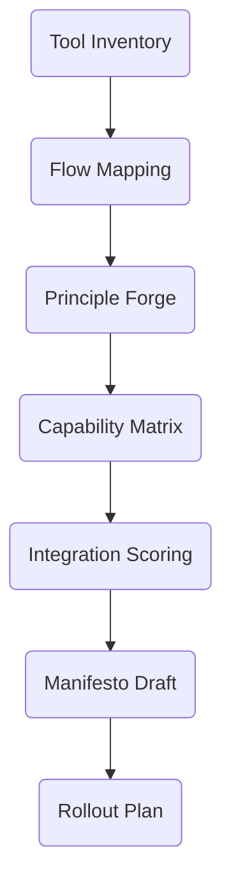

# 03A_Week03_Toolchain_Intentionality

**Learning Level**: Advanced  
**Prerequisites**: Week 02 discipline artifacts, tooling inventory, access to procurement/process policies  
**Estimated Time**: 4.5 hours (10 × 27-minute loops)

## 🎯 Learning Objectives

- Audit the current engineering toolchain for value, redundancy, and adoption maturity.
- Design an intentional, right-sized stack that accelerates discipline and delivery.
- Produce a Toolchain Manifesto that articulates principles, guardrails, and investment roadmap.

## 📋 Week Structure (Ten Loops)

| Loop | Focus | Output |
| --- | --- | --- |
| 01 | Tool inventory heatmap | Tool portfolio snapshot |
| 02 | Workflow mapping | Flow impediment map |
| 03 | Principle definition | Toolchain principles v0 |
| 04 | Capability alignment | Capability-to-tool matrix |
| 05 | Integration health check | Integration scorecard |
| 06 | Automation opportunity scan | Automation backlog |
| 07 | Risk & compliance review | Guardrail ledger |
| 08 | Stakeholder interviews | Adoption insight brief |
| 09 | Manifesto drafting | Toolchain Manifesto v0.9 |
| 10 | Rollout plan | Investment & enablement roadmap |

## 🔄 Daily Flow

| Day | Theme | Loops | Intent |
| --- | --- | --- | --- |
| Day 1 | Observe current tool reality | 01-02 | Surface duplicates, friction, and shadow tools |
| Day 2 | Principles & capability mapping | 03-04 | Define what “good” looks like and align tools |
| Day 3 | Integration & automation | 05-06 | Hardening flow and eliminating toil |
| Day 4 | Risk & adoption | 07-08 | Balance governance with usability |
| Day 5 | Manifesto & roadmap | 09-10 | Publish narrative and action plan |

## 🧠 Core Concepts

1. **Tooling as Strategy**: Every tool carries an operating assumption. Make those assumptions explicit.
2. **Flow-first Lens**: Tools exist to accelerate loop completion, not accumulate shelfware.
3. **Adoption Quadrants**: Pair maturity (low/high) with value (low/high) to guide rationalization.

## 🛠️ Practical Implementation

- Use a heatmap to visualize tool effectiveness across persona types (architect, developer, SRE, analyst).
- Score each integration on reliability, data fidelity, and maintenance burden.
- Link tooling decisions to the rituals and metrics established in Week 02.

## 📐 ASCII Blueprint

```text
[Inventory] -> [Flow Map] -> [Principles] -> [Capability Match] -> [Integration Health] -> [Manifesto]
```

## 🧩 Mermaid View



## ✅ Success Criteria & Metrics

| Metric | Target | Capture Method |
| --- | --- | --- |
| Duplicate tools identified | ≥ 3 redundant tools flagged | Portfolio snapshot |
| Integration health assessed | 100% of critical flows scored | Integration scorecard |
| Automation opportunities | ≥ 5 backlog items defined | Automation backlog |
| Stakeholder alignment | ≥ 4 personas interviewed | Adoption insight brief |

## 🚧 Pitfalls

- Equating “latest” with “best”—focus on fit-for-purpose.
- Ignoring license, security, and data residency constraints.
- Overloading teams with change without enablement runway.

## 🧵 Next Steps

- Socialize manifesto with procurement, security, and platform teams.
- Connect automation backlog to Cluster 05 craft recovery labs.
- Schedule quarterly toolchain health reviews to prevent drift.

## 🔗 Related Resources

- `../Cluster02_Discipline_Architecture/00_Week02_Craftsmanship_Principles.md`
- `../../../01_ReferenceLibrary/04_DevOps/02_Infrastructure-as-Code/README.md`
- `../../../01_ReferenceLibrary/02_AI-and-ML/06_MCP-Servers/README.md`
- `../../../01_ReferenceLibrary/01_Development/18_Development-Approaches/README.md`
