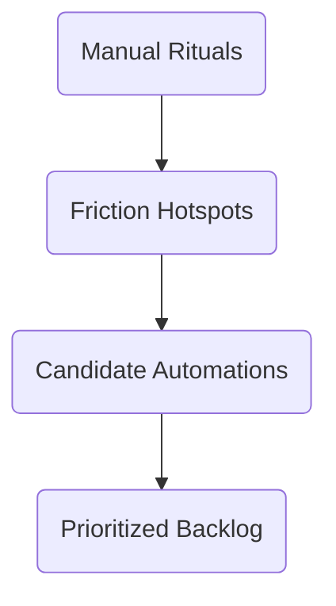

# 03D_Day03_Integration_Audit

**Learning Level**: Advanced  
**Prerequisites**: Capability-to-tool matrix, integration architecture diagrams, API access notes  
**Estimated Time**: 2 × 27-minute loops

## 🎯 Objectives for Today

- Score integration health across mission-critical workflows.
- Identify automation opportunities that reinforce discipline and reduce toil.

## ⏱️ Loop Map

| Loop | Focus | Output |
| --- | --- | --- |
| 05 | Integration scoring | Integration scorecard |
| 06 | Automation opportunity scan | Automation backlog |

## 🔌 Loop 05 – Integration Scoring

**Target Output**: Integration scorecard charting reliability, data fidelity, and maintenance burden.

### Step-by-step (Loop 05)

1. List the top integrations supporting key workflows (CI/CD pipeline, incident response, analytics feedback loop).
2. Score each on **Reliability**, **Latency**, **Data Completeness**, and **Maintenance Effort** (scale 1–5).
3. Capture incidents or outages tied to integration failures.
4. Document owners and support contracts.

### Scorecard Template

| Integration | Reliability | Latency | Data Completeness | Maintenance Effort | Owner | Notes |
| --- | --- | --- | --- | --- | --- | --- |

### ASCII Radar Cue

```text
          Reliability
             /\
            /  \
 Maintenance <    > Latency
            \  /
             \/
        Data Completeness
```

## 🤖 Loop 06 – Automation Opportunity Scan

**Target Output**: Automation backlog sequencing high-impact opportunities.

### Step-by-step (Loop 06)

1. Review Week 02 rituals and pinpoint manual steps that could be automated.
2. Combine with Day 1 friction points to list candidate automations (bots, scripts, workflow rules).
3. Estimate impact using **Time Saved**, **Risk Reduction**, and **Complexity** (scale 1–5).
4. Prioritize top five opportunities and assign exploration owners.

### Automation Backlog Table

| Opportunity | Ritual/Workflow | Time Saved | Risk Reduction | Complexity | Owner | Next Step |
| --- | --- | --- | --- | --- | --- | --- |

### Mermaid Funnel



## ✅ Exit Criteria for Day 3

- Integration scorecard scored and ready to share with platform/DevOps teams.
- Automation backlog prioritized with owners and next steps.
- Clear understanding of investments required to support discipline rituals.

## 🛠️ Tools & Resources

- Integration monitoring dashboards (Datadog, Splunk, New Relic).
- Workflow engines or automation platforms (Power Automate, Zapier, GitHub Actions).
- Incident postmortems and service level reports.

## 🔄 Handoff to Day 4

- Flag integrations with risk scores ≥ 4 for guardrail review tomorrow.
- Prep questions for security/compliance teams based on identified automation ideas.
- Schedule stakeholder interviews for adoption insights.
