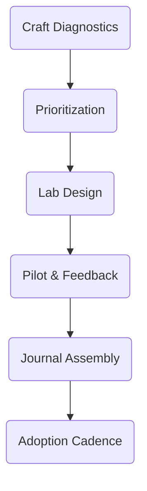

# 05A_Week05_Craft_Recovery

**Learning Level**: Advanced  
**Prerequisites**: Systems Heuristics Atlas, engineering skill assessments, retrospective notes  
**Estimated Time**: 4.5 hours (10 × 27-minute loops)

## 🎯 Learning Objectives

- Diagnose craft gaps across engineering fundamentals (code quality, testing, reliability, observability).
- Design micro-labs that drill critical skills and reinforce new heuristics.
- Produce a Foundations Lab Journal documenting exercises, rubrics, and mastery progression.

## 📋 Week Structure (Ten Loops)

| Loop | Focus | Output |
| --- | --- | --- |
| 01 | Skill diagnostic | Craft gap matrix |
| 02 | Prioritize focus areas | Priority heatmap |
| 03 | Lab design principles | Lab guideline charter |
| 04 | Exercise drafting | Micro-lab scripts |
| 05 | Rubric creation | Assessment rubric set |
| 06 | Instrumentation plan | Telemetry checklist |
| 07 | Pilot run-through | Pilot feedback log |
| 08 | Iteration sprint | Lab pack v0.9 |
| 09 | Journal assembly | Foundations Lab Journal v0.9 |
| 10 | Adoption plan | Practice cadence + retrospective brief |

## 🔄 Daily Flow

| Day | Theme | Loops | Intent |
| --- | --- | --- | --- |
| Day 1 | Diagnose craft state | 01-02 | Surface weaknesses and opportunities |
| Day 2 | Design principles & exercises | 03-04 | Build labs that matter |
| Day 3 | Rubrics & telemetry | 05-06 | Ensure measurement and feedback |
| Day 4 | Pilot & iterate | 07-08 | Test labs and refine |
| Day 5 | Publish & plan | 09-10 | Document labs and operationalize practice |

## 🧠 Core Concepts

1. **Skill Loops**: Practice → Feedback → Reflection → Adjustment → Practice.
2. **Progressive Complexity**: Start with fundamentals, layer on realistic constraints.
3. **Telemetry-Driven Learning**: Use metrics and automation to give instant feedback.

## 🛠️ Practical Implementation

- Anchor labs to real scenarios drawn from incidents and heuristic simulations.
- Ensure labs are toolchain-aware, leveraging automation backlog items.
- Grade with rubrics that differentiate novice vs. proficient vs. expert behaviors.

## 📐 ASCII Blueprint

```text
[Diagnostics] -> [Priorities] -> [Lab Design] -> [Rubrics] -> [Pilot] -> [Journal]
```

## 🧩 Mermaid View



## ✅ Success Criteria & Metrics

| Metric | Target | Capture Method |
| --- | --- | --- |
| Craft gaps identified | ≥ 5 priority skills mapped | Craft gap matrix |
| Micro-labs authored | ≥ 4 labs with progressive difficulty | Micro-lab scripts |
| Rubrics created | ≥ 1 rubric per lab | Assessment rubric set |
| Pilot feedback captured | ≥ 6 participants | Pilot feedback log |

## 🚧 Pitfalls

- Designing labs divorced from actual production constraints.
- Neglecting telemetry, leading to subjective scoring.
- Overloading labs with theory instead of hands-on practice.

## 🧵 Next Steps

- Schedule recurring lab rotations (monthly/quarterly).
- Connect lab outputs to performance reviews or growth plans.
- Feed lab insights into Cluster 06 signal intelligence for success pattern tracking.

## 🔗 Related Resources

- `../Cluster04_Systems_Heuristics/00_Week04_Systems_Heuristics.md`
- `../../../01_ReferenceLibrary/01_Development/02_Python/README.md`
- `../../../01_ReferenceLibrary/01_Development/06_JavaScript/README.md`
- `../../../01_ReferenceLibrary/04_DevOps/05_Legacy-Content/Incident-Response-Primer.md`
