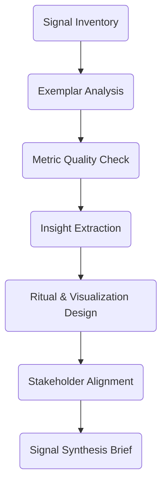

# 06A_Week06_Signal_Intelligence

**Learning Level**: Advanced  
**Prerequisites**: Foundations Lab Journal, observability stack access, executive dashboards  
**Estimated Time**: 4.5 hours (10 × 27-minute loops)

## 🎯 Learning Objectives

- Curate a signal library highlighting exemplar systems and leading indicators of performance.
- Design analytics rituals that keep discipline, toolchain, and craft improvements measurable.
- Produce a Signal Synthesis Brief connecting metrics to decision-makers and governance.

## 📋 Week Structure (Ten Loops)

| Loop | Focus | Output |
| --- | --- | --- |
| 01 | Signal source audit | Signal inventory |
| 02 | Exemplars analysis | Exemplar dossier |
| 03 | Metric quality check | Metric integrity ledger |
| 04 | Insight extraction | Signal insight cards |
| 05 | Ritual design | Analytics cadence map |
| 06 | Visualization storyboard | Dashboard storyboard |
| 07 | Stakeholder alignment | Alignment log |
| 08 | Automation trigger plan | Alerting matrix |
| 09 | Brief drafting | Signal Synthesis Brief v0.9 |
| 10 | Adoption roadmap | Intelligence rollout plan + retrospective brief |

## 🔄 Daily Flow

| Day | Theme | Loops | Intent |
| --- | --- | --- | --- |
| Day 1 | Audit & observe | 01-02 | Understand current signal landscape |
| Day 2 | Validate & synthesize | 03-04 | Ensure metrics are trustworthy and insightful |
| Day 3 | Design rituals & visuals | 05-06 | Create analytics operating model |
| Day 4 | Align stakeholders & automation | 07-08 | Ensure signals drive action |
| Day 5 | Publish & plan | 09-10 | Deliver brief and adoption roadmap |

## 🧠 Core Concepts

1. **Signal-to-Noise Ratio**: Prioritize metrics that influence decisions, not vanity dashboards.
2. **Narrative Analytics**: Pair data with context to spur action.
3. **Closed-Loop Governance**: Every signal must have an owner, ritual, and trigger.

## 🛠️ Practical Implementation

- Leverage existing observability tools and automation backlog for instrumentation.
- Benchmark exemplar systems to extract reliable patterns.
- Tie signals directly to Week 02 discipline metrics and Week 05 lab outcomes.

## 📐 ASCII Blueprint

```text
[Source Audit] -> [Exemplar Insights] -> [Metric Quality] -> [Ritual Design] -> [Automation] -> [Signal Brief]
```

## 🧩 Mermaid View



## ✅ Success Criteria & Metrics

| Metric | Target | Capture Method |
| --- | --- | --- |
| High-value signals cataloged | ≥ 20 signals tagged with owners | Signal inventory |
| Metrics validated | 100% of priority metrics scored for integrity | Metric integrity ledger |
| Rituals defined | ≥ 4 analytics cadences mapped | Analytics cadence map |
| Alerting triggers designed | ≥ 5 automation triggers captured | Alerting matrix |

## 🚧 Pitfalls

- Overcollecting data without defining decisions it supports.
- Ignoring data quality issues (stale, inconsistent, unlabeled).
- Building dashboards with no ritual or owner.

## 🧵 Next Steps

- Embed signal rituals into weekly leadership reviews and craft labs.
- Share exemplar stories with teams to inspire adoption.
- Set up continuous improvement feedback for dashboards and alerts.

## 🔗 Related Resources

- `../Cluster05_Craft_Recovery/00_Week05_Craft_Recovery.md`
- `../../../01_ReferenceLibrary/03_Data-Science/02_DataAnalytics/README.md`
- `../../../01_ReferenceLibrary/04_DevOps/03_Observability-and-Monitoring/README.md`
- `../../../01_ReferenceLibrary/02_AI-and-ML/06_MCP-Servers/README.md`
