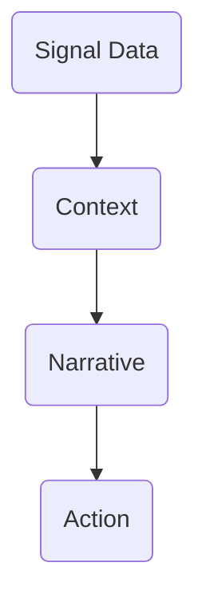

# 06C_Day02_Insight_Craft

**Learning Level**: Advanced  
**Prerequisites**: Signal inventory, exemplar dossier, data lineage documentation  
**Estimated Time**: 2 × 27-minute loops

## 🎯 Objectives for Today

- Validate metric integrity and readiness for decision-making.
- Synthesize raw signals into insight cards that narrate impact and action.

## ⏱️ Loop Map

| Loop | Focus | Output |
| --- | --- | --- |
| 03 | Metric quality check | Metric integrity ledger |
| 04 | Insight extraction | Signal insight cards |

## 🧪 Loop 03 – Metric Quality Check

**Target Output**: Metric integrity ledger documenting completeness, accuracy, and freshness.

### Step-by-step (Loop 03)

1. For each priority signal, trace data lineage: source → transformation → storage → visualization.
2. Assess **Accuracy**, **Timeliness**, **Consistency**, **Ownership**, **Alert Thresholds** (score 1–5).
3. Flag manual steps, missing metadata, or conflicting definitions.
4. Log remediation actions and dependencies on toolchain or data teams.

### Integrity Ledger Template

| Signal | Accuracy | Timeliness | Consistency | Owner | Issue | Remediation |
| --- | --- | --- | --- | --- | --- | --- |

### ASCII Reminder

```text
[Signal] -> [Lineage Trace] -> [Scorecard] -> [Remediation Ticket]
```

## 🔍 Loop 04 – Insight Extraction

**Target Output**: Signal insight cards translating metrics into stories and actions.

### Step-by-step (Loop 04)

1. Pair each high-value signal with context: trend, benchmark, expected range.
2. Identify decision impact (e.g., “ triggers deployment freeze if error budget < 20%”).
3. Summarize narrative: **What happened? Why? What’s next?**
4. Attach recommended actions, owners, and supporting evidence from exemplar dossier.

### Insight Card Template

```text
Signal:
Narrative Snapshot:
Key Trend:
Decision Trigger:
Recommended Action:
Owner:
Related Ritual:
```

### Mermaid Flow



## ✅ Exit Criteria for Day 2

- Metric integrity ledger filled for all priority signals.
- Insight cards drafted with clear actions and owners.
- Remediation backlog ready for stakeholder alignment tomorrow.

## 🛠️ Tools & Resources

- Data lineage tools (Monte Carlo, Collibra, custom docs).
- Analytics notebooks or BI tools for exploring trends.
- Collaboration docs for logging issues and actions.

## 🔄 Handoff to Day 3

- Identify signals needing ritual redesign and visualization tomorrow.
- Share integrity issues with data owners ahead of stakeholder alignment.
- Prepare to weave insight cards into dashboard storyboards.
