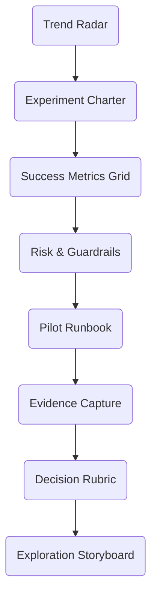

# 08A_Week08_Exploration_Engine

**Learning Level**: Advanced  
**Prerequisites**: Guardrail Charter v1.0, signal library, innovation backlog  
**Estimated Time**: 4.5 hours (10 × 27-minute loops)

## 🎯 Learning Objectives

- Establish a disciplined exploration engine that evaluates emerging technologies safely.
- Design experiment charters linking hypotheses to strategic bets and measurable outcomes.
- Produce an Exploration Storyboard capturing experiments, evidence, and go/no-go guidance.

## 📋 Week Structure (Ten Loops)

| Loop | Focus | Output |
| --- | --- | --- |
| 01 | Horizon scanning | Trend radar update |
| 02 | Hypothesis framing | Experiment idea log |
| 03 | Experiment charter drafting | Charter v0 |
| 04 | Success metric design | Evidence & metrics grid |
| 05 | Risk & guardrail alignment | Experiment risk canvas |
| 06 | Execution runway planning | Pilot runbook |
| 07 | Evidence capture | Insight log |
| 08 | Decision framing | Go/No-Go rubric |
| 09 | Storyboard assembly | Exploration Storyboard v0.9 |
| 10 | Adoption & backlog integration | Experiment pipeline & review cadence |

## 🔄 Daily Flow

| Day | Theme | Loops | Intent |
| --- | --- | --- | --- |
| Day 1 | Scan & frame | 01-02 | Identify promising exploration themes |
| Day 2 | Charter & metrics | 03-04 | Define experiments with clear evidence models |
| Day 3 | Risk & execution | 05-06 | Align experiments with guardrails and delivery plan |
| Day 4 | Evidence & decisions | 07-08 | Capture results and apply decision criteria |
| Day 5 | Storyboard & adoption | 09-10 | Publish storyboard and integrate into cadence |

## 🧠 Core Concepts

1. **Strategic Optionality**: Balance core delivery with structured exploration bets.
2. **Evidence-Driven Decisions**: Every experiment must declare success metrics upfront.
3. **Guardrailed Innovation**: Experiments are bounded by ethics, security, and budget guardrails.

## 🛠️ Practical Implementation

- Use signals from Cluster 06 to anchor metrics for emerging tech evaluations.
- Reuse guardrail patterns from Cluster 07 to keep experiments safe and governable.
- Maintain an exploration backlog prioritized by strategic themes and risk appetite.

## 📐 ASCII Blueprint

```text
[Trend Radar] -> [Experiment Charter] -> [Pilot Execution] -> [Evidence Ledger] -> [Exploration Storyboard]
```

## 🧩 Mermaid View



## ✅ Success Criteria & Metrics

| Metric | Target | Capture Method |
| --- | --- | --- |
| Experiments chartered | ≥ 3 priority experiments | Experiment idea log |
| Guardrail compliance | 100% experiments assessed against guardrail charter | Experiment risk canvas |
| Decision clarity | Go/No-Go rubric completed per experiment | Decision rubric |
| Adoption cadence | Exploration review scheduled monthly | Review calendar |

## 🚧 Pitfalls

- Treating exploration as side projects without governance.
- Ignoring capacity constraints; experiments must fit delivery bandwidth.
- Capturing evidence but failing to translate into adoption decisions.

## 🧵 Next Steps

- Publish Exploration Storyboard and share with architecture council.
- Feed approved experiments into Cluster 09 Reboot Doctrine as strategic bets.
- Schedule quarterly refresh of trend radar with cross-functional input.

## 🔗 Related Resources

- `../Cluster07_Guardrail_Charter/00_Week07_Guardrail_Charter.md`
- `../../../01_ReferenceLibrary/02_AI-and-ML/01_AI/04_AI-Experimentation-Playbook.md`
- `../../../01_ReferenceLibrary/03_Data-Science/02_DataAnalytics/05_Innovation-Metrics.md`
