# 01_The-Evolution-to-AI-Agents

**Learning Level**: Intermediate  
**Prerequisites**: LLM fundamentals, understanding of text generation and RAG  
**Estimated Time**: 40 minutes  

---

## 🎯 Learning Objectives

By the end of this module, you will:

- **Understand the evolutionary path** from text generation to autonomous agents
- **Recognize the foundational capabilities** that enable agent development
- **Grasp the paradigm shift** from reactive tools to proactive partners
- **Identify agent readiness indicators** in current AI systems
- **Prepare for agent architecture** understanding and implementation

---

## 🌟 The Genesis Capabilities: Building Blocks of Intelligence

### **Text Generation: The Communication Foundation**

The AI agent revolution began with a fundamental breakthrough—**natural language fluency**. Like learning to speak before becoming a diplomat, AI had to master communication before it could become an autonomous partner:

```text
The Communication Evolution:

Pre-2022: Command-Line Computing
Human: SELECT * FROM users WHERE age > 25 AND location = 'NYC'
System: [Returns raw data]
Limitation: Requires technical expertise

2022+: Conversational AI
Human: "Show me users over 25 in New York City"
AI: "I found 1,247 users over 25 in NYC. Would you like me to break this 
     down by demographics, or would you prefer to see specific user profiles?"
Revolution: Natural dialogue enables universal access

Agent Implication: Agents can now communicate intent, ask clarifying questions, 
and explain their reasoning in human terms
```

### **RAG: The Knowledge Connection Bridge**

Retrieval-Augmented Generation solved the **knowledge isolation problem**—connecting AI to real-world, dynamic information:

```text
The Knowledge Evolution:

Traditional AI: Isolated Expert
"I know what I was trained on, but I can't access your current data"
Limitation: Static, outdated information

RAG-Enhanced AI: Connected Intelligence  
"I can analyze your latest quarterly reports, current market data, 
 and real-time customer feedback to provide informed recommendations"
Revolution: Dynamic information access enables contextual decision-making

Agent Implication: Agents can now access, analyze, and act on current 
information, making them capable of real-world task execution
```

### **Multimodal Perception: The Sensory Expansion**

Multimodal capabilities gave AI **human-like perception**—the ability to see, hear, and understand context across different types of information:

```text
The Perception Evolution:

Text-Only AI: Limited Senses
"I can only understand what you type to me"
Limitation: Missing visual and audio context

Multimodal AI: Complete Sensory Understanding
"I can see the charts in your presentation, hear the tone in your voice, 
 and understand the visual layout of your documents"
Revolution: Full sensory input enables comprehensive understanding

Agent Implication: Agents can now perceive and interact with the world 
through multiple channels, like humans do
```

---

## 🚀 The Convergence: When Capabilities Create Agents

### **The Perfect Storm of Prerequisites**

AI agents emerged when three critical capabilities converged:

```mermaid
graph TD
    subgraph "🎯 Foundation Capabilities"
        COMM[💬 Natural Communication<br/>Human-like dialogue and explanation]
        KNOW[🧠 Dynamic Knowledge Access<br/>Real-time information retrieval]
        SENSE[👁️ Multimodal Perception<br/>Visual and audio understanding]
    end
    
    subgraph "⚡ Convergence Zone"
        AGENT[🤖 AI Agent Capability<br/>Autonomous task execution]
    end
    
    subgraph "🌟 Agent Characteristics"
        AUTO[🎯 Autonomous Action<br/>Independent task completion]
        ADAPT[🔄 Adaptive Behavior<br/>Learn and adjust approach]
        GOAL[🎪 Goal-Oriented<br/>Work toward defined objectives]
        COLLAB[🤝 Collaborative<br/>Partner with humans effectively]
    end
    
    COMM --> AGENT
    KNOW --> AGENT
    SENSE --> AGENT
    
    AGENT --> AUTO
    AGENT --> ADAPT
    AGENT --> GOAL
    AGENT --> COLLAB
    
    classDef foundationStyle fill:#e8f5e8,stroke:#4caf50,stroke-width:2px,color:#2e7d32
    classDef convergenceStyle fill:#fff3e0,stroke:#ff8f00,stroke-width:3px,color:#e65100
    classDef agentStyle fill:#e3f2fd,stroke:#2196f3,stroke-width:2px,color:#1565c0
    
    class COMM,KNOW,SENSE foundationStyle
    class AGENT convergenceStyle
    class AUTO,ADAPT,GOAL,COLLAB agentStyle
```



### **The Transformation: From Tools to Teammates**

The evolution represents a fundamental shift in how AI systems operate:

```text
Tool Era vs Agent Era:

Tool Paradigm (Traditional):
- Human defines every step
- AI executes specific instructions
- No independent decision-making
- Reactive: waits for commands

Example: "Generate a marketing email"
Result: Creates email but stops there

Agent Paradigm (Emerging):
- Human defines goals and constraints
- AI plans and executes multi-step workflows
- Makes contextual decisions autonomously
- Proactive: anticipates needs and suggests actions

Example: "Improve our customer engagement"
Agent Process:
1. Analyzes current engagement metrics
2. Researches industry best practices
3. Develops improvement strategy
4. Creates implementation plan
5. Monitors results and adjusts approach
6. Reports progress and recommendations

The Shift: From instruction-following to goal-achieving
```

---

## 🎭 Agent Capabilities: The New Intelligence Paradigm

### **Autonomous Task Execution**

Agents can **break down complex goals** into actionable steps and execute them independently:

```text
Goal Decomposition Example:

Human Goal: "Prepare for next week's board meeting"

Agent Analysis:
"This requires multiple coordinated tasks. Let me create a comprehensive plan."

Agent Execution Plan:
1. Research and Analysis
   - Review Q3 financial performance
   - Analyze competitor activities  
   - Gather customer feedback trends
   - Compile market data

2. Content Creation
   - Draft executive summary
   - Create performance visualizations
   - Prepare risk assessment
   - Design presentation slides

3. Stakeholder Coordination
   - Send calendar invites with agenda
   - Share pre-read materials
   - Coordinate with department heads
   - Set up technical requirements

4. Quality Assurance
   - Review all materials for accuracy
   - Check compliance with board policies
   - Ensure accessibility requirements met
   - Prepare backup plans

Agent Output: Complete board meeting package delivered 48 hours early

Human Role: Review, approve, and provide strategic guidance
Agent Role: Research, create, coordinate, and execute
```

### **Adaptive Learning and Optimization**

Agents can **learn from outcomes** and continuously improve their approach:

```text
Adaptive Behavior Example:

Task: Email Campaign Optimization

Agent's First Attempt:
- Sends standard promotional email
- Achieves 2.1% open rate, 0.3% click-through
- Result: Below industry average

Agent's Analysis:
"The open rate is low. Let me analyze what might improve engagement."

Agent's Optimizations:
- Studies successful campaigns from company history
- Analyzes recipient behavior patterns
- Tests different subject line styles
- Optimizes send timing based on recipient time zones
- Personalizes content based on purchase history

Agent's Second Attempt:
- Implements personalized, timing-optimized campaign
- Achieves 8.7% open rate, 2.1% click-through
- Result: 4x improvement over baseline

Agent's Learning:
"Personalization and timing optimization significantly improve engagement. 
 I'll apply these insights to future campaigns."

Continuous Improvement: Each interaction makes the agent more effective
```

### **Proactive Assistance**

Agents can **anticipate needs** and suggest actions before being asked:

```text
Proactive Intelligence Example:

Background Context:
- Agent monitors company metrics continuously
- Learns patterns and identifies potential issues
- Proactively suggests preventive actions

Agent Alert:
"I've noticed a concerning pattern in our customer support metrics:

Observed Trends:
- Support ticket volume increased 34% this week
- Resolution time has extended from 4 hours to 8 hours  
- Customer satisfaction scores dropped from 4.2 to 3.6
- Three team members out on sick leave

Predictive Analysis:
If this trend continues, we'll likely miss our SLA commitments 
and customer satisfaction may drop below our 4.0 threshold.

Proactive Recommendations:
1. Immediate: Activate our on-call support contractors
2. Short-term: Implement AI chatbot for common issues
3. Medium-term: Cross-train additional team members
4. Monitor: Daily check-ins until metrics stabilize

Would you like me to implement any of these recommendations?"

Value: Problems addressed before they become critical
```

---

## 🛤️ The Agent Development Pathway

### **Current State: Foundation Complete**

The prerequisite capabilities for AI agents are now mature:

```text
Agent Readiness Checklist:

✅ Natural Language Processing
   - Fluent conversation capability
   - Context understanding and maintenance
   - Intent recognition and response generation

✅ Knowledge Integration  
   - Real-time information access via RAG
   - Dynamic data source connection
   - Contextual information synthesis

✅ Multimodal Understanding
   - Visual content analysis
   - Audio processing capabilities
   - Cross-modal reasoning and integration

✅ Reasoning and Planning
   - Multi-step problem decomposition
   - Goal-oriented task planning
   - Adaptive strategy adjustment

Current Status: All prerequisites satisfied → Agent development viable
```

### **Next Evolution: Full Autonomy**

The next phase focuses on **autonomous action** and **collaborative intelligence**:

```text
Agent Development Roadmap:

Phase 1: Tool Integration (Current)
- Connect to existing software systems
- Automate routine tasks and workflows
- Provide intelligent recommendations

Phase 2: Autonomous Execution (Emerging)
- Independent task completion
- Dynamic problem-solving approaches
- Self-monitoring and error correction

Phase 3: Collaborative Intelligence (Future)
- Multi-agent coordination and teamwork
- Human-agent partnership optimization
- Organizational learning and adaptation

Timeline: Rapid development over next 2-3 years
```

---

## 🔗 Related Topics

### **Prerequisites**

- **Builds Upon**: [../05_LargeLanguageModels/11_Foundation-Models-and-LLM-Evolution](../05_LargeLanguageModels/11_Foundation-Models-and-LLM-Evolution.md) - Understanding foundation capabilities
- **Requires**: [../05_LargeLanguageModels/13_The-Journey-to-AI-Agents](../05_LargeLanguageModels/13_The-Journey-to-AI-Agents.md) - Text generation and RAG understanding

### **Enables**

- **Next Steps**: [03_Agent-Development-Fundamentals](03_Agent-Development-Fundamentals.md) - Building your first AI agents
- **Applications**: [04_Agent-Architectures-Patterns](04_Agent-Architectures-Patterns.md) - Agent design patterns and architectures
- **Advanced**: [06_Multi-Agent-Systems](06_Multi-Agent-Systems.md) - Coordinated agent environments

### **Cross-References**

- **LLM Track**: [../05_LargeLanguageModels/](../05_LargeLanguageModels/) - Foundational model understanding
- **Development**: [../../01_Development/](../../01_Development/) - Implementation frameworks for agents
- **MCP Servers**: [../06_MCP-Servers/](../06_MCP-Servers/) - Tool integration for agent systems

---

## 🎯 Key Takeaways

1. **AI agents emerged from the convergence** of natural communication, dynamic knowledge access, and multimodal perception capabilities

2. **The paradigm shift is from reactive tools to proactive partners**—agents can plan, execute, and optimize toward goals autonomously

3. **Autonomous task execution represents the core agent capability**—breaking down complex objectives into coordinated action sequences

4. **Adaptive learning enables continuous improvement**—agents get better at their tasks through experience and outcome analysis

5. **Proactive assistance transforms the user experience**—agents anticipate needs and suggest actions before problems become critical

6. **All foundation capabilities are now mature**—the infrastructure for agent development is complete and ready for implementation

**Remember**: AI agents represent the natural evolution of AI capabilities we've already mastered. Understanding this progression is essential for recognizing opportunities and designing effective agent-based systems that can truly augment human capabilities.

---

**Last Updated**: September 5, 2025  
**Next Review**: December 2025  
**Maintained By**: STSA Learning System
