# 14_Model-Variants-and-Specializations

**Learning Level**: Intermediate  
**Prerequisites**: Foundation Models understanding, LLM fundamentals  
**Estimated Time**: 45 minutes  

---

## 🎯 Learning Objectives

By the end of this module, you will:

- **Understand the model spectrum** from small specialized models to multimodal powerhouses
- **Recognize strategic trade-offs** between model size, capability, and efficiency
- **Master deployment considerations** for different model types and use cases
- **Grasp multimodal capabilities** that extend beyond text-only processing
- **Design model selection strategies** based on specific requirements

---

## 🎭 The Language Model Family: Size, Specialization, and Capabilities

### **The Complete Model Ecosystem**

Think of language models like a **professional services firm** with different types of experts—from focused specialists to versatile generalists, each optimized for specific scenarios:

```mermaid
graph TD
    subgraph "🏢 The Language Model Professional Services Firm"
        SLM[🎯 Small Language Models<br/>Specialized consultants<br/>1M-10B parameters]
        LLM[🌟 Large Language Models<br/>Senior partners<br/>10B+ parameters]
        RLM[🧠 Reasoning Language Models<br/>Strategic advisors<br/>Enhanced deliberation]
        MLLM[👁️ Multimodal Language Models<br/>Universal experts<br/>Text + Vision + Audio]
    end
    
    subgraph "💼 Business Applications"
        EFFICIENCY[⚡ High-Efficiency Tasks<br/>Edge deployment, real-time]
        GENERAL[🌍 General-Purpose Work<br/>Versatile problem-solving]
        COMPLEX[🔬 Complex Reasoning<br/>Strategic analysis, research]
        SENSORY[🎭 Multi-Sensory Tasks<br/>Visual analysis, multimedia]
    end
    
    subgraph "🏗️ Deployment Strategies"
        EDGE[📱 Edge Computing<br/>Mobile, IoT, offline]
        CLOUD[☁️ Cloud Services<br/>API-based, scalable]
        HYBRID[🔄 Hybrid Approach<br/>Specialized + general models]
    end
    
    SLM --> EFFICIENCY
    LLM --> GENERAL
    RLM --> COMPLEX
    MLLM --> SENSORY
    
    EFFICIENCY --> EDGE
    GENERAL --> CLOUD
    COMPLEX --> CLOUD
    SENSORY --> HYBRID
    
    classDef modelStyle fill:#e8f5e8,stroke:#4caf50,stroke-width:2px,color:#2e7d32
    classDef appStyle fill:#e3f2fd,stroke:#2196f3,stroke-width:2px,color:#1565c0
    classDef deployStyle fill:#fff3e0,stroke:#ff8f00,stroke-width:2px,color:#e65100
    
    class SLM,LLM,RLM,MLLM modelStyle
    class EFFICIENCY,GENERAL,COMPLEX,SENSORY appStyle
    class EDGE,CLOUD,HYBRID deployStyle
```



---

## 🎯 Small Language Models (SLMs): The Efficiency Specialists

### **Strategic Specialization Philosophy**

SLMs represent the **"focused expert"** approach—like hiring a specialist surgeon rather than a general practitioner for a specific procedure. They achieve excellence through **domain focus** rather than universal knowledge:

```text
The Specialization Advantage:

Traditional Approach (One-Size-Fits-All):
- Deploy massive LLM for every task
- High computational costs for simple queries
- Over-engineered solution for focused problems
- Example: Using GPT-4 to classify customer support tickets

SLM Approach (Right-Sized Intelligence):
- Deploy specialized models for specific domains
- Optimized performance for target tasks
- Cost-effective and fast inference
- Example: Custom 1B parameter model trained on support data

Performance Comparison:
Task: Customer Support Ticket Classification
- LLM: 98% accuracy, 2-second response, $0.05 per query
- SLM: 96% accuracy, 0.1-second response, $0.001 per query

Business Impact: 95% cost reduction with 2% accuracy trade-off
```

### **SLM Implementation Strategies**

SLMs excel through two primary approaches:

```text
Strategy 1: Domain-Specific Pre-Training
Build from scratch with focused data:

Medical SLM Example:
- Training Data: Medical journals, case studies, drug databases
- Specialization: Understands medical terminology, drug interactions
- Use Case: Clinical decision support, medical documentation
- Advantage: Deep domain expertise from foundation up

Strategy 2: Fine-Tuned Specialization  
Start with general model, add domain expertise:

Legal SLM Example:
- Base Model: General 7B parameter foundation model
- Fine-Tuning: Legal documents, case law, contracts
- Specialization: Legal reasoning, document analysis
- Use Case: Contract review, legal research assistance
- Advantage: Combines general language understanding with legal expertise
```

---

## 🌟 Large Language Models (LLMs): The Versatile Generalists

### **The Swiss Army Knife of AI**

LLMs are like **master craftspeople** who have apprenticed in many trades—they can handle diverse tasks with professional competence, even if they're not the absolute specialist in any single domain:

```text
LLM Versatility Spectrum:

Writing & Communication:
✅ Technical documentation
✅ Creative content generation  
✅ Email drafting and editing
✅ Presentation creation

Analysis & Research:
✅ Data interpretation
✅ Literature reviews
✅ Competitive analysis
✅ Strategic planning support

Technical Tasks:
✅ Code generation and debugging
✅ System architecture design
✅ API documentation
✅ Test case creation

Creative Problem-Solving:
✅ Brainstorming sessions
✅ Product ideation
✅ Marketing campaign concepts
✅ Process optimization

The Power: One model handles 80% of organizational knowledge work
The Trade-off: Higher cost and latency than specialized alternatives
```

### **LLM Deployment Patterns**

```text
Enterprise LLM Adoption Strategy:

Primary Use Case: General-Purpose AI Assistant
- Department: All teams (Engineering, Marketing, Sales, Support)
- Tasks: Document creation, analysis, research, communication
- Model: GPT-4, Claude, or equivalent general-purpose LLM
- Cost Structure: Pay-per-use API model

Scaling Considerations:
1. Start with general LLM for broad adoption
2. Identify high-volume, repetitive tasks  
3. Evaluate SLM opportunities for cost optimization
4. Maintain LLM for complex, varied work

Result: Hybrid strategy maximizing both capability and efficiency
```

---

## 🧠 Reasoning Language Models (RLMs): The Strategic Thinkers

### **Deep Deliberation Specialists**

RLMs are like **senior advisors** who take time to consider problems from multiple angles before providing recommendations. They trade speed for accuracy on complex, high-stakes decisions:

```text
The Deliberation Advantage:

Traditional LLM Process:
User: "Design a go-to-market strategy for our new SaaS product"
LLM: [Immediate response based on pattern matching]
Time: 2-3 seconds
Quality: Good general advice, may miss nuances

RLM Process:
User: "Design a go-to-market strategy for our new SaaS product"
RLM: [Internal reasoning]
- "Need to consider market size, competition, pricing models"
- "Should analyze target customer segments and pain points"  
- "Must evaluate different channel strategies and partnerships"
- "Need to factor in budget constraints and timeline"
[Synthesizes comprehensive strategy]
Time: 8-15 seconds  
Quality: Thorough, multi-faceted strategy with justification

Use Case Decision Framework:
Choose RLM when: Accuracy > Speed
Choose LLM when: Speed > Accuracy
```

### **RLM Optimal Applications**

```text
High-Value Reasoning Tasks:

Strategic Business Planning:
- Market entry strategies
- Investment decisions  
- Risk assessment and mitigation
- Long-term planning scenarios

Technical Problem-Solving:
- Complex system architecture design
- Security vulnerability analysis
- Performance optimization strategies
- Integration planning

Research & Analysis:
- Scientific hypothesis generation
- Patent analysis and IP strategy
- Competitive intelligence synthesis
- Regulatory compliance review

Creative Problem-Solving:
- Innovation workshops
- Product design challenges
- Process re-engineering
- Change management strategies

Common Pattern: High-stakes decisions where thoroughness matters more than speed
```

---

## 👁️ Multimodal Language Models (MLLMs): The Universal Experts

### **Beyond Text: Complete Sensory Intelligence**

MLLMs represent the evolution toward **human-like perception**—they can see, hear, and understand context across multiple types of information simultaneously:

```text
The Multimodal Advantage:

Traditional Text-Only Analysis:
Input: "Please review this quarterly report"
Process: Limited to text extraction and analysis
Missing: Charts, graphs, images, visual layout context
Result: Incomplete understanding

MLLM Analysis:
Input: "Please review this quarterly report" [PDF with charts and images]
Process: 
- Reads all text content
- Analyzes financial charts and trends
- Understands visual layout and emphasis  
- Correlates images with textual content
- Recognizes data visualization patterns
Result: Comprehensive, multi-dimensional analysis

Capability Expansion:
Text + Vision + Audio = Complete Understanding Context
```

### **MLLM Business Applications**

```text
Document Intelligence:
- Financial report analysis (text + charts + tables)
- Presentation review (slides + visuals + speaker notes)
- Contract analysis (text + signatures + legal formatting)
- Technical documentation (instructions + diagrams + images)

Quality Assurance:
- Manufacturing defect detection (visual inspection + specifications)
- Website review (design + content + user experience)
- Brand compliance (visual assets + messaging guidelines)
- Product packaging analysis (design + regulatory text)

Customer Experience:
- Support ticket analysis (text + screenshots + error logs)
- Social media monitoring (posts + images + video content)
- Training material creation (text + visual aids + interactive elements)
- Accessibility compliance (content + visual design + navigation)

Research & Development:
- Scientific paper analysis (text + figures + data visualizations)
- Patent research (descriptions + technical drawings + claims)
- Market research (surveys + infographics + video testimonials)
- Competitive analysis (websites + marketing materials + product demos)
```

---

## ⚖️ Model Selection Strategy Framework

### **The Right Model for the Right Job**

Choosing the optimal model type requires balancing multiple factors:

```mermaid
graph TD
    subgraph "🎯 Decision Factors"
        TASK[📋 Task Complexity<br/>Simple vs Complex reasoning]
        SPEED[⚡ Response Time<br/>Real-time vs Deliberate]
        COST[💰 Budget Constraints<br/>Per-query vs Fixed costs]
        DATA[📊 Input Types<br/>Text-only vs Multimodal]
    end
    
    subgraph "🔄 Selection Logic"
        SIMPLE[🎯 Simple + Fast + Low Cost<br/>→ Small Language Model]
        GENERAL[🌟 Moderate + Balanced<br/>→ Large Language Model]
        COMPLEX[🧠 Complex + Accuracy Critical<br/>→ Reasoning Language Model]
        MULTI[👁️ Visual/Audio Required<br/>→ Multimodal Language Model]
    end
    
    subgraph "📈 Optimization Strategy"
        START[🚀 Start with General LLM]
        MEASURE[📊 Measure Performance & Costs]
        OPTIMIZE[🎯 Optimize with Specialized Models]
        HYBRID[🔄 Deploy Hybrid Architecture]
    end
    
    TASK --> SIMPLE
    SPEED --> GENERAL
    COST --> COMPLEX
    DATA --> MULTI
    
    SIMPLE --> START
    GENERAL --> MEASURE
    COMPLEX --> OPTIMIZE
    MULTI --> HYBRID
    
    classDef factorStyle fill:#e8f5e8,stroke:#4caf50,stroke-width:2px,color:#2e7d32
    classDef logicStyle fill:#e3f2fd,stroke:#2196f3,stroke-width:2px,color:#1565c0
    classDef strategyStyle fill:#fff3e0,stroke:#ff8f00,stroke-width:2px,color:#e65100
    
    class TASK,SPEED,COST,DATA factorStyle
    class SIMPLE,GENERAL,COMPLEX,MULTI logicStyle
    class START,MEASURE,OPTIMIZE,HYBRID strategyStyle
```



### **Practical Decision Matrix**

```text
Model Selection Decision Tree:

Question 1: Do you need visual or audio processing?
→ YES: Consider Multimodal LLM (MLLM)
→ NO: Continue to Question 2

Question 2: Is this a high-stakes decision requiring deep analysis?
→ YES: Consider Reasoning LLM (RLM)  
→ NO: Continue to Question 3

Question 3: Is this a repetitive, domain-specific task?
→ YES: Consider Small LLM (SLM) with fine-tuning
→ NO: Use general Large LLM (LLM)

Real-World Examples:

Customer Support Chatbot:
- Repetitive, domain-specific → SLM
- Cost: $0.001 per interaction
- Performance: 95% accuracy, 100ms response

Strategic Planning Assistant:
- High-stakes, complex reasoning → RLM
- Cost: $0.50 per analysis
- Performance: 98% accuracy, 10-second response

Document Analysis System:
- Requires visual processing → MLLM
- Cost: $0.10 per document
- Performance: Text + image understanding

General Research Assistant:
- Varied tasks, moderate complexity → LLM
- Cost: $0.05 per query
- Performance: 92% accuracy, 2-second response
```

---

## 🔗 Related Topics

### **Prerequisites**

- **Builds Upon**: [11_Foundation-Models-and-LLM-Evolution](11_Foundation-Models-and-LLM-Evolution.md) - Understanding foundation model paradigm
- **Requires**: [12_Breakthrough-Innovations-in-GenAI](12_Breakthrough-Innovations-in-GenAI.md) - Latest efficiency and reasoning advances

### **Enables**

- **Next Steps**: [../07_AI-Agents/](../07_AI-Agents/) - Building intelligent agents with appropriate model selection
- **Applications**: Cost-effective AI system design and deployment optimization
- **Practice**: Model fine-tuning and specialized deployment strategies

### **Cross-References**

- **Development Track**: [../../01_Development/](../../01_Development/) - Implementation frameworks for different model types
- **Data Science**: [../../03_Data-Science/](../../03_Data-Science/) - Data preparation for specialized model training
- **DevOps**: [../../04_DevOps/](../../04_DevOps/) - Deployment strategies for model variants

---

## 🎯 Key Takeaways

1. **Model variety serves strategic purposes**—different model types optimize for specific trade-offs between capability, speed, and cost

2. **SLMs excel through focused specialization**—achieving 95%+ of LLM performance with 90% cost reduction for domain-specific tasks

3. **LLMs provide versatile general capability**—ideal for diverse, unpredictable tasks where flexibility matters more than optimization

4. **RLMs prioritize accuracy over speed**—essential for high-stakes decisions where thoroughness and reasoning quality are critical

5. **MLLMs enable complete sensory understanding**—necessary when visual, audio, or multimedia context is essential for task completion

6. **Strategic model selection maximizes ROI**—the right model for the right task creates dramatic efficiency improvements

**Remember**: Model selection is a strategic business decision, not just a technical choice. Understanding the capabilities and trade-offs of each model type enables optimal system design that balances performance, cost, and user experience requirements.

---

**Last Updated**: September 5, 2025  
**Next Review**: December 2025  
**Maintained By**: STSA Learning System
