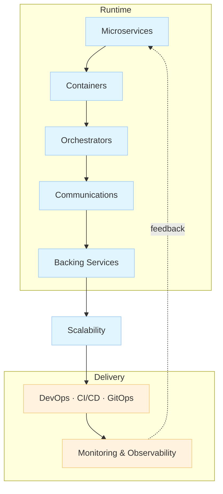

# 01_Cloud‑Native Distributed Apps: Key Characteristics

**Learning Level**: Practitioner
**Prerequisites**: Containers 101, basic DevOps/CI/CD, fundamentals of distributed systems
**Estimated Time**: 30–45 minutes

## 🎯 Learning Objectives

By the end of this guide, you will be able to:

- Explain the essential building blocks of cloud‑native distributed applications
- Describe how these components interact end‑to‑end in delivery and runtime
- Recognize common pitfalls and trade‑offs when adopting cloud‑native patterns

## Conceptual Foundation

This page summarizes the core ingredients of modern cloud‑native systems and how they fit together. We present the ideas in original terms and with fresh diagrams, without vendor logos.

### 1) Microservices (business capabilities)

- Small, independently deployable services that own a clear slice of business functionality and data.
- Communicate over well‑defined APIs; favor backward‑compatible changes and contract testing.
- Enable team autonomy and independent scaling, at the cost of increased operational complexity.

### 2) Containers (packaging + isolation)

- Self‑contained runtime units bundling app, dependencies, and configuration.
- Repeatable build/run parity across dev, test, and prod environments.
- Image immutability and versioning simplify rollback and promotion.

### 3) Orchestrators (scheduling + resilience)

- Platforms like Kubernetes schedule containers onto nodes, handle restarts, placement, and rollout strategies.
- Provide service discovery, autoscaling hooks, and config/secret distribution.
- Helm/other tooling offers release templating and environment overlays.

### 4) Communications (service‑to‑service + edge)

- API gateways and meshes add retries, timeouts, mTLS, rate limiting, and traffic shaping.
- Choose protocols intentionally: REST/JSON for simplicity; gRPC for typed, low‑latency calls; events/streams for decoupling.

### 5) Backing Services (state + integration)

- Datastores (SQL/NoSQL), caches, object storage, queues/streams, and external SaaS.
- Treat them as attached resources with clear interfaces and lifecycle controls.
- Prefer polyglot persistence only when justified by workload characteristics.

### 6) Scalability (elasticity + cost)

- Horizontal scale of stateless services; vertical tuning for stateful tiers where needed.
- Autoscaling driven by SLO‑aligned signals (RPS, latency, queue depth), not just CPU.
- Plan for burst vs. steady workloads; distinguish scale‑out from scale‑to‑zero.

### 7) DevOps, CI/CD, and GitOps (flow of change)

- CI produces tested, signed artifacts; CD promotes via progressive delivery (canary/blue‑green).
- GitOps uses version‑controlled desired state; the platform reconciles runtime to match Git.
- Everything as code: infra, policy, pipelines, dashboards.

### 8) Monitoring & Observability (operational feedback)

- Telemetry: metrics, logs, traces; correlated with exemplars and labels.
- SLOs and error budgets drive release pace and reliability investment.
- Golden signals: latency, traffic, errors, saturation—plus domain‑specific KPIs.

## How it fits together

```text
        [Microservices]
               ↓
          [Containers]
               ↓
         [Orchestrators]
               ↓
         [Communications]
               ↓
         [Backing Services]
               ↓
           [Scalability]
               ↓
 [DevOps / CI-CD / GitOps]
               ↓
 [Monitoring & Observability]
               ↲ (feedback into design, rollout, and scaling)
```



## Practical Example: a simple e‑commerce platform

- Catalog, Cart, Checkout, and Inventory are separate microservices.
- Each builds a container image on commit; images are scanned and signed.
- Kubernetes deploys updated services via a canary; service mesh controls traffic split.
- Checkout writes orders to a database and publishes an event; fulfillment service consumes it.
- Autoscaler reacts to queue depth and P95 latency; cache size scales with traffic.
- Dashboards track SLOs; error budget burn throttles releases automatically.

## Implementation Guide (starter checklist)

- Model services by business capability; align teams to services.
- Containerize with a small base image; pin versions; add SBOM and signatures.
- Use a single orchestrator baseline (namespaces, RBAC, network policy, secrets mgmt).
- Standardize communication patterns (REST + idempotency, gRPC where latency‑sensitive, events for decoupling).
- Define SLOs and instrumentation up front; wire alerts to user‑impacting symptoms.
- Adopt CI that gates on tests/security; use GitOps for environment promotion.
- Autoscale on meaningful signals; test scale with load and chaos before prod.

## Common Pitfalls

- Too many microservices too early; start modular, split where pain justifies.
- Per‑service tech sprawl; constrain to a curated platform stack.
- CPU‑only autoscaling; ignore latency/backlog leading to brownouts.
- Copy‑pasted dashboards with no SLOs; alerts that page without actionability.
- Stateful services treated like stateless; missing backup/restore/runbooks.

## Next Steps

- Read: `06-architectural-principles/README.md`
- Explore patterns: `../07-architecture-patterns/`
- Deep‑dive topics: API gateways, service mesh, eventing, and production SLOs.

## 🔗 Related Topics

- 03_ReferenceLibrary → 01_Development → 02_software-design-principles → 07-architecture-patterns
- 03_ReferenceLibrary → 01_Development → Containers & Kubernetes (when available)
- 02_LearningJourney → Weekly plans that exercise cloud‑native deployments
