# Covariance and Contravariance in C# - Type Safety Mastery

**Learning Level**: Advanced  
**Prerequisites**: C# generics fundamentals, inheritance, interfaces  
**Estimated Time**: 3-4 hours deep study + practice  

---

## 🎯 Learning Objectives

By mastering this module, you will:

- **Understand variance concepts** - covariance, contravariance, and invariance
- **Apply variance in practice** - design type-safe generic APIs
- **Avoid common pitfalls** - prevent runtime type errors
- **Design better interfaces** - leverage variance for flexible APIs

---

## 🔷 **Understanding Variance: The Foundation**

### **What is Variance?**

Variance describes how subtyping between complex types relates to subtyping between their component types.

```mermaid
graph TD
    subgraph "🎯 Variance Types"
        COV[📈 Covariance<br/>out T<br/>Can return T]
        CONTRA[📉 Contravariance<br/>in T<br/>Can accept T]
        INV[🔒 Invariance<br/>T<br/>Exact type match]
    end
    
    subgraph "🔍 Real-World Examples"
        IENUM[IEnumerable&lt;out T&gt;<br/>Reading collections]
        ACTION[Action&lt;in T&gt;<br/>Method parameters]
        LIST[List&lt;T&gt;<br/>Mutable collections]
    end
    
    COV -.-> IENUM
    CONTRA -.-> ACTION
    INV -.-> LIST
    
    classDef covariant fill:#e8f5e8,stroke:#388e3c,stroke-width:2px
    classDef contravariant fill:#ffebee,stroke:#c62828,stroke-width:2px
    classDef invariant fill:#e3f2fd,stroke:#1976d2,stroke-width:2px
    
    class COV,IENUM covariant
    class CONTRA,ACTION contravariant
    class INV,LIST invariant
```



---

## 📈 **Covariance: "out" Parameters**

### **Core Concept**

Covariance allows you to use a more derived type than originally specified. **You can only return/output the type, never accept it as input.**

```csharp
// Covariant interface - can only return T, never accept it
public interface IProducer<out T>
{
    T GetNext();           // ✅ Valid - returning T
    // void Add(T item);   // ❌ Invalid - would accept T as input
}

// Real-world example: IEnumerable<out T>
IEnumerable<string> strings = new List<string> { "hello", "world" };
IEnumerable<object> objects = strings; // ✅ Covariance in action!

// This works because:
// - IEnumerable only returns items (foreach, LINQ)
// - You can't add items to IEnumerable
// - Every string IS an object
```

### **Practical Covariance Examples**

```csharp
// 1. Document Processing System
public interface IDocumentProvider<out T> where T : Document
{
    T GetDocument(int id);
    IEnumerable<T> GetAllDocuments();
    T CreateDocument(string content); // ✅ Still valid - returning T
}

public class Document { public string Content { get; set; } }
public class PdfDocument : Document { public int PageCount { get; set; } }
public class WordDocument : Document { public bool HasMacros { get; set; } }

// Implementation
public class PdfProvider : IDocumentProvider<PdfDocument>
{
    public PdfDocument GetDocument(int id) => new PdfDocument();
    public IEnumerable<PdfDocument> GetAllDocuments() => new List<PdfDocument>();
    public PdfDocument CreateDocument(string content) => new PdfDocument { Content = content };
}

// Usage with covariance
IDocumentProvider<PdfDocument> pdfProvider = new PdfProvider();
IDocumentProvider<Document> documentProvider = pdfProvider; // ✅ Covariance!

Document doc = documentProvider.GetDocument(1); // Returns PdfDocument as Document

// 2. Event System
public interface IEventPublisher<out T> where T : EventArgs
{
    event Action<T> EventOccurred;
    void RaiseEvent(T eventArgs);
}

public class OrderEventArgs : EventArgs { public int OrderId { get; set; } }
public class PaymentEventArgs : EventArgs { public decimal Amount { get; set; } }

IEventPublisher<OrderEventArgs> orderPublisher = new OrderEventPublisher();
IEventPublisher<EventArgs> eventPublisher = orderPublisher; // ✅ Covariance
```

### **🎯 Covariance Rules**

```mermaid
graph LR
    subgraph "✅ Allowed Operations"
        RETURN[Return T]
        PROPERTY_GET[Property Get]
        EVENT_RAISE[Event Declaration]
        METHOD_RETURN[Method Return Types]
    end
    
    subgraph "❌ Prohibited Operations"
        PARAMETER[Method Parameters]
        PROPERTY_SET[Property Set]
        OUT_PARAM[out/ref parameters]
        GENERIC_CONSTRAINT[Generic Constraints on T]
    end
    
    classDef allowed fill:#e8f5e8,stroke:#388e3c,stroke-width:2px
    classDef prohibited fill:#ffebee,stroke:#c62828,stroke-width:2px
    
    class RETURN,PROPERTY_GET,EVENT_RAISE,METHOD_RETURN allowed
    class PARAMETER,PROPERTY_SET,OUT_PARAM,GENERIC_CONSTRAINT prohibited
```



---

## 📉 **Contravariance: "in" Parameters**

### **Core Concept**

Contravariance allows you to use a more general (base) type than originally specified. **You can only accept the type as input, never return it.**

```csharp
// Contravariant interface - can only accept T, never return it
public interface IConsumer<in T>
{
    void Process(T item);        // ✅ Valid - accepting T as input
    // T GetNext();              // ❌ Invalid - would return T
}

// Real-world example: Action<in T>
Action<object> processObject = obj => Console.WriteLine(obj.ToString());
Action<string> processString = processObject; // ✅ Contravariance!

processString("Hello"); // Works! string is passed to Action<object>
```

### **Practical Contravariance Examples**

```csharp
// 1. Validation System
public interface IValidator<in T>
{
    bool IsValid(T item);
    ValidationResult Validate(T item);
    void ReportError(T item, string message);
}

public abstract class Animal { public string Name { get; set; } }
public class Dog : Animal { public string Breed { get; set; } }
public class Cat : Animal { public bool IsIndoor { get; set; } }

// General animal validator
public class AnimalValidator : IValidator<Animal>
{
    public bool IsValid(Animal animal) => !string.IsNullOrEmpty(animal.Name);
    
    public ValidationResult Validate(Animal animal)
    {
        return new ValidationResult 
        { 
            IsValid = IsValid(animal),
            Message = IsValid(animal) ? "Valid" : "Name is required"
        };
    }
    
    public void ReportError(Animal animal, string message) 
        => Console.WriteLine($"Validation error for {animal.Name}: {message}");
}

// Usage with contravariance
IValidator<Animal> animalValidator = new AnimalValidator();
IValidator<Dog> dogValidator = animalValidator; // ✅ Contravariance!

var dog = new Dog { Name = "Buddy", Breed = "Golden Retriever" };
bool isValidDog = dogValidator.IsValid(dog); // Animal validator validates Dog

// 2. Command Pattern
public interface ICommandHandler<in T> where T : ICommand
{
    void Handle(T command);
    bool CanHandle(T command);
}

public interface ICommand { }
public class CreateOrderCommand : ICommand { public int CustomerId { get; set; } }
public class UpdateOrderCommand : ICommand { public int OrderId { get; set; } }

public class BaseCommandHandler : ICommandHandler<ICommand>
{
    public void Handle(ICommand command) => Console.WriteLine($"Handling {command.GetType().Name}");
    public bool CanHandle(ICommand command) => true;
}

// Contravariance in action
ICommandHandler<ICommand> baseHandler = new BaseCommandHandler();
ICommandHandler<CreateOrderCommand> createHandler = baseHandler; // ✅ Contravariance!

createHandler.Handle(new CreateOrderCommand { CustomerId = 123 });

// 3. Comparison System
public interface IComparer<in T>
{
    int Compare(T x, T y);
}

public class ObjectComparer : IComparer<object>
{
    public int Compare(object x, object y) => x.GetHashCode().CompareTo(y.GetHashCode());
}

IComparer<object> objectComparer = new ObjectComparer();
IComparer<string> stringComparer = objectComparer; // ✅ Contravariance!

int result = stringComparer.Compare("hello", "world");
```

### **🎯 Contravariance Rules**

```mermaid
graph LR
    subgraph "✅ Allowed Operations"
        PARAMETER[Method Parameters]
        GENERIC_CONSTRAINTS[Generic Method Constraints]
        DELEGATE_PARAMS[Delegate Parameters]
    end
    
    subgraph "❌ Prohibited Operations"
        RETURN[Return Types]
        PROPERTY_GET[Property Get]
        OUT_REF[out/ref parameters]
        PROPERTY_SET[Property Set returning T]
    end
    
    classDef allowed fill:#e8f5e8,stroke:#388e3c,stroke-width:2px
    classDef prohibited fill:#ffebee,stroke:#c62828,stroke-width:2px
    
    class PARAMETER,GENERIC_CONSTRAINTS,DELEGATE_PARAMS allowed
    class RETURN,PROPERTY_GET,OUT_REF,PROPERTY_SET prohibited
```



---

## 🔒 **Invariance: Default Behavior**

### **Core Concept**

Invariance means the generic type must be exactly the same. This is the default behavior for most generic types, especially mutable collections.

```csharp
// Invariant interface - T must be exact type
public interface IRepository<T> where T : class
{
    void Add(T item);     // Accepts T as input
    T GetById(int id);    // Returns T as output
    void Update(T item);  // Both input and output operations
    void Delete(T item);
}

// Why invariance is necessary for mutable collections
List<string> strings = new List<string>();
// List<object> objects = strings; // ❌ Compiler error - would be unsafe!

// If this were allowed, you could do:
// objects.Add(new Car()); // Adding Car to a List<string>!
// string firstString = strings[0]; // Runtime error - Car is not string
```

### **Real-World Invariance Examples**

```csharp
// 1. Mutable Repository Pattern
public class UserRepository : IRepository<User>
{
    private readonly List<User> _users = new();
    
    public void Add(User user) => _users.Add(user);
    public User GetById(int id) => _users.FirstOrDefault(u => u.Id == id);
    public void Update(User user) { /* update logic */ }
    public void Delete(User user) => _users.Remove(user);
}

// Each repository is invariant - must be exact type
IRepository<User> userRepo = new UserRepository();
// IRepository<Person> personRepo = userRepo; // ❌ Not allowed

// 2. Cache System
public interface ICache<T>
{
    void Set(string key, T value);
    T Get(string key);
    void Remove(string key);
}

public class MemoryCache<T> : ICache<T>
{
    private readonly Dictionary<string, T> _cache = new();
    
    public void Set(string key, T value) => _cache[key] = value;
    public T Get(string key) => _cache.TryGetValue(key, out T value) ? value : default(T);
    public void Remove(string key) => _cache.Remove(key);
}

// Cache must be invariant to maintain type safety
ICache<string> stringCache = new MemoryCache<string>();
// ICache<object> objectCache = stringCache; // ❌ Not safe
```

---

## 🚀 **Advanced Variance Patterns**

### **Combining Variance in Complex Scenarios**

```csharp
// 1. Factory Pattern with Variance
public interface IFactory<out T> where T : class
{
    T Create();
    T Create(string name);
}

// Combined with contravariant consumers
public interface IProcessor<in T> where T : class
{
    void Process(T item);
}

// Service that combines both patterns
public class ProcessingService<T> where T : class
{
    private readonly IFactory<T> _factory;
    private readonly IProcessor<T> _processor;
    
    public ProcessingService(IFactory<T> factory, IProcessor<T> processor)
    {
        _factory = factory;
        _processor = processor;
    }
    
    public void ProcessNew(string name)
    {
        T item = _factory.Create(name);
        _processor.Process(item);
    }
}

// Usage with variance
IFactory<Dog> dogFactory = new DogFactory();
IFactory<Animal> animalFactory = dogFactory; // ✅ Covariance

IProcessor<Animal> animalProcessor = new AnimalProcessor();
IProcessor<Dog> dogProcessor = animalProcessor; // ✅ Contravariance

var service = new ProcessingService<Dog>(dogFactory, dogProcessor);

// 2. Event System with Variance
public interface IEventHandler<in T> where T : EventArgs
{
    void Handle(T eventArgs);
}

public interface IEventPublisher<out T> where T : EventArgs
{
    event Action<T> EventRaised;
    void Publish(T eventArgs);
}

// Base event types
public class OrderEventArgs : EventArgs { public int OrderId { get; set; } }
public class PaymentEventArgs : OrderEventArgs { public decimal Amount { get; set; } }

// Handlers
public class OrderEventHandler : IEventHandler<OrderEventArgs>
{
    public void Handle(OrderEventArgs eventArgs) 
        => Console.WriteLine($"Handling order {eventArgs.OrderId}");
}

// Variance in action
IEventHandler<OrderEventArgs> orderHandler = new OrderEventHandler();
IEventHandler<PaymentEventArgs> paymentHandler = orderHandler; // ✅ Contravariance

// Can handle more specific payment events with general order handler
paymentHandler.Handle(new PaymentEventArgs { OrderId = 123, Amount = 99.99m });
```

### **🎯 Variance Best Practices**

```mermaid
graph TD
    subgraph "🔍 Design Decisions"
        QUESTION[What operations does the interface perform?]
    end
    
    subgraph "📤 Output Only"
        OUT_OPS[Returns/Produces T<br/>Properties (get only)<br/>Events]
        USE_OUT[Use: out T<br/>Covariance]
    end
    
    subgraph "📥 Input Only"
        IN_OPS[Accepts/Consumes T<br/>Method parameters<br/>Actions/Predicates]
        USE_IN[Use: in T<br/>Contravariance]
    end
    
    subgraph "🔄 Both Input & Output"
        BOTH_OPS[Stores and retrieves T<br/>Mutable collections<br/>Repositories]
        USE_NONE[Use: T<br/>Invariance]
    end
    
    QUESTION --> OUT_OPS
    QUESTION --> IN_OPS
    QUESTION --> BOTH_OPS
    
    OUT_OPS --> USE_OUT
    IN_OPS --> USE_IN
    BOTH_OPS --> USE_NONE
    
    classDef question fill:#f0f8ff,stroke:#4682b4,stroke-width:2px
    classDef operations fill:#fffacd,stroke:#daa520,stroke-width:2px
    classDef decisions fill:#f0fff0,stroke:#228b22,stroke-width:2px
    
    class QUESTION question
    class OUT_OPS,IN_OPS,BOTH_OPS operations
    class USE_OUT,USE_IN,USE_NONE decisions
```

---

## 🐛 **Common Pitfalls and Solutions**

### **Pitfall 1: Array Covariance (Pre-Generics Legacy)**

```csharp
// ❌ Arrays are covariantly typed (legacy behavior) - DANGEROUS!
string[] strings = new string[] { "hello", "world" };
object[] objects = strings; // Compiles but dangerous

try
{
    objects[0] = new Car(); // Runtime exception!
}
catch (ArrayTypeMismatchException ex)
{
    Console.WriteLine("Runtime error: " + ex.Message);
}

// ✅ Better approach with generic collections
IEnumerable<string> stringEnumerable = new List<string> { "hello", "world" };
IEnumerable<object> objectEnumerable = stringEnumerable; // Safe covariance

// Can't modify through the interface - safe!
```

### **Pitfall 2: Trying to Use Variance Where Not Supported**

```csharp
// ❌ Cannot use variance with concrete classes
// public class MyList<out T> : List<T> { } // Compiler error

// ❌ Cannot use variance with value types
// public interface IProcessor<in T> where T : struct { } // Limited usefulness

// ✅ Variance only works with interfaces and delegates
public interface IProcessor<in T> where T : class
{
    void Process(T item);
}

// ✅ Delegate variance
Func<string, object> stringToObject = s => s as object;
Func<string, string> stringToString = stringToObject; // ✅ Contravariance on input
```

### **Pitfall 3: Misunderstanding Variance Direction**

```csharp
// ❌ Common mistake - confusing direction
public interface IWrongProcessor<out T> // Trying to make it covariant
{
    void Process(T item); // ❌ Error - can't accept input parameter with 'out'
}

// ✅ Correct approach
public interface ICorrectProcessor<in T> // Contravariant
{
    void Process(T item); // ✅ Can accept input parameter with 'in'
}
```

---

## 🎯 **Real-World Application: Building a Type-Safe Event System**

```csharp
// Complete example demonstrating all variance concepts
using System;
using System.Collections.Generic;

// Event base classes
public abstract class BaseEvent
{
    public DateTime Timestamp { get; } = DateTime.UtcNow;
    public Guid Id { get; } = Guid.NewGuid();
}

public class OrderEvent : BaseEvent
{
    public int OrderId { get; set; }
    public int CustomerId { get; set; }
}

public class PaymentEvent : OrderEvent
{
    public decimal Amount { get; set; }
    public string PaymentMethod { get; set; }
}

// Covariant event source (only produces events)
public interface IEventSource<out T> where T : BaseEvent
{
    event Action<T> EventOccurred;
    IEnumerable<T> GetRecentEvents();
    T GetLastEvent();
}

// Contravariant event handler (only consumes events)
public interface IEventHandler<in T> where T : BaseEvent
{
    void Handle(T eventArgs);
    bool CanHandle(T eventArgs);
}

// Invariant event store (both stores and retrieves)
public interface IEventStore<T> where T : BaseEvent
{
    void Store(T eventArgs);
    T GetById(Guid id);
    IEnumerable<T> GetAll();
    void Delete(T eventArgs);
}

// Implementations
public class OrderEventSource : IEventSource<OrderEvent>
{
    public event Action<OrderEvent> EventOccurred;
    private readonly List<OrderEvent> _events = new();
    
    public IEnumerable<OrderEvent> GetRecentEvents() => _events.TakeLast(10);
    public OrderEvent GetLastEvent() => _events.LastOrDefault();
    
    public void RaiseEvent(OrderEvent orderEvent)
    {
        _events.Add(orderEvent);
        EventOccurred?.Invoke(orderEvent);
    }
}

public class BaseEventHandler : IEventHandler<BaseEvent>
{
    public void Handle(BaseEvent eventArgs)
        => Console.WriteLine($"Handling {eventArgs.GetType().Name} at {eventArgs.Timestamp}");
    
    public bool CanHandle(BaseEvent eventArgs) => true;
}

public class OrderEventHandler : IEventHandler<OrderEvent>
{
    public void Handle(OrderEvent eventArgs)
        => Console.WriteLine($"Processing order {eventArgs.OrderId} for customer {eventArgs.CustomerId}");
    
    public bool CanHandle(OrderEvent eventArgs) => eventArgs.OrderId > 0;
}

// Usage demonstrating variance
public class EventSystemExample
{
    public static void Main()
    {
        // Covariance: OrderEventSource can be used as BaseEvent source
        IEventSource<OrderEvent> orderSource = new OrderEventSource();
        IEventSource<BaseEvent> baseSource = orderSource; // ✅ Covariance
        
        // Contravariance: BaseEventHandler can handle OrderEvents
        IEventHandler<BaseEvent> baseHandler = new BaseEventHandler();
        IEventHandler<OrderEvent> orderHandler = baseHandler; // ✅ Contravariance
        
        // Also can use specific handler
        IEventHandler<OrderEvent> specificHandler = new OrderEventHandler();
        
        // Subscribe with contravariant handler
        orderSource.EventOccurred += orderHandler.Handle;
        orderSource.EventOccurred += specificHandler.Handle;
        
        // Raise events
        var orderEvent = new OrderEvent { OrderId = 123, CustomerId = 456 };
        ((OrderEventSource)orderSource).RaiseEvent(orderEvent);
        
        // Contravariance allows payment handler to use order handler
        IEventHandler<PaymentEvent> paymentHandler = baseHandler; // ✅ Contravariance
        
        var paymentEvent = new PaymentEvent 
        { 
            OrderId = 123, 
            CustomerId = 456, 
            Amount = 99.99m, 
            PaymentMethod = "Credit Card" 
        };
        
        paymentHandler.Handle(paymentEvent); // Base handler handles payment event
    }
}
```

---

## 🎓 **Mastery Checklist**

### **Conceptual Understanding**

- [ ] Can explain the difference between covariance, contravariance, and invariance
- [ ] Understands when to use `out`, `in`, and no modifier
- [ ] Can predict which operations are allowed with each variance type
- [ ] Recognizes why arrays have unsafe covariance behavior

### **Practical Application**

- [ ] Can design interfaces with appropriate variance modifiers
- [ ] Can implement event systems using covariant publishers and contravariant handlers
- [ ] Can create factory patterns using covariance
- [ ] Can build validation systems using contravariance
- [ ] Can identify when invariance is necessary for type safety

### **Advanced Skills**

- [ ] Can combine variance concepts in complex inheritance hierarchies
- [ ] Can design APIs that leverage variance for maximum flexibility
- [ ] Can troubleshoot variance-related compilation errors
- [ ] Can optimize code using variance to reduce type casting

---

## 🔗 **Integration with Design Patterns**

### **Related Patterns Enhanced by Variance**

- **Factory Pattern**: Use covariance for flexible factory interfaces
- **Observer Pattern**: Use contravariance for event handlers
- **Strategy Pattern**: Use contravariance for strategy interfaces
- **Repository Pattern**: Use invariance for data access layers

### **Next Steps**

- **[06_Design-Patterns/](../06_Design-Patterns/)** - Apply variance in design patterns
- **[04_Async-and-Parallel/](../04_Async-and-Parallel/)** - Variance with async delegates
- **[08_Testing-and-Quality/](../08_Testing-and-Quality/)** - Test variance scenarios

---

*🎯 **Mastery Achievement**: Understanding variance transforms you from a C# user to a C# language expert, enabling you to design APIs that are both type-safe and flexible.*
