# 01_.NET Aspire Overview (Original Notes)

**Learning Level**: Practitioner  
**Prerequisites**: C#/.NET fundamentals, containers, basic Kubernetes concepts  
**Estimated Time**: 25–40 minutes

> Navigation: [C# Track](../README.md) › [Enterprise Development](./README.md) › .NET Aspire Overview

## 🎯 Objectives

- Understand what .NET Aspire aims to solve in cloud‑native .NET development
- Learn its core building blocks and developer workflow
- See where Aspire fits alongside containers and orchestrators

## What is .NET Aspire? (in our words)

An opinionated, batteries‑included stack for building cloud‑ready .NET apps. Aspire focuses on:

- Local orchestration of multi‑service apps during development
- Sensible defaults for telemetry, configuration, and service wiring
- Repeatable deployments to cloud targets with minimal friction

Think of it as a “developer cockpit” that coordinates .NET services and common dependencies (databases, queues) locally while preparing you for production environments.

## Core Pieces

- Templates and project types that encourage service boundaries
- Service discovery and environment wiring for local runs
- Built‑in observability: metrics/logs/traces with standard conventions
- Configuration story that scales from dev → test → prod

## End‑to‑End Flow

```text
[Dev Machines]
    |
    v
[Aspire Orchestration] -- runs --> [Multiple .NET Services]
       |                                  |
       | provides                          | emit
       v                                  v
[Config + Wiring + Local Dependencies]  [Telemetry]
       |                                   |
       '----> [Container Images] ----> [Orchestrator/CD]
```

```mermaid
graph TB
  DEV[Developer] --> ORCH[Aspire Orchestration]
  ORCH --> S1[Service A]
  ORCH --> S2[Service B]
  ORCH --> DEPS[Local Dependencies]
  S1 --> TEL[Telemetry]
  S2 --> TEL
  ORCH --> IMG[Container Images]
  IMG --> CD[CI/CD → Orchestrator]

  classDef a fill:#e1f5fe,stroke:#9ec9f3;
  classDef b fill:#fff3e0,stroke:#f4c97b;
  class ORCH,DEPS,IMG a;
  class S1,S2,TEL b;
```



## Practical Tips

- Keep services small; isolate responsibilities; expose HTTP/gRPC contracts
- Use environment variables and appsettings layering; avoid hard‑coding endpoints
- Standardize telemetry and correlation IDs early
- Build containers in CI; scan and sign images; pin base images

## Common Pitfalls

- Treating local defaults as production‑ready configs
- Service sprawl without clear ownership or SLIs/SLOs
- Ignoring resource limits locally, leading to surprises in prod

## Next Steps

- Explore: `06-architectural-principles/01_Cloud-Native-Distributed-Apps-Key-Characteristics.md`
- Prepare: containerize services and define a minimal CI pipeline
- Optional: add a service mesh and progressive delivery once in an orchestrator

## 🔗 Related Topics

- 03_ReferenceLibrary → 01_Development → 02_software-design-principles → 06-architectural-principles
- 03_ReferenceLibrary → 01_Development → 03_CSharp → 06_Design-Patterns

---

Note: These are original learning notes synthesized for STSA (Zero‑Copy Policy). They do not reproduce slide text or figures.
